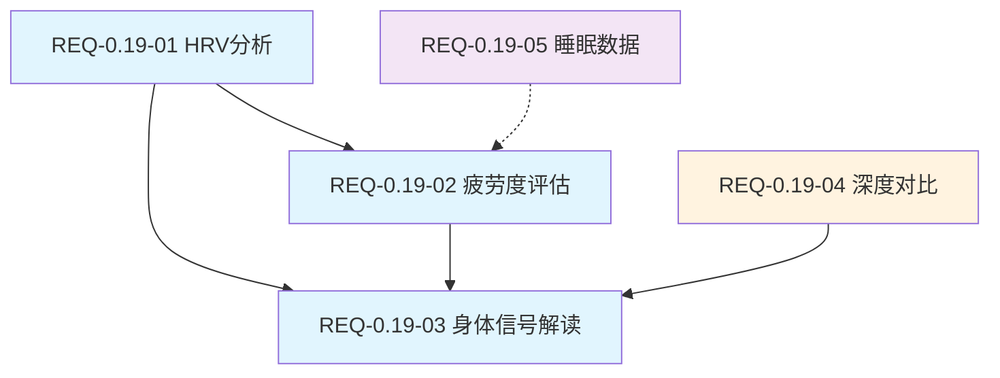

# 需求规格说明书

> **文档版本**: v5.2  
> **最后更新**: 2026-05-06  
> **当前基线**: v0.19.0  
> **下一版本**: v0.20.0  
> **维护者**: Architecture Team  
> **对齐产品规划**: v6.0 (2026-05-05)

---

## 1. 项目概述

### 1.1 项目背景

Nanobot Runner 是一款桌面端私人 AI 跑步助理，基于 nanobot-ai 框架构建，旨在帮助跑步爱好者管理和分析运动数据。

**产品愿景**: 成为技术型跑者首选的本地化 AI 跑步数据分析工具

### 1.2 项目目标

| 目标 | 说明 | 优先级 |
|------|------|--------|
| 提供本地化的跑步数据管理方案 | 数据完全存储在本地，用户可控 | P0 |
| 实现智能化的运动数据分析 | VDOT、TSS、心率漂移等专业指标 | P0 |
| 构建自然语言交互的 AI 助理 | 自然语言查询和智能建议 | P0 |
| 保护用户数据隐私 | 零外联设计，不收集用户隐私 | P0 |

### 1.3 目标用户

**技术型严肃跑者**：25-45岁技术从业者，规律跑步2年以上，习惯佩戴专业设备，担心云端数据隐私，需要更专业的数据分析。

---

## 2. 已完成功能摘要

> 以下功能已在历史版本中交付，仅保留核心能力摘要。详细验收标准见 Git 历史版本。

| 模块 | 核心能力 | 完成版本 |
|------|----------|----------|
| **数据导入** | FIT文件解析、SHA256去重、批量导入 | v0.5 |
| **数据存储** | Parquet按年分片、Snappy压缩、索引管理 | v0.5 |
| **数据分析** | VDOT计算、训练负荷(ATL/CTL/TSB)、心率漂移、用户画像 | v0.8-v0.9 |
| **Agent交互** | 自然语言查询、智能建议、训练计划生成 | v0.8-v0.12 |
| **CLI** | 分层架构(data/analysis/agent/report/system/gateway)、Rich格式化 | v0.9 |
| **架构重构** | 依赖注入(AppContext)、SessionRepository、Polars向量化 | v0.9 |
| **架构解耦** | nanobot-ai SDK化、配置注入层、初始化流程整合 | v0.9.5 |
| **工具生态** | MCP协议、天气/地图接入、工具发现与管理 | v0.13 |
| **智能进化** | AI自我诊断、个性化建议引擎 | v0.14 |
| **透明化** | AI决策透明化、全链路可观测性 | v0.15 |
| **模块化** | Core层子模块拆分(diagnosis/memory/personality/skills/validate/tools) | v0.16 |
| **底座激活** | 流式输出、Subagent验证 | v0.17 |
| **可视化与导出** | 终端图表(plotext)、多格式导出(CSV/JSON/Parquet) | v0.18 |
| **身体信号分析** | HRV分析、疲劳度评估、恢复状态、身体信号解读 | v0.19 |

---

## 3. v0.19.0 需求规格：让身体信号"会说话"

### 3.1 版本概述

**版本主题**: 让身体信号"会说话"  
**核心目标**: 深度分析与自定义扩展，让跑者读懂身体信号  
**规划日期**: 2026-07  
**对齐文档**: [产品规划方案 v6.0](../product/产品规划方案.md)

**用户核心痛点**:
> "我知道心率、功率这些数据很重要，但我看不懂它们之间的关系。为什么今天同样配速心率却更高？我的身体到底恢复好了没有？"

**技术可行性评估**:

| 需求域 | 现有代码基础 | 增量开发量 | 可行性 |
|--------|-------------|-----------|--------|
| HRV分析 | HeartRateAnalyzer(漂移+区间)、心率数据已存储 | 中等(新增HRV/恢复率计算) | ✅ 高 |
| 疲劳度评估 | TrainingLoadAnalyzer(TSS/ATL/CTL/TSB)、SmartAdviceEngine | 低(聚合+评分模型) | ✅ 高 |
| 身体信号解读 | InjuryRiskAnalyzer、SmartAdviceEngine | 低(预警规则+摘要) | ✅ 高 |
| 深度对比 | SessionRepository、Polars查询能力 | 中等(对比逻辑+图表) | ✅ 高 |
| 睡眠数据 | 无基础 | 高(新数据源+模型) | ⚠️ 中 |

---

### 3.2 P0 需求：必须交付

#### 3.2.1 心率变异（HRV）分析

**需求ID**: REQ-0.19-01  
**需求描述**: 基于现有心率数据，提供心率变异分析能力，帮助跑者了解自主神经状态和恢复情况

**功能要点**:

| 子功能 | 说明 | 数据来源 |
|--------|------|----------|
| 静息心率趋势 | 追踪静息心率变化，识别体能变化趋势 | Parquet中低心率区间数据 |
| 心率恢复分析 | 运动后1分钟/3分钟心率恢复率，评估心肺恢复能力 | FIT逐秒心率数据 |
| 心率漂移检测 | 长距离跑步中心率漂移>10%预警 | 已有HeartRateAnalyzer |
| HRV基础统计 | 基于RR间期估算HRV指标（RMSSD/SDNN） | FIT逐秒心率数据 |

**验收标准**:

- [ ] AC-01: 静息心率趋势支持7/30/90天查看，数据来源为活动最低10%心率区间均值
- [ ] AC-02: 心率恢复率计算准确：恢复率 = (运动末心率 - N分钟后心率) / (运动末心率 - 静息心率) × 100%
- [ ] AC-03: 心率漂移>10%时预警"有氧能力不足，建议降低配速"
- [ ] AC-04: HRV估算基于现有心率数据，明确标注"非医疗级精度，仅供参考"
- [ ] AC-05: 新增CLI命令 `analysis hrv --days 30` 和 `analysis hr-recovery`
- [ ] AC-06: 新增Agent工具 `get_hrv_analysis` 和 `get_hr_recovery`

**数据模型**:

```python
@dataclass(frozen=True)
class HRVAnalysisResult:
    resting_hr_trend: list[RestingHRPoint]  # 静息心率趋势
    hr_recovery_1min: float | None           # 1分钟恢复率(%)
    hr_recovery_3min: float | None           # 3分钟恢复率(%)
    estimated_rmssd: float | None            # 估算RMSSD(ms)
    estimated_sdnn: float | None             # 估算SDNN(ms)
    drift_alert: bool                        # 漂移预警
    assessment: str                          # 综合评估

@dataclass(frozen=True)
class RestingHRPoint:
    date: str
    resting_hr: float
    deviation_pct: float  # 与30天均值偏差百分比
```

**前置依赖**:
- FIT逐秒心率数据已存储于Parquet
- 用户画像中静息心率配置（已有）
- HeartRateAnalyzer现有能力可复用

---

#### 3.2.2 疲劳度与恢复评估

**需求ID**: REQ-0.19-02  
**需求描述**: 综合训练负荷、心率指标、主观感受，量化疲劳状态和恢复情况

**功能要点**:

| 子功能 | 说明 | 计算方法 |
|--------|------|----------|
| 综合疲劳度评分 | 0-100分，量化当前疲劳状态 | 加权：ATL权重40%+静息心率偏差20%+连续训练天数20%+主观疲劳度20% |
| 恢复状态指示器 | 红/黄/绿三色状态 | 绿(TSB>10且疲劳度<30)、黄(TSB 0~10或疲劳度30-60)、红(TSB<0或疲劳度>60) |
| 连续训练日监控 | 统计7天内高强度训练次数 | TSS>80定义为高强度 |
| 休息日效果评估 | 对比休息前后关键指标变化 | 休息后vs休息前静息心率、TSB变化 |

**验收标准**:

- [ ] AC-01: 疲劳度评分0-100分，各维度权重可配置（默认值如上）
- [ ] AC-02: 恢复状态三色指示：绿(可高强度)、黄(适度训练)、红(需要休息)
- [ ] AC-03: 7天内高强度训练≥4次时提示"连续高强度训练过多，建议安排恢复日"
- [ ] AC-04: 休息日后静息心率下降>5%或TSB上升>10时提示"休息效果良好"
- [ ] AC-05: 新增CLI命令 `analysis fatigue` 和 `analysis recovery`
- [ ] AC-06: 新增Agent工具 `get_fatigue_score` 和 `get_recovery_status`

**数据模型**:

```python
@dataclass(frozen=True)
class FatigueAssessment:
    fatigue_score: float                     # 0-100
    recovery_status: RecoveryStatus          # RED/YELLOW/GREEN
    consecutive_hard_days: int               # 连续高强度天数
    rest_day_effect: RestDayEffect | None    # 休息日效果
    breakdown: FatigueBreakdown              # 各维度得分明细
    recommendation: str                      # 建议文案

class RecoveryStatus(StrEnum):
    GREEN = "green"    # 可高强度训练
    YELLOW = "yellow"  # 适度训练
    RED = "red"        # 需要休息

@dataclass(frozen=True)
class FatigueBreakdown:
    atl_component: float       # ATL维度得分(0-100)
    hr_deviation_component: float  # 心率偏差维度得分
    consecutive_component: float   # 连续训练维度得分
    subjective_component: float    # 主观疲劳维度得分
```

**前置依赖**:
- TrainingLoadAnalyzer已有TSS/ATL/CTL/TSB计算能力
- 用户画像中静息心率（已有）
- 主观疲劳度(RPE)需用户输入或从训练记录获取

---

#### 3.2.3 身体信号智能解读

**需求ID**: REQ-0.19-03  
**需求描述**: 基于身体信号数据，提供异常预警、训练建议和状态摘要

**功能要点**:

| 子功能 | 说明 | 触发条件 |
|--------|------|----------|
| 异常信号预警 | 及时发现身体异常 | 静息心率突增>10%、TSB连续3天<-20、疲劳度连续上升 |
| 训练建议生成 | 基于身体状态给出actionable建议 | 每次查询时根据当前状态生成 |
| 身体信号摘要 | 每日/每周一句话总结 | 综合疲劳度+恢复状态+异常信号 |

**验收标准**:

- [ ] AC-01: 静息心率较7天均值突增>10%时预警"静息心率异常升高，可能未充分恢复或存在健康风险"
- [ ] AC-02: TSB连续3天<-20时预警"持续过度训练状态，建议立即减量"
- [ ] AC-03: 训练建议具体可执行（如"今天适合轻松跑，配速建议5:30-6:00/km，时长30-40分钟"）
- [ ] AC-04: 每日摘要格式："今日状态：🟢体能充沛 | 静息心率55bpm(正常) | 建议可安排质量课"
- [ ] AC-05: 新增CLI命令 `status today` 和 `status weekly`
- [ ] AC-06: 新增Agent工具 `get_body_signal_summary`

**数据模型**:

```python
@dataclass(frozen=True)
class BodySignalSummary:
    date: str
    recovery_status: RecoveryStatus
    fatigue_score: float
    alerts: list[BodySignalAlert]
    daily_summary: str
    recommendation: str

@dataclass(frozen=True)
class BodySignalAlert:
    alert_type: str          # "hr_spike" / "overtraining" / "fatigue_rising"
    severity: str            # "warning" / "critical"
    message: str
    related_metrics: list[str]
```

**前置依赖**:
- REQ-0.19-01(HRV分析)和REQ-0.19-02(疲劳度评估)的输出作为输入
- SmartAdviceEngine现有建议生成能力可复用

---

### 3.3 P1 需求：应该交付

#### 3.3.1 深度对比分析

**需求ID**: REQ-0.19-04  
**需求描述**: 支持不同维度的训练数据对比，帮助跑者发现最佳训练模式

**功能要点**:

| 子功能 | 说明 | 实现方式 |
|--------|------|----------|
| 周期对比 | 对比不同训练周期数据 | 按时间段筛选，对比距离/时长/VDOT/TSS |
| 相似训练对比 | 按距离/配速筛选相似训练对比 | Polars条件筛选+指标对比表 |
| 训练负荷-表现关联 | 散点图显示负荷与表现关系 | CTL vs VDOT散点图 |

**验收标准**:

- [ ] AC-01: 支持"今年vs去年"同期对比，输出距离/时长/VDOT/训练负荷对比表
- [ ] AC-02: 相似训练按距离±10%和配速±5%筛选，对比心率/疲劳度/恢复情况
- [ ] AC-03: 训练负荷-表现关联图展示CTL与VDOT的散点关系
- [ ] AC-04: 新增CLI命令 `analysis compare --period this_year:last_year`
- [ ] AC-05: 新增Agent工具 `compare_training_periods`

---

### 3.4 P2 需求：可选交付

#### 3.4.1 睡眠与恢复数据集成

**需求ID**: REQ-0.19-05  
**需求描述**: 支持导入睡眠数据，用于更全面的恢复评估

**功能要点**:
- CSV格式睡眠数据导入（日期、入睡时间、起床时间、睡眠时长、深睡/浅睡比例）
- 睡眠质量与次日训练表现关联分析
- 睡眠数据纳入疲劳度评分（替代主观疲劳度维度）

**验收标准**:

- [ ] AC-01: 支持CSV格式睡眠数据导入，字段映射可配置
- [ ] AC-02: 睡眠不足(<6小时)次日训练时提示"睡眠不足，建议降低训练强度"
- [ ] AC-03: 睡眠数据独立存储，不影响现有Parquet结构

**风险提示**: 需新增数据源和存储结构，开发量较大，建议评估后决定是否纳入

---

### 3.5 v0.19.0 用户交互设计

**新增CLI命令**:

```bash
# 身体状态快速查看
uv run nanobotrun status today
uv run nanobotrun status weekly

# 心率分析
uv run nanobotrun analysis hrv --days 30
uv run nanobotrun analysis hr-recovery

# 疲劳度评估
uv run nanobotrun analysis fatigue
uv run nanobotrun analysis recovery

# 深度对比（P1）
uv run nanobotrun analysis compare --period this_year:last_year
```

**新增Agent工具**:

| 工具名 | 功能 | 输入 | 输出 |
|--------|------|------|------|
| `get_hrv_analysis` | HRV分析 | days | HRVAnalysisResult |
| `get_hr_recovery` | 心率恢复分析 | 无(取最近训练) | 恢复率数据 |
| `get_fatigue_score` | 疲劳度评分 | 无(取当前状态) | FatigueAssessment |
| `get_recovery_status` | 恢复状态 | 无(取当前状态) | 恢复状态+建议 |
| `get_body_signal_summary` | 身体信号摘要 | period(today/weekly) | BodySignalSummary |
| `compare_training_periods` | 训练对比 | period_a, period_b | 对比结果 |

**AI交互场景**:

| 场景 | 用户输入 | AI响应 |
|------|----------|--------|
| 晨间检查 | "今天状态如何？" | 综合心率、疲劳度、恢复情况给出建议 |
| 异常询问 | "为什么最近静息心率变高了？" | 分析近期训练负荷，指出可能原因 |
| 训练决策 | "今天能跑间歇吗？" | 基于恢复状态给出是/否建议及理由 |

---

### 3.6 v0.19.0 成功标准

| 维度 | 标准 | 测量方式 |
|------|------|----------|
| 功能完成 | P0功能100%实现，P1功能实现≥60% | 功能清单核对 |
| 预警准确 | 异常信号预警准确率≥80% | 与主观感受对比验证 |
| 建议质量 | 训练建议被采纳率≥70% | 用户反馈统计 |
| 性能要求 | 身体状态查询<2秒 | 性能测试 |
| 代码质量 | 新增模块测试覆盖率≥80% | pytest --cov |

---

### 3.7 v0.19.0 风险与缓解

| 风险 | 等级 | 影响 | 缓解措施 |
|------|------|------|----------|
| HRV计算准确性 | 高 | 基于心率数据估算，非RR间期直接计算 | 明确标注"非医疗级精度"，提供参考值范围 |
| 疲劳度模型普适性 | 中 | 加权模型可能不适用所有跑者 | 提供权重校准机制，用户可调整各维度权重 |
| 用户过度依赖指标 | 中 | 忽视身体主观感受 | 强调"倾听身体"的重要性，指标仅作参考 |
| FIT数据中RR间期缺失 | 中 | 部分设备不记录RR间期数据 | 基于心率数据估算HRV，降级提示数据精度 |
| 睡眠数据格式不统一 | 低 | 不同设备CSV格式差异 | P2优先级，提供字段映射配置 |

---

## 4. 非功能需求

### 4.1 性能需求

| 指标 | 要求 | 适用版本 |
|------|------|----------|
| 数据导入速度 | < 1 秒/文件 | 全版本 |
| 查询响应时间 | < 100ms（1 年数据） | v1.0 |
| 内存占用 | < 500MB | v1.0 |
| Agent 响应时间 | < 3 秒 | 全版本 |
| 身体状态查询 | < 2 秒 | v0.19+ |
| 图表生成时间 | < 2 秒 | v0.18+ |

### 4.2 质量需求

| 指标 | 要求 | 适用范围 |
|------|------|----------|
| 代码覆盖率 | core≥80%, agents≥70%, cli≥60% | 全模块 |
| 类型注解 | 核心模块覆盖率 ≥ 80% | core/ |
| 代码规范 | ruff 零警告，mypy 零错误 | 全项目 |

### 4.3 安全需求

| 指标 | 要求 |
|------|------|
| 敏感信息 | 不硬编码，使用 config 模块 |
| 数据所有权 | 用户数据完全归用户，不外传 |
| 审计日志 | 完整记录关键操作 |

---

## 5. 约束条件

### 5.1 技术约束

- Python 3.11+ / Polars 0.20+ / nanobot-ai Latest
- 本地部署，无云服务依赖
- 支持 Windows/Linux/macOS

### 5.2 业务约束

- 仅支持 FIT 格式文件（v0.19新增CSV睡眠数据导入）
- 单用户使用场景
- 数据存储在本地

### 5.3 法规约束

- 遵守数据保护法规（GDPR/个人信息保护法）
- 用户数据所有权归用户，不收集不共享

---

## 6. 数据需求

### 6.1 核心数据字典

| 数据项 | 类型 | 说明 | 来源 |
|--------|------|------|------|
| activity_id | string | 活动唯一标识 | FIT |
| timestamp | datetime | 活动时间戳 | FIT |
| total_distance | float | 总距离（米） | FIT |
| total_timer_time | float | 总时长（秒） | FIT |
| avg_heart_rate | float | 平均心率 | FIT |
| max_heart_rate | float | 最大心率 | FIT |
| vdot | float | VDOT 值 | 计算 |
| tss | float | 训练压力分数 | 计算 |
| atl / ctl / tsb | float | 训练负荷指标 | 计算 |
| hr_drift | float | 心率漂移相关性 | 计算 |

### 6.2 v0.19.0 新增数据项

| 数据项 | 类型 | 说明 | 来源 |
|--------|------|------|------|
| resting_hr | float | 静息心率（活动最低10%区间均值） | 计算 |
| hr_recovery_1min | float | 1分钟心率恢复率(%) | 计算 |
| hr_recovery_3min | float | 3分钟心率恢复率(%) | 计算 |
| estimated_rmssd | float | 估算RMSSD(ms) | 计算 |
| estimated_sdnn | float | 估算SDNN(ms) | 计算 |
| fatigue_score | float | 综合疲劳度(0-100) | 计算 |
| recovery_status | string | 恢复状态(green/yellow/red) | 计算 |
| consecutive_hard_days | int | 连续高强度训练天数 | 计算 |

### 6.3 数据量估算

| 数据类型 | 年增长量 | 5 年增长量 |
|---------|---------|-----------|
| 运动记录 | ~500 条/年 | ~2500 条 |
| 存储空间 | ~50MB/年 | ~250MB |

---

## 7. 迭代计划

### 7.1 版本路线图

| 版本 | 主题 | 核心交付 | 状态 |
|------|------|----------|------|
| v0.5-v0.9 | 基础能力 | 数据导入/存储/分析/CLI/架构重构 | ✅ 完成 |
| v0.9.5 | 架构解耦 | nanobot-ai SDK化、配置注入 | ✅ 完成 |
| v0.13-v0.14 | 工具与智能 | MCP协议、AI自我诊断 | ✅ 完成 |
| v0.15-v0.16 | 透明与模块化 | 决策透明化、Core模块化 | ✅ 完成 |
| v0.17-v0.18 | 底座与可视化 | 流式输出、终端图表、多格式导出 | ✅ 完成 |
| **v0.19.0** | **身体信号** | **HRV分析、疲劳度评估、身体信号解读** | **📋 当前** |
| v0.20.0 | 预测未来 | 伤病风险预测、VDOT趋势预测、比赛成绩预测 | 📋 计划中 |
| v1.0.0 | 稳定版 | API冻结、性能优化、完整文档 | 📋 计划中 |

### 7.2 v0.19.0 需求清单汇总

| 需求ID | 需求描述 | 优先级 | 前置依赖 |
|--------|---------|--------|----------|
| REQ-0.19-01 | HRV分析（静息心率趋势/心率恢复/漂移检测/HRV统计） | P0 | 逐秒心率数据 |
| REQ-0.19-02 | 疲劳度与恢复评估（综合评分/状态指示/连续训练监控/休息效果） | P0 | REQ-0.19-01 |
| REQ-0.19-03 | 身体信号智能解读（异常预警/训练建议/状态摘要） | P0 | REQ-0.19-01, REQ-0.19-02 |
| REQ-0.19-04 | 深度对比分析（周期对比/相似训练/负荷-表现关联） | P1 | SessionRepository |
| REQ-0.19-05 | 睡眠与恢复数据集成 | P2 | 无 |

### 7.3 需求依赖关系



---

## 8. 变更记录

| 版本 | 日期 | 变更内容 |
|------|------|----------|
| v5.0 | 2026-05-05 | 新增v0.19.0需求规格；精简已完成版本为摘要表；更新数据字典和迭代计划 |
| v4.0 | 2026-05-03 | 新增v0.13.0/v0.15.0/v0.16.0需求；更新迭代计划 |
