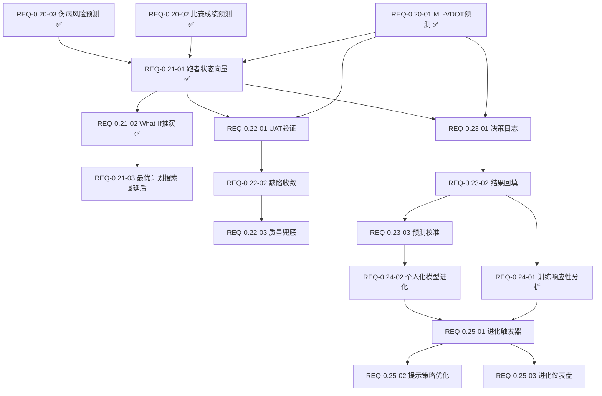
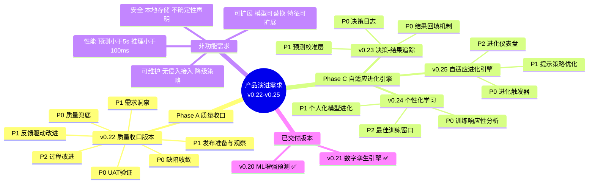

# 需求规格说明书

> **文档版本**: v9.0  
> **最后更新**: 2026-05-14  
> **当前基线**: v0.21.0  
> **覆盖版本**: v0.22.0 - v0.25.0  
> **对齐产品规划**: v9.5 (2026-05-14)  
> **对齐架构设计**: v8.1.0 (2026-05-12)  
> **外部参考**: 产品演进设计 v1.0 + 多智能体架构分析

---

## 1. 项目概述

### 1.1 产品定位

Nanobot Runner 是一款桌面端私人 AI 跑步助理，基于 nanobot-ai 框架构建。产品从"记录跑步"升级为"预测跑步"再到"进化跑步"，核心价值：**本地化、隐私可控、专业可信、预测未来、自我进化**。

### 1.2 演进愿景

| 阶段 | 口号 | 核心能力 | 对应版本 |
|------|------|----------|----------|
| **记录跑步** | "你的跑步数据管家" | FIT解析、数据存储、基础统计 | v0.5-v0.19 ✅ |
| **预测跑步** | "你的数字孪生跑者" | ML增强预测、What-If推演、风险预警 | v0.20-v0.21 ✅ / v0.22 当前 |
| **进化跑步** | "越用越懂你的私人教练" | 决策追踪、自适应学习、个性化进化 | v0.23-v0.25 |

### 1.3 目标用户

技术型严肃跑者：25-45岁技术从业者，规律跑步2年+，关注数据隐私，具备CLI操作能力。

### 1.4 核心痛点与演进目标

| 痛点 | 当前状态 | 演进目标 | 覆盖版本 |
|------|---------|---------|---------|
| 训练计划不够个性化 | 基于规则和LLM推理 | 数据驱动的个体化预测推演 | v0.20-v0.21 ✅ |
| 缺乏预测性健康预警 | 事后评估 | 3周前置伤病风险预警 | v0.20 ✅ |
| 功能稳定性待验证 | v0.20-v0.21引入复杂ML/孪生功能 | 全量UAT验证+缺陷收敛+质量兜底 | v0.22 |
| 缺乏自我进化能力 | 每次决策从零开始 | 从训练结果中学习优化 | v0.23-v0.25 |

### 1.5 已完成功能摘要

| 模块 | 核心能力 | 版本 |
|------|----------|------|
| 数据管理 | FIT解析、SHA256去重、Parquet按年分片 | v0.5 |
| 数据分析 | VDOT、TSS/ATL/CTL/TSB、心率漂移、用户画像 | v0.8-v0.9 |
| Agent交互 | 自然语言查询、智能建议、训练计划 | v0.8-v0.12 |
| CLI | 分层架构、Rich格式化 | v0.9 |
| 架构 | 依赖注入(AppContext)、Polars向量化 | v0.9-v0.16 |
| 工具生态 | MCP协议、AI自我诊断、决策透明化 | v0.13-v0.15 |
| 可视化与导出 | 终端图表(plotext)、多格式导出 | v0.18 |
| 身体信号分析 | HRV分析、疲劳度评估、恢复状态、身体信号解读 | v0.19 |
| ML增强预测 | VDOT趋势预测、比赛成绩预测、伤病风险预测、模型管理 | v0.20 |
| 数字孪生引擎 | 跑者状态向量、What-If推演、计划对比 | v0.21 |

---

## 2. 文档冲突裁决记录

> 以下冲突已在历史版本中裁决，此处保留结论供参考。详细裁决理由见历史版本。

### 2.1 裁决结论汇总

| 冲突项 | 裁决结论 |
|--------|---------|
| ML框架选型 | **scikit-learn (GradientBoostingRegressor/Classifier)**，不采用LightGBM |
| 预测模块命名 | **`src/core/prediction/`** |
| 孪生模块命名 | **`src/core/twin/`**（v0.21已交付） |
| 多视角模块命名 | **`src/core/review/`**（延后，v0.22已调整为质量收口版本） |
| 决策追踪模块命名 | **`src/core/tracking/`**（v0.23规划） |
| 个性化学习模块命名 | **`src/core/personalization/`**（v0.24规划） |
| 进化模块命名 | **`src/core/evolution/`**（v0.25规划） |
| CLI命令规范 | predict/twin/evolution各自独立命令组，snake_case风格 |
| Agent工具命名 | snake_case风格，与现有工具命名规范一致 |
| 多智能体架构 | 单Agent角色切换为主方案，多Agent为增强手段，非核心依赖 |

---

## 3. Phase A：数字孪生跑者（v0.20-v0.22）

### 3.1 v0.20.0 交付摘要：ML增强预测 ✅ 已发布

**版本主题**: ML增强预测 —— 为数据充足用户提供更精准的未来洞察

**核心交付**:

| 需求ID | 需求描述 | 优先级 | 状态 |
|--------|---------|--------|------|
| REQ-0.20-01 | ML-VDOT趋势预测（时序特征/多因子ML/置信区间/SHAP特征重要性） | P0 | ✅ 已交付 |
| REQ-0.20-02 | 个人化比赛成绩预测（修正系数/Riegel拟合/赛前修正/历史验证） | P0 | ✅ 已交付 |
| REQ-0.20-03 | ML伤病风险预测（时序特征/多模态融合/风险时间线/可解释因子） | P0 | ✅ 已交付 |
| REQ-0.20-04 | 伤病报告工具（标签分类/持久化存储） | P0 | ✅ 已交付 |
| REQ-0.20-05 | 训练响应预测工具（Banister IR/刺激计算/响应预测） | P0 | ✅ 已交付 |
| REQ-0.20-06 | 模型管理与校准（训练/版本管理/准确性追踪/增量学习） | P1 | ✅ 已交付 |
| REQ-0.20-07 | 数据充足度评估（质量报告/积累建议/解锁进度） | P1 | ✅ 已交付 |
| REQ-0.20-08 | 高级分析功能（训练响应性/最佳窗口/年度周期） | P2 | ✅ 已交付 |

**技术选型**: scikit-learn (GradientBoosting) + scipy (Riegel/Banister IR拟合) + shap (特征解释) + joblib (模型序列化)

**数据门槛分层策略**: L1 ML增强(18月+/400+条) → L2 参数化基线(200-400条) → L3 基础预测(<200条)

**成功标准达成**: VDOT预测误差<5% ✅ | 全马预测误差<8分钟 ✅ | 伤病3周预警召回率>75% ✅ | ML预测响应<5秒 ✅

---

### 3.2 v0.21.0 交付摘要：数字孪生引擎 ✅ 已发布

**版本主题**: 数字孪生引擎 —— 构建可推演的跑者生理模型

**核心交付**:

| 需求ID | 需求描述 | 优先级 | 状态 |
|--------|---------|--------|------|
| REQ-0.21-01 | 跑者状态向量（5维度≥15指标/自动聚合/缓存TTL=24h） | P0 | ✅ 已交付 |
| REQ-0.21-02 | What-If推演引擎（simulate_plan/compare_plans/仅系统计划） | P0 | ✅ 已交付 |
| REQ-0.21-03 | 最优计划搜索 | P1(延后) | ⏳ 延后到v0.22+评估 |

**MVP Twin设计决策**: 仅支持系统生成计划(plan_id引用)，手动计划输入和自动寻优延后评估

**新增CLI命令**: `twin status [--refresh] [--json]`, `twin simulate --plan --weeks [--json]`, `twin compare --plans --weeks [--json]`

**新增Agent工具**: `get_runner_state`, `simulate_plan`, `compare_plans`

**成功标准达成**: 4周VDOT推演误差<8% ✅ | 单计划4周推演<10秒 ✅ | 状态向量聚合<3秒 ✅

---

### 3.3 v0.22.0 需求规格：质量收口版本（Hardening Release）

#### 3.3.1 版本概述

**版本主题**: 质量收口 + 需求洞察 —— 全量功能稳定性验证 + 用户痛点挖掘与反馈驱动改进  
**核心目标**: 
1. 通过系统化UAT验证v0.5-v0.21全版本功能稳定性，修复缺陷
2. 基于UAT反馈挖掘用户使用痛点，形成新用户需求
3. 建立反馈驱动的产品改进机制
**目标用户**: 所有使用产品的用户（覆盖全版本功能使用者）  
**对齐文档**: [产品规划方案 v9.5](../product/产品规划方案.md)

**版本背景与决策** ⭐:

> 原规划的「多视角决策验证（Coach/Doctor双视角）」版本因以下原因调整为「质量收口版本」：
> 1. v0.20-v0.21引入了ML预测、数字孪生等复杂功能，需要充分验证稳定性
> 2. 多视角决策验证依赖nanobot Subagent能力，当前底座支持尚不成熟
> 3. 优先保障现有功能的质量基线，为后续v0.23-v0.25自适应进化奠定稳定基础

**与v0.20/v0.21的关系**：

| 能力 | v0.20/v0.21（功能交付） | v0.22（质量收口） |
|------|------------------------|-------------------|
| 功能验证 | 功能开发+自测 | 系统化UAT验证全版本功能 |
| 缺陷管理 | 开发期缺陷修复 | 缺陷收敛：致命/严重清零，一般≥80% |
| 用户体验 | 功能可用 | 痛点挖掘+反馈驱动改进 |
| 质量保障 | 基础测试 | 质量兜底：边界测试+性能基线+数据一致性 |
| 发布就绪 | 版本发布 | 发布检查+7天观察期 |

#### 3.3.2 需求清单

| 需求ID | 需求描述 | 优先级 |
|--------|---------|--------|
| REQ-0.22-01 | UAT验证（覆盖v0.5-v0.21全版本功能，P0用例100%通过，P1用例≥90%通过） | P0 |
| REQ-0.22-02 | 缺陷收敛（致命/严重缺陷清零，一般缺陷修复率≥80%） | P0 |
| REQ-0.22-03 | 质量兜底（边界测试+性能基线+数据一致性+兼容性+文档完整性） | P0 |
| REQ-0.22-04 | 需求洞察（识别≥3个有效痛点，形成≥2个新需求） | P1 |
| REQ-0.22-05 | 反馈驱动改进（高优先级改进项完成率≥80%） | P1 |
| REQ-0.22-06 | 发布准备与观察（发布就绪检查+7天观察期） | P1 |
| REQ-0.22-07 | 过程改进（复盘与流程优化，识别并记录可改进点） | P2 |

#### 3.3.3 P0需求详细规格

##### REQ-0.22-01：UAT验证

**需求描述**: 执行系统化用户验收测试，覆盖v0.5-v0.21全版本功能，验证功能稳定性

**UAT测试范围**:

| 版本 | 模块 | 测试重点 |
|------|------|----------|
| v0.5+ | 数据导入 | 单文件/批量导入、去重、异常处理 |
| v0.5+ | 数据查询 | 统计信息、年份/日期范围过滤 |
| v0.5+ | 数据分析 | VDOT趋势、训练负荷、心率漂移 |
| v0.5+ | 训练计划 | 智能建议、目标评估、长期规划 |
| v0.5+ | 报告生成 | 周报、月报、报告导出 |
| v0.5+ | 系统管理 | 配置验证、数据迁移 |
| v0.5+ | Agent交互 | 自然语言对话、数据查询 |
| v0.5+ | 性能测试 | 批量导入性能、查询性能 |
| v0.17 | MCP工具管理 | 工具列表、启用/禁用、配置导入 |
| v0.17 | Agent工具集成 | 天气/地图/健康数据工具 |
| v0.17 | Gateway服务 | 飞书通道、命令路由、消息推送 |
| v0.17 | Cron训练提醒 | 状态查看、启用/禁用、手动触发 |
| v0.17 | AI透明化 | 决策追踪、状态看板、训练洞察 |
| v0.17 | 偏好管理 | 查看/设置/重置偏好、反馈统计 |
| v0.17 | 技能管理 | 技能列表、启用/禁用、导入 |
| v0.18 | 数据可视化 | VDOT趋势图、训练负荷曲线、心率区间 |
| v0.18 | 数据导出 | CSV/JSON/Parquet导出、日期筛选 |
| v0.19 | 身体信号 | HRV分析、疲劳度评估、恢复评估 |
| v0.20 | 预测模块 | ML-VDOT预测、比赛成绩预测、伤病预警 |
| v0.21 | 数字孪生 | 状态向量构建、What-If推演、计划对比 |

**AI辅助UAT执行**:
1. AI Agent根据用户验收测试指南辅助执行测试
2. 自动汇总测试结果，按严重程度分级（致命/严重/一般/轻微）
3. 生成UAT反馈报告，包含缺陷清单、修复建议、风险评估
4. 同步收集用户体验反馈，识别使用痛点

**验收标准**:

- [ ] AC-01: UAT测试覆盖v0.5-v0.21全部版本功能模块
- [ ] AC-02: P0用例100%通过
- [ ] AC-03: P1用例≥90%通过
- [ ] AC-04: 生成UAT测试报告，包含按模块/版本的测试结果汇总
- [ ] AC-05: 同步收集用户体验反馈，输出痛点清单

---

##### REQ-0.22-02：缺陷收敛

**需求描述**: 对UAT发现的缺陷进行分级、修复、验证，确保致命/严重缺陷清零

**缺陷分级与修复优先级**:

| 级别 | 定义 | 修复时限 | 验收标准 |
|------|------|----------|----------|
| **致命** | 导致系统崩溃、数据丢失、核心功能不可用 | 24小时内 | 100%修复 |
| **严重** | 主要功能异常、性能严重下降 | 3天内 | 100%修复 |
| **一般** | 次要功能异常、用户体验问题 | 1周内 | 修复率≥80% |
| **轻微** | 界面瑕疵、文案问题 | 可选修复 | 记录待后续优化 |

**缺陷收敛流程**:

```
UAT发现缺陷 → 分级定级 → 分配修复 → 修复验证 → 回归测试 → 缺陷关闭
     ↑                                                              |
     └──────────────── 未通过验证，重新打开 ────────────────────────┘
```

**验收标准**:

- [ ] AC-01: 致命缺陷100%修复，严重缺陷100%修复
- [ ] AC-02: 一般缺陷修复率≥80%
- [ ] AC-03: 每个修复的缺陷通过回归测试验证
- [ ] AC-04: 生成缺陷修复报告，包含修复清单、回归测试结果

---

##### REQ-0.22-03：质量兜底

**需求描述**: 补充测试与边界验证，建立质量基线，防止功能退化

**兜底措施**:

| 兜底项 | 措施 | 完成标准 |
|--------|------|----------|
| 边界测试 | 补充异常输入、边界值测试 | 核心接口边界覆盖100% |
| 性能基线 | 建立性能基准，防止退化 | 关键操作响应时间符合v0.21基线 |
| 数据一致性 | 验证数据计算准确性 | VDOT/TSS/CTL等核心指标计算正确 |
| 兼容性 | 验证历史数据兼容性 | v0.19及之前数据正常迁移 |
| 文档完整性 | 检查用户文档、API文档 | 所有功能有对应文档说明 |

**验收标准**:

- [ ] AC-01: 核心接口边界测试覆盖100%
- [ ] AC-02: 关键操作响应时间符合v0.21基线（ML预测<5秒，推演<10秒，状态聚合<3秒）
- [ ] AC-03: VDOT/TSS/CTL/ATL/TSB等核心指标计算结果与v0.21一致
- [ ] AC-04: v0.19及之前的历史数据可正常加载和使用
- [ ] AC-05: 100%功能有对应文档说明
- [ ] AC-06: 生成质量兜底报告

#### 3.3.4 P1需求详细规格

##### REQ-0.22-04：需求洞察

**需求描述**: 收集UAT反馈，挖掘用户使用痛点，形成新用户需求

**用户痛点挖掘流程**:

```
UAT执行过程中
    ↓
收集用户反馈（体验问题、功能建议、使用障碍）
    ↓
痛点分析分类（功能性/易用性/性能/文档）
    ↓
痛点优先级排序（影响范围 × 解决价值）
    ↓
形成新用户需求 → 纳入需求池
    ↓
高优先级改进项在v0.22内实现
```

**反馈收集渠道**:

| 渠道 | 收集方式 |
|------|----------|
| UAT测试反馈 | AI Agent辅助收集测试过程中的体验问题 |
| 用户主动反馈 | 内置反馈命令、Issue模板 |
| 使用数据分析 | 分析高频操作路径、异常退出点 |

**验收标准**:

- [ ] AC-01: 识别≥3个有效痛点
- [ ] AC-02: 形成≥2个新需求条目，纳入需求池
- [ ] AC-03: 输出需求洞察报告，含痛点分析、优先级排序、新需求条目

---

##### REQ-0.22-05：反馈驱动改进

**需求描述**: 基于用户反馈优化功能，实现高优先级改进项

**反馈处理流程**:

| 阶段 | 动作 | 输出 |
|------|------|------|
| 收集 | 多渠道汇总用户反馈 | 原始反馈列表 |
| 分类 | 按功能模块、问题类型分类 | 分类反馈清单 |
| 分析 | 识别共性痛点、根因分析 | 痛点分析报告 |
| 转化 | 将痛点转化为具体需求 | 新需求条目 |
| 优先级 | 评估业务价值、实现成本 | 优先级排序列表 |
| 实现 | 高优先级改进项开发 | 改进实现报告 |
| 验证 | 用户验证改进效果 | 验证确认 |

**验收标准**:

- [ ] AC-01: 高优先级改进项完成率≥80%
- [ ] AC-02: 改进项经过用户验证确认
- [ ] AC-03: 生成改进实现报告

---

##### REQ-0.22-06：发布准备与观察

**需求描述**: 发布检查与文档完善，发布后7天观察期

**发布就绪检查单**:

| 检查项 | 负责人 |
|--------|--------|
| UAT测试通过 | 测试工程师 |
| 需求洞察报告完成 | 产品经理 |
| 高优先级改进项完成 | 开发工程师 |
| 致命/严重缺陷清零 | 开发工程师 |
| 性能测试通过 | 测试工程师 |
| 文档更新完成 | 产品经理 |
| 发布说明编写完成 | 产品经理 |
| 回滚方案准备就绪 | 运维工程师 |

**发布后观察期（7天）**:
- 监控用户反馈渠道（Issue、社区）
- 跟踪关键指标（错误率、性能指标）
- 持续收集用户反馈，补充需求洞察
- 快速响应并修复发现的问题

**验收标准**:

- [ ] AC-01: 发布就绪检查单所有项满足
- [ ] AC-02: 发布后7天内无P0级问题
- [ ] AC-03: 生成发布后观察报告

#### 3.3.5 P2需求详细规格

##### REQ-0.22-07：过程改进

**需求描述**: 复盘v0.22质量收口过程，识别并记录可改进点

**验收标准**:

- [ ] AC-01: 识别并记录≥3个可改进点
- [ ] AC-02: 输出过程改进建议，供后续版本参考

#### 3.3.6 v0.22.0 成功标准

| 维度 | 标准 | 测量方式 |
|------|------|----------|
| UAT通过率 | P0用例100%，P1用例≥90% | UAT测试报告 |
| 缺陷修复率 | 致命/严重100%，一般≥80% | 缺陷跟踪报告 |
| 需求洞察 | 识别≥3个有效痛点，形成≥2个新需求 | 需求洞察报告 |
| 反馈改进 | 高优先级改进项完成率≥80% | 改进实现报告 |
| 发布质量 | 发布后7天内无P0级问题 | 发布后观察报告 |
| 用户满意度 | 无重大质量投诉 | 用户反馈汇总 |
| 文档完整度 | 100%功能有对应文档 | 文档检查清单 |

---

## 4. Phase C：自适应进化引擎（v0.23-v0.25）

### 4.0 Phase C 基线测量计划

> 在 v0.22 发布后、v0.23 启动前执行，作为 v0.23-v0.25 迭代效果对比的依据。

| 指标 | 基线值（v0.22 结束时） | 测量方法 | 量化标准 |
|------|------------------------|----------|----------|
| VDOT 预测误差（MAE） | 以 `PredictionRecord` 中最近 30 天记录计算 | `abs(预测VDOT - 实际VDOT) / 实际VDOT` 均值 | 每版本下降 ≥ 5%（相对值），连续 2 个版本 |
| 全马成绩预测误差 | 以 `PredictionRecord` 中最近 3 次比赛预测计算 | `abs(预测成绩 - 实际成绩)` 均值 | 每版本下降 ≥ 5%（相对值），连续 2 个版本 |
| 用户主观满意度 | 初始基线：无（v0.22 首次收集） | `RecordFeedbackTool` 收集，1-5 星评分 + 可选文本反馈 | 平均分 ≥ 4.0/5.0，每版本提升 ≥ 0.1 分 |
| 系统推荐采纳率 | 初始基线：无（v0.22 首次收集） | 追踪 `DecisionLog` 中 `recommendation_accepted` 字段 | 采纳率 > 60%，每版本提升 ≥ 3%（绝对值） |
| 伤病预警召回率 | 以 v0.20-v0.22 实际伤病事件回溯计算 | 对比 `InjuryRiskPrediction` 与 `InjuryReport` 时间戳 | 维持 ≥ 75%，误报率每版本下降 ≥ 3% |

**基线报告输出**：v0.23 启动前必须输出《Phase C 基线测量报告》。

### 4.1 v0.23.0 需求规格：决策-结果追踪系统

#### 4.1.1 版本概述

**版本主题**: 决策-结果追踪 —— 记录AI决策全链路，建立"决策→执行→结果→校准"闭环  
**核心目标**: 让系统具备自我评估能力，为后续个性化学习提供数据基础  
**前置依赖**: v0.20预测引擎、v0.21孪生引擎（可选）  
**不依赖v0.22**: 即使v0.22跳过，v0.23仍可独立交付

#### 4.1.2 P0需求：决策追踪核心

##### REQ-0.23-01：决策日志

**需求描述**: 记录每次AI决策的完整上下文，包括跑者状态、工具调用链、预测快照

**功能要点**:

| 字段 | 说明 |
|------|------|
| decision_id | 唯一标识 |
| timestamp | 决策发生时间 |
| runner_state | 决策时的RunnerStateVector |
| decision_type | 训练计划生成/预测查询/风险评估 |
| input_context | 决策输入上下文 |
| tools_called | 本次决策调用的所有工具及参数 |
| prediction_made | 决策时做出的预测（如有） |
| decision_summary | 决策摘要 |

**验收标准**:

- [ ] AC-01: DecisionRecord为frozen dataclass，包含上述全部字段
- [ ] AC-02: 通过现有Hook系统无侵入接入，不修改核心Agent逻辑
- [ ] AC-03: 决策日志按月分片存储为Parquet格式：`~/.nanobot-runner/decisions/2026-05/`
- [ ] AC-04: DecisionTrackingHook实现before_iteration/before_execute_tools/after_iteration三个钩子

**数据模型**:

```python
@dataclass
class DecisionRecord:
    decision_id: str
    timestamp: datetime
    runner_state: RunnerStateVector
    decision_type: str
    input_context: dict
    decision_summary: str
    tools_called: list[ToolCallRecord]
    prediction_made: PredictionSnapshot | None
    executed: bool | None = None
    execution_fidelity: float | None = None
    actual_outcome: OutcomeRecord | None = None
    user_feedback: str | None = None
    prediction_error: float | None = None
    decision_quality: float | None = None
```

---

##### REQ-0.23-02：结果回填机制

**需求描述**: 对比计划vs实际、预测vs实际，建立结果追踪闭环

**功能要点**:

| 功能 | 说明 |
|------|------|
| check_plan_execution() | 对比计划训练vs实际训练，计算执行忠实度 |
| check_prediction_accuracy() | 对比预测VDOT vs 实际VDOT，对比预测伤病风险vs实际伤病事件 |
| generate_feedback_prompt() | 生成用户反馈收集提示 |

**验收标准**:

- [ ] AC-01: check_plan_execution()输出ExecutionReport，含执行忠实度(0-1)、偏差详情
- [ ] AC-02: check_prediction_accuracy()输出AccuracyReport，含MAE、偏差方向、校准建议
- [ ] AC-03: 结果回填不阻塞主流程，异步执行
- [ ] AC-04: 结果记录按月分片存储为Parquet格式：`~/.nanobot-runner/outcomes/2026-05/`

---

#### 4.1.3 P1需求：预测校准

##### REQ-0.23-03：预测校准层

**需求描述**: 基于决策日志和结果记录，校准预测模型的系统性偏差

**验收标准**:

- [ ] AC-01: 校准器检测预测的系统性偏差（持续高估/低估），输出偏差方向和幅度
- [ ] AC-02: 校准结果应用于后续预测，自动修正预测值
- [ ] AC-03: 校准触发条件：累计≥10条预测-实际配对数据
- [ ] AC-04: 校准过程输出校准报告，含修正前后对比

---

#### 4.1.4 v0.23.0 成功标准

| 维度 | 标准 |
|------|------|
| 决策记录 | 每次AI决策100%自动记录 |
| 结果回填 | 计划执行忠实度可计算率>80% |
| 预测校准 | 校准后预测误差降低≥10% |
| 性能 | Hook接入对主流程延迟增加<100ms |

---

### 4.2 v0.24.0 需求规格：个性化学习

#### 4.2.1 版本概述

**版本主题**: 个性化学习 —— 让系统理解"这个跑者对什么训练响应最好"  
**核心目标**: 基于决策日志和结果记录，实现训练响应性分析和模型个体化进化  
**前置依赖**: v0.23决策追踪系统

#### 4.2.2 P0需求：训练响应性分析

##### REQ-0.24-01：训练响应性分析

**需求描述**: 分析用户对不同训练刺激的反应，识别最有效的训练类型

**验收标准**:

- [ ] AC-01: 输出不同训练类型(间歇/阈值/长距离/恢复)对VDOT的提升效果排名
- [ ] AC-02: 基于v0.23决策日志中的训练-结果配对数据
- [ ] AC-03: 输出个人训练响应画像（如"间歇训练响应性强"）
- [ ] AC-04: 分析结果可被LLM引用，用于个性化训练计划生成

---

#### 4.2.3 P1需求：个人化模型进化

##### REQ-0.24-02：个人化模型进化

**需求描述**: 基于决策日志持续校准预测模型参数

**验收标准**:

- [ ] AC-01: VDOT预测校准基于预测误差调整模型偏差，校准后MAE降低≥15%
- [ ] AC-02: 伤病风险校准基于实际伤病事件调整风险阈值
- [ ] AC-03: 训练响应校准基于实际训练效果调整Banister IR参数(τ_fitness, τ_fatigue)
- [ ] AC-04: 校准过程输出校准报告，含参数变化对比

---

#### 4.2.4 P2需求：最佳训练窗口

##### REQ-0.24-03：最佳训练窗口预测

**需求描述**: 基于CTL-VDOT关联分析，预测突破VDOT的最佳时机

**验收标准**:

- [ ] AC-01: 基于历史CTL-VDOT关联分析，输出"未来2-4周是突破VDOT的最佳窗口"
- [ ] AC-02: 窗口预测基于≥6个月的CTL-VDOT关联数据

---

#### 4.2.5 v0.24.0 成功标准

| 维度 | 标准 |
|------|------|
| 响应性分析 | 训练类型效果排名与用户主观感受一致率>70% |
| 模型进化 | 校准后VDOT预测MAE降低≥15% |
| 伤病校准 | 校准后伤病风险AUC提升≥0.05 |

---

### 4.3 v0.25.0 需求规格：自适应进化引擎

#### 4.3.1 版本概述

**版本主题**: 自适应进化引擎 —— 实现"决策→执行→追踪→校准→优化→更好决策"自进化闭环  
**核心目标**: 让系统从用户反馈和训练结果中自动学习优化  
**前置依赖**: v0.23决策追踪 + v0.24个性化学习

#### 4.3.2 P0需求：进化触发器

##### REQ-0.25-01：自动化进化触发器

**需求描述**: 自动检测进化条件并触发模型重训练/策略优化

**验收标准**:

- [ ] AC-01: 预测误差连续3次>阈值(15%)时，自动触发对应模型重训练
- [ ] AC-02: 用户连续2次拒绝推荐时，调整推荐策略
- [ ] AC-03: 新数据积累≥50条时，触发增量学习
- [ ] AC-04: 月度复盘时，生成个性化进化报告
- [ ] AC-05: 进化触发不阻塞主流程，异步执行

---

#### 4.3.3 P1需求：提示策略优化

##### REQ-0.25-02：LLM提示策略优化

**需求描述**: 基于用户反馈和决策效果，自动优化LLM提示词

**验收标准**:

- [ ] AC-01: 个性化语气：根据用户偏好调整建议风格（严厉/温和/数据驱动）
- [ ] AC-02: 信息密度：根据用户反馈调整输出详细程度
- [ ] AC-03: 推荐策略：根据采纳率调整推荐激进程度
- [ ] AC-04: 优化策略存储为配置文件，可回滚

---

#### 4.3.4 P2需求：进化仪表盘

##### REQ-0.25-03：进化仪表盘

**需求描述**: 可视化展示系统进化状态和效果

**验收标准**:

- [ ] AC-01: 新增CLI命令 `evolution status`，输出进化引擎状态
- [ ] AC-02: 展示：决策记录数、预测准确率趋势、决策接受率、模型版本、个性化程度、上次进化时间
- [ ] AC-03: 新增CLI命令 `evolution trigger`，手动触发进化检查

---

#### 4.3.5 v0.25.0 成功标准

| 维度 | 标准 |
|------|------|
| 自进化闭环 | 决策→校准→优化闭环自动运行率>90% |
| 预测进化 | VDOT预测MAE<0.5（个体化校准后） |
| 伤病进化 | 伤病风险AUC>0.80 |
| 决策进化 | 训练计划接受率较v0.20提升≥20% |
| 预测校准 | 校准误差<5% |

---

## 5. 非功能需求

### 5.1 性能需求

| 需求ID | 需求描述 | 验收标准 | 覆盖版本 |
|--------|---------|---------|---------|
| NFR-01 | ML预测响应时间 | <5秒 | v0.20+ |
| NFR-02 | ML模型训练时间 | <5分钟/单模型 | v0.20+ |
| NFR-03 | ML推理延迟 | <100ms | v0.20+ |
| NFR-04 | 孪生推演性能 | 单计划4周推演<10秒 | v0.21+ |
| NFR-04b | 多计划对比性能 | 3计划4周对比<30秒 | v0.21+ |
| NFR-04c | 状态向量聚合性能 | RunnerStateVector聚合计算<3秒 | v0.21+ |
| NFR-05 | Hook接入延迟 | 对主流程增加<100ms | v0.23+ |
| NFR-06 | 模型文件大小 | <50MB/模型 | v0.20+ |

### 5.2 安全需求

| 需求ID | 需求描述 | 验收标准 | 覆盖版本 |
|--------|---------|---------|---------|
| NFR-07 | 数据本地存储 | 所有ML模型和预测数据仅存储本地 | v0.20+ |
| NFR-08 | 预测不确定性声明 | ML预测必须输出置信区间和不确定性声明 | v0.20+ |
| NFR-09 | 模型回滚安全 | 模型重训练失败时自动回退到上一版本 | v0.20+ |
| NFR-09b | 推演不确定性声明 | 孪生推演必须标注"模拟结果，非确定性预测" | v0.21+ |

### 5.3 可维护性需求

| 需求ID | 需求描述 | 验收标准 | 覆盖版本 |
|--------|---------|---------|---------|
| NFR-10 | 模块无侵入接入 | 新模块通过Hook/接口接入，不修改现有核心逻辑 | v0.20+ |
| NFR-11 | 数据降级策略 | 数据不足时自动降级为基础预测，不阻塞用户 | v0.20+ |
| NFR-12 | 向后兼容 | 新版本不破坏现有CLI命令和Agent工具接口 | v0.20+ |
| NFR-12b | 孪生模块无侵入 | twin模块通过AppContext扩展属性接入，不修改现有核心逻辑 | v0.21+ |

### 5.4 可扩展性需求

| 需求ID | 需求描述 | 验收标准 | 覆盖版本 |
|--------|---------|---------|---------|
| NFR-13 | 模型可替换 | ML模型实现可替换（sklearn→其他框架），接口不变 | v0.20+ |
| NFR-14 | 特征可扩展 | 特征工程支持新增特征维度，不破坏现有模型 | v0.20+ |
| NFR-14b | 推演策略可扩展 | What-If推演策略可替换（Banister IR→其他模型），接口不变 | v0.21+ |

---

## 6. 约束条件

- Python 3.11+ / Polars 0.20+ / nanobot-ai Latest
- 本地部署，无云服务依赖
- 支持 Windows/Linux/macOS
- 仅支持 FIT 格式文件
- 单用户使用场景
- ML模型训练和推理均在本地执行
- 模型文件存储于用户本地目录
- nanobot框架仅支持主-从后台任务模式，不支持Agent间协作

---

## 7. 数据需求

### 7.1 新增数据项汇总

| 数据项 | 类型 | 来源 | 版本 |
|--------|------|------|------|
| predicted_vdot | float | ML模型/线性回归 | v0.20 |
| prediction_confidence | float | 模型输出 | v0.20 |
| confidence_lower/upper | float | 模型输出 | v0.20 |
| prediction_type | str | 数据充足度判断 | v0.20 |
| injury_risk_probability | float | ML分类模型 | v0.20 |
| risk_timeline | list | ML时序预测 | v0.20 |
| runner_type | str | 个人修正系数学习 | v0.20 |
| riegel_exponent | float | 曲线拟合 | v0.20 |
| model_version | str | 模型管理 | v0.20 |
| runner_state_vector | RunnerStateVector | 各计算器/引擎聚合 | v0.21 |
| state_vector_cache | RunnerStateCache | 本地文件 | v0.21 |
| plan_simulation_result | PlanSimulationResult | WhatIfSimulator | v0.21 |
| plan_comparison | PlanComparison | PlanComparator | v0.21 |
| composite_score | float | 加权公式计算 | v0.21 |
| overtraining_risk | str | 推演引擎 | v0.21 |
| recovery_margin | str | 推演引擎 | v0.21 |

### 7.2 新增存储需求

| 数据类型 | 存储位置 | 估算大小 |
|---------|---------|---------|
| ML模型文件 | ~/.nanobot-runner/models/ | 5-50MB/模型 |
| 预测历史记录 | ~/.nanobot-runner/predictions/ | ~1MB/年 |
| 特征缓存 | ~/.nanobot-runner/cache/ | ~10MB |
| 伤病标签 | ~/.nanobot-runner/injury_labels/ | ~1MB/年 |
| 决策日志 | ~/.nanobot-runner/decisions/ | ~5MB/年 |
| 结果记录 | ~/.nanobot-runner/outcomes/ | ~2MB/年 |
| 状态向量缓存 | ~/.nanobot-runner/twin/state_vector.json | ~5KB |
| 推演结果缓存 | ~/.nanobot-runner/twin/simulations/ | ~50KB/次 |

---

## 8. 需求依赖关系



**需求清单汇总**:

| 需求ID | 需求描述 | 优先级 | 前置依赖 | 状态 |
|--------|---------|--------|----------|------|
| REQ-0.20-01 | ML-VDOT趋势预测 | P0 | VDOTCalculator, RacePredictionEngine | ✅ |
| REQ-0.20-02 | 个人化比赛成绩预测 | P0 | REQ-0.20-01 | ✅ |
| REQ-0.20-03 | ML伤病风险预测 | P0 | REQ-0.20-01 | ✅ |
| REQ-0.20-04 | 伤病报告工具 | P0 | 无 | ✅ |
| REQ-0.20-05 | 训练响应预测工具 | P0 | REQ-0.20-01 | ✅ |
| REQ-0.20-06 | 模型管理与校准 | P1 | REQ-0.20-01/02/03 | ✅ |
| REQ-0.20-07 | 数据充足度评估 | P1 | REQ-0.20-01/02/03 | ✅ |
| REQ-0.20-08 | 高级分析功能 | P2 | REQ-0.20-01/02 | ✅ |
| REQ-0.21-01 | 跑者状态向量 | P0 | REQ-0.20-01/02/03 | ✅ |
| REQ-0.21-02 | What-If推演引擎 | P0 | REQ-0.21-01 | ✅ |
| REQ-0.21-03 | 最优计划搜索 | P1(延后) | REQ-0.21-02 | ⏳ |
| REQ-0.22-01 | UAT验证 | P0 | REQ-0.20-01, REQ-0.21-01 | 📋 |
| REQ-0.22-02 | 缺陷收敛 | P0 | REQ-0.22-01 | 📋 |
| REQ-0.22-03 | 质量兜底 | P0 | REQ-0.22-02 | 📋 |
| REQ-0.22-04 | 需求洞察 | P1 | REQ-0.22-01 | 📋 |
| REQ-0.22-05 | 反馈驱动改进 | P1 | REQ-0.22-04 | 📋 |
| REQ-0.22-06 | 发布准备与观察 | P1 | REQ-0.22-02/03 | 📋 |
| REQ-0.22-07 | 过程改进 | P2 | REQ-0.22-06 | 📋 |
| REQ-0.23-01 | 决策日志 | P0 | REQ-0.20-01, REQ-0.21-01 | 📋 |
| REQ-0.23-02 | 结果回填机制 | P0 | REQ-0.23-01 | 📋 |
| REQ-0.23-03 | 预测校准层 | P1 | REQ-0.23-02 | 📋 |
| REQ-0.24-01 | 训练响应性分析 | P0 | REQ-0.23-02 | 📋 |
| REQ-0.24-02 | 个人化模型进化 | P1 | REQ-0.23-03 | 📋 |
| REQ-0.24-03 | 最佳训练窗口预测 | P2 | REQ-0.24-01 | 📋 |
| REQ-0.25-01 | 自动化进化触发器 | P0 | REQ-0.24-01/02 | 📋 |
| REQ-0.25-02 | LLM提示策略优化 | P1 | REQ-0.25-01 | 📋 |
| REQ-0.25-03 | 进化仪表盘 | P2 | REQ-0.25-01 | 📋 |

---

## 9. 版本迭代计划

| 版本 | 主题 | P0需求数 | P1需求数 | P2需求数 | 状态 |
|------|------|---------|---------|---------|------|
| v0.20 | 预测智能模块 | 5 | 2 | 1 | ✅ 已发布 |
| v0.21 | 数字孪生引擎 | 2 | 0(1延后) | 0 | ✅ 已发布 |
| v0.22 | 质量收口版本 | 3 | 3 | 1 | 📋 当前 |
| v0.23 | 决策-结果追踪 | 2 | 1 | 0 | 📋 规划中 |
| v0.24 | 个性化学习 | 1 | 1 | 1 | 📋 规划中 |
| v0.25 | 自适应进化引擎 | 1 | 1 | 1 | 📋 规划中 |

**需求总数**: P0=14, P1=8(含1项延后), P2=3, **总计=25**（v0.20+v0.21已交付P0=7项，v0.22当前P0=3项）

---

## 10. 风险评估

### 10.1 v0.22 质量收口风险

| 风险 | 等级 | 影响 | 缓解措施 |
|------|------|------|----------|
| UAT测试范围过大 | 中 | 测试周期延长 | 按模块优先级分层测试，P0模块优先 |
| 缺陷修复引入新缺陷 | 中 | 回归风险 | 每个修复必须通过回归测试 |
| 历史版本兼容性问题 | 中 | 用户数据迁移失败 | 兼容性测试覆盖v0.5+全部版本 |
| 需求洞察质量不足 | 低 | 痛点识别不充分 | 多渠道收集反馈，AI辅助分析 |

### 10.2 Phase C 风险

| 风险 | 等级 | 影响 | 缓解措施 |
|------|------|------|----------|
| 决策日志数据膨胀 | 中 | 长期运行后日志过大 | Parquet按月分片；自动归档旧数据 |
| 用户反馈稀疏 | 高 | 缺乏足够反馈驱动进化 | 设计轻量反馈机制（thumbs up/down）；主动询问 |
| 进化方向偏差 | 中 | 系统学习到的偏好与真实目标偏离 | 保留人工覆盖机制；定期review进化报告 |
| 预测过度自信导致用户过度依赖 | 中 | 用户做出不安全决策 | 输出校准概率+置信区间+不确定性声明 |
| 数据不足导致ML模型无效 | 高 | 预测不准确 | 双轨制：参数化基线兜底，ML增强可选 |
| 伤病事件稀少导致分类模型欠拟合 | 高 | 伤病风险预测不准 | 规则基线+强正则化+类别权重平衡 |
| 推演误差累积 | 高 | 多步推演误差逐周放大 | 每步推演基于当前状态重新预测；输出不确定性声明 |

---

## 11. 验收总览

### 11.1 v0.22 质量收口验收门禁

| 门禁项 | 标准 |
|--------|------|
| UAT通过率 | P0用例100%，P1用例≥90% |
| 缺陷修复率 | 致命/严重100%，一般≥80% |
| 需求洞察 | 识别≥3个有效痛点，形成≥2个新需求 |
| 反馈改进 | 高优先级改进项完成率≥80% |
| 发布质量 | 发布后7天内无P0级问题 |
| 文档完整度 | 100%功能有对应文档 |

### 11.2 Phase A 已达成验收门禁

| 门禁项 | 标准 | 版本 |
|--------|------|------|
| VDOT预测准确 | ML预测误差<5% | v0.20 ✅ |
| 比赛预测准确 | 全马预测误差<8分钟 | v0.20 ✅ |
| 伤病预警有效 | 3周前置预警召回率>75% | v0.20 ✅ |
| 推演准确性 | 4周VDOT推演误差<8% | v0.21 ✅ |
| 推演性能 | 单计划4周推演<10秒 | v0.21 ✅ |
| 状态聚合性能 | RunnerStateVector聚合计算<3秒 | v0.21 ✅ |
| 推演不确定性 | 推演输出标注"模拟结果，非确定性预测" | v0.21 ✅ |

### 11.3 Phase C 验收门禁

| 门禁项 | 标准 | 版本 |
|--------|------|------|
| 决策记录 | 每次AI决策100%自动记录 | v0.23 |
| 预测校准 | 校准后预测误差降低≥10% | v0.23 |
| 模型进化 | 校准后VDOT预测MAE降低≥15% | v0.24 |
| 自进化闭环 | 闭环自动运行率>90% | v0.25 |
| 预测进化 | VDOT预测MAE<0.5 | v0.25 |

---

## 12. 需求脑图



---

## 附录A：术语表

| 术语 | 定义 |
|------|------|
| VDOT | 跑力值，衡量跑者有氧能力的指标 |
| Banister IR Model | 运动科学经典模型，描述训练刺激与体能响应的关系 |
| Riegel曲线 | 距离-成绩关系模型，标准指数1.06 |
| ACWR | 急慢性负荷比（Acute:Chronic Workload Ratio） |
| CTL | 慢性训练负荷（42天EWMA） |
| ATL | 急性训练负荷（7天EWMA） |
| TSB | 训练压力平衡（CTL-ATL） |
| SHAP | SHapley Additive exPlanations，特征重要性解释方法 |
| RunnerStateVector | 跑者状态向量，统一封装跑者当前全部生理状态 |
| DecisionLog | 决策日志，记录AI决策的完整上下文 |
| Hook系统 | nanobot-ai的事件钩子机制，支持无侵入扩展 |
| ML增强预测 | 使用机器学习模型替代简单统计模型的预测能力 |
| 参数化基线 | 数据不足时使用确定性模型（如Banister IR）的冷启动策略 |
| 基础预测 | v0.19及之前版本的简单线性回归/公式预测 |
| 增量学习 | 用新数据更新现有模型而非重新训练 |
| 数字孪生 | 基于数据构建的、可推演的跑者生理模型 |
| What-If推演 | 模拟不同训练方案下的状态演变 |
| 综合推荐评分 | 基于VDOT提升(0.4)+伤病风险(0.35)+恢复余量(0.25)加权的计划评分(0-100) |
| MVP Twin | v0.21最小可用孪生设计，仅核心推演能力，手动计划和自动寻优延后 |
| 质量收口版本 | Hardening Release，以UAT验证+缺陷收敛+质量兜底为核心的稳定性版本 |
| UAT | 用户验收测试（User Acceptance Testing） |
| 缺陷收敛 | 通过分级修复+回归验证，将缺陷数量收敛到可接受水平的质量活动 |

## 附录B：变更记录

| 版本 | 日期 | 变更内容 |
|------|------|---------|
| v9.0 | 2026-05-14 | **v0.22版本定位重构**：v0.22从"多视角决策验证（条件性）"调整为"质量收口版本（Hardening Release）"，对齐产品规划v9.5；精简v0.20/v0.21已发布版本为交付摘要；新增REQ-0.22-01~07质量收口需求（UAT验证/缺陷收敛/质量兜底/需求洞察/反馈改进/发布观察/过程改进）；新增Phase C基线测量计划；更新需求依赖图/迭代计划/风险评估/验收门禁/需求脑图；冲突裁决记录精简为结论汇总；对齐产品规划v9.5 |
| v8.5 | 2026-05-12 | v0.21.0需求规格更新：MVP Twin设计决策、缓存机制、CLI/Agent工具设计 |
| v8.0 | 2026-05-08 | 合并升级：吸收产品演进需求规格说明书v1.0全量内容，覆盖版本扩展至v0.20-v0.25 |
| v7.0 | 2026-05-07 | v0.20.0详细需求规格 |
| v6.0 | 2026-05-06 | v0.19.0身体信号分析需求规格 |
| v5.0 | 2026-04-20 | v0.18.0可视化与导出需求规格 |
