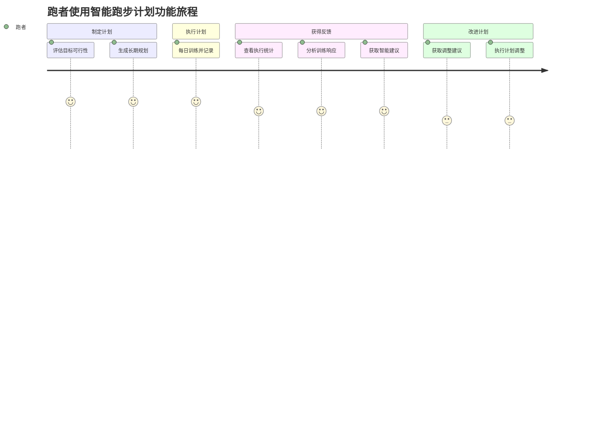
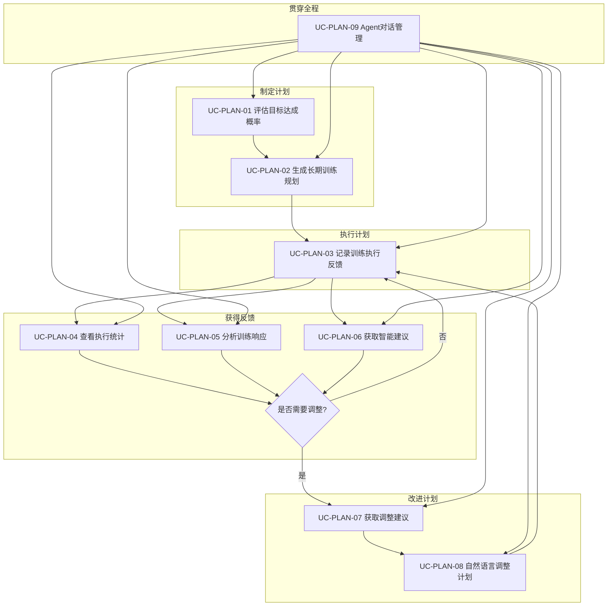

# 智能跑步计划功能用例（Use Cases）

> **文档版本**: v1.1
> **创建日期**: 2026-04-21
> **最后更新**: 2026-04-21
> **文档状态**: 正式发布
> **适用范围**: v0.10.0 - v0.12.0 智能跑步计划功能
> **对齐文档**: 《PRD_智能跑步计划.md》《REQ_需求规格说明书.md》《产品规划方案.md》

---

## 1. 文档目的

本文档基于项目现有基线（v0.10.0-v0.12.0 已实现的 CLI、Agent 工具、核心引擎），从**用户视角**按**实际使用顺序**梳理计划功能的完整用例。

用户使用计划功能的典型顺序为：
1. **制定计划** → 设定目标、生成长期规划
2. **执行计划** → 按计划训练、记录执行情况
3. **获得反馈** → 查看统计、分析响应、评估目标
4. **改进计划** → 获取建议、调整计划

**目标读者**: 产品经理、测试工程师、开发工程师、架构师

---

## 2. 用例总览（按用户使用顺序）

| 阶段 | 用例编号 | 用例名称 | 所属版本 | 优先级 | 参与者 |
|------|---------|---------|---------|--------|--------|
| **制定计划** | UC-PLAN-01 | 评估目标达成概率 | v0.12.0 | P0 | 跑者 |
| **制定计划** | UC-PLAN-02 | 生成长期训练规划 | v0.12.0 | P0 | 跑者 |
| **执行计划** | UC-PLAN-03 | 记录训练计划执行反馈 | v0.10.0 | P0 | 跑者 |
| **获得反馈** | UC-PLAN-04 | 查看计划执行统计 | v0.10.0 | P0 | 跑者 |
| **获得反馈** | UC-PLAN-05 | 分析训练响应模式 | v0.10.0 | P1 | 跑者 |
| **获得反馈** | UC-PLAN-06 | 获取智能训练建议 | v0.12.0 | P0 | 跑者 |
| **改进计划** | UC-PLAN-07 | 获取计划调整建议 | v0.11.0 | P1 | 跑者 |
| **改进计划** | UC-PLAN-08 | 自然语言调整训练计划 | v0.11.0 | P0 | 跑者 |
| **贯穿全程** | UC-PLAN-09 | Agent对话式计划管理 | v0.11.0 | P0 | 跑者 |

---

## 3. 用户使用旅程



---

## 4. 详细用例描述

---

### 第一阶段：制定计划

#### UC-PLAN-01 评估目标达成概率

**用例名称**: 评估目标达成概率

**参与者**: 跑者（技术型严肃跑者）

**版本**: v0.12.0

**优先级**: P0（MVP核心）

**业务价值**: 帮助用户在制定计划前理性评估目标可行性，避免盲目设定或过度自信，为后续规划提供数据依据

---

**前置条件**:
1. 用户已完成系统初始化（`nanobotrun system init`）
2. 用户已知当前 VDOT 值（可通过历史数据计算或手动输入）
3. 已设定明确目标（VDOT 提升或比赛成绩）

**后置条件**:
1. 用户获得目标达成概率评估
2. 获得关键风险和改进建议
3. 为用户制定长期规划提供决策依据

---

**基本流程**:

1. 用户输入评估命令：
   ```bash
   nanobotrun plan evaluate <goal_type> <goal_value> --vdot <current_vdot> [--weeks <weeks>]
   ```
2. 系统解析目标类型（vdot/5k/10k/half_marathon/marathon）
3. 系统计算当前水平与目标差距
4. 系统基于 VDOT 趋势、训练负荷、一致性计算达成概率
5. 系统识别关键风险因素
6. 系统生成改进建议
7. 系统输出评估报告：
   - 当前水平、目标差距
   - 达成概率、置信度
   - 预计所需周数
   - 关键风险列表
   - 改进建议列表

**扩展流程**:

- **3a. 目标已达成**: 达成概率显示 100%，提示"目标已达成或已超越"
- **4a. 数据不足**: 置信度较低，提示"建议积累更多训练数据以提高预测准确性"
- **1b. Agent 模式**: 用户问"我能在16周内把VDOT从42提升到50吗"，Agent 调用 `EvaluateGoalAchievementTool`

---

**验收要点**:
- [ ] 支持 VDOT 和比赛成绩目标评估
- [ ] 达成概率计算合理（0%-100%）
- [ ] 识别关键风险因素
- [ ] 提供可操作的改进建议
- [ ] 目标达成预测准确率 > 75%

---

#### UC-PLAN-02 生成长期训练规划

**用例名称**: 生成长期训练规划

**参与者**: 跑者

**版本**: v0.12.0

**优先级**: P0（MVP核心）

**业务价值**: 为用户提供周期化的长期训练蓝图，明确各阶段重点，让训练有章可循

---

**前置条件**:
1. 用户已完成系统初始化
2. 用户已知当前 VDOT 值
3. 已确定目标赛事或目标 VDOT
4. 已知可用训练周数

**后置条件**:
1. 生成多周期长期训练规划
2. 规划持久化到训练计划文件
3. 用户获得可执行的训练蓝图

---

**基本流程**:

1. 用户输入规划命令：
   ```bash
   nanobotrun plan long-term "<计划名称>" --vdot <current_vdot> [--target <target_vdot>] [--race <race_name>] [--date <target_date>] [--weeks <total_weeks>] [--level <fitness_level>]
   ```
2. 系统验证参数合法性
3. 系统根据经典周期化理论划分训练周期：
   - 基础期（35%）：建立有氧基础
   - 提升期（30%）：提升速度耐力
   - 巅峰期（20%）：达到竞技状态
   - 减量期（15%）：恢复调整
4. 系统计算各周期跑量范围
5. 系统生成关键里程碑（测试赛、阶段性目标）
6. 系统输出长期规划报告

**扩展流程**:

- **2a. 参数不合法**: 返回错误提示（如体能水平不在可选范围内）
- **3a. 用户未指定目标日期**: 系统以当前日期为起点，按总周数推算
- **1b. Agent 模式**: 用户说"帮我制定一个16周全马备赛计划"，Agent 调用 `GenerateLongTermPlanTool`

---

**验收要点**:
- [ ] 支持按周期划分训练阶段
- [ ] 各周期跑量范围合理
- [ ] 包含关键里程碑节点
- [ ] 遵循经典周期化训练理论
- [ ] 支持不同体能水平（初级/中级/高级/精英）

---

### 第二阶段：执行计划

#### UC-PLAN-03 记录训练计划执行反馈

**用例名称**: 记录训练计划执行反馈

**参与者**: 跑者

**版本**: v0.10.0

**优先级**: P0（MVP核心）

**业务价值**: 建立训练执行数据基础，让计划从"纸面"走向"落地"，为后续分析和改进提供数据支撑

---

**前置条件**:
1. 用户已完成系统初始化（`nanobotrun system init`）
2. 已存在至少一个训练计划（plan_id有效）
3. 计划中存在对应日期的训练安排

**后置条件**:
1. 执行反馈数据持久化到 `training_plans.json`
2. 可触发后续统计分析和响应模式分析

---

**基本流程**:

1. 用户完成当日训练后，通过 CLI 输入执行反馈命令：
   ```bash
   nanobotrun plan log <plan_id> <date> --completion <rate> --effort <score> --notes <text>
   ```
2. 系统验证 plan_id 是否存在、日期是否在计划范围内
3. 系统验证参数合法性（completion_rate ∈ [0.0, 1.0]，effort_score ∈ [1, 10]）
4. 系统更新对应日期的 DailyPlan 执行数据
5. 系统保存到 `training_plans.json`
6. 系统返回记录成功提示，展示记录摘要

**扩展流程**:

- **2a. plan_id 不存在**: 系统返回错误"计划不存在：{plan_id}"，退出码 1
- **2b. 日期不在计划范围内**: 系统返回错误"日期不存在"，退出码 1
- **3a. completion_rate 超出范围**: 系统返回错误"完成度必须在0.0-1.0之间"，退出码 1
- **3b. effort_score 超出范围**: 系统返回错误"体感评分必须在1-10之间"，退出码 1
- **4a. 用户通过 Agent 自然语言记录**: 用户输入"今天跑了8公里，感觉有点累"，Agent 调用 `RecordPlanExecutionTool` 自动解析并记录

---

**验收要点**:
- [ ] CLI 命令支持记录完成度、体感评分、备注
- [ ] Agent 工具支持自然语言记录
- [ ] 数据持久化到 training_plans.json
- [ ] 参数边界校验正确（0.0≤完成度≤1.0，1≤体感≤10）
- [ ] 错误提示清晰，包含具体原因

---

### 第三阶段：获得反馈

#### UC-PLAN-04 查看计划执行统计

**用例名称**: 查看计划执行统计

**参与者**: 跑者

**版本**: v0.10.0

**优先级**: P0（MVP核心）

**业务价值**: 让用户直观了解计划执行情况，发现训练规律和问题，为后续调整提供依据

---

**前置条件**:
1. 已存在训练计划
2. 已记录至少一条执行反馈

**后置条件**:
1. 用户获得结构化统计数据
2. 可作为调整计划的决策依据

---

**基本流程**:

1. 用户输入统计查询命令：
   ```bash
   nanobotrun plan stats <plan_id>
   ```
2. 系统从 `training_plans.json` 和 `activities_*.parquet` 读取数据
3. 系统计算统计指标：
   - 计划天数、完成天数、完成率
   - 平均体感评分
   - 总距离、总时长
   - 平均心率、平均心率漂移
4. 系统格式化输出统计报告
5. 用户查看报告，了解执行概况

**扩展流程**:

- **2a. 计划无执行记录**: 系统输出"暂无执行记录"，退出码 0
- **3a. 通过 Agent 查询**: 用户问"我的计划执行得怎么样"，Agent 调用 `GetPlanExecutionStatsTool` 返回结构化数据

---

**验收要点**:
- [ ] 支持查询任意计划的执行统计
- [ ] 返回指标完整（完成率、体感、跑量、时长、心率等）
- [ ] 查询响应时间 < 500ms
- [ ] Agent 支持自然语言查询

---

#### UC-PLAN-05 分析训练响应模式

**用例名称**: 分析训练响应模式

**参与者**: 跑者

**版本**: v0.10.0

**优先级**: P1（重要功能）

**业务价值**: 识别用户对不同训练类型的适应程度，发现个人训练偏好和弱点，优化训练策略

---

**前置条件**:
1. 已记录至少 3 次不同训练类型的执行反馈
2. 已导入对应的跑步活动数据

**后置条件**:
1. 生成训练响应模式报告
2. 识别最佳/最不适应的训练类型

---

**基本流程**:

1. 用户通过 Agent 发起分析请求："分析我最近的训练响应"
2. Agent 调用 `AnalyzeTrainingResponseTool`
3. 系统读取训练计划和活动数据
4. 系统按训练类型聚合数据，计算：
   - 各类型平均完成率
   - 各类型平均体感评分
   - 各类型平均心率漂移
5. 系统生成响应模式报告，包含：
   - 最适应的训练类型（高完成率+低体感+低心率漂移）
   - 最不适应的训练类型
   - 训练建议
6. Agent 向用户展示报告

**扩展流程**:

- **4a. 数据不足**: 系统返回"数据不足，建议至少记录3次训练后再分析"
- **5a. 无显著模式**: 报告提示"暂未发现显著响应模式，建议继续记录"

---

**验收要点**:
- [ ] 支持分析不同训练类型的响应模式
- [ ] 识别最适应和最不适应的训练类型
- [ ] 输出结构化训练响应模式报告
- [ ] 数据不足时给出友好提示

---

#### UC-PLAN-06 获取智能训练建议

**用例名称**: 获取智能训练建议

**参与者**: 跑者

**版本**: v0.12.0

**优先级**: P0（MVP核心）

**业务价值**: 基于多维数据，提供训练、恢复、营养、伤病预防的综合建议，帮助用户科学训练

---

**前置条件**:
1. 用户已知当前 VDOT（可选）
2. 已知周跑量、训练一致性等数据

**后置条件**:
1. 用户获得多维度个性化建议

---

**基本流程**:

1. 用户输入建议命令：
   ```bash
   nanobotrun plan advice --vdot <vdot> --volume <weekly_volume> --consistency <ratio> --risk <injury_risk> [--goal <goal_type>]
   ```
2. 系统读取用户画像和训练数据
3. 系统分别生成四类建议：
   - **训练建议**: 跑量、强度、训练类型安排
   - **恢复建议**: 休息日、减量周、睡眠
   - **营养建议**: 补给时机、营养素搭配
   - **伤病预防**: 力量训练、跑姿、拉伸
4. 系统按优先级排序建议
5. 系统格式化输出建议列表

**扩展流程**:

- **3a. 某项数据缺失**: 系统基于已有数据生成建议，缺失维度提示"建议补充数据"
- **1b. Agent 模式**: 用户问"我最近训练状态怎么样，有什么建议"，Agent 调用 `GetTrainingAdviceTool`

---

**验收要点**:
- [ ] 建议覆盖训练、恢复、营养、伤病预防四个维度
- [ ] 建议基于用户实际数据
- [ ] 优先级排序合理
- [ ] 建议内容具体可操作
- [ ] 置信度标注清晰

---

### 第四阶段：改进计划

#### UC-PLAN-07 获取计划调整建议

**用例名称**: 获取计划调整建议

**参与者**: 跑者

**版本**: v0.11.0

**优先级**: P1（重要功能）

**业务价值**: 基于数据和规则，主动为用户提供个性化调整建议，让用户知道"该怎么改"

---

**前置条件**:
1. 已存在训练计划
2. 已记录至少 3 条执行反馈

**后置条件**:
1. 用户获得个性化调整建议列表

---

**基本流程**:

1. 用户输入建议查询命令：
   ```bash
   nanobotrun plan suggest <plan_id>
   ```
2. 系统读取计划执行数据和用户画像
3. 系统分析当前状态：
   - 训练负荷趋势（ATL/CTL/TSB）
   - 连续高强度训练天数
   - 完成率变化趋势
   - 心率漂移模式
4. 系统生成建议列表，每条建议包含：
   - 优先级（高/中/低）
   - 建议内容
   - 置信度
   - 原因说明
5. 系统按优先级排序输出

**扩展流程**:

- **3a. 计划执行良好**: 系统返回"当前计划执行情况良好，暂无调整建议"
- **1b. Agent 模式**: 用户问"有什么调整建议吗"，Agent 调用 `GetPlanAdjustmentSuggestionsTool`

---

**验收要点**:
- [ ] 建议考虑用户历史偏好和当前状态
- [ ] 建议包含优先级和置信度
- [ ] 覆盖训练、恢复、强度等多维度
- [ ] 建议合理性评分 > 4.0/5.0

---

#### UC-PLAN-08 自然语言调整训练计划

**用例名称**: 自然语言调整训练计划

**参与者**: 跑者

**版本**: v0.11.0

**优先级**: P0（MVP核心）

**业务价值**: 降低计划调整门槛，让用户通过自然语言快速调整计划，实现"知道怎么改就能改"

---

**前置条件**:
1. 已存在训练计划
2. LLM 服务可用（Agent 模式）或 CLI 命令可用

**后置条件**:
1. 训练计划按调整请求更新
2. 调整记录持久化

---

**基本流程**:

1. 用户输入调整命令：
   ```bash
   nanobotrun plan adjust <plan_id> "<调整请求>" [--no-confirm]
   ```
2. 系统解析调整请求，识别调整类型（跑量/强度/类型/日期）
3. 系统调用 `PlanAdjustmentValidator` 进行规则校验：
   - 周跑量增幅 ≤ 10%
   - 长距离跑占比 ≤ 30%
   - 间歇跑后需恢复日
   - 比赛前需减量
   - 轻松日强度限制
4. 校验通过，系统生成调整预览
5. 用户确认（或 `--no-confirm` 跳过）
6. 系统执行调整，更新计划
7. 系统返回调整成功提示

**扩展流程**:

- **3a. 规则校验未通过**: 系统返回违规项列表和建议，不执行调整
- **5a. 用户拒绝确认**: 取消调整，返回"调整已取消"
- **1b. Agent 模式**: 用户说"下周减量20%"，Agent 调用 `AdjustPlanTool` 执行上述流程
- **1c. 多轮对话修改**: 用户说"把周三的间歇跑改成轻松跑"，Agent 通过 `PlanModificationDialogManager` 澄清并执行

---

**验收要点**:
- [ ] 支持自然语言调整指令（如"下周减量"）
- [ ] 支持具体修改（如"把周三改成轻松跑"）
- [ ] 规则引擎正确拦截不合理调整
- [ ] 调整前确认机制有效
- [ ] 调整建议符合运动科学原则

---

### 贯穿全程

#### UC-PLAN-09 Agent对话式计划管理

**用例名称**: Agent对话式计划管理

**参与者**: 跑者

**版本**: v0.11.0

**优先级**: P0（MVP核心）

**业务价值**: 通过自然语言对话，降低功能使用门槛，让用户在一个入口完成计划的全生命周期管理

---

**前置条件**:
1. Agent 服务已启动（`nanobotrun agent chat` 或飞书 Gateway）
2. LLM 服务配置正确

**后置条件**:
1. 用户通过对话完成计划管理操作
2. Agent 记忆更新（可选）

---

**基本流程**:

1. 用户启动 Agent 对话：
   ```bash
   nanobotrun agent chat
   ```
2. 用户输入自然语言指令，覆盖计划全生命周期：
   - **制定阶段**: "帮我评估一下VDOT从42提升到50需要多久"
   - **制定阶段**: "制定一个16周全马备赛计划"
   - **执行阶段**: "记录今天跑了10公里，完成度90%，体感7分"
   - **反馈阶段**: "我的计划执行得怎么样"
   - **反馈阶段**: "分析我最近的训练响应"
   - **改进阶段**: "有什么调整建议吗"
   - **改进阶段**: "下周减量20%"
3. Agent 识别用户意图，调用对应工具
4. Agent 执行操作并返回结果
5. 用户可继续多轮对话，Agent 保持上下文

**扩展流程**:

- **3a. 意图不明确**: Agent 追问澄清，如"您是想调整跑量还是强度？"
- **3b. 操作需要确认**: Agent 展示预览，询问"确认执行吗？"
- **3c. 规则校验失败**: Agent 解释原因，如"周跑量增幅不能超过10%，建议调整为5%"
- **5a. 用户要求撤销**: Agent 支持撤销最近一次的计划修改

---

**验收要点**:
- [ ] 支持自然语言指令理解
- [ ] 支持多轮对话上下文
- [ ] 意图识别准确率 > 85%
- [ ] 操作前确认机制
- [ ] 错误解释清晰友好
- [ ] 支持工具调用结果的自然语言转述

---

## 5. 用例关系图（按使用顺序）



---

## 6. 用例与功能模块映射

| 用例编号 | 用例名称 | CLI 命令 | Agent 工具 | 核心引擎 |
|---------|---------|---------|-----------|---------|
| UC-PLAN-01 | 评估目标达成概率 | `plan evaluate` | `EvaluateGoalAchievementTool` | `GoalPredictionEngine` |
| UC-PLAN-02 | 生成长期训练规划 | `plan long-term` | `GenerateLongTermPlanTool` | `LongTermPlanGenerator` |
| UC-PLAN-03 | 记录训练执行反馈 | `plan log` | `RecordPlanExecutionTool` | `PlanManager.record_execution` |
| UC-PLAN-04 | 查看计划执行统计 | `plan stats` | `GetPlanExecutionStatsTool` | `PlanExecutionRepository` |
| UC-PLAN-05 | 分析训练响应模式 | - | `AnalyzeTrainingResponseTool` | `TrainingResponseAnalyzer` |
| UC-PLAN-06 | 获取智能训练建议 | `plan advice` | `GetTrainingAdviceTool` | `SmartAdviceEngine` |
| UC-PLAN-07 | 获取计划调整建议 | `plan suggest` | `GetPlanAdjustmentSuggestionsTool` | `SmartAdviceEngine` |
| UC-PLAN-08 | 自然语言调整训练计划 | `plan adjust` | `AdjustPlanTool` | `PlanAdjustmentValidator` |
| UC-PLAN-09 | Agent对话式计划管理 | `agent chat` | 多工具组合 | `PlanModificationDialogManager` |

---

## 7. 边界与异常场景汇总

| 场景 | 触发条件 | 系统行为 | 用户感知 |
|------|---------|---------|---------|
| 计划不存在 | 使用无效的 plan_id | 返回错误，退出码 1 | "计划不存在：xxx" |
| 日期越界 | 记录反馈的日期不在计划内 | 返回错误，退出码 1 | "日期不存在" |
| 参数越界 | completion > 1.0 或 effort > 10 | 返回错误，退出码 1 | "完成度必须在0.0-1.0之间" |
| 数据不足 | 分析时记录数 < 3 | 返回友好提示 | "建议至少记录3次训练后再分析" |
| 规则拦截 | 跑量增幅 > 10% | 拒绝调整，返回建议 | "周跑量增幅不能超过10%" |
| LLM 不可用 | Agent 模式网络故障 | 降级到 CLI 或提示重试 | "服务暂时不可用，请稍后重试" |
| 目标已达成 | 当前值 ≥ 目标值 | 概率 100%，给出祝贺 | "目标已达成，恭喜！" |

---

## 8. 验收标准汇总

### 8.1 功能验收

| 阶段 | 用例 | 验收标准 | 优先级 |
|------|------|---------|--------|
| 制定计划 | UC-PLAN-01 | 概率计算合理，风险识别，改进建议具体 | P0 |
| 制定计划 | UC-PLAN-02 | 周期划分合理，跑量范围科学，里程碑清晰 | P0 |
| 执行计划 | UC-PLAN-03 | CLI/Agent 均可记录，数据持久化，边界校验正确 | P0 |
| 获得反馈 | UC-PLAN-04 | 统计指标完整，查询 < 500ms，Agent 可查询 | P0 |
| 获得反馈 | UC-PLAN-05 | 识别最佳/最差训练类型，输出结构化报告 | P1 |
| 获得反馈 | UC-PLAN-06 | 四维度建议，基于数据，可操作性强 | P0 |
| 改进计划 | UC-PLAN-07 | 多维度建议，优先级排序，置信度标注 | P1 |
| 改进计划 | UC-PLAN-08 | 自然语言调整，规则引擎拦截，确认机制 | P0 |
| 贯穿全程 | UC-PLAN-09 | 意图识别 > 85%，多轮对话，上下文保持 | P0 |

### 8.2 非功能验收

| 指标 | 标准 | 验证方式 |
|------|------|---------|
| CLI 响应时间 | < 500ms | 压力测试 |
| Agent 工具响应 | < 3s（含 LLM 调用） | 集成测试 |
| 数据持久化 | 记录后不丢失 | 重启验证 |
| 并发安全 | 工具标记 `concurrency_safe` | 代码审查 |
| 错误处理 | 所有异常有友好提示 | 边界测试 |

---

## 9. 文档修订记录

| 版本 | 日期 | 修订内容 | 修订人 |
|------|------|---------|--------|
| v1.0 | 2026-04-21 | 初始版本，基于 v0.10.0-v0.12.0 基线梳理全部用例 | 产品经理 |
| v1.1 | 2026-04-21 | 按用户使用顺序重新编排：制定计划→执行计划→获得反馈→改进计划 | 产品经理 |

---

> **后续建议**: 本文档作为测试策略和开发任务的输入，建议下游智能体基于本文档开展测试用例设计和功能开发。
