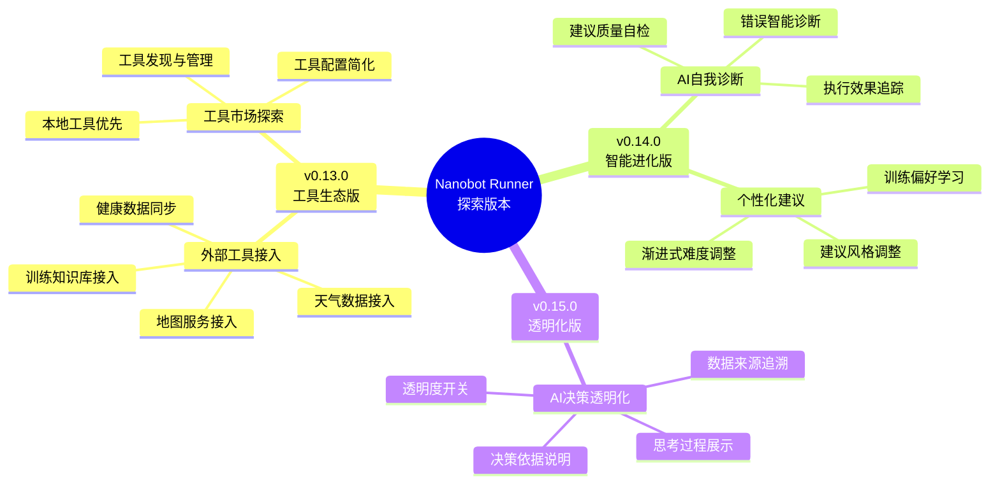
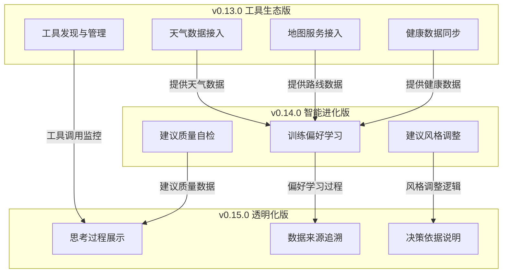
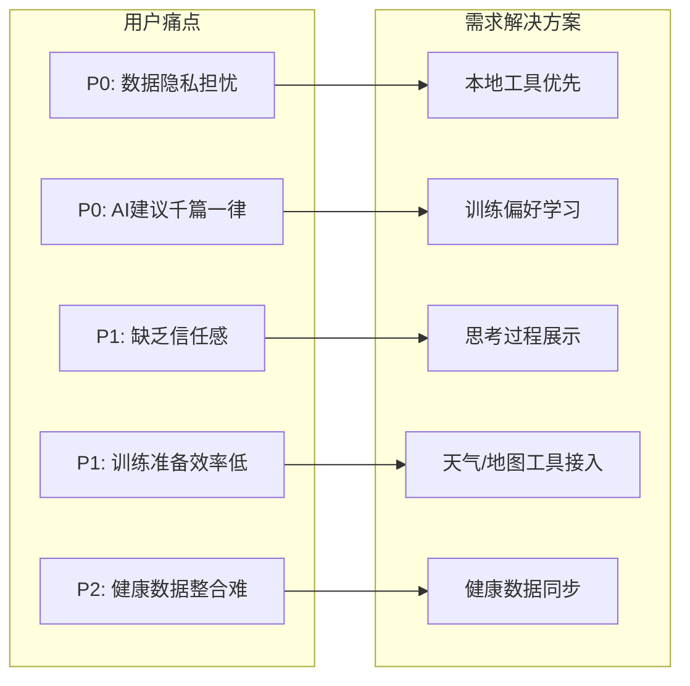
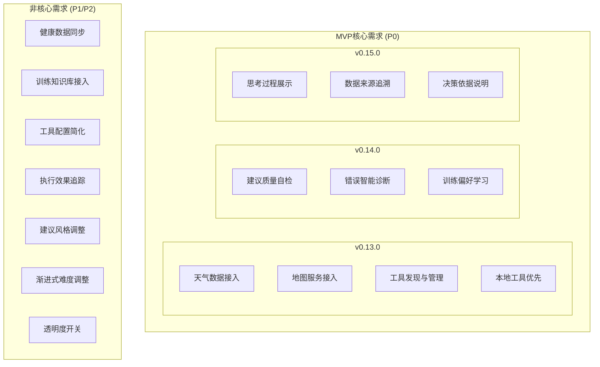
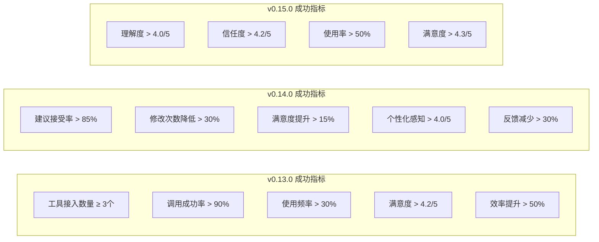
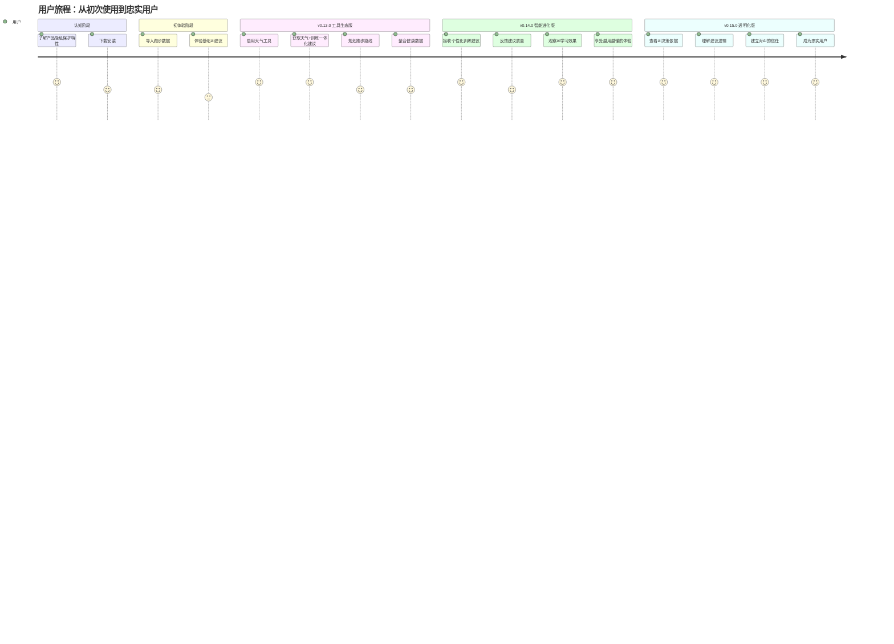
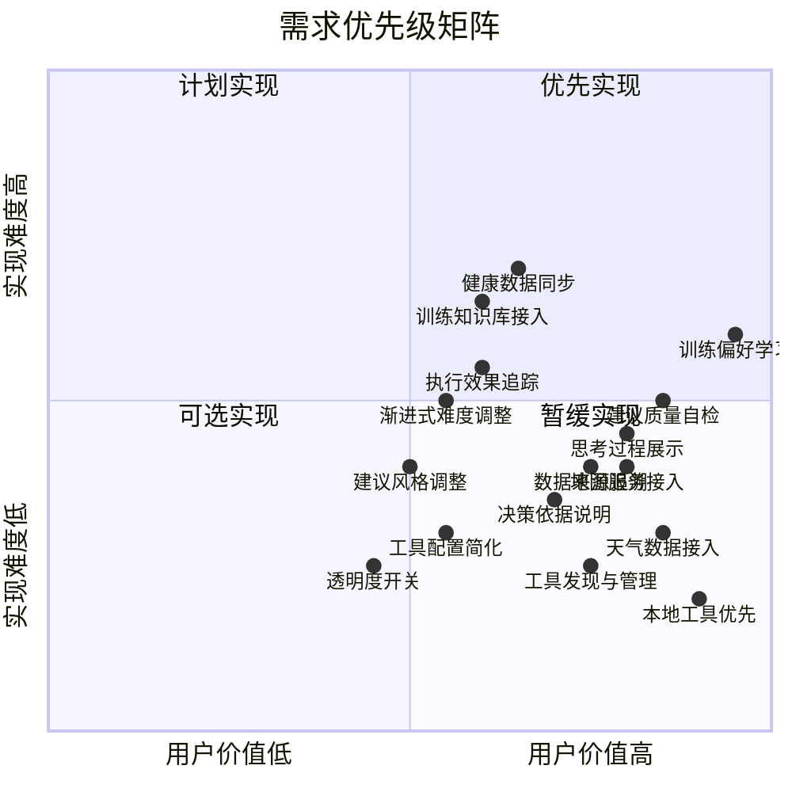
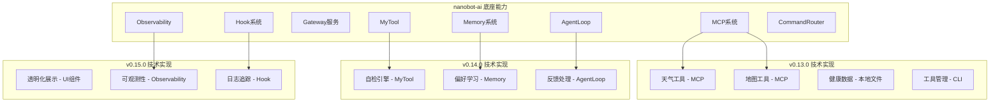
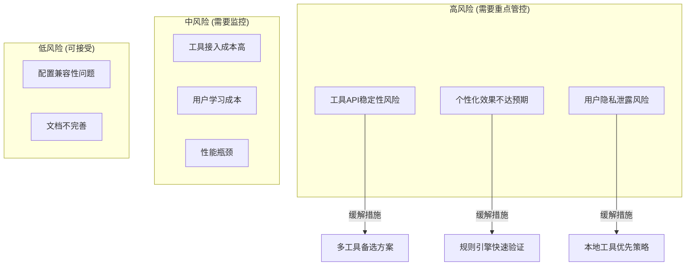
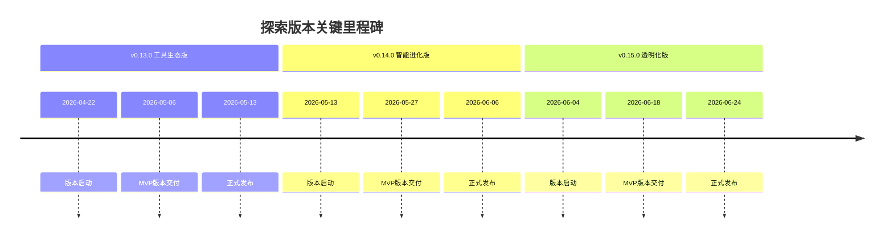

# Nanobot Runner 探索版本需求脑图

> **文档版本**: v1.0  
> **创建日期**: 2026-04-26  
> **最后更新**: 2026-04-26  
> **对齐需求文档**: REQ_需求规格说明书.md

---

## 1. 需求全景图

---

## 2. 版本依赖关系图

---

## 3. 用户痛点与需求映射图

---

## 4. MVP核心需求识别

---

## 5. 验收标准量化指标

---

## 6. 用户旅程地图

---

## 7. 需求优先级矩阵

---

## 8. 技术架构依赖图

---

## 9. 风险评估矩阵

---

## 10. 需求统计概览

| 版本 | 需求总数 | MVP核心需求 | 非核心需求 | 验收标准数 |
|------|---------|-----------|-----------|-----------|
| v0.13.0 | 7 | 4 | 3 | 35 |
| v0.14.0 | 6 | 3 | 3 | 30 |
| v0.15.0 | 4 | 3 | 1 | 20 |
| **总计** | **17** | **10** | **7** | **85** |

---

## 11. 关键里程碑

---

*本文档遵循需求管理规范，与需求规格说明书同步更新*
