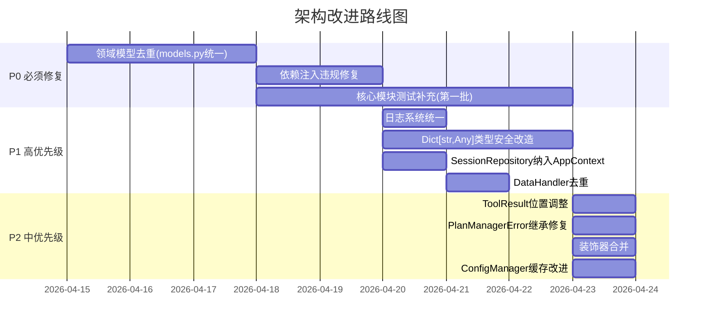
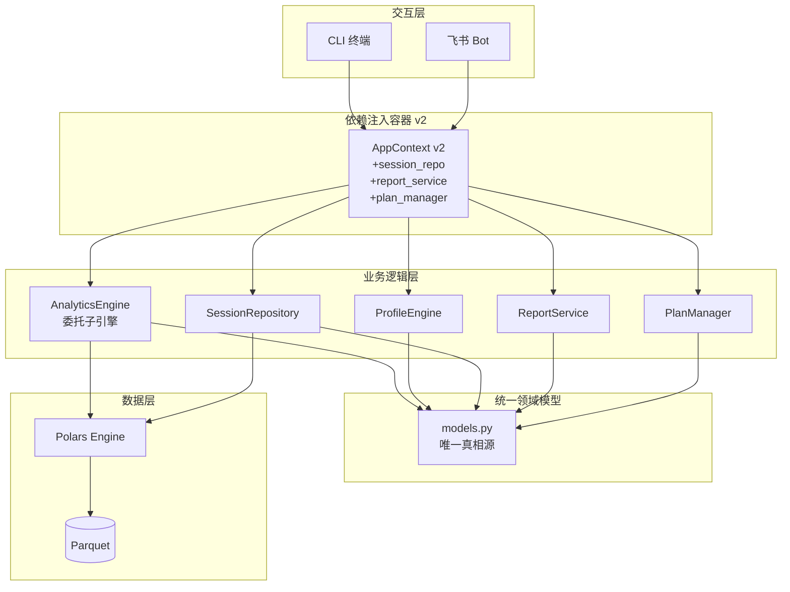

# 架构评审报告 — Nanobot Runner v0.9.2

> **评审日期**: 2026-04-14
> **评审版本**: v0.9.2
> **评审结论**: ⚠️ 不通过（需整改后重新评审）

---

## 评审摘要

| 维度 | 评分 | 说明 |
|------|------|------|
| 架构一致性 | ⭐⭐⭐ | v0.9.0重构方向正确，但落地不彻底 |
| 代码质量 | ⭐⭐ | 存在大量重复定义、依赖注入违规 |
| 测试覆盖 | ⭐ | 22%覆盖率，远低于门禁标准 |
| 安全合规 | ⭐⭐⭐ | 未发现硬编码密钥，但异常体系不统一 |
| 性能 | ⭐⭐⭐ | Polars LazyFrame使用基本规范，个别点可优化 |

---

## P0 — 必须立即修复（阻塞发布）

### 1. 🔴 领域模型重复定义 — "一物多源"严重违反DRY

**问题**：同一领域概念在多个文件中独立定义，无统一来源，极易导致行为不一致。

| 重复类名 | 定义位置 | 影响 |
|----------|---------|------|
| `ProfileStorageManager` | `src/core/profile.py`, `src/core/user_profile_manager.py` | 2处独立实现，行为可能不一致 |
| `PlanStatus` | `src/core/models.py`, `src/core/plan/plan_manager.py` | 2处定义，枚举值不同（Enum vs StrEnum） |
| `FitnessLevel` | `src/core/user_profile_manager.py`, `src/core/training_plan.py`, `src/core/profile.py` | 3处定义，枚举值完全不同 |
| `DailyPlan` | `src/core/models.py`, `src/core/training_plan.py` | 字段名和结构不同 |
| `WeeklySchedule` | `src/core/models.py`, `src/core/training_plan.py` | 字段不同 |
| `ReportType` | `src/core/report_generator.py`, `src/core/report_service.py` | 枚举值不同 |
| `TrainingPlan` | `src/core/models.py`, `src/core/training_plan.py` | 2处独立定义 |

**改进方案**：

```
src/core/models.py → 统一为唯一领域模型定义源
├── 枚举类: PlanStatus, FitnessLevel, TrainingType, ReportType, InjuryRiskLevel...
├── 值对象: DailyPlan, WeeklySchedule, TrainingPlan, UserPreferences...
└── 删除 training_plan.py / plan_manager.py / profile.py 中的重复定义
    → 改为 from src.core.models import ...
```

**落地路径**：
1. 以 `models.py` 为唯一真相源，合并所有领域模型
2. 其他模块通过 `from src.core.models import ...` 引用
3. 删除 `training_plan.py` 中与 `models.py` 重复的类定义，保留业务逻辑方法
4. `ProfileStorageManager` 保留 `user_profile_manager.py` 版本（更完整），删除 `profile.py` 中的重复

---

### 2. 🔴 依赖注入违规 — 9处直接实例化绕过AppContext

**问题**：AGENTS.md 明确规定"禁止直接实例化核心组件，必须通过 `get_context()` 获取"，但代码中仍有大量违规。

| 违规位置 | 实例化方式 | 应改为 |
|----------|-----------|--------|
| `src/cli/handlers/data_handler.py:175` | `AnalyticsEngine(self.storage)` | `context.analytics` |
| `src/core/profile.py:1100` | `AnalyticsEngine(self.storage)` | `context.analytics` |
| `src/core/profile.py:1216` | `AnalyticsEngine(self.storage)` | `context.analytics` |
| `src/core/report_generator.py:268` | `AnalyticsEngine(self.storage)` | `context.analytics` |
| `src/core/report_service.py:44` | `AnalyticsEngine(self.storage)` | `context.analytics` |
| `src/core/importer.py:36` | `StorageManager()` | `context.storage` |
| `src/notify/feishu.py:41` | `ConfigManager()` | `context.config` |
| `src/notify/feishu_calendar.py:307` | `ConfigManager()` | `context.config` |
| `src/core/plan/plan_manager.py:76` | `ConfigManager()` | `context.config` |

**改进方案**：

1. **扩展 `AppContext`**：将 `SessionRepository`、`ReportGenerator`、`ReportService`、`PlanManager` 等纳入上下文管理
2. **所有业务模块通过构造函数注入 `AppContext`**，不再自行创建依赖
3. **CLI Handler 模式统一**：`DataHandler.__init__(context)` 已正确实现，其他Handler/Service应参照此模式

---

### 3. 🔴 测试覆盖率 22% — 远低于门禁标准

**问题**：项目门禁要求 `core≥80% | agents≥70% | cli≥60%`，实际仅 22%。

| 关键模块 | 当前覆盖率 | 目标 | 差距 |
|----------|-----------|------|------|
| `feishu.py` | 18% | 70% | -52% |
| `feishu_calendar.py` | 22% | 70% | -48% |
| `vdot_calculator.py` | 22% | 80% | -58% |
| `user_profile_manager.py` | 39% | 80% | -41% |
| `analytics.py` | ~30% | 80% | -50% |

**改进方案**：

按优先级分批补充测试：
- **第一批（核心计算）**：`vdot_calculator`、`training_load_analyzer`、`heart_rate_analyzer` — 纯计算逻辑，Mock少，投入产出比最高
- **第二批（数据流）**：`session_repository`、`statistics_aggregator`、`storage` — Mock StorageManager即可
- **第三批（集成链路）**：`profile`、`report_generator`、`importer` — 需Mock多个依赖
- **第四批（外部交互）**：`feishu`、`feishu_calendar` — Mock HTTP请求

---

## P1 — 高优先级改进

### 4. 🟠 日志系统不一致 — loguru vs 自定义logger混用

**问题**：`src/core/config.py` 使用 `import loguru; loguru.logger.debug(...)`，而项目其他模块统一使用 `from src.core.logger import get_logger`。loguru 不在 `pyproject.toml` 依赖中。

**改进方案**：将 `config.py` 中的 `loguru.logger` 调用替换为 `get_logger(__name__)`，与项目规范对齐。

---

### 5. 🟠 `Dict[str, Any]` 返回类型 — 40+处违规

**问题**：AGENTS.md 明确规定"禁止返回 `Dict[str, Any]`"，但 `analytics.py`、`report_generator.py`、`heart_rate_analyzer.py`、`feishu_calendar.py` 等大量方法仍返回 `Dict[str, Any]`。

**改进方案**：

```
为每个返回 Dict[str, Any] 的方法创建对应的 frozen dataclass：
- analytics.get_running_stats() → RunningStats
- analytics.analyze_hr_drift() → HRDriftResult  
- report_generator.generate_report() → ReportData
- heart_rate_analyzer.get_hr_zones() → HRZoneResult
- hard_validator.validate_*() → ValidationResult
```

优先改造对外API（Agent Tools、CLI Handler），内部方法可渐进式替换。

---

### 6. 🟠 DataHandler 重复实现 SessionRepository 逻辑

**问题**：`src/cli/handlers/data_handler.py:155-199` 的 `get_recent_runs()` 方法自行实现了 session 聚合逻辑，与 `SessionRepository` 功能高度重复。

**改进方案**：`DataHandler` 应通过 `context.session_repo` 委托给 `SessionRepository`，消除重复代码。同时将 `SessionRepository` 纳入 `AppContext`。

---

### 7. 🟠 AppContext 缺少 SessionRepository

**问题**：架构设计文档和 AGENTS.md 均提到 `SessionRepository` 应通过 `AppContext` 获取，但 `src/core/context.py` 的 `AppContext` 中未包含 `session_repo` 字段。

**改进方案**：

```python
@dataclass
class AppContext:
    config: ConfigManager
    storage: StorageManager
    indexer: IndexManager
    parser: FitParser
    importer: ImportService
    analytics: AnalyticsEngine
    profile_engine: ProfileEngine
    profile_storage: ProfileStorageManager
    session_repo: SessionRepository  # 新增
```

---

## P2 — 中优先级改进

### 8. 🟡 ToolResult 放置位置不当

**问题**：`src/core/exceptions.py` 中包含 `ToolResult` 类，这是工具返回格式，不是异常。违反单一职责原则。

**改进方案**：将 `ToolResult` 移至 `src/agents/tools.py` 或新建 `src/core/result.py`。

---

### 9. 🟡 PlanManagerError 未继承 NanobotRunnerError

**问题**：`src/core/plan/plan_manager.py` 定义 `PlanManagerError(Exception)` 直接继承 `Exception`，而非项目统一的 `NanobotRunnerError`。

**改进方案**：改为 `class PlanManagerError(NanobotRunnerError)`，并添加 `error_code` 和 `recovery_suggestion`。

---

### 10. 🟡 装饰器功能重叠

**问题**：`src/core/decorators.py` 中 `tool_wrapper` 和 `handle_tool_errors` 功能高度重叠，都做异常捕获和格式转换，但返回类型不同（`str` vs `Any`）。

**改进方案**：合并为单一装饰器，通过参数控制返回格式。

---

### 11. 🟡 ConfigManager 类级可变状态

**问题**：`ConfigManager._cache` 和 `_cache_time` 是类变量，所有实例共享。在测试中可能导致状态泄漏。

**改进方案**：改为实例变量，或引入 `@classmethod` 的 `reset_cache()` 方法供测试使用。

---

## 改进优先级与实施路线图



---

## 架构改进后的目标结构



---

## 总结

项目 v0.9.0 的架构重构方向正确（上帝类拆分、依赖注入引入、Polars向量化），但**落地不彻底**，主要体现在：

1. **领域模型碎片化**：同一概念多处定义，是当前最大的架构债务
2. **依赖注入半成品**：AppContext 已建但未被全面使用，9处绕过
3. **测试覆盖严重不足**：22%覆盖率无法保障重构安全性

**建议**：先完成 P0 的领域模型统一和依赖注入修复，再补充核心测试覆盖，最后再推进 P1/P2 改进。每完成一个 P0 项，运行全量测试确认无回归。

---

## 问题清单汇总

| 编号 | 优先级 | 问题 | 状态 |
|------|--------|------|------|
| P0-1 | 🔴 阻塞 | 领域模型重复定义（7个类多处定义） | 待修复 |
| P0-2 | 🔴 阻塞 | 依赖注入违规（9处直接实例化） | 待修复 |
| P0-3 | 🔴 阻塞 | 测试覆盖率22%，远低于门禁 | 待修复 |
| P1-4 | 🟠 高 | 日志系统不一致（loguru混用） | 待修复 |
| P1-5 | 🟠 高 | Dict[str, Any]返回类型（40+处） | 待修复 |
| P1-6 | 🟠 高 | DataHandler重复实现SessionRepository逻辑 | 待修复 |
| P1-7 | 🟠 高 | AppContext缺少SessionRepository | 待修复 |
| P2-8 | 🟡 中 | ToolResult放置位置不当 | 待修复 |
| P2-9 | 🟡 中 | PlanManagerError未继承NanobotRunnerError | 待修复 |
| P2-10 | 🟡 中 | 装饰器功能重叠 | 待修复 |
| P2-11 | 🟡 中 | ConfigManager类级可变状态 | 待修复 |

---

**评审人**: 架构师智能体  
**评审日期**: 2026-04-14
