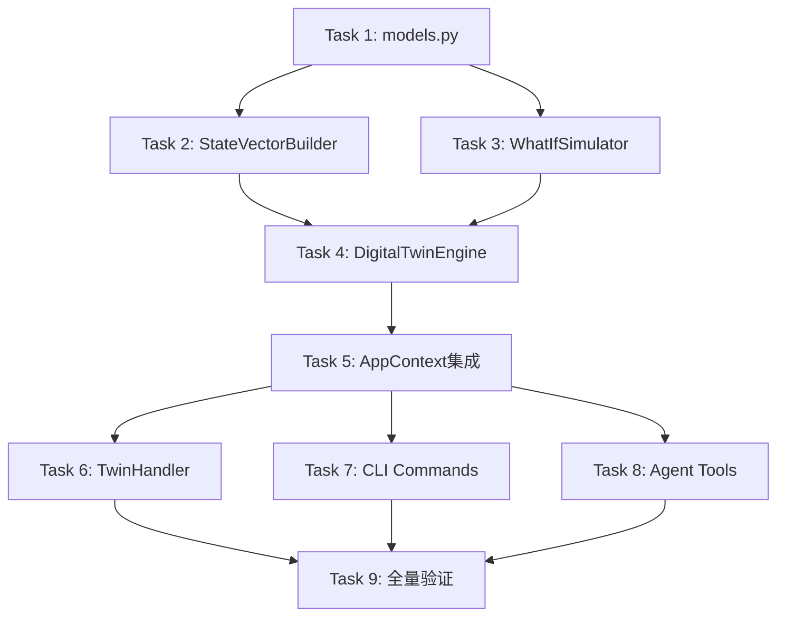

# v0.21 数字孪生引擎 实施计划

> **For agentic workers:** REQUIRED SUB-SKILL: Use superpowers:subagent-driven-development (recommended) or superpowers:executing-plans to implement this plan task-by-task. Steps use checkbox (`- [ ]`) syntax for tracking.

**Goal:** 实现数字孪生引擎，构建5维度跑者状态向量，支持What-If推演和计划对比功能，让用户"在训练前看到训练后的自己"。

**Architecture:** 薄编排层方案。`DigitalTwinEngine` 聚合 `StateVectorBuilder` 和 `WhatIfSimulator`，复用 v0.20 的 `PredictionEngine`、`BodySignalEngine`、`BanisterIRModel` 等已有模块，不引入新状态转移引擎。v0.21仅支持系统计划引用（plan_id），手动计划构建延后。

**Tech Stack:** Python 3.11+, dataclasses(frozen), Polars, numpy, scipy, Typer, Rich

**Design Spec:** `docs/superpowers/specs/2026-05-10-v0.21-digital-twin-design.md` v1.1
**Architecture Doc:** `docs/architecture/架构设计说明书.md` v8.0.0
**Architecture Review:** `docs/architecture/架构评审报告.md` PASSED

---

## File Structure

| 操作 | 文件路径 | 职责 |
|------|----------|------|
| Create | `src/core/twin/__init__.py` | 模块导出 |
| Create | `src/core/twin/models.py` | 所有数据模型（frozen dataclass）+ TwinEngineError + StateVectorCache |
| Create | `src/core/twin/state_vector_builder.py` | 5维度状态向量构建器 |
| Create | `src/core/twin/whatif_simulator.py` | What-If 逐周推演器 |
| Create | `src/core/twin/twin_engine.py` | 薄编排层 + 缓存 + 计划加载 |
| Modify | `src/core/base/context.py` | 新增 `twin_engine` 属性 |
| Create | `src/cli/handlers/twin_handler.py` | CLI 业务逻辑调用层 |
| Create | `src/cli/commands/twin.py` | CLI 命令定义（status/simulate/compare） |
| Modify | `src/cli/commands/__init__.py` | 注册 twin_app |
| Modify | `src/cli/app.py` | 注册 twin 命令组 |
| Modify | `src/agents/tools.py` | 新增3个 Agent 工具 |
| Create | `tests/unit/core/twin/__init__.py` | 测试包 |
| Create | `tests/unit/core/twin/test_models.py` | 数据模型测试 |
| Create | `tests/unit/core/twin/test_state_vector_builder.py` | 状态向量构建器测试 |
| Create | `tests/unit/core/twin/test_whatif_simulator.py` | 推演器测试 |
| Create | `tests/unit/core/twin/test_twin_engine.py` | 编排层测试 |

---

## Task Dependency Graph



---

### Task 1: 数据模型 — models.py

**Files:** `src/core/twin/__init__.py`, `src/core/twin/models.py`, `tests/unit/core/twin/__init__.py`, `tests/unit/core/twin/test_models.py`

- [ ] **Step 1: 创建测试包和测试文件**

创建 `tests/unit/core/twin/__init__.py`（空文件）。

创建 `tests/unit/core/twin/test_models.py` — 测试所有 frozen dataclass 的创建、frozen 不可变性、to_dict 序列化、StateVectorCache.is_expired()、TwinEngineError 继承关系。

关键测试类：
- `TestDataQuality` — 枚举值验证
- `TestFitnessDimension` — 创建/None/frozen/to_dict
- `TestLoadDimension` — 创建/to_dict
- `TestBodySignalDimension` — None字段/to_dict
- `TestRiskDimension` — 创建/to_dict
- `TestIntensityDistribution` — zone1_pct/zone2_pct/zone3_pct/to_dict
- `TestTrainingPatternDimension` — IntensityDistribution嵌套/to_dict
- `TestRunnerStateVector` — 5维度组合/frozen/to_dict（含嵌套）
- `TestWeeklyPlanSpec` — 默认intensity_multiplier=1.0/to_dict
- `TestHypotheticalPlan` — source="plan_id"/plan_id/to_dict
- `TestSimulationWeekSnapshot` — week_number/confidence/to_dict
- `TestSimulationResult` — vdot_delta/total_weeks/to_dict
- `TestPlanComparisonMetrics` — recommendation_score/to_dict
- `TestPlanComparison` — best_plan/to_dict
- `TestStateVectorCache` — ttl_hours/is_expired(False)/is_expired(True)
- `TestTwinEngineError` — message/error_code/inherits NanobotRunnerError/to_dict

- [ ] **Step 2: 运行测试确认失败**

Run: `uv run pytest tests/unit/core/twin/test_models.py -v --no-header -q 2>&1 | Select-Object -First 20`
Expected: FAIL — `ModuleNotFoundError: No module named 'src.core.twin'`

- [ ] **Step 3: 创建 src/core/twin/__init__.py**

导出所有公共模型类：BodySignalDimension, DataQuality, FitnessDimension, HypotheticalPlan, IntensityDistribution, LoadDimension, PlanComparison, PlanComparisonMetrics, RiskDimension, RunnerStateVector, SimulationResult, SimulationWeekSnapshot, StateVectorCache, TrainingPatternDimension, TwinEngineError, WeeklyPlanSpec

- [ ] **Step 4: 创建 src/core/twin/models.py**

核心数据结构定义：

| 类名 | 类型 | 关键字段 |
|------|------|----------|
| `FitnessDimension` | frozen dataclass | vdot, vdot_trend, vo2max_estimate? |
| `LoadDimension` | frozen dataclass | ctl, atl, tsb, acwr |
| `BodySignalDimension` | frozen dataclass | fatigue_score, recovery_status, resting_hr?, hrv_rmssd? |
| `RiskDimension` | frozen dataclass | injury_risk_7d, injury_risk_28d, overtraining_risk |
| `IntensityDistribution` | frozen dataclass | zone1_pct, zone2_pct, zone3_pct |
| `TrainingPatternDimension` | frozen dataclass | weekly_volume_km, intensity_distribution(IntensityDistribution), long_run_frequency |
| `RunnerStateVector` | frozen dataclass | fitness, load, body_signal, risk, training_pattern, snapshot_date, data_quality |
| `WeeklyPlanSpec` | frozen dataclass | weekly_volume_km, easy_ratio, tempo_ratio, interval_ratio, long_run_km, intensity_multiplier=1.0 |
| `HypotheticalPlan` | frozen dataclass | name, weeks, source="plan_id", plan_id="" |
| `SimulationWeekSnapshot` | frozen dataclass | week_number, state, weekly_plan, confidence |
| `SimulationResult` | frozen dataclass | plan_name, initial_state, final_state, snapshots, total_weeks, prediction_type, vdot_delta, peak_injury_risk, avg_tsb |
| `PlanComparisonMetrics` | frozen dataclass | plan_id, plan_name, vdot_delta, peak_injury_risk, avg_tsb, min_recovery_status, recommendation_score |
| `PlanComparison` | frozen dataclass | plans, best_plan, comparison_dimensions, recommendation |
| `StateVectorCache` | frozen dataclass | state, created_at, ttl_hours=24 + is_expired()方法 |
| `TwinEngineError` | dataclass(非frozen) | 继承NanobotRunnerError, error_code="TWIN_ENGINE_ERROR", recovery_suggestion? |

所有类均实现 `to_dict()` 方法。`StateVectorCache.is_expired()` 使用 `datetime.fromisoformat()` + `timedelta` 判断。

- [ ] **Step 5: 运行测试确认通过**

Run: `uv run pytest tests/unit/core/twin/test_models.py -v --no-header -q 2>&1 | Select-Object -Last 15`
Expected: 全部 PASS

- [ ] **Step 6: 提交**

```bash
git add src/core/twin/__init__.py src/core/twin/models.py tests/unit/core/twin/__init__.py tests/unit/core/twin/test_models.py
git commit -m "feat(twin): add data models, TwinEngineError, and StateVectorCache"
```

---

### Task 2: 状态向量构建器 — StateVectorBuilder

**Files:** `src/core/twin/state_vector_builder.py`, `tests/unit/core/twin/test_state_vector_builder.py`

- [ ] **Step 1: 创建测试文件**

`tests/unit/core/twin/test_state_vector_builder.py` — Mock 4个依赖，测试5维度构建 + 5个fallback场景。

Mock 工厂函数：
- `_make_mock_prediction_engine()` — predict_vdot_trend/predict_injury_risk 返回 to_dict()
- `_make_mock_body_signal_engine()` — get_daily_summary 返回 to_dict()
- `_make_mock_training_load_analyzer()` — calculate_ctl/atl/tsb/acwr 返回固定值
- `_make_mock_session_repo()` — get_recent_sessions 返回 collect()

测试类：
- `TestStateVectorBuilderBuild` — 6个测试：返回类型、5个维度分别验证
- `TestStateVectorBuilderFallback` — 5个测试：每个依赖失败时返回零值默认维度

- [ ] **Step 2: 运行测试确认失败**

Run: `uv run pytest tests/unit/core/twin/test_state_vector_builder.py -v --no-header -q 2>&1 | Select-Object -First 10`
Expected: FAIL — `ImportError: cannot import name 'StateVectorBuilder'`

- [ ] **Step 3: 创建 src/core/twin/state_vector_builder.py**

核心逻辑：
- `__init__` 接收4个依赖：prediction_engine, body_signal_engine, training_load_analyzer, session_repo
- `build()` 调用5个 build_* 方法，汇总为 RunnerStateVector，根据 `dim_is_default()` 判断 data_quality
- `build_fitness()` — 调用 predict_vdot_trend(days=30)，提取 current_vdot/trend_slope
- `build_load()` — 调用 calculate_ctl/atl/tsb/acwr
- `build_body_signal()` — 调用 get_daily_summary()，提取 fatigue_score/recovery_status/resting_hr/hrv_rmssd
- `build_risk()` — 调用 predict_injury_risk(days=28)，从 risk_timeline 提取 7d/28d 概率（×100转百分比）
- `build_training_pattern()` — 调用 get_recent_sessions(days=28)，计算周均跑量
- 每个方法独立 try/except，失败时返回零值默认维度
- `dim_is_default()` 辅助函数检查维度是否为零值

- [ ] **Step 4: 运行测试确认通过**

Run: `uv run pytest tests/unit/core/twin/test_state_vector_builder.py -v --no-header -q 2>&1 | Select-Object -Last 15`
Expected: 全部 PASS

- [ ] **Step 5: 提交**

```bash
git add src/core/twin/state_vector_builder.py tests/unit/core/twin/test_state_vector_builder.py
git commit -m "feat(twin): add StateVectorBuilder with 5-dimension aggregation and fallback"
```

---

### Task 3: What-If 推演器 — WhatIfSimulator

**Files:** `src/core/twin/whatif_simulator.py`, `tests/unit/core/twin/test_whatif_simulator.py`

- [ ] **Step 1: 创建测试文件**

`tests/unit/core/twin/test_whatif_simulator.py` — 测试TSS估算、单周推演、多周推演、置信度衰减。

测试类：
- `TestEstimateWeeklyTss` — 3个测试：基础估算/零跑量/intensity_multiplier影响
- `TestSimulateWeek` — 2个测试：返回类型/负荷更新
- `TestSimulate` — 6个测试：快照数量/周编号/置信度L1衰减/L3衰减/L3衰减快于L1/basic模式

- [ ] **Step 2: 运行测试确认失败**

Run: `uv run pytest tests/unit/core/twin/test_whatif_simulator.py -v --no-header -q 2>&1 | Select-Object -First 10`
Expected: FAIL — `ImportError: cannot import name 'WhatIfSimulator'`

- [ ] **Step 3: 创建 src/core/twin/whatif_simulator.py**

核心常量：
- `AVG_PACE_MIN_PER_KM = 6.0`
- `DECAY_RATES = {"ml_enhanced": 0.05, "parametric": 0.08, "basic": 0.12}`
- `INITIAL_CONFIDENCE = {"ml_enhanced": 0.95, "parametric": 0.85, "basic": 0.70}`

核心逻辑：
- `estimate_weekly_tss(week_plan)` — 静态方法，按强度分布估算TSS（easy=0.5, tempo=0.8, interval=1.1, long=0.65）
- `simulate_week(current_state, week_plan, prediction_type)` — 推演一周：CTL/ATL EWMA更新、VDOT增量估算、疲劳度累加、恢复状态判断、风险增量（ACWR>1.3时触发）、过度训练判断
- `simulate(initial_state, plan, prediction_type)` — 逐周循环，每步 confidence *= (1-decay_rate)
- `_estimate_vdot_delta(weekly_tss, current_ctl, prediction_type)` — L1用ML趋势斜率，L2/L3用stress_ratio公式

- [ ] **Step 4: 运行测试确认通过**

Run: `uv run pytest tests/unit/core/twin/test_whatif_simulator.py -v --no-header -q 2>&1 | Select-Object -Last 15`
Expected: 全部 PASS

- [ ] **Step 5: 提交**

```bash
git add src/core/twin/whatif_simulator.py tests/unit/core/twin/test_whatif_simulator.py
git commit -m "feat(twin): add WhatIfSimulator with weekly simulation and 3-tier fallback"
```

---

### Task 4: 数字孪生引擎编排层 — DigitalTwinEngine

**Files:** `src/core/twin/twin_engine.py`, `tests/unit/core/twin/test_twin_engine.py`

- [ ] **Step 1: 创建测试文件**

`tests/unit/core/twin/test_twin_engine.py` — Mock builder/simulator/plan_manager，测试三大能力 + 缓存 + 边界。

测试类：
- `TestGetRunnerState` — 5个测试：返回类型/委托builder/缓存命中/缓存未命中/强制刷新
- `TestSimulatePlan` — 3个测试：返回SimulationResult/计划不存在抛TwinEngineError/无plan_manager抛TwinEngineError
- `TestComparePlans` — 4个测试：返回PlanComparison/plan_ids<2抛错/plan_ids>5抛错/2-5范围内正常
- `TestConvertTrainingPlan` — 3个测试：正常计划转换（含各workout_type）/空周（全rest日）降级/缺失daily_plans防御性处理

- [ ] **Step 2: 运行测试确认失败**

Run: `uv run pytest tests/unit/core/twin/test_twin_engine.py -v --no-header -q 2>&1 | Select-Object -First 10`
Expected: FAIL — `ImportError: cannot import name 'DigitalTwinEngine'`

- [ ] **Step 3: 创建 src/core/twin/twin_engine.py**

核心常量：`CACHE_FILENAME`, `MIN_COMPARE_PLANS=2`, `MAX_COMPARE_PLANS=5`

核心逻辑：
- `__init__` — 组装 StateVectorBuilder + WhatIfSimulator，接收 plan_manager? 和 banister_model?
- `set_cache_dir(cache_dir)` — 设置缓存目录
- `get_runner_state(use_cache=True)` — 缓存命中返回，否则builder.build() + 保存缓存。CLI `--refresh` 时传 False
- `simulate_plan(plan_id, weeks?)` — v0.21仅支持plan_id：加载计划→转换→截断weeks→推演→汇总SimulationResult
- `compare_plans(plan_ids)` — 验证2≤len≤5，逐个simulate_plan→计算recommendation_score→排序→推荐
- `_convert_training_plan(training_plan)` — 将系统TrainingPlan转为HypotheticalPlan
- `_determine_prediction_type(state)` — 根据data_quality决定ml_enhanced/parametric/basic
- `_load_cache()` / `_save_cache(state)` — JSON文件读写，24小时TTL

recommendation_score 公式：40%×vdot_delta归一化 + 35%×(100-peak_injury_risk)/100 + 25%×avg_tsb归一化

- [ ] **Step 4: 运行测试确认通过**

Run: `uv run pytest tests/unit/core/twin/test_twin_engine.py -v --no-header -q 2>&1 | Select-Object -Last 15`
Expected: 全部 PASS

- [ ] **Step 5: 提交**

```bash
git add src/core/twin/twin_engine.py tests/unit/core/twin/test_twin_engine.py
git commit -m "feat(twin): add DigitalTwinEngine with cache, plan simulation, and comparison"
```

---

### Task 5: AppContext 集成

**Files:** `src/core/base/context.py`（Modify）

- [ ] **Step 1: 在 context.py 中添加 twin_engine 属性**

在 AppContext 类中新增 `twin_engine` 属性，使用 `get_extension`/`set_extension` 惰性初始化模式（与现有 `prediction_engine` 等属性一致）：

```python
@property
def twin_engine(self) -> Any:
    """获取数字孪生引擎（v0.21.0新增）"""
    from src.core.twin.twin_engine import DigitalTwinEngine

    engine = self.get_extension("twin_engine")
    if engine is None:
        engine = DigitalTwinEngine(
            prediction_engine=self.prediction_engine,
            body_signal_engine=self.body_signal_engine,
            training_load_analyzer=self.training_load_analyzer,
            session_repo=self.session_repo,
            plan_manager=self.plan_manager,
        )
        self.set_extension("twin_engine", engine)
    return engine
```

- [ ] **Step 2: 运行现有测试确认无回归**

Run: `uv run pytest tests/unit/core/base/test_context_prediction.py -v --no-header -q 2>&1 | Select-Object -Last 10`
Expected: 全部 PASS

- [ ] **Step 3: 提交**

```bash
git add src/core/base/context.py
git commit -m "feat(twin): add twin_engine property to AppContext"
```

---

### Task 6: CLI Handler — TwinHandler

**Files:** `src/cli/handlers/twin_handler.py`

- [ ] **Step 1: 创建 TwinHandler**

遵循 PredictionHandler 模式：通过 AppContext 获取 twin_engine，调用对应方法，返回 to_dict()。

```python
class TwinHandler:
    def __init__(self, context: AppContext | None = None) -> None:
        if context is None:
            context = AppContextFactory.create()
        self.context = context

    def _get_engine(self) -> Any:
        engine = self.context.twin_engine
        if engine is None:
            raise RuntimeError("数字孪生引擎未初始化")
        return engine

    def get_runner_state(self, refresh: bool = False) -> dict[str, Any]:
        engine = self._get_engine()
        result = engine.get_runner_state(use_cache=not refresh)
        return result.to_dict()

    def simulate_plan(self, plan_id: str, weeks: int | None = None) -> dict[str, Any]:
        engine = self._get_engine()
        result = engine.simulate_plan(plan_id=plan_id, weeks=weeks)
        return result.to_dict()

    def compare_plans(self, plan_ids: list[str]) -> dict[str, Any]:
        engine = self._get_engine()
        result = engine.compare_plans(plan_ids=plan_ids)
        return result.to_dict()
```

- [ ] **Step 2: 提交**

```bash
git add src/cli/handlers/twin_handler.py
git commit -m "feat(twin): add TwinHandler for CLI business logic"
```

---

### Task 7: CLI Commands — twin.py

**Files:** `src/cli/commands/twin.py`, `src/cli/commands/__init__.py`（Modify）, `src/cli/app.py`（Modify）

- [ ] **Step 1: 创建 src/cli/commands/twin.py**

遵循 prediction.py 模式，3个子命令：

```python
app = typer.Typer(help="数字孪生命令", no_args_is_help=True)

@app.command(name="status")
def twin_status(
    refresh: bool = typer.Option(False, "--refresh", help="强制刷新缓存"),
    json_output: bool = typer.Option(False, "--json", help="以JSON格式输出"),
) -> None:
    """查看跑者数字孪生状态"""
    # 调用 TwinHandler.get_runner_state(refresh=refresh)
    # json_output=True 时输出JSON，否则 Rich Panel 展示5维度状态

@app.command(name="simulate")
def twin_simulate(
    plan_id: str = typer.Option(..., "--plan-id", help="训练计划ID"),
    weeks: int | None = typer.Option(None, "--weeks", "-w", help="推演周数"),
    json_output: bool = typer.Option(False, "--json", help="以JSON格式输出"),
) -> None:
    """推演训练计划效果"""
    # 调用 TwinHandler.simulate_plan(plan_id, weeks)
    # json_output=True 时输出JSON，否则 Rich Table 展示逐周快照

@app.command(name="compare")
def twin_compare(
    plan_ids: str = typer.Option(..., "--plan-ids", help="计划ID列表，逗号分隔（2-5个）"),
    json_output: bool = typer.Option(False, "--json", help="以JSON格式输出"),
) -> None:
    """对比多个训练计划"""
    ids = [p.strip() for p in plan_ids.split(",")]
    # 调用 TwinHandler.compare_plans(ids)
    # Rich Table 展示对比指标
```

- [ ] **Step 2: 注册 twin 命令组**

在 `src/cli/commands/__init__.py` 中添加：
```python
from src.cli.commands.twin import app as twin_app
```

在 `src/cli/app.py` 中添加：
```python
from src.cli.commands.twin import app as twin_app
app.add_typer(twin_app, name="twin")
```

- [ ] **Step 3: 验证CLI注册**

Run: `uv run nanobotrun twin --help`
Expected: 显示 status/simulate/compare 三个子命令

- [ ] **Step 4: 提交**

```bash
git add src/cli/commands/twin.py src/cli/commands/__init__.py src/cli/app.py
git commit -m "feat(twin): add CLI commands for status, simulate, and compare"
```

---

### Task 8: Agent Tools

**Files:** `src/agents/tools.py`（Modify）

- [ ] **Step 1: 新增3个 Agent 工具**

遵循现有 BaseTool 模式，在 RunnerTools 中添加3个工具：

1. **GetRunnerStateTool** — 获取跑者数字孪生状态
   - name: "get_runner_state"
   - parameters: use_cache (bool, default true)
   - execute: 调用 TwinHandler.get_runner_state(refresh=not use_cache)

2. **SimulatePlanTool** — 推演训练计划效果
   - name: "simulate_plan"
   - parameters: plan_id (str), weeks (int?, optional)
   - execute: 调用 TwinHandler.simulate_plan(plan_id, weeks)

3. **ComparePlansTool** — 对比多个训练计划
   - name: "compare_plans"
   - parameters: plan_ids (list[str])
   - execute: 调用 TwinHandler.compare_plans(plan_ids)

- [ ] **Step 2: 提交**

```bash
git add src/agents/tools.py
git commit -m "feat(twin): add Agent tools for twin status, simulate, and compare"
```

---

### Task 9: 全量验证

- [ ] **Step 1: 运行全部 twin 单元测试**

Run: `uv run pytest tests/unit/core/twin/ -v --no-header -q 2>&1 | Select-Object -Last 20`
Expected: 全部 PASS

- [ ] **Step 2: 运行 lint**

Run: `uv run ruff check src/core/twin/ src/cli/handlers/twin_handler.py src/cli/commands/twin.py 2>&1`
Expected: 无错误

- [ ] **Step 3: 运行 typecheck**

Run: `uv run mypy src/core/twin/ --ignore-missing-imports 2>&1`
Expected: 无错误

- [ ] **Step 4: 运行全量单元测试确认无回归**

Run: `uv run pytest tests/unit/ -v --no-header -q 2>&1 | Select-Object -Last 20`
Expected: 全部 PASS

- [ ] **Step 5: 最终提交**

```bash
git add -A
git commit -m "feat(twin): v0.21 digital twin engine complete - all tests passing"
```

---

## 风险与缓解

| 风险 | 等级 | 缓解方案 |
|------|------|----------|
| BanisterIRModel 接口不匹配 | 中 | WhatIfSimulator 已内置基础EWMA降级，Banister可选 |
| PlanManager.get_plan 返回格式不确定 | 中 | _convert_training_plan 做防御性转换，字段缺失用默认值 |
| 缓存JSON反序列化失败 | 低 | _load_cache 捕获异常，回退到 builder.build() |
| compare_plans plan_ids=2时只有一个计划存在 | 低 | 对不存在的计划跳过并记录warning，至少需要1个有效计划 |
| PlanManager数据结构变更 | 中 | _convert_training_plan()需与PlanManager同步维护（架构评审R6） |
| 推演结果与实际偏差无追踪 | 中 | 所有输出标注"模拟结果，非确定性预测"；v0.23+可增加推演历史对比（架构评审R7） |

---

## 非功能需求覆盖（NFR）

| NFR ID | 需求 | 实施任务覆盖 | 验证方式 |
|--------|------|-------------|---------|
| NFR-04 | 单计划4周推演<10秒 | Task 3 (WhatIfSimulator), Task 9 (验证) | Task 9 Step 1 性能测试 |
| NFR-04b | 3计划4周对比<30秒 | Task 4 (DigitalTwinEngine.compare_plans), Task 9 | Task 9 Step 1 性能测试 |
| NFR-04c | RunnerStateVector聚合<3秒 | Task 2 (StateVectorBuilder), Task 9 | Task 9 Step 1 性能测试 |
| NFR-09b | 推演必须标注"模拟结果，非确定性预测" | Task 3 (WhatIfSimulator输出), Task 7 (CLI展示), Task 8 (Agent工具输出) | Task 9 验证输出包含声明 |
| NFR-12b | twin模块通过AppContext扩展属性接入，不修改现有核心逻辑 | Task 5 (仅新增属性，不改现有方法) | Task 5 Step 2 回归测试 |
| NFR-14b | What-If推演策略可替换（Banister IR→其他模型），接口不变 | Task 3 (WhatIfSimulator接口设计), Task 4 (_determine_prediction_type) | 代码审查确认接口抽象 |

---

## 架构评审建议落实

| 建议 | 落实方式 | 覆盖任务 |
|------|---------|---------|
| 建议1: 增加 _convert_training_plan 单元测试场景 | Task 4 test_twin_engine.py 新增 TestConvertTrainingPlan 测试类（正常转换/空周降级/缺失daily_plans防御） | Task 4 |
| 建议2: 预留推演结果持久化存储路径 | Task 4 twin_engine.py 预留 `~/.nanobot-runner/twin/simulations/` 目录创建逻辑（v0.21不实现存储） | Task 4 |
