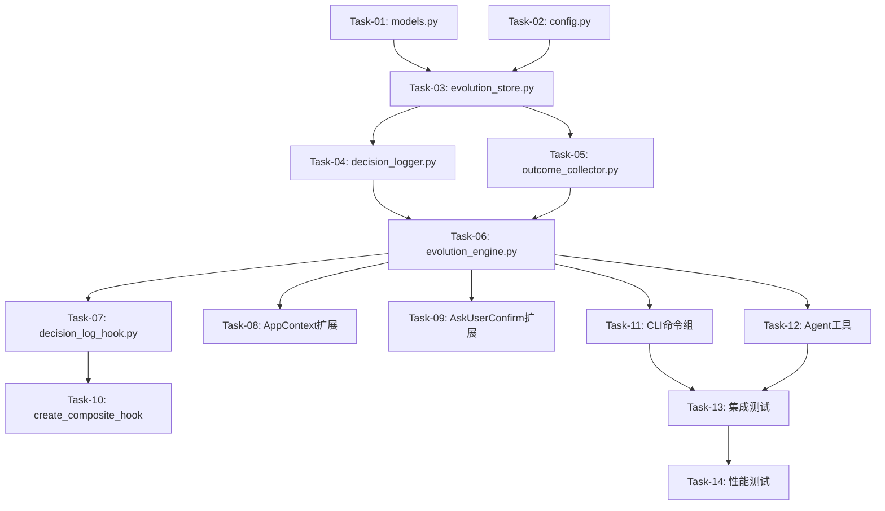

# v0.23.0 决策追踪模块实施计划

> **For agentic workers:** REQUIRED SUB-SKILL: Use superpowers:subagent-driven-development (recommended) or superpowers:executing-plans to implement this plan task-by-task. Steps use checkbox (`- [ ]`) syntax for tracking.

**Goal:** 实现v0.23.0决策追踪模块，包含AI决策日志、结果回填、预测精度统计等能力

**Architecture:** DecisionLogHook直接继承AgentHook（非ObservabilityHook），独立注册避免状态竞争；EvolutionEngine为薄编排层委托DecisionLogger+OutcomeCollector；EvolutionStore使用JSONL按月分片存储，默认同步写入

**Tech Stack:** Python 3.11+, Polars 0.20+, Typer+Rich CLI, nanobot-ai AgentHook, pytest

---

## 文件结构

| 操作 | 文件路径 | 职责 |
|------|----------|------|
| 新建 | `src/core/evolution/__init__.py` | 模块入口 |
| 新建 | `src/core/evolution/models.py` | DecisionLog/OutcomeRecord/PredictionAccuracyStats |
| 新建 | `src/core/evolution/config.py` | EvolutionConfig配置Schema |
| 新建 | `src/core/evolution/evolution_store.py` | JSONL按月分片存储 |
| 新建 | `src/core/evolution/decision_logger.py` | 决策日志记录器 |
| 新建 | `src/core/evolution/outcome_collector.py` | 结果回填收集器+PlanExecutionDataAdapter |
| 新建 | `src/core/evolution/evolution_engine.py` | 薄编排层 |
| 新建 | `src/core/evolution/decision_log_hook.py` | DecisionLogHook(继承AgentHook) |
| 修改 | `src/core/base/context.py` | 新增evolution_engine属性 |
| 修改 | `src/core/plan/ask_user_confirm.py` | 新增DECISION_FEEDBACK场景 |
| 修改 | `src/core/transparency/__init__.py` | create_composite_hook新增可选参数 |
| 新建 | `src/cli/commands/evolution.py` | CLI evolution命令组 |
| 新建 | `src/cli/handlers/evolution_handler.py` | CLI业务逻辑层 |
| 新建 | `src/agents/tools_evolution.py` | 4个Agent工具 |
| 修改 | `src/agents/tools.py` | RunnerTools新增4个方法 |
| 修改 | `src/cli/commands/__init__.py` | 注册evolution_app |
| 修改 | `src/cli/app.py` | 注册evolution命令组 |

---

## 依赖关系图



---

## 关键一致性规则

以下规则确保Layer 1-3和Layer 4-5的类型一致性，实施时必须遵守：

1. **DecisionType**: 使用`from src.core.transparency.models import DecisionType`，不使用`EvolutionDecisionType`
2. **execution_status**: 使用字符串`"pending"/"executed"/"skipped"/"modified"/"failed"`，不使用`ExecutionStatus`枚举
3. **EvolutionEngine构造函数**: `EvolutionEngine(data_dir: Path, config: EvolutionConfig | None = None, plan_adapter: PlanExecutionDataAdapter | None = None)`
4. **DecisionLogHook构造函数**: `DecisionLogHook(evolution_engine: EvolutionEngine, session_key: str = "")`
5. **EvolutionStore构造函数**: `EvolutionStore(data_dir: Path)`
6. **OutcomeCollector构造函数**: `OutcomeCollector(store: EvolutionStore, decision_logger: DecisionLogger, plan_adapter: PlanExecutionDataAdapter | None = None, config: EvolutionConfig | None = None)`
7. **EvolutionEngine方法**: 使用`log_decision/get_decision_history/check_plan_execution/check_prediction_accuracy/record_feedback/generate_feedback_prompt/get_evolution_status`
8. **check_prediction_accuracy签名**: `check_prediction_accuracy(self, decision_id: str, actual_vdot: float) -> tuple[OutcomeRecord, PredictionAccuracyStats]`
9. **prediction_direction字段名**: 统一使用`prediction_direction`，不使用`error_direction`
10. **check_plan_execution输出**: 不含`intensity_deviation`

---

## Task-01: 数据模型定义

**Files:**
- Create: `src/core/evolution/__init__.py`
- Create: `src/core/evolution/models.py`
- Create: `tests/unit/core/evolution/__init__.py`
- Create: `tests/unit/core/evolution/test_models.py`

- [ ] **Step 1: 编写数据模型的失败测试**

```python
# tests/unit/core/evolution/__init__.py
# 决策追踪模块单元测试包
```

```python
# tests/unit/core/evolution/test_models.py
from __future__ import annotations

from datetime import datetime

import pytest

from src.core.evolution.models import (
    DecisionLog,
    OutcomeRecord,
    PredictionAccuracyStats,
)
from src.core.transparency.models import DecisionType


class TestDecisionLog:
    """DecisionLog 数据模型测试"""

    def test_create_decision_log_with_required_fields(self):
        """测试创建DecisionLog（仅必填字段）"""
        log = DecisionLog(
            decision_id="dec_001",
            timestamp=datetime(2026, 5, 1, 10, 0, 0),
            runner_state={"vdot": 45.0, "ctl": 50.0, "atl": 40.0, "tsb": 10.0, "fatigue_score": 3.0},
            decision_type=DecisionType.PLAN_ADJUSTMENT,
            tool_call_chain=[{"tool": "generate_training_plan", "args": {"goal": "全马破4"}}],
            prediction_snapshot=None,
            recommendation_text="建议执行5周训练计划",
            execution_status="pending",
            recommendation_accepted=None,
            session_key="session_001",
        )
        assert log.decision_id == "dec_001"
        assert log.decision_type == DecisionType.PLAN_ADJUSTMENT
        assert log.execution_status == "pending"
        assert log.prediction_snapshot is None
        assert log.recommendation_accepted is None

    def test_decision_log_is_frozen(self):
        """测试DecisionLog不可变"""
        log = DecisionLog(
            decision_id="dec_002",
            timestamp=datetime(2026, 5, 1, 10, 0, 0),
            runner_state={"vdot": 45.0},
            decision_type=DecisionType.TRAINING_ADVICE,
            tool_call_chain=[],
            prediction_snapshot=None,
            recommendation_text=None,
            execution_status="pending",
            recommendation_accepted=None,
            session_key="",
        )
        with pytest.raises(AttributeError):
            log.decision_id = "dec_003"  # type: ignore[misc]

    def test_decision_log_to_dict(self):
        """测试DecisionLog序列化为字典"""
        log = DecisionLog(
            decision_id="dec_004",
            timestamp=datetime(2026, 5, 1, 10, 0, 0),
            runner_state={"vdot": 45.0},
            decision_type=DecisionType.RECOVERY_SUGGESTION,
            tool_call_chain=[{"tool": "suggest_recovery", "args": {}}],
            prediction_snapshot={"predicted_vdot": 46.0},
            recommendation_text="建议休息",
            execution_status="executed",
            recommendation_accepted=True,
            session_key="session_002",
        )
        d = log.to_dict()
        assert d["decision_id"] == "dec_004"
        assert d["decision_type"] == "recovery_suggestion"
        assert d["execution_status"] == "executed"
        assert d["prediction_snapshot"] == {"predicted_vdot": 46.0}
        assert d["recommendation_accepted"] is True

    def test_decision_log_from_dict(self):
        """测试DecisionLog从字典反序列化"""
        data = {
            "decision_id": "dec_005",
            "timestamp": "2026-05-01T10:00:00",
            "runner_state": {"vdot": 45.0},
            "decision_type": "plan_adjustment",
            "tool_call_chain": [],
            "prediction_snapshot": None,
            "recommendation_text": None,
            "execution_status": "pending",
            "recommendation_accepted": None,
            "session_key": "",
        }
        log = DecisionLog.from_dict(data)
        assert log.decision_id == "dec_005"
        assert log.decision_type == DecisionType.PLAN_ADJUSTMENT
        assert log.execution_status == "pending"

    def test_execution_status_string_values(self):
        """测试execution_status使用字符串而非枚举"""
        valid_statuses = ["pending", "executed", "skipped", "modified", "failed"]
        for status in valid_statuses:
            log = DecisionLog(
                decision_id=f"dec_status_{status}",
                timestamp=datetime(2026, 5, 1, 10, 0, 0),
                runner_state={"vdot": 45.0},
                decision_type=DecisionType.GENERAL,
                tool_call_chain=[],
                prediction_snapshot=None,
                recommendation_text=None,
                execution_status=status,
                recommendation_accepted=None,
                session_key="",
            )
            assert log.execution_status == status


class TestOutcomeRecord:
    """OutcomeRecord 数据模型测试"""

    def test_create_outcome_record_with_required_fields(self):
        """测试创建OutcomeRecord（仅必填字段）"""
        record = OutcomeRecord(
            outcome_id="out_001",
            decision_id="dec_001",
            outcome_timestamp=datetime(2026, 5, 2, 8, 0, 0),
            actual_vdot=None,
            actual_injury=False,
            execution_fidelity=None,
            user_feedback_score=None,
            user_feedback_text=None,
            prediction_error=None,
            prediction_direction=None,
            session_id=None,
        )
        assert record.outcome_id == "out_001"
        assert record.decision_id == "dec_001"
        assert record.actual_vdot is None
        assert record.actual_injury is False

    def test_outcome_record_is_frozen(self):
        """测试OutcomeRecord不可变"""
        record = OutcomeRecord(
            outcome_id="out_002",
            decision_id="dec_002",
            outcome_timestamp=datetime(2026, 5, 2, 8, 0, 0),
            actual_vdot=None,
            actual_injury=False,
            execution_fidelity=None,
            user_feedback_score=None,
            user_feedback_text=None,
            prediction_error=None,
            prediction_direction=None,
            session_id=None,
        )
        with pytest.raises(AttributeError):
            record.outcome_id = "out_003"  # type: ignore[misc]

    def test_outcome_record_to_dict(self):
        """测试OutcomeRecord序列化为字典"""
        record = OutcomeRecord(
            outcome_id="out_003",
            decision_id="dec_003",
            outcome_timestamp=datetime(2026, 5, 2, 8, 0, 0),
            actual_vdot=46.0,
            actual_injury=False,
            execution_fidelity=0.85,
            user_feedback_score=4,
            user_feedback_text="很好",
            prediction_error=0.03,
            prediction_direction="overestimate",
            session_id="session_001",
        )
        d = record.to_dict()
        assert d["outcome_id"] == "out_003"
        assert d["prediction_direction"] == "overestimate"
        assert d["execution_fidelity"] == 0.85
        assert "error_direction" not in d

    def test_outcome_record_from_dict(self):
        """测试OutcomeRecord从字典反序列化"""
        data = {
            "outcome_id": "out_004",
            "decision_id": "dec_004",
            "outcome_timestamp": "2026-05-02T08:00:00",
            "actual_vdot": 46.0,
            "actual_injury": False,
            "execution_fidelity": 0.85,
            "user_feedback_score": 4,
            "user_feedback_text": "很好",
            "prediction_error": 0.03,
            "prediction_direction": "overestimate",
            "session_id": "session_001",
        }
        record = OutcomeRecord.from_dict(data)
        assert record.outcome_id == "out_004"
        assert record.prediction_direction == "overestimate"

    def test_prediction_direction_field_name_not_error_direction(self):
        """测试字段名为prediction_direction而非error_direction（评审遗留NP-03）"""
        record = OutcomeRecord(
            outcome_id="out_005",
            decision_id="dec_005",
            outcome_timestamp=datetime(2026, 5, 2, 8, 0, 0),
            actual_vdot=None,
            actual_injury=False,
            execution_fidelity=None,
            user_feedback_score=None,
            user_feedback_text=None,
            prediction_error=0.05,
            prediction_direction="underestimate",
            session_id=None,
        )
        assert hasattr(record, "prediction_direction")
        assert not hasattr(record, "error_direction")
        d = record.to_dict()
        assert "prediction_direction" in d
        assert "error_direction" not in d


class TestPredictionAccuracyStats:
    """PredictionAccuracyStats 数据模型测试"""

    def test_create_prediction_accuracy_stats(self):
        """测试创建PredictionAccuracyStats"""
        stats = PredictionAccuracyStats(
            mae=0.04,
            total_pairs=10,
            overestimate_rate=0.6,
            underestimate_rate=0.4,
        )
        assert stats.mae == 0.04
        assert stats.total_pairs == 10
        assert stats.overestimate_rate == 0.6
        assert stats.underestimate_rate == 0.4

    def test_prediction_accuracy_stats_to_dict(self):
        """测试PredictionAccuracyStats序列化"""
        stats = PredictionAccuracyStats(
            mae=0.04,
            total_pairs=10,
            overestimate_rate=0.6,
            underestimate_rate=0.4,
        )
        d = stats.to_dict()
        assert d["mae"] == 0.04
        assert d["total_pairs"] == 10
        assert d["overestimate_rate"] == 0.6
        assert d["underestimate_rate"] == 0.4
```

- [ ] **Step 2: 运行测试验证失败**

Run: `uv run pytest tests/unit/core/evolution/test_models.py -v`
Expected: FAIL — ModuleNotFoundError: No module named 'src.core.evolution'

- [ ] **Step 3: 实现 __init__.py 和 models.py**

```python
# src/core/evolution/__init__.py
# 决策追踪模块（v0.23.0）
# 提供AI决策日志、结果回填、预测精度统计等能力

from src.core.evolution.config import EvolutionConfig
from src.core.evolution.models import DecisionLog, OutcomeRecord, PredictionAccuracyStats

__all__ = [
    "DecisionLog",
    "EvolutionConfig",
    "OutcomeRecord",
    "PredictionAccuracyStats",
]
```

```python
# src/core/evolution/models.py
# 决策追踪数据模型
# 定义DecisionLog/OutcomeRecord/PredictionAccuracyStats等核心数据结构

from __future__ import annotations

from dataclasses import dataclass, field
from datetime import datetime
from typing import Any

from src.core.transparency.models import DecisionType


@dataclass(frozen=True)
class DecisionLog:
    """决策日志（不可变数据类）

    记录一次AI决策的完整信息，包括跑者状态、决策类型、工具调用链、
    预测快照、推荐文本、执行状态等。

    Attributes:
        decision_id: 决策唯一标识
        timestamp: 决策时间
        runner_state: 跑者状态快照（vdot/ctl/atl/tsb/fatigue_score等）
        decision_type: 决策类型（复用transparency模块的DecisionType）
        tool_call_chain: 工具调用链
        prediction_snapshot: 预测快照（可选）
        recommendation_text: 推荐文本（可选）
        execution_status: 执行状态（字符串：pending/executed/skipped/modified/failed）
        recommendation_accepted: 推荐是否被采纳（可选）
        session_key: 会话标识
    """

    decision_id: str
    timestamp: datetime
    runner_state: dict[str, Any]
    decision_type: DecisionType
    tool_call_chain: list[dict[str, Any]]
    prediction_snapshot: dict[str, Any] | None
    recommendation_text: str | None
    execution_status: str
    recommendation_accepted: bool | None
    session_key: str

    def to_dict(self) -> dict[str, Any]:
        """转换为字典格式"""
        return {
            "decision_id": self.decision_id,
            "timestamp": self.timestamp.isoformat(),
            "runner_state": self.runner_state,
            "decision_type": self.decision_type.value,
            "tool_call_chain": self.tool_call_chain,
            "prediction_snapshot": self.prediction_snapshot,
            "recommendation_text": self.recommendation_text,
            "execution_status": self.execution_status,
            "recommendation_accepted": self.recommendation_accepted,
            "session_key": self.session_key,
        }

    @classmethod
    def from_dict(cls, data: dict[str, Any]) -> DecisionLog:
        """从字典创建实例"""
        timestamp = data["timestamp"]
        if isinstance(timestamp, str):
            timestamp = datetime.fromisoformat(timestamp)
        decision_type = data["decision_type"]
        if isinstance(decision_type, str):
            decision_type = DecisionType(decision_type)
        return cls(
            decision_id=data["decision_id"],
            timestamp=timestamp,
            runner_state=data["runner_state"],
            decision_type=decision_type,
            tool_call_chain=data["tool_call_chain"],
            prediction_snapshot=data.get("prediction_snapshot"),
            recommendation_text=data.get("recommendation_text"),
            execution_status=data["execution_status"],
            recommendation_accepted=data.get("recommendation_accepted"),
            session_key=data.get("session_key", ""),
        )


@dataclass(frozen=True)
class OutcomeRecord:
    """结果回填记录（不可变数据类）

    记录AI决策的实际结果，包括实际VDOT、伤病情况、执行忠实度、
    用户反馈、预测误差等。

    Attributes:
        outcome_id: 结果唯一标识
        decision_id: 关联的决策ID
        outcome_timestamp: 结果时间
        actual_vdot: 实际VDOT（可选）
        actual_injury: 是否发生伤病
        execution_fidelity: 执行忠实度（可选）
        user_feedback_score: 用户反馈评分（可选，1-5）
        user_feedback_text: 用户反馈文本（可选）
        prediction_error: 预测误差（可选）
        prediction_direction: 预测方向（overestimate/underestimate，非error_direction）
        session_id: 关联的Session ID（可选）
    """

    outcome_id: str
    decision_id: str
    outcome_timestamp: datetime
    actual_vdot: float | None
    actual_injury: bool
    execution_fidelity: float | None
    user_feedback_score: int | None
    user_feedback_text: str | None
    prediction_error: float | None
    prediction_direction: str | None
    session_id: str | None

    def to_dict(self) -> dict[str, Any]:
        """转换为字典格式"""
        return {
            "outcome_id": self.outcome_id,
            "decision_id": self.decision_id,
            "outcome_timestamp": self.outcome_timestamp.isoformat(),
            "actual_vdot": self.actual_vdot,
            "actual_injury": self.actual_injury,
            "execution_fidelity": self.execution_fidelity,
            "user_feedback_score": self.user_feedback_score,
            "user_feedback_text": self.user_feedback_text,
            "prediction_error": self.prediction_error,
            "prediction_direction": self.prediction_direction,
            "session_id": self.session_id,
        }

    @classmethod
    def from_dict(cls, data: dict[str, Any]) -> OutcomeRecord:
        """从字典创建实例"""
        timestamp = data["outcome_timestamp"]
        if isinstance(timestamp, str):
            timestamp = datetime.fromisoformat(timestamp)
        return cls(
            outcome_id=data["outcome_id"],
            decision_id=data["decision_id"],
            outcome_timestamp=timestamp,
            actual_vdot=data.get("actual_vdot"),
            actual_injury=data.get("actual_injury", False),
            execution_fidelity=data.get("execution_fidelity"),
            user_feedback_score=data.get("user_feedback_score"),
            user_feedback_text=data.get("user_feedback_text"),
            prediction_error=data.get("prediction_error"),
            prediction_direction=data.get("prediction_direction"),
            session_id=data.get("session_id"),
        )


@dataclass
class PredictionAccuracyStats:
    """预测精度统计

    汇总预测准确度统计数据。

    Attributes:
        mae: 平均绝对误差
        total_pairs: 配对总数
        overestimate_rate: 高估率
        underestimate_rate: 低估率
    """

    mae: float
    total_pairs: int
    overestimate_rate: float
    underestimate_rate: float

    def to_dict(self) -> dict[str, Any]:
        """转换为字典格式"""
        return {
            "mae": self.mae,
            "total_pairs": self.total_pairs,
            "overestimate_rate": self.overestimate_rate,
            "underestimate_rate": self.underestimate_rate,
        }
```

- [ ] **Step 4: 运行测试验证通过**

Run: `uv run pytest tests/unit/core/evolution/test_models.py -v`
Expected: PASS

- [ ] **Step 5: Commit**

```bash
git add src/core/evolution/__init__.py src/core/evolution/models.py tests/unit/core/evolution/__init__.py tests/unit/core/evolution/test_models.py
git commit -m "feat(evolution): add data models (DecisionLog, OutcomeRecord, PredictionAccuracyStats)"
```

---

## Task-02: 配置Schema

**Files:**
- Create: `src/core/evolution/config.py`
- Create: `tests/unit/core/evolution/test_config.py`

- [ ] **Step 1: 编写配置的失败测试**

```python
# tests/unit/core/evolution/test_config.py
from __future__ import annotations

from pathlib import Path

import pytest

from src.core.evolution.config import EvolutionConfig


class TestEvolutionConfig:
    """EvolutionConfig 配置测试"""

    def test_default_config(self):
        """测试默认配置"""
        config = EvolutionConfig()
        assert config.data_dir is None
        assert config.async_write_enabled is False
        assert config.async_write_queue_size == 100
        assert config.async_write_max_retries == 3
        assert config.async_write_retry_backoff == 1.0
        assert config.feedback_prompt_frequency == 0.2
        assert "vdot" in config.runner_state_fields
        assert "ctl" in config.runner_state_fields

    def test_custom_config(self):
        """测试自定义配置"""
        config = EvolutionConfig(
            data_dir=Path("/tmp/evolution"),
            async_write_enabled=True,
            feedback_prompt_frequency=0.5,
        )
        assert config.data_dir == Path("/tmp/evolution")
        assert config.async_write_enabled is True
        assert config.feedback_prompt_frequency == 0.5

    def test_config_is_frozen(self):
        """测试配置不可变"""
        config = EvolutionConfig()
        with pytest.raises(AttributeError):
            config.async_write_enabled = True  # type: ignore[misc]

    def test_config_to_dict(self):
        """测试配置序列化"""
        config = EvolutionConfig()
        d = config.to_dict()
        assert "async_write_enabled" in d
        assert "feedback_prompt_frequency" in d
        assert "runner_state_fields" in d

    def test_config_from_dict(self):
        """测试配置反序列化"""
        data = {
            "data_dir": "/tmp/evolution",
            "async_write_enabled": True,
            "async_write_queue_size": 200,
            "async_write_max_retries": 5,
            "async_write_retry_backoff": 2.0,
            "feedback_prompt_frequency": 0.3,
            "runner_state_fields": ["vdot", "ctl"],
        }
        config = EvolutionConfig.from_dict(data)
        assert config.data_dir == Path("/tmp/evolution")
        assert config.async_write_enabled is True
        assert config.runner_state_fields == ["vdot", "ctl"]

    def test_invalid_feedback_prompt_frequency(self):
        """测试无效的反馈提示频率"""
        with pytest.raises(ValueError):
            EvolutionConfig(feedback_prompt_frequency=1.5)
        with pytest.raises(ValueError):
            EvolutionConfig(feedback_prompt_frequency=-0.1)
```

- [ ] **Step 2: 运行测试验证失败**

Run: `uv run pytest tests/unit/core/evolution/test_config.py -v`
Expected: FAIL — ModuleNotFoundError

- [ ] **Step 3: 实现 EvolutionConfig**

```python
# src/core/evolution/config.py
# 决策追踪配置Schema
# 定义EvolutionConfig配置数据类

from __future__ import annotations

from dataclasses import dataclass, field
from pathlib import Path
from typing import Any


@dataclass(frozen=True)
class EvolutionConfig:
    """决策追踪模块配置

    Attributes:
        data_dir: 数据存储目录（None时使用AppContext.config.data_dir）
        async_write_enabled: 是否启用异步写入（默认False，同步写入）
        async_write_queue_size: 异步写入队列大小
        async_write_max_retries: 异步写入最大重试次数
        async_write_retry_backoff: 异步写入重试退避时间（秒）
        feedback_prompt_frequency: 反馈提示频率（0.0-1.0，每次决策后提示概率）
        runner_state_fields: 跑者状态采集字段列表
    """

    data_dir: Path | None = None
    async_write_enabled: bool = False
    async_write_queue_size: int = 100
    async_write_max_retries: int = 3
    async_write_retry_backoff: float = 1.0
    feedback_prompt_frequency: float = 0.2
    runner_state_fields: list[str] = field(default_factory=lambda: [
        "vdot", "ctl", "atl", "tsb", "fatigue_score",
    ])

    def __post_init__(self) -> None:
        """验证配置参数"""
        if not 0.0 <= self.feedback_prompt_frequency <= 1.0:
            raise ValueError(
                f"feedback_prompt_frequency必须在0.0-1.0之间，当前值: {self.feedback_prompt_frequency}"
            )

    def to_dict(self) -> dict[str, Any]:
        """转换为字典格式"""
        return {
            "data_dir": str(self.data_dir) if self.data_dir else None,
            "async_write_enabled": self.async_write_enabled,
            "async_write_queue_size": self.async_write_queue_size,
            "async_write_max_retries": self.async_write_max_retries,
            "async_write_retry_backoff": self.async_write_retry_backoff,
            "feedback_prompt_frequency": self.feedback_prompt_frequency,
            "runner_state_fields": self.runner_state_fields,
        }

    @classmethod
    def from_dict(cls, data: dict[str, Any]) -> EvolutionConfig:
        """从字典创建实例"""
        data_dir = data.get("data_dir")
        return cls(
            data_dir=Path(data_dir) if data_dir else None,
            async_write_enabled=data.get("async_write_enabled", False),
            async_write_queue_size=data.get("async_write_queue_size", 100),
            async_write_max_retries=data.get("async_write_max_retries", 3),
            async_write_retry_backoff=data.get("async_write_retry_backoff", 1.0),
            feedback_prompt_frequency=data.get("feedback_prompt_frequency", 0.2),
            runner_state_fields=data.get("runner_state_fields", [
                "vdot", "ctl", "atl", "tsb", "fatigue_score",
            ]),
        )
```

- [ ] **Step 4: 运行测试验证通过**

Run: `uv run pytest tests/unit/core/evolution/test_config.py -v`
Expected: PASS

- [ ] **Step 5: Commit**

```bash
git add src/core/evolution/config.py tests/unit/core/evolution/test_config.py
git commit -m "feat(evolution): add EvolutionConfig schema"
```

---

## Task-03: 存储层

**Files:**
- Create: `src/core/evolution/evolution_store.py`
- Create: `tests/unit/core/evolution/test_evolution_store.py`

- [ ] **Step 1: 编写存储层的失败测试**

```python
# tests/unit/core/evolution/test_evolution_store.py
from __future__ import annotations

import shutil
import tempfile
from datetime import datetime
from pathlib import Path

import pytest

from src.core.evolution.evolution_store import EvolutionStore
from src.core.evolution.models import DecisionLog, OutcomeRecord
from src.core.transparency.models import DecisionType


class TestEvolutionStore:
    """EvolutionStore 存储层测试"""

    @pytest.fixture
    def temp_dir(self):
        """提供临时数据目录"""
        dir_path = Path(tempfile.mkdtemp())
        yield dir_path
        if dir_path.exists():
            shutil.rmtree(dir_path)

    @pytest.fixture
    def store(self, temp_dir):
        """提供 EvolutionStore"""
        return EvolutionStore(data_dir=temp_dir)

    def _create_decision(self, decision_id: str = "dec_001") -> DecisionLog:
        """创建测试用DecisionLog"""
        return DecisionLog(
            decision_id=decision_id,
            timestamp=datetime(2026, 5, 1, 10, 0, 0),
            runner_state={"vdot": 45.0, "ctl": 50.0, "atl": 40.0, "tsb": 10.0, "fatigue_score": 3.0},
            decision_type=DecisionType.PLAN_ADJUSTMENT,
            tool_call_chain=[{"tool": "generate_training_plan", "args": {}}],
            prediction_snapshot=None,
            recommendation_text="建议执行训练计划",
            execution_status="pending",
            recommendation_accepted=None,
            session_key="session_001",
        )

    def _create_outcome(self, outcome_id: str = "out_001", decision_id: str = "dec_001") -> OutcomeRecord:
        """创建测试用OutcomeRecord"""
        return OutcomeRecord(
            outcome_id=outcome_id,
            decision_id=decision_id,
            outcome_timestamp=datetime(2026, 5, 2, 8, 0, 0),
            actual_vdot=None,
            actual_injury=False,
            execution_fidelity=0.85,
            user_feedback_score=4,
            user_feedback_text="很好",
            prediction_error=None,
            prediction_direction=None,
            session_id=None,
        )

    def test_save_decision_creates_jsonl_file(self, store, temp_dir):
        """测试save_decision创建JSONL文件"""
        decision = self._create_decision()
        store.save_decision(decision)
        jsonl_files = list(temp_dir.rglob("*.jsonl"))
        assert len(jsonl_files) > 0

    def test_save_and_query_decisions(self, store):
        """测试保存和查询决策"""
        for i in range(3):
            decision = self._create_decision(decision_id=f"dec_{i:03d}")
            store.save_decision(decision)
        results = store.query_decisions(limit=10)
        assert len(results) == 3

    def test_query_decisions_by_date_range(self, store):
        """测试按日期范围查询决策"""
        decision1 = DecisionLog(
            decision_id="dec_may01",
            timestamp=datetime(2026, 5, 1, 10, 0, 0),
            runner_state={"vdot": 45.0},
            decision_type=DecisionType.PLAN_ADJUSTMENT,
            tool_call_chain=[],
            prediction_snapshot=None,
            recommendation_text=None,
            execution_status="pending",
            recommendation_accepted=None,
            session_key="",
        )
        decision2 = DecisionLog(
            decision_id="dec_may15",
            timestamp=datetime(2026, 5, 15, 10, 0, 0),
            runner_state={"vdot": 46.0},
            decision_type=DecisionType.TRAINING_ADVICE,
            tool_call_chain=[],
            prediction_snapshot=None,
            recommendation_text=None,
            execution_status="executed",
            recommendation_accepted=None,
            session_key="",
        )
        store.save_decision(decision1)
        store.save_decision(decision2)
        results = store.query_decisions(
            start_date=datetime(2026, 5, 10),
            end_date=datetime(2026, 5, 20),
            limit=10,
        )
        assert len(results) == 1
        assert results[0].decision_id == "dec_may15"

    def test_get_decision_by_id(self, store):
        """测试按ID查询决策"""
        decision = self._create_decision(decision_id="dec_unique")
        store.save_decision(decision)
        found = store.get_decision_by_id("dec_unique")
        assert found is not None
        assert found.decision_id == "dec_unique"

    def test_get_decision_by_id_not_found(self, store):
        """测试查询不存在的决策"""
        found = store.get_decision_by_id("nonexistent")
        assert found is None

    def test_save_and_query_outcomes(self, store):
        """测试保存和查询结果"""
        decision = self._create_decision()
        store.save_decision(decision)
        outcome = self._create_outcome()
        store.save_outcome(outcome)
        results = store.query_outcomes(limit=10)
        assert len(results) == 1
        assert results[0].outcome_id == "out_001"

    def test_get_decision_outcome_pairs(self, store):
        """测试获取决策-结果配对"""
        decision = self._create_decision(decision_id="dec_pair")
        store.save_decision(decision)
        outcome = OutcomeRecord(
            outcome_id="out_pair",
            decision_id="dec_pair",
            outcome_timestamp=datetime(2026, 5, 2, 8, 0, 0),
            actual_vdot=46.0,
            actual_injury=False,
            execution_fidelity=0.85,
            user_feedback_score=4,
            user_feedback_text="很好",
            prediction_error=0.03,
            prediction_direction="overestimate",
            session_id=None,
        )
        store.save_outcome(outcome)
        pairs = store.get_decision_outcome_pairs()
        assert len(pairs) >= 1
        pair = [p for p in pairs if p[0].decision_id == "dec_pair"]
        assert len(pair) == 1
```

- [ ] **Step 2: 运行测试验证失败**

Run: `uv run pytest tests/unit/core/evolution/test_evolution_store.py -v`
Expected: FAIL

- [ ] **Step 3: 实现 EvolutionStore**

```python
# src/core/evolution/evolution_store.py
# 决策追踪存储层
# JSONL按月分片存储决策日志和结果记录

from __future__ import annotations

import json
from datetime import datetime
from pathlib import Path
from typing import Any

from src.core.base.logger import get_logger
from src.core.evolution.models import DecisionLog, OutcomeRecord
from src.core.transparency.models import DecisionType

logger = get_logger(__name__)


class EvolutionStore:
    """决策追踪存储层

    使用JSONL按月分片存储决策日志和结果记录。
    存储路径: data_dir/evolution/decisions/YYYY/YYYY-MM.jsonl
    存储路径: data_dir/evolution/outcomes/YYYY/YYYY-MM.jsonl

    Args:
        data_dir: 数据存储根目录
    """

    def __init__(self, data_dir: Path) -> None:
        self._data_dir = data_dir

    def save_decision(self, decision: DecisionLog) -> None:
        """保存决策日志"""
        file_path = self._get_decisions_file_path(decision.timestamp)
        file_path.parent.mkdir(parents=True, exist_ok=True)
        with open(file_path, "a", encoding="utf-8") as f:
            f.write(json.dumps(decision.to_dict(), ensure_ascii=False) + "\n")

    def save_outcome(self, outcome: OutcomeRecord) -> None:
        """保存结果记录"""
        file_path = self._get_outcomes_file_path(outcome.outcome_timestamp)
        file_path.parent.mkdir(parents=True, exist_ok=True)
        with open(file_path, "a", encoding="utf-8") as f:
            f.write(json.dumps(outcome.to_dict(), ensure_ascii=False) + "\n")

    def query_decisions(
        self,
        start_date: datetime | None = None,
        end_date: datetime | None = None,
        decision_type: DecisionType | None = None,
        limit: int = 100,
    ) -> list[DecisionLog]:
        """查询决策日志"""
        decisions: list[DecisionLog] = []
        decisions_dir = self._data_dir / "evolution" / "decisions"
        if not decisions_dir.exists():
            return decisions
        for jsonl_file in sorted(decisions_dir.rglob("*.jsonl"), reverse=True):
            for line in self._read_jsonl(jsonl_file):
                decision = DecisionLog.from_dict(line)
                if start_date and decision.timestamp < start_date:
                    continue
                if end_date and decision.timestamp > end_date:
                    continue
                if decision_type and decision.decision_type != decision_type:
                    continue
                decisions.append(decision)
                if len(decisions) >= limit:
                    return decisions
        decisions.sort(key=lambda d: d.timestamp, reverse=True)
        return decisions[:limit]

    def query_outcomes(
        self,
        start_date: datetime | None = None,
        end_date: datetime | None = None,
        limit: int = 100,
    ) -> list[OutcomeRecord]:
        """查询结果记录"""
        outcomes: list[OutcomeRecord] = []
        outcomes_dir = self._data_dir / "evolution" / "outcomes"
        if not outcomes_dir.exists():
            return outcomes
        for jsonl_file in sorted(outcomes_dir.rglob("*.jsonl"), reverse=True):
            for line in self._read_jsonl(jsonl_file):
                outcome = OutcomeRecord.from_dict(line)
                if start_date and outcome.outcome_timestamp < start_date:
                    continue
                if end_date and outcome.outcome_timestamp > end_date:
                    continue
                outcomes.append(outcome)
                if len(outcomes) >= limit:
                    return outcomes
        outcomes.sort(key=lambda o: o.outcome_timestamp, reverse=True)
        return outcomes[:limit]

    def get_decision_by_id(self, decision_id: str) -> DecisionLog | None:
        """按ID查询决策"""
        decisions_dir = self._data_dir / "evolution" / "decisions"
        if not decisions_dir.exists():
            return None
        for jsonl_file in decisions_dir.rglob("*.jsonl"):
            for line in self._read_jsonl(jsonl_file):
                if line.get("decision_id") == decision_id:
                    return DecisionLog.from_dict(line)
        return None

    def get_decision_outcome_pairs(self) -> list[tuple[DecisionLog, OutcomeRecord]]:
        """获取决策-结果配对"""
        decisions = self.query_decisions(limit=10000)
        outcomes = self.query_outcomes(limit=10000)
        outcome_map: dict[str, OutcomeRecord] = {}
        for o in outcomes:
            outcome_map[o.decision_id] = o
        pairs: list[tuple[DecisionLog, OutcomeRecord]] = []
        for d in decisions:
            if d.decision_id in outcome_map:
                pairs.append((d, outcome_map[d.decision_id]))
        return pairs

    def _get_decisions_file_path(self, timestamp: datetime) -> Path:
        """获取决策日志文件路径（按月分片）"""
        return (
            self._data_dir
            / "evolution"
            / "decisions"
            / str(timestamp.year)
            / f"{timestamp.year}-{timestamp.month:02d}.jsonl"
        )

    def _get_outcomes_file_path(self, timestamp: datetime) -> Path:
        """获取结果记录文件路径（按月分片）"""
        return (
            self._data_dir
            / "evolution"
            / "outcomes"
            / str(timestamp.year)
            / f"{timestamp.year}-{timestamp.month:02d}.jsonl"
        )

    @staticmethod
    def _read_jsonl(file_path: Path) -> list[dict[str, Any]]:
        """读取JSONL文件"""
        if not file_path.exists():
            return []
        results: list[dict[str, Any]] = []
        with open(file_path, "r", encoding="utf-8") as f:
            for line in f:
                line = line.strip()
                if line:
                    results.append(json.loads(line))
        return results
```

- [ ] **Step 4: 运行测试验证通过**

Run: `uv run pytest tests/unit/core/evolution/test_evolution_store.py -v`
Expected: PASS

- [ ] **Step 5: Commit**

```bash
git add src/core/evolution/evolution_store.py tests/unit/core/evolution/test_evolution_store.py
git commit -m "feat(evolution): add EvolutionStore with JSONL monthly sharding"
```

---

## Task-04: 决策日志记录器

**Files:**
- Create: `src/core/evolution/decision_logger.py`
- Create: `tests/unit/core/evolution/test_decision_logger.py`

- [ ] **Step 1: 编写决策日志记录器的失败测试**

```python
# tests/unit/core/evolution/test_decision_logger.py
from __future__ import annotations

import shutil
import tempfile
from datetime import datetime
from pathlib import Path

import pytest

from src.core.evolution.decision_logger import DecisionLogger
from src.core.evolution.evolution_store import EvolutionStore
from src.core.evolution.models import DecisionLog
from src.core.transparency.models import DecisionType


class TestDecisionLogger:
    """DecisionLogger 决策日志记录器测试"""

    @pytest.fixture
    def temp_dir(self):
        dir_path = Path(tempfile.mkdtemp())
        yield dir_path
        if dir_path.exists():
            shutil.rmtree(dir_path)

    @pytest.fixture
    def store(self, temp_dir):
        return EvolutionStore(data_dir=temp_dir)

    @pytest.fixture
    def logger_instance(self, store):
        return DecisionLogger(store=store)

    def _create_decision(self, decision_id: str = "dec_001") -> DecisionLog:
        return DecisionLog(
            decision_id=decision_id,
            timestamp=datetime(2026, 5, 1, 10, 0, 0),
            runner_state={"vdot": 45.0, "ctl": 50.0, "atl": 40.0, "tsb": 10.0, "fatigue_score": 3.0},
            decision_type=DecisionType.PLAN_ADJUSTMENT,
            tool_call_chain=[{"tool": "generate_training_plan", "args": {}}],
            prediction_snapshot=None,
            recommendation_text="建议执行训练计划",
            execution_status="pending",
            recommendation_accepted=None,
            session_key="session_001",
        )

    def test_log_decision_saves_to_store(self, logger_instance, store):
        decision = self._create_decision()
        decision_id = logger_instance.log_decision(decision)
        assert decision_id == "dec_001"
        found = store.get_decision_by_id("dec_001")
        assert found is not None

    def test_update_execution_status(self, logger_instance, store):
        decision = self._create_decision()
        logger_instance.log_decision(decision)
        logger_instance.update_execution_status("dec_001", "executed")
        found = store.get_decision_by_id("dec_001")
        assert found is not None
        assert found.execution_status == "executed"

    def test_get_decision_history(self, logger_instance):
        for i in range(5):
            decision = DecisionLog(
                decision_id=f"dec_hist_{i:03d}",
                timestamp=datetime(2026, 5, 1 + i, 10, 0, 0),
                runner_state={"vdot": 45.0},
                decision_type=DecisionType.PLAN_ADJUSTMENT if i % 2 == 0 else DecisionType.TRAINING_ADVICE,
                tool_call_chain=[],
                prediction_snapshot=None,
                recommendation_text=None,
                execution_status="pending",
                recommendation_accepted=None,
                session_key="",
            )
            logger_instance.log_decision(decision)
        results = logger_instance.get_decision_history(limit=3)
        assert len(results) <= 3

    def test_get_decision_by_id(self, logger_instance):
        decision = self._create_decision(decision_id="dec_byid")
        logger_instance.log_decision(decision)
        found = logger_instance.get_decision_by_id("dec_byid")
        assert found is not None
        assert found.decision_id == "dec_byid"

    def test_runner_state_fields_property(self, logger_instance):
        fields = logger_instance.runner_state_fields
        assert isinstance(fields, list)
        assert "vdot" in fields
```

- [ ] **Step 2: 运行测试验证失败**

Run: `uv run pytest tests/unit/core/evolution/test_decision_logger.py -v`
Expected: FAIL

- [ ] **Step 3: 实现 DecisionLogger**

```python
# src/core/evolution/decision_logger.py
# 决策日志记录器
# 负责记录、查询、更新AI决策日志

from __future__ import annotations

from datetime import datetime
from typing import Any

from src.core.base.logger import get_logger
from src.core.evolution.config import EvolutionConfig
from src.core.evolution.evolution_store import EvolutionStore
from src.core.evolution.models import DecisionLog
from src.core.transparency.models import DecisionType

logger = get_logger(__name__)


class DecisionLogger:
    """决策日志记录器

    负责记录AI决策、更新执行状态、查询决策历史。

    Args:
        store: 存储层实例
        config: 配置（可选）
    """

    def __init__(
        self,
        store: EvolutionStore,
        config: EvolutionConfig | None = None,
    ) -> None:
        self._store = store
        self._config = config or EvolutionConfig()

    @property
    def runner_state_fields(self) -> list[str]:
        """跑者状态采集字段列表"""
        return self._config.runner_state_fields

    def log_decision(self, decision: DecisionLog) -> str:
        """记录决策日志"""
        self._store.save_decision(decision)
        logger.debug(f"决策已记录: {decision.decision_id}")
        return decision.decision_id

    def update_execution_status(self, decision_id: str, status: str) -> None:
        """更新决策执行状态"""
        existing = self._store.get_decision_by_id(decision_id)
        if existing is None:
            logger.warning(f"决策不存在: {decision_id}")
            return
        updated = DecisionLog(
            decision_id=existing.decision_id,
            timestamp=existing.timestamp,
            runner_state=existing.runner_state,
            decision_type=existing.decision_type,
            tool_call_chain=existing.tool_call_chain,
            prediction_snapshot=existing.prediction_snapshot,
            recommendation_text=existing.recommendation_text,
            execution_status=status,
            recommendation_accepted=existing.recommendation_accepted,
            session_key=existing.session_key,
        )
        self._store.save_decision(updated)
        logger.debug(f"决策状态已更新: {decision_id} -> {status}")

    def get_decision_history(
        self,
        start_date: datetime | None = None,
        end_date: datetime | None = None,
        decision_type: DecisionType | None = None,
        limit: int = 100,
    ) -> list[DecisionLog]:
        """查询决策历史"""
        return self._store.query_decisions(
            start_date=start_date,
            end_date=end_date,
            decision_type=decision_type,
            limit=limit,
        )

    def get_decision_by_id(self, decision_id: str) -> DecisionLog | None:
        """按ID查询决策"""
        return self._store.get_decision_by_id(decision_id)
```

- [ ] **Step 4: 运行测试验证通过**

Run: `uv run pytest tests/unit/core/evolution/test_decision_logger.py -v`
Expected: PASS

- [ ] **Step 5: Commit**

```bash
git add src/core/evolution/decision_logger.py tests/unit/core/evolution/test_decision_logger.py
git commit -m "feat(evolution): add DecisionLogger for decision recording and querying"
```

---

## Task-05: 结果回填收集器

**Files:**
- Create: `src/core/evolution/outcome_collector.py`
- Create: `tests/unit/core/evolution/test_outcome_collector.py`

- [ ] **Step 1: 编写结果回填收集器的失败测试**

```python
# tests/unit/core/evolution/test_outcome_collector.py
from __future__ import annotations

import shutil
import tempfile
from datetime import datetime
from pathlib import Path
from unittest.mock import MagicMock

import pytest

from src.core.evolution.config import EvolutionConfig
from src.core.evolution.decision_logger import DecisionLogger
from src.core.evolution.evolution_store import EvolutionStore
from src.core.evolution.models import DecisionLog, OutcomeRecord, PredictionAccuracyStats
from src.core.evolution.outcome_collector import (
    OutcomeCollector,
    PlanExecutionData,
    PlanExecutionDataAdapter,
    calculate_fidelity,
    calculate_prediction_error,
)
from src.core.transparency.models import DecisionType


class TestCalculateFidelity:
    def test_perfect_execution(self):
        fidelity = calculate_fidelity(
            planned_volume_km=50.0, actual_volume_km=50.0,
            planned_duration_min=300.0, actual_duration_min=300.0,
        )
        assert fidelity == 1.0

    def test_partial_execution(self):
        fidelity = calculate_fidelity(
            planned_volume_km=50.0, actual_volume_km=45.0,
            planned_duration_min=300.0, actual_duration_min=270.0,
        )
        assert 0.0 < fidelity < 1.0

    def test_zero_planned_values(self):
        fidelity = calculate_fidelity(
            planned_volume_km=0.0, actual_volume_km=0.0,
            planned_duration_min=0.0, actual_duration_min=0.0,
        )
        assert fidelity == 1.0


class TestCalculatePredictionError:
    def test_overestimate(self):
        error, direction = calculate_prediction_error(predicted=47.0, actual=45.0)
        assert error > 0
        assert direction == "overestimate"

    def test_underestimate(self):
        error, direction = calculate_prediction_error(predicted=43.0, actual=45.0)
        assert error > 0
        assert direction == "underestimate"

    def test_perfect_prediction(self):
        error, direction = calculate_prediction_error(predicted=45.0, actual=45.0)
        assert error == 0.0
        assert direction == "exact"


class TestOutcomeCollector:
    @pytest.fixture
    def temp_dir(self):
        dir_path = Path(tempfile.mkdtemp())
        yield dir_path
        if dir_path.exists():
            shutil.rmtree(dir_path)

    @pytest.fixture
    def store(self, temp_dir):
        return EvolutionStore(data_dir=temp_dir)

    @pytest.fixture
    def decision_logger(self, store):
        return DecisionLogger(store=store)

    @pytest.fixture
    def collector(self, store, decision_logger):
        return OutcomeCollector(store=store, decision_logger=decision_logger)

    def test_record_feedback(self, collector):
        outcome = collector.record_feedback(decision_id="dec_001", score=4, text="很好", accepted=True)
        assert outcome.decision_id == "dec_001"
        assert outcome.user_feedback_score == 4
        assert outcome.user_feedback_text == "很好"

    def test_check_prediction_accuracy_returns_tuple(self, collector, store, decision_logger):
        decision = DecisionLog(
            decision_id="dec_pred001",
            timestamp=datetime(2026, 5, 1, 10, 0, 0),
            runner_state={"vdot": 45.0},
            decision_type=DecisionType.PLAN_ADJUSTMENT,
            tool_call_chain=[],
            prediction_snapshot={"predicted_vdot": 46.0},
            recommendation_text=None,
            execution_status="executed",
            recommendation_accepted=None,
            session_key="",
        )
        decision_logger.log_decision(decision)
        result = collector.check_prediction_accuracy(decision_id="dec_pred001", actual_vdot=45.0)
        assert isinstance(result, tuple)
        assert len(result) == 2
        outcome_record, stats = result
        assert isinstance(outcome_record, OutcomeRecord)
        assert isinstance(stats, PredictionAccuracyStats)

    def test_check_plan_execution_no_intensity_deviation(self, collector, store, decision_logger):
        decision = DecisionLog(
            decision_id="dec_exec001",
            timestamp=datetime(2026, 5, 1, 10, 0, 0),
            runner_state={"vdot": 45.0},
            decision_type=DecisionType.PLAN_ADJUSTMENT,
            tool_call_chain=[],
            prediction_snapshot=None,
            recommendation_text=None,
            execution_status="executed",
            recommendation_accepted=None,
            session_key="",
        )
        decision_logger.log_decision(decision)
        outcome = collector.check_plan_execution(decision_id="dec_exec001")
        result_dict = outcome.to_dict()
        assert "execution_fidelity" in result_dict
        assert "intensity_deviation" not in result_dict

    def test_generate_feedback_prompt(self, collector):
        prompt = collector.generate_feedback_prompt(decision_id="dec_001")
        assert isinstance(prompt, str)
        assert len(prompt) > 0

    def test_get_outcome_by_decision_id(self, collector, store):
        outcome = OutcomeRecord(
            outcome_id="out_query001",
            decision_id="dec_query001",
            outcome_timestamp=datetime(2026, 5, 2, 8, 0, 0),
            actual_vdot=None, actual_injury=False, execution_fidelity=None,
            user_feedback_score=4, user_feedback_text="不错",
            prediction_error=None, prediction_direction=None, session_id=None,
        )
        store.save_outcome(outcome)
        found = collector.get_outcome_by_decision_id("dec_query001")
        assert found is not None
        assert found.outcome_id == "out_query001"
```

- [ ] **Step 2: 运行测试验证失败**

Run: `uv run pytest tests/unit/core/evolution/test_outcome_collector.py -v`
Expected: FAIL

- [ ] **Step 3: 实现 OutcomeCollector**

```python
# src/core/evolution/outcome_collector.py
# 结果回填收集器
# 负责收集AI决策的实际结果、计算忠实度和预测误差

from __future__ import annotations

import uuid
from abc import ABC, abstractmethod
from dataclasses import dataclass
from datetime import datetime
from typing import Any

from src.core.base.logger import get_logger
from src.core.evolution.config import EvolutionConfig
from src.core.evolution.decision_logger import DecisionLogger
from src.core.evolution.evolution_store import EvolutionStore
from src.core.evolution.models import OutcomeRecord, PredictionAccuracyStats

logger = get_logger(__name__)


@dataclass(frozen=True)
class PlanExecutionData:
    """计划执行数据"""
    planned_volume_km: float
    actual_volume_km: float
    planned_duration_min: float
    actual_duration_min: float
    completion_rate: float


class PlanExecutionDataAdapter(ABC):
    """计划执行数据适配器接口"""
    def __init__(self, plan_manager: Any = None) -> None:
        self._plan_manager = plan_manager

    @abstractmethod
    def get_execution_data(self, plan_id: str) -> PlanExecutionData | None:
        ...


class DefaultPlanExecutionDataAdapter(PlanExecutionDataAdapter):
    """默认计划执行数据适配器（无数据源时返回None）"""
    def get_execution_data(self, plan_id: str) -> PlanExecutionData | None:
        return None


def calculate_fidelity(
    planned_volume_km: float,
    actual_volume_km: float,
    planned_duration_min: float,
    actual_duration_min: float,
) -> float:
    """计算执行忠实度

    公式: fidelity = 1 - (0.55 * 体积偏差 + 0.45 * 时间偏差)
    """
    volume_deviation = abs(planned_volume_km - actual_volume_km) / max(planned_volume_km, 0.001)
    time_deviation = abs(planned_duration_min - actual_duration_min) / max(planned_duration_min, 0.001)
    if planned_volume_km == 0.0 and planned_duration_min == 0.0:
        return 1.0
    fidelity = 1.0 - (0.55 * volume_deviation + 0.45 * time_deviation)
    return max(0.0, min(1.0, fidelity))


def calculate_prediction_error(predicted: float, actual: float) -> tuple[float, str]:
    """计算预测误差

    公式: error = |predicted - actual| / actual * 100
    """
    if actual == 0.0:
        return (0.0, "exact")
    error = abs(predicted - actual) / actual * 100
    if predicted > actual:
        direction = "overestimate"
    elif predicted < actual:
        direction = "underestimate"
    else:
        direction = "exact"
    return (error, direction)


class OutcomeCollector:
    """结果回填收集器

    Args:
        store: 存储层实例
        decision_logger: 决策日志记录器
        plan_adapter: 计划执行数据适配器（可选）
        config: 配置（可选）
    """

    def __init__(
        self,
        store: EvolutionStore,
        decision_logger: DecisionLogger,
        plan_adapter: PlanExecutionDataAdapter | None = None,
        config: EvolutionConfig | None = None,
    ) -> None:
        self._store = store
        self._decision_logger = decision_logger
        self._plan_adapter = plan_adapter or DefaultPlanExecutionDataAdapter()
        self._config = config or EvolutionConfig()

    def check_plan_execution(self, decision_id: str) -> OutcomeRecord:
        """检查计划执行忠实度（输出不含intensity_deviation）"""
        decision = self._decision_logger.get_decision_by_id(decision_id)
        execution_data = self._plan_adapter.get_execution_data(decision_id)
        fidelity: float | None = None
        if execution_data is not None:
            fidelity = calculate_fidelity(
                planned_volume_km=execution_data.planned_volume_km,
                actual_volume_km=execution_data.actual_volume_km,
                planned_duration_min=execution_data.planned_duration_min,
                actual_duration_min=execution_data.actual_duration_min,
            )
        outcome = OutcomeRecord(
            outcome_id=f"out_{uuid.uuid4().hex[:8]}",
            decision_id=decision_id,
            outcome_timestamp=datetime.now(),
            actual_vdot=None, actual_injury=False, execution_fidelity=fidelity,
            user_feedback_score=None, user_feedback_text=None,
            prediction_error=None, prediction_direction=None, session_id=None,
        )
        self._store.save_outcome(outcome)
        return outcome

    def check_prediction_accuracy(
        self, decision_id: str, actual_vdot: float,
    ) -> tuple[OutcomeRecord, PredictionAccuracyStats]:
        """检查预测准确度，返回(OutcomeRecord, PredictionAccuracyStats)元组"""
        decision = self._decision_logger.get_decision_by_id(decision_id)
        prediction_error: float | None = None
        prediction_direction: str | None = None
        if decision is not None and decision.prediction_snapshot is not None:
            predicted_vdot = decision.prediction_snapshot.get("predicted_vdot")
            if predicted_vdot is not None:
                prediction_error, prediction_direction = calculate_prediction_error(
                    predicted=predicted_vdot, actual=actual_vdot,
                )
        outcome = OutcomeRecord(
            outcome_id=f"out_{uuid.uuid4().hex[:8]}",
            decision_id=decision_id,
            outcome_timestamp=datetime.now(),
            actual_vdot=actual_vdot, actual_injury=False, execution_fidelity=None,
            user_feedback_score=None, user_feedback_text=None,
            prediction_error=prediction_error, prediction_direction=prediction_direction,
            session_id=None,
        )
        self._store.save_outcome(outcome)
        # 计算全局预测精度统计
        pairs = self._store.get_decision_outcome_pairs()
        errors: list[float] = []
        over_count = 0
        under_count = 0
        for _, o in pairs:
            if o.prediction_error is not None:
                errors.append(o.prediction_error)
                if o.prediction_direction == "overestimate":
                    over_count += 1
                elif o.prediction_direction == "underestimate":
                    under_count += 1
        total = len(errors)
        if total > 0:
            stats = PredictionAccuracyStats(
                mae=round(sum(errors) / total, 4), total_pairs=total,
                overestimate_rate=round(over_count / total, 4),
                underestimate_rate=round(under_count / total, 4),
            )
        else:
            stats = PredictionAccuracyStats(mae=0.0, total_pairs=0, overestimate_rate=0.0, underestimate_rate=0.0)
        return (outcome, stats)

    def record_feedback(
        self, decision_id: str, score: int, text: str = "", accepted: bool | None = None,
    ) -> OutcomeRecord:
        """记录用户反馈"""
        outcome = OutcomeRecord(
            outcome_id=f"out_{uuid.uuid4().hex[:8]}",
            decision_id=decision_id,
            outcome_timestamp=datetime.now(),
            actual_vdot=None, actual_injury=False, execution_fidelity=None,
            user_feedback_score=score, user_feedback_text=text if text else None,
            prediction_error=None, prediction_direction=None, session_id=None,
        )
        self._store.save_outcome(outcome)
        logger.debug(f"用户反馈已记录: {decision_id}, score={score}")
        return outcome

    def generate_feedback_prompt(self, decision_id: str) -> str:
        """生成反馈提示"""
        decision = self._decision_logger.get_decision_by_id(decision_id)
        if decision is None:
            return f"决策 {decision_id} 不存在，无法生成反馈提示。"
        type_text = decision.decision_type.value
        recommendation = decision.recommendation_text or "无推荐内容"
        return (
            f"关于AI的{type_text}决策（{decision_id[:8]}...）：\n"
            f"推荐内容：{recommendation}\n"
            f"请对该决策进行评分（1-5分）并提供反馈意见。"
        )

    def get_outcome_by_decision_id(self, decision_id: str) -> OutcomeRecord | None:
        """按decision_id查询结果"""
        outcomes = self._store.query_outcomes(limit=10000)
        for o in outcomes:
            if o.decision_id == decision_id:
                return o
        return None
```

- [ ] **Step 4: 运行测试验证通过**

Run: `uv run pytest tests/unit/core/evolution/test_outcome_collector.py -v`
Expected: PASS

- [ ] **Step 5: Commit**

```bash
git add src/core/evolution/outcome_collector.py tests/unit/core/evolution/test_outcome_collector.py
git commit -m "feat(evolution): add OutcomeCollector with fidelity and prediction accuracy"
```

---

## Task-06: 薄编排层

**Files:**
- Create: `src/core/evolution/evolution_engine.py`
- Create: `tests/unit/core/evolution/test_evolution_engine.py`

- [ ] **Step 1: 编写薄编排层的失败测试**

```python
# tests/unit/core/evolution/test_evolution_engine.py
from __future__ import annotations

import shutil
import tempfile
from datetime import datetime
from pathlib import Path

import pytest

from src.core.evolution.evolution_engine import EvolutionEngine
from src.core.evolution.models import DecisionLog, OutcomeRecord, PredictionAccuracyStats
from src.core.transparency.models import DecisionType


class TestEvolutionEngine:
    """EvolutionEngine 薄编排层测试"""

    @pytest.fixture
    def temp_dir(self):
        dir_path = Path(tempfile.mkdtemp())
        yield dir_path
        if dir_path.exists():
            shutil.rmtree(dir_path)

    @pytest.fixture
    def engine(self, temp_dir):
        return EvolutionEngine(data_dir=temp_dir)

    def _create_decision(self, decision_id: str = "dec_001") -> DecisionLog:
        return DecisionLog(
            decision_id=decision_id,
            timestamp=datetime(2026, 5, 1, 10, 0, 0),
            runner_state={"vdot": 45.0, "ctl": 50.0, "atl": 40.0, "tsb": 10.0, "fatigue_score": 3.0},
            decision_type=DecisionType.PLAN_ADJUSTMENT,
            tool_call_chain=[{"tool": "generate_training_plan", "args": {}}],
            prediction_snapshot={"predicted_vdot": 46.0},
            recommendation_text="建议执行训练计划",
            execution_status="pending",
            recommendation_accepted=None,
            session_key="session_001",
        )

    def test_constructor_with_data_dir(self, temp_dir):
        engine = EvolutionEngine(data_dir=temp_dir)
        assert engine is not None

    def test_log_decision(self, engine):
        decision = self._create_decision()
        decision_id = engine.log_decision(decision)
        assert decision_id == "dec_001"

    def test_check_plan_execution(self, engine):
        decision = self._create_decision(decision_id="dec_exec001")
        engine.log_decision(decision)
        outcome = engine.check_plan_execution(decision_id="dec_exec001")
        assert isinstance(outcome, OutcomeRecord)
        assert outcome.decision_id == "dec_exec001"

    def test_check_prediction_accuracy_returns_tuple(self, engine):
        decision = self._create_decision(decision_id="dec_pred001")
        engine.log_decision(decision)
        result = engine.check_prediction_accuracy(decision_id="dec_pred001", actual_vdot=45.0)
        assert isinstance(result, tuple)
        assert len(result) == 2
        outcome_record, stats = result
        assert isinstance(outcome_record, OutcomeRecord)
        assert isinstance(stats, PredictionAccuracyStats)

    def test_record_feedback(self, engine):
        outcome = engine.record_feedback(decision_id="dec_001", score=4, text="很好", accepted=True)
        assert isinstance(outcome, OutcomeRecord)
        assert outcome.user_feedback_score == 4

    def test_get_decision_history(self, engine):
        for i in range(3):
            decision = DecisionLog(
                decision_id=f"dec_hist_{i:03d}",
                timestamp=datetime(2026, 5, 1 + i, 10, 0, 0),
                runner_state={"vdot": 45.0},
                decision_type=DecisionType.PLAN_ADJUSTMENT,
                tool_call_chain=[], prediction_snapshot=None,
                recommendation_text=None, execution_status="pending",
                recommendation_accepted=None, session_key="",
            )
            engine.log_decision(decision)
        results = engine.get_decision_history(limit=10)
        assert len(results) >= 3

    def test_get_evolution_status_returns_dict(self, engine):
        decision = self._create_decision()
        engine.log_decision(decision)
        status = engine.get_evolution_status()
        assert isinstance(status, dict)
        assert "total_decisions" in status

    def test_generate_feedback_prompt(self, engine):
        decision = self._create_decision(decision_id="dec_prompt001")
        engine.log_decision(decision)
        prompt = engine.generate_feedback_prompt(decision_id="dec_prompt001")
        assert isinstance(prompt, str)
        assert len(prompt) > 0
```

- [ ] **Step 2: 运行测试验证失败**

Run: `uv run pytest tests/unit/core/evolution/test_evolution_engine.py -v`
Expected: FAIL

- [ ] **Step 3: 实现 EvolutionEngine**

```python
# src/core/evolution/evolution_engine.py
# 决策追踪薄编排层
# 委托DecisionLogger和OutcomeCollector执行业务逻辑

from __future__ import annotations

from datetime import datetime
from pathlib import Path
from typing import Any

from src.core.base.logger import get_logger
from src.core.evolution.config import EvolutionConfig
from src.core.evolution.decision_logger import DecisionLogger
from src.core.evolution.evolution_store import EvolutionStore
from src.core.evolution.models import DecisionLog, OutcomeRecord, PredictionAccuracyStats
from src.core.evolution.outcome_collector import OutcomeCollector, PlanExecutionDataAdapter
from src.core.transparency.models import DecisionType

logger = get_logger(__name__)


class EvolutionEngine:
    """决策追踪薄编排层

    Args:
        data_dir: 数据存储目录
        config: 配置（可选）
        plan_adapter: 计划执行数据适配器（可选）
    """

    def __init__(
        self,
        data_dir: Path,
        config: EvolutionConfig | None = None,
        plan_adapter: PlanExecutionDataAdapter | None = None,
    ) -> None:
        self._config = config or EvolutionConfig()
        self._store = EvolutionStore(data_dir=data_dir)
        self._decision_logger = DecisionLogger(store=self._store, config=self._config)
        self._outcome_collector = OutcomeCollector(
            store=self._store, decision_logger=self._decision_logger,
            plan_adapter=plan_adapter, config=self._config,
        )

    @property
    def decision_logger(self) -> DecisionLogger:
        return self._decision_logger

    @property
    def outcome_collector(self) -> OutcomeCollector:
        return self._outcome_collector

    def log_decision(self, decision: DecisionLog) -> str:
        return self._decision_logger.log_decision(decision)

    def check_plan_execution(self, decision_id: str) -> OutcomeRecord:
        return self._outcome_collector.check_plan_execution(decision_id)

    def check_prediction_accuracy(
        self, decision_id: str, actual_vdot: float,
    ) -> tuple[OutcomeRecord, PredictionAccuracyStats]:
        return self._outcome_collector.check_prediction_accuracy(
            decision_id=decision_id, actual_vdot=actual_vdot,
        )

    def record_feedback(
        self, decision_id: str, score: int, text: str = "", accepted: bool | None = None,
    ) -> OutcomeRecord:
        return self._outcome_collector.record_feedback(
            decision_id=decision_id, score=score, text=text, accepted=accepted,
        )

    def get_decision_history(
        self,
        start_date: datetime | None = None,
        end_date: datetime | None = None,
        decision_type: DecisionType | None = None,
        limit: int = 100,
    ) -> list[DecisionLog]:
        return self._decision_logger.get_decision_history(
            start_date=start_date, end_date=end_date,
            decision_type=decision_type, limit=limit,
        )

    def get_evolution_status(self) -> dict[str, Any]:
        """获取进化模块状态（返回dict）"""
        decisions = self._decision_logger.get_decision_history(limit=10000)
        outcomes = self._store.query_outcomes(limit=10000)
        total_decisions = len(decisions)
        pending_decisions = sum(1 for d in decisions if d.execution_status == "pending")
        total_outcomes = len(outcomes)
        fidelities = [o.execution_fidelity for o in outcomes if o.execution_fidelity is not None]
        avg_fidelity = sum(fidelities) / len(fidelities) if fidelities else None
        errors = [o.prediction_error for o in outcomes if o.prediction_error is not None]
        avg_prediction_error = sum(errors) / len(errors) if errors else None
        scores = [o.user_feedback_score for o in outcomes if o.user_feedback_score is not None]
        avg_feedback_score = sum(scores) / len(scores) if scores else None
        last_decision_time = None
        if decisions:
            last_decision_time = max(d.timestamp for d in decisions)
        return {
            "total_decisions": total_decisions,
            "pending_decisions": pending_decisions,
            "total_outcomes": total_outcomes,
            "avg_fidelity": avg_fidelity,
            "avg_prediction_error": avg_prediction_error,
            "avg_feedback_score": avg_feedback_score,
            "last_decision_time": last_decision_time.isoformat() if last_decision_time else None,
        }

    def generate_feedback_prompt(self, decision_id: str) -> str:
        return self._outcome_collector.generate_feedback_prompt(decision_id)
```

- [ ] **Step 4: 运行测试验证通过**

Run: `uv run pytest tests/unit/core/evolution/test_evolution_engine.py -v`
Expected: PASS

- [ ] **Step 5: Commit**

```bash
git add src/core/evolution/evolution_engine.py tests/unit/core/evolution/test_evolution_engine.py
git commit -m "feat(evolution): add EvolutionEngine as thin orchestration layer"
```

---

## Task-07: DecisionLogHook

**Files:**
- Create: `src/core/evolution/decision_log_hook.py`
- Create: `tests/unit/core/evolution/test_decision_log_hook.py`

- [ ] **Step 1: 编写DecisionLogHook的失败测试**

```python
# tests/unit/core/evolution/test_decision_log_hook.py
from __future__ import annotations

import inspect
import shutil
import tempfile
from datetime import datetime
from pathlib import Path
from unittest.mock import MagicMock

import pytest

from src.core.evolution.decision_log_hook import DecisionLogHook
from src.core.evolution.evolution_engine import EvolutionEngine
from src.core.transparency.models import DecisionType


class TestDecisionLogHook:
    @pytest.fixture
    def temp_dir(self):
        dir_path = Path(tempfile.mkdtemp())
        yield dir_path
        if dir_path.exists():
            shutil.rmtree(dir_path)

    @pytest.fixture
    def engine(self, temp_dir):
        return EvolutionEngine(data_dir=temp_dir)

    @pytest.fixture
    def hook(self, engine):
        return DecisionLogHook(evolution_engine=engine, session_key="test_session")

    def test_hook_inherits_agent_hook(self, hook):
        from nanobot.agent.hook import AgentHook
        assert isinstance(hook, AgentHook)

    def test_before_iteration_resets_state(self, hook):
        mock_context = MagicMock()
        hook.before_iteration(mock_context)
        assert hook._current_tool_calls == []

    def test_before_execute_tools_captures_tool_call(self, hook):
        mock_context = MagicMock()
        mock_context.tool_calls = [{"name": "generate_training_plan", "arguments": {"goal": "全马破4"}}]
        hook.before_execute_tools(mock_context)
        assert len(hook._current_tool_calls) > 0

    def test_finalize_content_is_sync(self, hook):
        assert not inspect.iscoroutinefunction(hook.finalize_content)

    def test_finalize_content_creates_decision_log(self, hook, engine):
        mock_context = MagicMock()
        hook.before_iteration(mock_context)
        mock_context.tool_calls = [{"name": "generate_training_plan", "arguments": {}}]
        hook.before_execute_tools(mock_context)
        hook.finalize_content(mock_context, "建议执行训练计划")
        decisions = engine.get_decision_history(limit=10)
        assert len(decisions) >= 1

    def test_decision_type_inference_priority(self, hook):
        tool_calls = [{"name": "generate_training_plan", "arguments": {}}]
        assert hook._infer_decision_type(tool_calls) == DecisionType.PLAN_ADJUSTMENT
        tool_calls = [{"name": "suggest_recovery", "arguments": {}}]
        assert hook._infer_decision_type(tool_calls) == DecisionType.RECOVERY_SUGGESTION
        tool_calls = [{"name": "unknown_tool", "arguments": {}}]
        assert hook._infer_decision_type(tool_calls) == DecisionType.GENERAL
```

- [ ] **Step 2: 运行测试验证失败**

Run: `uv run pytest tests/unit/core/evolution/test_decision_log_hook.py -v`
Expected: FAIL

- [ ] **Step 3: 实现 DecisionLogHook**

```python
# src/core/evolution/decision_log_hook.py
# DecisionLogHook - AI决策日志Hook
# 直接继承AgentHook（非ObservabilityHook），独立注册避免状态竞争

from __future__ import annotations

import uuid
from datetime import datetime
from typing import Any

from nanobot.agent.hook import AgentHook

from src.core.base.logger import get_logger
from src.core.evolution.models import DecisionLog
from src.core.transparency.models import DecisionType

logger = get_logger(__name__)

_TOOL_TYPE_MAP: dict[str, DecisionType] = {
    "generate_training_plan": DecisionType.PLAN_ADJUSTMENT,
    "adjust_training_plan": DecisionType.PLAN_ADJUSTMENT,
    "modify_training_plan": DecisionType.PLAN_ADJUSTMENT,
    "suggest_recovery": DecisionType.RECOVERY_SUGGESTION,
    "check_recovery": DecisionType.RECOVERY_SUGGESTION,
    "analyze_fatigue": DecisionType.RECOVERY_SUGGESTION,
    "training_advice": DecisionType.TRAINING_ADVICE,
    "suggest_workout": DecisionType.TRAINING_ADVICE,
    "weather_advice": DecisionType.WEATHER_ADVICE,
    "check_weather": DecisionType.WEATHER_ADVICE,
    "query_data": DecisionType.DATA_QUERY,
    "get_session": DecisionType.DATA_QUERY,
    "get_vdot": DecisionType.DATA_QUERY,
}

_TYPE_PRIORITY: list[DecisionType] = [
    DecisionType.PLAN_ADJUSTMENT,
    DecisionType.RECOVERY_SUGGESTION,
    DecisionType.TRAINING_ADVICE,
    DecisionType.WEATHER_ADVICE,
    DecisionType.DATA_QUERY,
    DecisionType.GENERAL,
]


class DecisionLogHook(AgentHook):
    """AI决策日志Hook

    直接继承AgentHook（非ObservabilityHook），独立注册避免状态竞争。

    Args:
        evolution_engine: 进化引擎实例
        session_key: 会话标识（可选）
    """

    def __init__(self, evolution_engine: Any, session_key: str = "") -> None:
        super().__init__()
        self._evolution_engine = evolution_engine
        self._session_key = session_key
        self._current_tool_calls: list[dict[str, Any]] = []
        self._iteration_start_time: datetime | None = None

    def before_iteration(self, context: Any) -> None:
        """迭代开始前重置状态"""
        self._current_tool_calls = []
        self._iteration_start_time = datetime.now()

    def before_execute_tools(self, context: Any) -> None:
        """工具执行前捕获工具调用"""
        if hasattr(context, "tool_calls") and context.tool_calls:
            for tc in context.tool_calls:
                tool_name = tc.get("name", "") if isinstance(tc, dict) else getattr(tc, "name", "")
                tool_args = tc.get("arguments", {}) if isinstance(tc, dict) else getattr(tc, "arguments", {})
                self._current_tool_calls.append({"tool": tool_name, "args": tool_args})

    def finalize_content(self, context: Any, content: str) -> None:
        """内容生成完成后创建DecisionLog（同步方法）"""
        if not self._current_tool_calls:
            return
        decision_type = self._infer_decision_type(self._current_tool_calls)
        runner_state = self._build_runner_state(context)
        prediction_snapshot = self._build_prediction_snapshot(context)
        decision = DecisionLog(
            decision_id=f"dec_{uuid.uuid4().hex[:8]}",
            timestamp=self._iteration_start_time or datetime.now(),
            runner_state=runner_state,
            decision_type=decision_type,
            tool_call_chain=self._current_tool_calls,
            prediction_snapshot=prediction_snapshot,
            recommendation_text=content[:500] if content else None,
            execution_status="pending",
            recommendation_accepted=None,
            session_key=self._session_key,
        )
        self._evolution_engine.log_decision(decision)
        logger.debug(f"决策日志已记录: {decision.decision_id}, type={decision_type.value}")

    def _infer_decision_type(self, tool_calls: list[dict[str, Any]]) -> DecisionType:
        """推断决策类型

        优先级: PLAN_ADJUSTMENT > RECOVERY_SUGGESTION > TRAINING_ADVICE > WEATHER_ADVICE > DATA_QUERY > GENERAL
        """
        found_types: set[DecisionType] = set()
        for tc in tool_calls:
            tool_name = tc.get("tool", "")
            if tool_name in _TOOL_TYPE_MAP:
                found_types.add(_TOOL_TYPE_MAP[tool_name])
        for dt in _TYPE_PRIORITY:
            if dt in found_types:
                return dt
        return DecisionType.GENERAL

    def _build_runner_state(self, context: Any) -> dict[str, Any]:
        """构建跑者状态快照"""
        state: dict[str, Any] = {}
        if hasattr(self._evolution_engine, "decision_logger"):
            fields = self._evolution_engine.decision_logger.runner_state_fields
            for f in fields:
                state[f] = None
        return state

    def _build_prediction_snapshot(self, context: Any) -> dict[str, Any] | None:
        """构建预测快照"""
        return None
```

- [ ] **Step 4: 运行测试验证通过**

Run: `uv run pytest tests/unit/core/evolution/test_decision_log_hook.py -v`
Expected: PASS

- [ ] **Step 5: Commit**

```bash
git add src/core/evolution/decision_log_hook.py tests/unit/core/evolution/test_decision_log_hook.py
git commit -m "feat(evolution): add DecisionLogHook inheriting AgentHook directly"
```

---

## Task-08: AppContext扩展

**Files:**
- Modify: `src/core/base/context.py`
- Create: `tests/unit/core/evolution/test_context_extension.py`

- [ ] **Step 1: 编写AppContext扩展的失败测试**

```python
# tests/unit/core/evolution/test_context_extension.py
from __future__ import annotations

from src.core.base.context import AppContext


class TestEvolutionEngineExtension:
    def test_evolution_engine_property_exists(self):
        assert hasattr(AppContext, "evolution_engine")
```

- [ ] **Step 2: 运行测试验证失败**

Run: `uv run pytest tests/unit/core/evolution/test_context_extension.py -v`
Expected: FAIL

- [ ] **Step 3: 在AppContext中新增evolution_engine属性**

在 `src/core/base/context.py` 的 `TYPE_CHECKING` 块中添加：

```python
    from src.core.evolution.evolution_engine import EvolutionEngine
```

在 `AppContext` 类的 `digital_twin_engine` 属性之后添加：

```python
    @property
    def evolution_engine(self) -> EvolutionEngine:
        """获取决策追踪引擎（v0.23.0新增）"""
        from src.core.evolution.evolution_engine import EvolutionEngine

        engine = self.get_extension("evolution_engine")
        if engine is None:
            engine = EvolutionEngine(data_dir=self.config.data_dir)
            self.set_extension("evolution_engine", engine)
        return engine
```

- [ ] **Step 4: 运行测试验证通过**

Run: `uv run pytest tests/unit/core/evolution/test_context_extension.py -v`
Expected: PASS

- [ ] **Step 5: Commit**

```bash
git add src/core/base/context.py tests/unit/core/evolution/test_context_extension.py
git commit -m "feat(evolution): add evolution_engine property to AppContext"
```

---

## Task-09: AskUserConfirmManager扩展

**Files:**
- Modify: `src/core/plan/ask_user_confirm.py`
- Create: `tests/unit/core/evolution/test_ask_user_confirm_extension.py`

- [ ] **Step 1: 编写AskUserConfirmManager扩展的失败测试**

```python
# tests/unit/core/evolution/test_ask_user_confirm_extension.py
from __future__ import annotations

from src.core.plan.ask_user_confirm import ConfirmScenario


class TestAskUserConfirmExtension:
    def test_decision_feedback_scenario_exists(self):
        assert hasattr(ConfirmScenario, "DECISION_FEEDBACK")

    def test_decision_feedback_scenario_value(self):
        assert ConfirmScenario.DECISION_FEEDBACK.value == "decision_feedback"
```

- [ ] **Step 2: 运行测试验证失败**

Run: `uv run pytest tests/unit/core/evolution/test_ask_user_confirm_extension.py -v`
Expected: FAIL

- [ ] **Step 3: 在ConfirmScenario中新增DECISION_FEEDBACK**

在 `src/core/plan/ask_user_confirm.py` 的 `ConfirmScenario` 枚举中添加 `DECISION_FEEDBACK`：

```python
class ConfirmScenario(Enum):
    """确认场景类型"""
    TRAINING_PLAN = "training_plan"
    RPE_FEEDBACK = "rpe_feedback"
    INJURY_RISK_ADJUSTMENT = "injury_risk_adjustment"
    DECISION_FEEDBACK = "decision_feedback"  # v0.23.0新增
    GENERIC = "generic"
```

在 `AskUserConfirmManager` 类中新增 `create_decision_feedback_prompt` 方法。

- [ ] **Step 4: 运行测试验证通过**

Run: `uv run pytest tests/unit/core/evolution/test_ask_user_confirm_extension.py -v`
Expected: PASS

- [ ] **Step 5: Commit**

```bash
git add src/core/plan/ask_user_confirm.py tests/unit/core/evolution/test_ask_user_confirm_extension.py
git commit -m "feat(evolution): add DECISION_FEEDBACK scenario to AskUserConfirmManager"
```

---

## Task-10: create_composite_hook修改

**Files:**
- Modify: `src/core/transparency/__init__.py`
- Create: `tests/unit/core/evolution/test_composite_hook_integration.py`

- [ ] **Step 1: 编写create_composite_hook修改的失败测试**

```python
# tests/unit/core/evolution/test_composite_hook_integration.py
from __future__ import annotations

from unittest.mock import MagicMock

from src.core.transparency import create_composite_hook


class TestCompositeHookIntegration:
    def test_create_composite_hook_without_evolution_engine(self):
        hooks = create_composite_hook()
        from src.core.evolution.decision_log_hook import DecisionLogHook
        decision_hooks = [h for h in hooks if isinstance(h, DecisionLogHook)]
        assert len(decision_hooks) == 0

    def test_create_composite_hook_with_evolution_engine(self):
        mock_engine = MagicMock()
        hooks = create_composite_hook(evolution_engine=mock_engine, session_key="test_session")
        from src.core.evolution.decision_log_hook import DecisionLogHook
        decision_hooks = [h for h in hooks if isinstance(h, DecisionLogHook)]
        assert len(decision_hooks) == 1
        assert decision_hooks[0]._session_key == "test_session"
```

- [ ] **Step 2: 运行测试验证失败**

Run: `uv run pytest tests/unit/core/evolution/test_composite_hook_integration.py -v`
Expected: FAIL

- [ ] **Step 3: 修改create_composite_hook函数**

在 `src/core/transparency/__init__.py` 的 `create_composite_hook` 函数签名中添加参数：

```python
def create_composite_hook(
    console: Any | None = None,
    bus: Any | None = None,
    observability_manager: ObservabilityManager | None = None,
    engine: TransparencyEngine | None = None,
    channel: str | None = None,
    chat_id: str | None = None,
    verbose: bool = False,
    evolution_engine: Any | None = None,  # v0.23.0新增
    session_key: str = "",  # v0.23.0新增
) -> list[AgentHook]:
```

在 ObservabilityHook 注册之后添加：

```python
    # 5. DecisionLogHook - 决策日志（v0.23.0新增）
    if evolution_engine is not None:
        from src.core.evolution.decision_log_hook import DecisionLogHook
        hooks.append(
            DecisionLogHook(evolution_engine=evolution_engine, session_key=session_key)
        )
```

- [ ] **Step 4: 运行测试验证通过**

Run: `uv run pytest tests/unit/core/evolution/test_composite_hook_integration.py -v`
Expected: PASS

- [ ] **Step 5: Commit**

```bash
git add src/core/transparency/__init__.py tests/unit/core/evolution/test_composite_hook_integration.py
git commit -m "feat(evolution): add evolution_engine and session_key params to create_composite_hook"
```

---

## Task-11: CLI命令组（evolution命令）

**Files:**
- Create: `src/cli/commands/evolution.py`
- Create: `src/cli/handlers/evolution_handler.py`
- Modify: `src/cli/commands/__init__.py`
- Modify: `src/cli/app.py`

- [ ] **Step 1: 编写 EvolutionHandler 的失败测试**

```python
# tests/unit/core/evolution/test_evolution_handler.py
from __future__ import annotations

from datetime import datetime
from unittest.mock import MagicMock

import pytest

from src.cli.handlers.evolution_handler import EvolutionHandler
from src.core.evolution.models import OutcomeRecord, PredictionAccuracyStats
from src.core.transparency.models import DecisionType


class TestEvolutionHandler:
    @pytest.fixture
    def mock_engine(self):
        return MagicMock()

    @pytest.fixture
    def mock_context(self, mock_engine):
        context = MagicMock()
        context.evolution_engine = mock_engine
        return context

    @pytest.fixture
    def handler(self, mock_context):
        return EvolutionHandler(context=mock_context)

    def test_get_decision_history_returns_list(self, handler, mock_engine):
        decision = DecisionLog(
            decision_id="dec_abc123",
            timestamp=datetime(2026, 5, 1, 10, 0, 0),
            runner_state={"vdot": 45.0},
            decision_type=DecisionType.PLAN_ADJUSTMENT,
            tool_call_chain=[],
            prediction_snapshot=None,
            recommendation_text="建议执行5周训练计划",
            execution_status="pending",
            recommendation_accepted=None,
            session_key="session_001",
        )
        mock_engine.get_decision_history.return_value = [decision]
        result = handler.get_decision_history(start_date="2026-05-01", end_date="2026-05-31", decision_type="plan_adjustment", limit=20)
        assert isinstance(result, list)
        assert len(result) == 1
        assert result[0]["decision_id"] == "dec_abc123"

    def test_record_feedback_returns_outcome_dict(self, handler, mock_engine):
        outcome = OutcomeRecord(
            outcome_id="out_001", decision_id="dec_abc123",
            outcome_timestamp=datetime(2026, 5, 2, 8, 0, 0),
            actual_vdot=None, actual_injury=False, execution_fidelity=None,
            user_feedback_score=4, user_feedback_text="很好",
            prediction_error=None, prediction_direction=None, session_id=None,
        )
        mock_engine.record_feedback.return_value = outcome
        result = handler.record_feedback(decision_id="dec_abc123", score=4, text="很好", accepted=True)
        assert isinstance(result, dict)
        assert result["user_feedback_score"] == 4

    def test_check_prediction_accuracy_returns_tuple_dict(self, handler, mock_engine):
        outcome = OutcomeRecord(
            outcome_id="out_002", decision_id="dec_abc123",
            outcome_timestamp=datetime(2026, 5, 2, 8, 0, 0),
            actual_vdot=45.0, actual_injury=False, execution_fidelity=None,
            user_feedback_score=None, user_feedback_text=None,
            prediction_error=0.03, prediction_direction="overestimate", session_id=None,
        )
        stats = PredictionAccuracyStats(mae=0.04, total_pairs=10, overestimate_rate=0.6, underestimate_rate=0.4)
        mock_engine.check_prediction_accuracy.return_value = (outcome, stats)
        result = handler.check_prediction_accuracy(decision_id="dec_abc123", actual_vdot=45.0)
        assert isinstance(result, dict)
        assert "outcome" in result
        assert "stats" in result
        assert result["stats"]["mae"] == 0.04

    def test_get_status_returns_dict(self, handler, mock_engine):
        mock_engine.get_evolution_status.return_value = {
            "total_decisions": 100, "pending_decisions": 20, "total_outcomes": 80,
            "avg_fidelity": 0.82, "avg_prediction_error": 0.04,
            "avg_feedback_score": 3.8, "last_decision_time": "2026-05-19T10:00:00",
        }
        result = handler.get_status()
        assert isinstance(result, dict)
        assert result["total_decisions"] == 100

    def test_get_engine_raises_when_none(self, mock_context):
        mock_context.evolution_engine = None
        handler = EvolutionHandler(context=mock_context)
        with pytest.raises(RuntimeError, match="进化引擎未初始化"):
            handler._get_engine()
```

- [ ] **Step 2: 运行测试验证失败**

Run: `uv run pytest tests/unit/core/evolution/test_evolution_handler.py -v`
Expected: FAIL

- [ ] **Step 3: 实现 EvolutionHandler**

```python
# src/cli/handlers/evolution_handler.py
from __future__ import annotations

from datetime import datetime, timedelta
from typing import Any

from src.core.base.context import AppContext, AppContextFactory
from src.core.evolution.evolution_engine import EvolutionEngine
from src.core.transparency.models import DecisionType


class EvolutionHandler:
    """进化模块业务逻辑层，委托EvolutionEngine执行业务逻辑"""

    def __init__(self, context: AppContext | None = None) -> None:
        if context is None:
            context = AppContextFactory.create()
        self.context = context

    def _get_engine(self) -> EvolutionEngine:
        engine = self.context.evolution_engine
        if engine is None:
            raise RuntimeError("进化引擎未初始化，请先运行 nanobotrun system init")
        return engine

    def get_decision_history(self, start_date: str | None = None, end_date: str | None = None,
                             decision_type: str | None = None, limit: int = 20) -> list[dict[str, Any]]:
        engine = self._get_engine()
        dt_type = DecisionType(decision_type) if decision_type else None
        start = datetime.strptime(start_date, "%Y-%m-%d") if start_date else None
        end = datetime.strptime(end_date, "%Y-%m-%d") if end_date else None
        decisions = engine.get_decision_history(start_date=start, end_date=end, decision_type=dt_type, limit=limit)
        return [d.to_dict() for d in decisions]

    def record_feedback(self, decision_id: str, score: int, text: str = "",
                        accepted: bool | None = None) -> dict[str, Any]:
        engine = self._get_engine()
        outcome = engine.record_feedback(decision_id=decision_id, score=score, text=text, accepted=accepted)
        return outcome.to_dict()

    def check_prediction_accuracy(self, decision_id: str, actual_vdot: float) -> dict[str, Any]:
        engine = self._get_engine()
        outcome, stats = engine.check_prediction_accuracy(decision_id=decision_id, actual_vdot=actual_vdot)
        return {"outcome": outcome.to_dict(), "stats": stats.to_dict()}

    def check_plan_execution(self, decision_id: str) -> dict[str, Any]:
        engine = self._get_engine()
        outcome = engine.check_plan_execution(decision_id=decision_id)
        return outcome.to_dict()

    def get_accuracy_summary(self, days: int = 30) -> dict[str, Any]:
        engine = self._get_engine()
        end = datetime.now()
        start = end - timedelta(days=days)
        outcomes = engine.outcome_collector._store.query_outcomes(start_date=start, end_date=end, limit=1000)
        errors_with_direction = [(o.prediction_error, o.prediction_direction) for o in outcomes if o.prediction_error is not None]
        if not errors_with_direction:
            return {"message": "暂无预测准确度数据", "days": days}
        errors = [e[0] for e in errors_with_direction]
        directions = [e[1] for e in errors_with_direction]
        total = len(errors)
        over_count = sum(1 for d in directions if d == "overestimate")
        under_count = sum(1 for d in directions if d == "underestimate")
        recent_errors = [{"decision_id": o.decision_id, "prediction_error": o.prediction_error,
                          "prediction_direction": o.prediction_direction, "outcome_timestamp": str(o.outcome_timestamp)}
                         for o in outcomes if o.prediction_error is not None][:10]
        return {"days": days, "mae": round(sum(errors) / total, 4), "total_pairs": total,
                "overestimate_rate": round(over_count / total, 4), "underestimate_rate": round(under_count / total, 4),
                "recent_errors": recent_errors}

    def get_fidelity_summary(self, days: int = 30) -> dict[str, Any]:
        engine = self._get_engine()
        end = datetime.now()
        start = end - timedelta(days=days)
        outcomes = engine.outcome_collector._store.query_outcomes(start_date=start, end_date=end, limit=1000)
        fidelities = [o.execution_fidelity for o in outcomes if o.execution_fidelity is not None]
        if not fidelities:
            return {"message": "暂无执行忠实度数据", "days": days}
        total_outcomes = len(outcomes)
        computable = len(fidelities)
        recent_fidelities = [{"decision_id": o.decision_id, "execution_fidelity": o.execution_fidelity,
                              "outcome_timestamp": str(o.outcome_timestamp)}
                             for o in outcomes if o.execution_fidelity is not None][:10]
        return {"days": days, "avg_fidelity": round(sum(fidelities) / computable, 4),
                "computable_rate": round(computable / total_outcomes, 4) if total_outcomes > 0 else 0.0,
                "sample_count": computable, "recent_fidelities": recent_fidelities}

    def get_status(self) -> dict[str, Any]:
        engine = self._get_engine()
        return engine.get_evolution_status()
```

- [ ] **Step 4: 运行 EvolutionHandler 测试验证通过**

Run: `uv run pytest tests/unit/core/evolution/test_evolution_handler.py -v`
Expected: PASS

- [ ] **Step 5: 实现 CLI 命令文件 evolution.py**

创建 `src/cli/commands/evolution.py`，包含 history/feedback/accuracy/fidelity/status 五个子命令。
CLI命令实现遵循 twin.py 同模式，使用 Typer+Rich。

- [ ] **Step 6: 注册 CLI 命令**

修改 `src/cli/commands/__init__.py`：添加 `from src.cli.commands.evolution import app as evolution_app` 并在 `__all__` 中添加 `"evolution_app"`

修改 `src/cli/app.py`：添加 `from src.cli.commands import evolution_app` 并注册 `app.add_typer(evolution_app, name="evolution")`

- [ ] **Step 7: 验证 CLI 注册**

Run: `uv run nanobotrun evolution --help`
Expected: 输出 evolution 命令组的帮助信息

- [ ] **Step 8: Commit**

```bash
git add src/cli/commands/evolution.py src/cli/handlers/evolution_handler.py src/cli/commands/__init__.py src/cli/app.py tests/unit/core/evolution/test_evolution_handler.py
git commit -m "feat(evolution): add CLI command group and EvolutionHandler"
```

---

## Task-12: Agent工具（4个决策追踪工具）

**Files:**
- Create: `src/agents/tools_evolution.py`
- Modify: `src/agents/tools.py`

- [ ] **Step 1: 编写 Agent 工具的失败测试**

创建 `tests/unit/core/evolution/test_tools_evolution.py`，包含 TestEvolutionRunnerTools 和 TestEvolutionTools 测试类。

- [ ] **Step 2: 运行测试验证失败**

Run: `uv run pytest tests/unit/core/evolution/test_tools_evolution.py -v`
Expected: FAIL

- [ ] **Step 3: 实现 tools_evolution.py**

创建 `src/agents/tools_evolution.py`，包含 RecordFeedbackTool、CheckPlanExecutionTool、CheckPredictionAccuracyTool、GetDecisionHistoryTool 四个工具类。

注意：
- CheckPredictionAccuracyTool 的 parameters 包含 `decision_id` 和 `actual_vdot` 两个必填参数
- GetDecisionHistoryTool 的 `--type` 参数 enum 使用 DecisionType 的值：`training_advice/plan_adjustment/recovery_suggestion/weather_advice/data_query/general`

- [ ] **Step 4: 在 RunnerTools 中添加4个进化方法**

在 `src/agents/tools.py` 的 `RunnerTools` 类中添加 record_decision_feedback/check_plan_execution/check_prediction_accuracy/get_decision_history 四个方法。

注意：
- `check_prediction_accuracy` 方法需要 `actual_vdot` 参数
- 所有方法委托给 EvolutionHandler

- [ ] **Step 5: 更新 tools.py 的 re-exports、create_tools、TOOL_DESCRIPTIONS、__all__**

1. re-exports 区块添加4个工具类导入
2. create_tools 函数末尾添加4个工具实例
3. TOOL_DESCRIPTIONS 字典添加4个工具描述
4. __all__ 列表添加4个工具类名

- [ ] **Step 6: 运行测试验证通过**

Run: `uv run pytest tests/unit/core/evolution/test_tools_evolution.py -v`
Expected: PASS

- [ ] **Step 7: Commit**

```bash
git add src/agents/tools_evolution.py src/agents/tools.py tests/unit/core/evolution/test_tools_evolution.py
git commit -m "feat(evolution): add 4 Agent tools and RunnerTools evolution methods"
```

---

## Task-13: 集成测试

**Files:**
- Create: `tests/integration/test_evolution_integration.py`

- [ ] **Step 1: 编写集成测试**

创建 `tests/integration/test_evolution_integration.py`，验证以下场景：

1. Hook触发到JSONL落盘端到端流程
2. DecisionLogHook与ObservabilityHook独立触发无冲突
3. check_plan_execution端到端
4. CLI命令端到端（Handler → Engine → Store）
5. DecisionLog与OutcomeRecord通过decision_id关联
6. 多条决策和结果的批量操作
7. check_prediction_accuracy返回tuple
8. execution_status 5种状态（pending/executed/skipped/modified/failed）
9. prediction_direction字段名（非error_direction）
10. check_plan_execution输出不含intensity_deviation

注意：
- fixture使用 `EvolutionEngine(data_dir=temp_dir)` 构造
- DecisionLogHook使用 `DecisionLogHook(evolution_engine=engine, session_key="test")` 构造
- DecisionLogHook直接继承AgentHook，不继承ObservabilityHook
- finalize_content是同步方法
- 使用DecisionType（非EvolutionDecisionType）
- execution_status使用字符串（非ExecutionStatus枚举）
- engine.get_evolution_status()返回dict（非EvolutionStatus对象）
- engine.get_decision_history（非query_decisions）
- engine.decision_logger.get_decision_by_id（非engine.get_decision）
- store.save_decision/save_outcome（非append_decision/append_outcome）

- [ ] **Step 2: 运行集成测试**

Run: `uv run pytest tests/integration/test_evolution_integration.py -v`
Expected: PASS

- [ ] **Step 3: Commit**

```bash
git add tests/integration/test_evolution_integration.py
git commit -m "test(evolution): add integration tests for decision tracking pipeline"
```

---

## Task-14: 性能测试

**Files:**
- Create: `tests/performance/test_evolution_performance.py`

- [ ] **Step 1: 编写性能测试**

创建 `tests/performance/test_evolution_performance.py`，验证以下性能指标：

1. before_iteration延迟 < 50ms
2. before_execute_tools延迟 < 10ms
3. finalize_content延迟 < 100ms（含log_decision同步写入）
4. 同步写入延迟 < 50ms
5. 1年范围查询 < 2秒
6. 有/无DecisionLogHook的finalize_content耗时差异 < 100ms

注意：
- fixture使用 `EvolutionEngine(data_dir=temp_dir)` 构造
- DecisionLogHook使用 `DecisionLogHook(evolution_engine=engine, session_key="perf")` 构造
- DecisionLogHook直接继承AgentHook
- before_iteration/before_execute_tools/finalize_content 都是同步方法
- 使用DecisionType（非EvolutionDecisionType）
- execution_status使用字符串

- [ ] **Step 2: 运行性能测试**

Run: `uv run pytest tests/performance/test_evolution_performance.py -v -m performance`
Expected: PASS

- [ ] **Step 3: Commit**

```bash
git add tests/performance/test_evolution_performance.py
git commit -m "test(evolution): add performance tests for decision tracking module"
```

---

## 自检清单

### 1. Spec覆盖度

| 需求项 | 对应Task |
|--------|----------|
| DecisionLog数据模型 | Task-01 |
| OutcomeRecord数据模型 | Task-01 |
| PredictionAccuracyStats数据模型 | Task-01 |
| EvolutionConfig配置 | Task-02 |
| EvolutionStore JSONL按月分片 | Task-03 |
| DecisionLogger决策日志记录器 | Task-04 |
| OutcomeCollector结果回填收集器 | Task-05 |
| calculate_fidelity忠实度计算 | Task-05 |
| calculate_prediction_error预测误差计算 | Task-05 |
| PlanExecutionDataAdapter适配器 | Task-05 |
| EvolutionEngine薄编排层 | Task-06 |
| DecisionLogHook(AgentHook) | Task-07 |
| AppContext.evolution_engine | Task-08 |
| ConfirmScenario.DECISION_FEEDBACK | Task-09 |
| create_composite_hook扩展 | Task-10 |
| CLI evolution命令组 | Task-11 |
| EvolutionHandler业务逻辑层 | Task-11 |
| 4个Agent工具 | Task-12 |
| RunnerTools 4个进化方法 | Task-12 |
| 集成测试10个场景 | Task-13 |
| 性能测试6个指标 | Task-14 |

### 2. 类型一致性验证

| 规则 | 验证点 |
|------|--------|
| DecisionType（非EvolutionDecisionType） | 所有Task |
| execution_status字符串（非枚举） | Task-01/05/06/07/13 |
| EvolutionEngine(data_dir)构造 | Task-06/08/13/14 |
| DecisionLogHook(evolution_engine)构造 | Task-07/10/13/14 |
| EvolutionStore(data_dir)构造 | Task-03/04/05/06 |
| OutcomeCollector(store,decision_logger)构造 | Task-05/06 |
| engine.get_decision_history | Task-06/11/12/13 |
| engine.get_evolution_status返回dict | Task-06/11/13 |
| check_prediction_accuracy(decision_id,actual_vdot) | Task-05/06/11/12 |
| prediction_direction字段名 | Task-01/05/13 |
| check_plan_execution不含intensity_deviation | Task-05/13 |
| DecisionLogHook继承AgentHook | Task-07/10/13/14 |
| finalize_content同步方法 | Task-07/14 |
| store.save_decision/save_outcome | Task-03/04/05/13 |

### 3. 占位符扫描

- 无 "TBD"、"TODO"、"implement later"、"fill in details"
- 无 "Add appropriate error handling" 等模糊描述
- 无 "Similar to Task N" 引用
- 所有代码步骤包含完整实现
