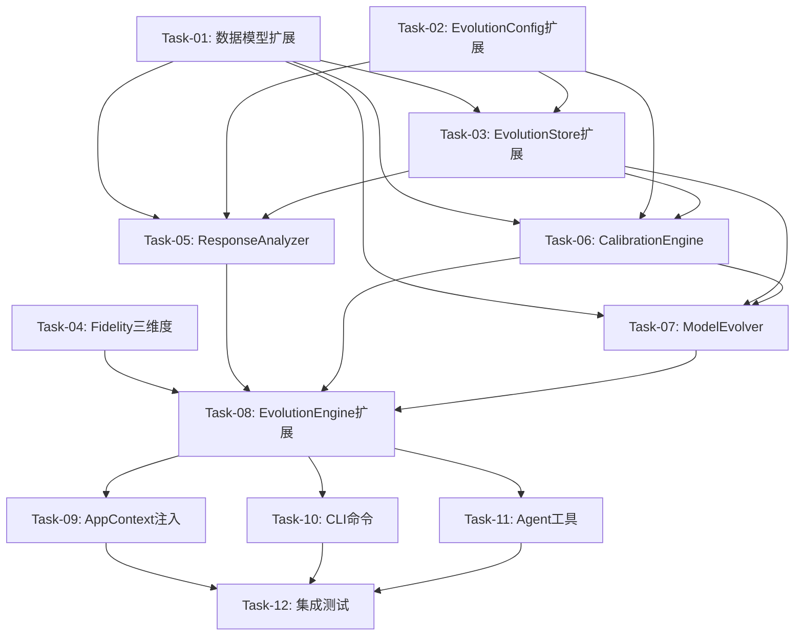

# v0.24.0 个性化学习 Implementation Plan

> **For agentic workers:** REQUIRED SUB-SKILL: Use superpowers:subagent-driven-development (recommended) or superpowers:executing-plans to implement this plan task-by-task. Steps use checkbox (`- [ ]`) syntax for tracking.

**Goal:** 实现v0.24.0个性化学习模块——训练响应性分析、预测校准、模型进化

**Architecture:** 在v0.23决策追踪模块基础上递增式添加3个新子组件(ResponseAnalyzer/CalibrationEngine/ModelEvolver)，通过EvolutionEngine薄编排层统一入口，遵循无侵入原则(PredictionEngine零修改)

**Tech Stack:** Python 3.11+, Polars 0.20+, scikit-learn, scipy, joblib, dataclasses(frozen)

---

## 文件结构

| 操作 | 文件路径 | 职责 |
|------|----------|------|
| 修改 | `src/core/evolution/models.py` | 新增6个v0.24数据模型 |
| 修改 | `src/core/evolution/__init__.py` | 更新导出列表 |
| 修改 | `src/core/evolution/config.py` | 新增6个校准配置字段 |
| 修改 | `src/core/evolution/evolution_store.py` | 新增5个校准/参数持久化方法 |
| 修改 | `src/core/evolution/outcome_collector.py` | Fidelity三维度升级 |
| 新建 | `src/core/evolution/response_analyzer.py` | 训练响应性分析器 |
| 新建 | `src/core/evolution/calibration_engine.py` | 校准引擎 |
| 新建 | `src/core/evolution/model_evolver.py` | 模型进化器 |
| 修改 | `src/core/evolution/evolution_engine.py` | v0.24编排方法扩展 |
| 修改 | `src/core/base/context.py` | v0.24组件注入更新 |
| 修改 | `src/cli/commands/evolution.py` | 新增calibration/response命令 |
| 修改 | `src/cli/handlers/evolution_handler.py` | 新增2个handler方法 |
| 修改 | `src/agents/tools_evolution.py` | 新增2个Agent工具 |
| 修改 | `src/agents/tools.py` | RunnerTools新增2个方法+TOOL_DESCRIPTIONS |
| 新建 | `tests/unit/core/evolution/test_response_analyzer.py` | ResponseAnalyzer单元测试 |
| 新建 | `tests/unit/core/evolution/test_calibration_engine.py` | CalibrationEngine单元测试 |
| 新建 | `tests/unit/core/evolution/test_model_evolver.py` | ModelEvolver单元测试 |
| 新建 | `tests/integration/test_evolution_v024.py` | 集成测试 |

---

## 依赖关系图



---

## 关键一致性规则

以下规则确保v0.23→v0.24的类型一致性，实施时必须遵守：

1. **CalibrationProfile无bias字段**: 仅scale修正（评审MEDIUM-1整改）
2. **CalibrationReport无bias_before/bias_after**: 仅记录scale变化
3. **PlanExecutionData新增字段默认0.0**: 向后兼容，旧数据自动回退v0.23双维度
4. **EvolutionEngine新增参数均为Optional**: 未注入时抛RuntimeError，不影响v0.23功能
5. **PredictionEngine零修改**: 无侵入验证，校准通过apply_calibration_to_prediction在Engine层应用
6. **EvolutionStore._calibrations_dir**: 新增属性，首次写入时自动创建目录
7. **INTENSITY_FACTOR_TABLE**: 模块级常量，定义在outcome_collector.py中
8. **get_prediction_actual_pairs**: 从DecisionLog.prediction_snapshot和OutcomeRecord提取配对数据
9. **Banister参数调整**: tau_fitness调整步长2.0，k1调整系数0.95/1.05，单次不超过5%
10. **EMA更新**: alpha*new + (1-alpha)*current，alpha默认0.7

---

## Task-01: v0.24数据模型扩展

**Files:**
- Modify: `src/core/evolution/models.py`
- Modify: `src/core/evolution/__init__.py`
- Test: `tests/unit/core/evolution/test_models.py`

### Step 1.1: 编写失败测试 — 6个新数据模型

在 `tests/unit/core/evolution/test_models.py` 末尾追加：

```python
from src.core.evolution.models import (
    TrainingTypeResponse,
    TrainingResponseReport,
    CalibrationProfile,
    CalibrationReport,
    ParameterChange,
    ModelEvolutionResult,
)


class TestTrainingTypeResponse:
    """TrainingTypeResponse 数据模型测试"""

    def test_create_training_type_response(self):
        resp = TrainingTypeResponse(
            training_type="interval",
            sample_count=10,
            avg_vdot_delta=0.3,
            avg_fidelity=0.85,
            response_score=0.72,
        )
        assert resp.training_type == "interval"
        assert resp.sample_count == 10
        assert resp.avg_vdot_delta == 0.3
        assert resp.avg_fidelity == 0.85
        assert resp.response_score == 0.72

    def test_training_type_response_is_frozen(self):
        resp = TrainingTypeResponse(
            training_type="threshold", sample_count=5,
            avg_vdot_delta=0.1, avg_fidelity=0.9, response_score=0.5,
        )
        with pytest.raises(AttributeError):
            resp.training_type = "easy"  # type: ignore[misc]

    def test_training_type_response_to_dict(self):
        resp = TrainingTypeResponse(
            training_type="long", sample_count=8,
            avg_vdot_delta=0.2, avg_fidelity=0.75, response_score=0.6,
        )
        d = resp.to_dict()
        assert d["training_type"] == "long"
        assert d["sample_count"] == 8
        assert d["avg_vdot_delta"] == 0.2
        assert d["avg_fidelity"] == 0.75
        assert d["response_score"] == 0.6


class TestTrainingResponseReport:
    """TrainingResponseReport 数据模型测试"""

    def test_create_training_response_report(self):
        responses = [
            TrainingTypeResponse("interval", 10, 0.3, 0.85, 0.72),
            TrainingTypeResponse("easy", 8, 0.1, 0.9, 0.5),
        ]
        report = TrainingResponseReport(
            report_id="rpt_001",
            timestamp=datetime(2026, 5, 20, 10, 0, 0),
            analysis_months=6,
            total_pairs=20,
            eligible_pairs=18,
            training_responses=responses,
            best_type="interval",
            worst_type="easy",
            profile_summary="间歇训练效果最佳",
            data_sufficient=True,
        )
        assert report.report_id == "rpt_001"
        assert report.analysis_months == 6
        assert len(report.training_responses) == 2
        assert report.best_type == "interval"
        assert report.worst_type == "easy"
        assert report.data_sufficient is True

    def test_training_response_report_to_dict(self):
        responses = [TrainingTypeResponse("interval", 10, 0.3, 0.85, 0.72)]
        report = TrainingResponseReport(
            report_id="rpt_002",
            timestamp=datetime(2026, 5, 20, 10, 0, 0),
            analysis_months=6, total_pairs=20, eligible_pairs=18,
            training_responses=responses,
            best_type="interval", worst_type=None,
            profile_summary="数据不足", data_sufficient=False,
        )
        d = report.to_dict()
        assert d["report_id"] == "rpt_002"
        assert len(d["training_responses"]) == 1
        assert d["worst_type"] is None

    def test_training_response_report_from_dict(self):
        data = {
            "report_id": "rpt_003",
            "timestamp": "2026-05-20T10:00:00",
            "analysis_months": 6,
            "total_pairs": 20,
            "eligible_pairs": 18,
            "training_responses": [
                {"training_type": "interval", "sample_count": 10,
                 "avg_vdot_delta": 0.3, "avg_fidelity": 0.85, "response_score": 0.72}
            ],
            "best_type": "interval",
            "worst_type": None,
            "profile_summary": "测试",
            "data_sufficient": True,
        }
        report = TrainingResponseReport.from_dict(data)
        assert report.report_id == "rpt_003"
        assert len(report.training_responses) == 1
        assert report.training_responses[0].training_type == "interval"


class TestCalibrationProfile:
    """CalibrationProfile 数据模型测试"""

    def test_create_calibration_profile(self):
        profile = CalibrationProfile(
            model_type="vdot", scale=1.05,
            last_updated=datetime(2026, 5, 20, 10, 0, 0),
            sample_count=15, mae_before=2.5, mae_after=1.8,
        )
        assert profile.model_type == "vdot"
        assert profile.scale == 1.05
        assert profile.sample_count == 15

    def test_calibration_profile_default_scale(self):
        profile = CalibrationProfile(
            model_type="vdot",
            last_updated=datetime(2026, 5, 20, 10, 0, 0),
            sample_count=0,
        )
        assert profile.scale == 1.0
        assert profile.mae_before is None
        assert profile.mae_after is None

    def test_calibration_profile_no_bias_field(self):
        """测试CalibrationProfile无bias字段（评审MEDIUM-1整改）"""
        profile = CalibrationProfile(
            model_type="vdot",
            last_updated=datetime(2026, 5, 20, 10, 0, 0),
            sample_count=0,
        )
        assert not hasattr(profile, "bias")
        d = profile.to_dict()
        assert "bias" not in d

    def test_calibration_profile_default_class_method(self):
        profile = CalibrationProfile.default("vdot")
        assert profile.model_type == "vdot"
        assert profile.scale == 1.0
        assert profile.sample_count == 0

    def test_calibration_profile_to_dict_and_from_dict(self):
        profile = CalibrationProfile(
            model_type="injury", scale=0.95,
            last_updated=datetime(2026, 5, 20, 10, 0, 0),
            sample_count=20, mae_before=3.0, mae_after=2.2,
        )
        d = profile.to_dict()
        restored = CalibrationProfile.from_dict(d)
        assert restored.model_type == "injury"
        assert restored.scale == 0.95
        assert restored.sample_count == 20


class TestCalibrationReport:
    """CalibrationReport 数据模型测试"""

    def test_create_calibration_report(self):
        report = CalibrationReport(
            model_type="vdot",
            timestamp=datetime(2026, 5, 20, 10, 0, 0),
            direction="overestimate", magnitude=0.08,
            scale_before=1.0, scale_after=0.95,
            mae_before=2.5, mae_after=1.8,
            improvement_pct=28.0, sample_count=15,
        )
        assert report.model_type == "vdot"
        assert report.direction == "overestimate"
        assert report.scale_after == 0.95
        assert report.improvement_pct == 28.0

    def test_calibration_report_no_bias_fields(self):
        """测试CalibrationReport无bias_before/bias_after字段"""
        report = CalibrationReport(
            model_type="vdot",
            timestamp=datetime(2026, 5, 20, 10, 0, 0),
            direction="none", magnitude=0.0,
            scale_before=1.0, scale_after=1.0,
            mae_before=1.0, mae_after=1.0,
            improvement_pct=0.0, sample_count=10,
        )
        assert not hasattr(report, "bias_before")
        assert not hasattr(report, "bias_after")
        d = report.to_dict()
        assert "bias_before" not in d
        assert "bias_after" not in d

    def test_calibration_report_from_dict(self):
        data = {
            "model_type": "vdot",
            "timestamp": "2026-05-20T10:00:00",
            "direction": "underestimate", "magnitude": 0.06,
            "scale_before": 1.0, "scale_after": 1.04,
            "mae_before": 2.0, "mae_after": 1.5,
            "improvement_pct": 25.0, "sample_count": 12,
        }
        report = CalibrationReport.from_dict(data)
        assert report.direction == "underestimate"
        assert report.scale_after == 1.04


class TestParameterChange:
    """ParameterChange 数据模型测试"""

    def test_create_parameter_change(self):
        change = ParameterChange(
            name="tau_fitness", old_value=42.0,
            new_value=44.0, change_pct=4.76,
        )
        assert change.name == "tau_fitness"
        assert change.old_value == 42.0
        assert change.new_value == 44.0
        assert change.change_pct == 4.76

    def test_parameter_change_to_dict(self):
        change = ParameterChange(
            name="k1", old_value=0.0038,
            new_value=0.00361, change_pct=-5.0,
        )
        d = change.to_dict()
        assert d["name"] == "k1"
        assert d["change_pct"] == -5.0


class TestModelEvolutionResult:
    """ModelEvolutionResult 数据模型测试"""

    def test_create_model_evolution_result(self):
        changes = [
            ParameterChange("tau_fitness", 42.0, 44.0, 4.76),
            ParameterChange("k1", 0.0038, 0.00361, -5.0),
        ]
        cal_report = CalibrationReport(
            model_type="vdot",
            timestamp=datetime(2026, 5, 20, 10, 0, 0),
            direction="overestimate", magnitude=0.08,
            scale_before=1.0, scale_after=0.95,
            mae_before=2.5, mae_after=1.8,
            improvement_pct=28.0, sample_count=15,
        )
        result = ModelEvolutionResult(
            model_type="vdot",
            timestamp=datetime(2026, 5, 20, 10, 0, 0),
            parameter_changes=changes,
            mae_before=2.5, mae_after=1.8,
            improvement_pct=28.0,
            calibration_report=cal_report,
        )
        assert result.model_type == "vdot"
        assert len(result.parameter_changes) == 2
        assert result.calibration_report is not None

    def test_model_evolution_result_without_calibration(self):
        result = ModelEvolutionResult(
            model_type="vdot",
            timestamp=datetime(2026, 5, 20, 10, 0, 0),
            parameter_changes=[],
            mae_before=0.0, mae_after=0.0,
            improvement_pct=0.0,
            calibration_report=None,
        )
        assert result.calibration_report is None
        assert result.parameter_changes == []

    def test_model_evolution_result_from_dict(self):
        data = {
            "model_type": "vdot",
            "timestamp": "2026-05-20T10:00:00",
            "parameter_changes": [
                {"name": "tau_fitness", "old_value": 42.0,
                 "new_value": 44.0, "change_pct": 4.76}
            ],
            "mae_before": 2.5, "mae_after": 1.8,
            "improvement_pct": 28.0,
            "calibration_report": None,
        }
        result = ModelEvolutionResult.from_dict(data)
        assert result.model_type == "vdot"
        assert len(result.parameter_changes) == 1
        assert result.parameter_changes[0].name == "tau_fitness"
```

### Step 1.2: 实现6个新数据模型

在 `src/core/evolution/models.py` 末尾追加以下代码。注意需要将文件头部的 `from dataclasses import dataclass` 改为 `from dataclasses import dataclass, field`：

```python
@dataclass(frozen=True)
class TrainingTypeResponse:
    """训练类型响应性数据（不可变数据类）

    记录某类训练对跑者VDOT变化的响应效果。

    Attributes:
        training_type: 训练类型（interval/threshold/long/recovery/easy/unknown）
        sample_count: 样本数量
        avg_vdot_delta: 平均VDOT变化量
        avg_fidelity: 平均执行忠实度
        response_score: 综合响应性评分
    """

    training_type: str
    sample_count: int
    avg_vdot_delta: float
    avg_fidelity: float
    response_score: float

    def to_dict(self) -> dict[str, Any]:
        return {
            "training_type": self.training_type,
            "sample_count": self.sample_count,
            "avg_vdot_delta": self.avg_vdot_delta,
            "avg_fidelity": self.avg_fidelity,
            "response_score": self.response_score,
        }


@dataclass(frozen=True)
class TrainingResponseReport:
    """训练响应性分析报告（不可变数据类）

    Attributes:
        report_id: 报告唯一标识
        timestamp: 报告生成时间
        analysis_months: 分析月数
        total_pairs: 总决策-结果配对数
        eligible_pairs: 符合条件的配对数
        training_responses: 各训练类型响应数据列表
        best_type: 最佳训练类型（可选）
        worst_type: 最差训练类型（可选）
        profile_summary: 画像摘要文本
        data_sufficient: 数据是否充足
    """

    report_id: str
    timestamp: datetime
    analysis_months: int
    total_pairs: int
    eligible_pairs: int
    training_responses: list[TrainingTypeResponse]
    best_type: str | None
    worst_type: str | None
    profile_summary: str
    data_sufficient: bool

    def to_dict(self) -> dict[str, Any]:
        return {
            "report_id": self.report_id,
            "timestamp": self.timestamp.isoformat(),
            "analysis_months": self.analysis_months,
            "total_pairs": self.total_pairs,
            "eligible_pairs": self.eligible_pairs,
            "training_responses": [r.to_dict() for r in self.training_responses],
            "best_type": self.best_type,
            "worst_type": self.worst_type,
            "profile_summary": self.profile_summary,
            "data_sufficient": self.data_sufficient,
        }

    @classmethod
    def from_dict(cls, data: dict[str, Any]) -> TrainingResponseReport:
        timestamp = data["timestamp"]
        if isinstance(timestamp, str):
            timestamp = datetime.fromisoformat(timestamp)
        responses = [
            TrainingTypeResponse(**r) for r in data.get("training_responses", [])
        ]
        return cls(
            report_id=data["report_id"],
            timestamp=timestamp,
            analysis_months=data["analysis_months"],
            total_pairs=data["total_pairs"],
            eligible_pairs=data["eligible_pairs"],
            training_responses=responses,
            best_type=data.get("best_type"),
            worst_type=data.get("worst_type"),
            profile_summary=data.get("profile_summary", ""),
            data_sufficient=data.get("data_sufficient", False),
        )


@dataclass(frozen=True)
class CalibrationProfile:
    """校准配置（不可变数据类）— 仅scale修正（评审MEDIUM-1整改：无bias字段）

    Attributes:
        model_type: 模型类型（vdot/injury/training_response）
        scale: 缩放因子，默认1.0（无修正）
        last_updated: 最后更新时间
        sample_count: 校准使用的样本数
        mae_before: 校准前MAE（可选）
        mae_after: 校准后MAE（可选）
    """

    model_type: str
    scale: float = 1.0
    last_updated: datetime = field(default_factory=datetime.now)
    sample_count: int = 0
    mae_before: float | None = None
    mae_after: float | None = None

    def to_dict(self) -> dict[str, Any]:
        return {
            "model_type": self.model_type,
            "scale": self.scale,
            "last_updated": self.last_updated.isoformat(),
            "sample_count": self.sample_count,
            "mae_before": self.mae_before,
            "mae_after": self.mae_after,
        }

    @classmethod
    def from_dict(cls, data: dict[str, Any]) -> CalibrationProfile:
        last_updated = data.get("last_updated", datetime.now().isoformat())
        if isinstance(last_updated, str):
            last_updated = datetime.fromisoformat(last_updated)
        return cls(
            model_type=data["model_type"],
            scale=data.get("scale", 1.0),
            last_updated=last_updated,
            sample_count=data.get("sample_count", 0),
            mae_before=data.get("mae_before"),
            mae_after=data.get("mae_after"),
        )

    @classmethod
    def default(cls, model_type: str) -> CalibrationProfile:
        """创建默认校准配置（scale=1.0，无修正）"""
        return cls(
            model_type=model_type,
            scale=1.0,
            last_updated=datetime.now(),
            sample_count=0,
            mae_before=None,
            mae_after=None,
        )


@dataclass(frozen=True)
class CalibrationReport:
    """校准报告（不可变数据类）— 无bias_before/bias_after字段

    Attributes:
        model_type: 模型类型
        timestamp: 校准时间
        direction: 偏差方向（overestimate/underestimate/none）
        magnitude: 偏差幅度
        scale_before: 校准前scale
        scale_after: 校准后scale
        mae_before: 校准前MAE
        mae_after: 校准后MAE
        improvement_pct: 改善百分比
        sample_count: 样本数
    """

    model_type: str
    timestamp: datetime
    direction: str
    magnitude: float
    scale_before: float
    scale_after: float
    mae_before: float
    mae_after: float
    improvement_pct: float
    sample_count: int

    def to_dict(self) -> dict[str, Any]:
        return {
            "model_type": self.model_type,
            "timestamp": self.timestamp.isoformat(),
            "direction": self.direction,
            "magnitude": self.magnitude,
            "scale_before": self.scale_before,
            "scale_after": self.scale_after,
            "mae_before": self.mae_before,
            "mae_after": self.mae_after,
            "improvement_pct": self.improvement_pct,
            "sample_count": self.sample_count,
        }

    @classmethod
    def from_dict(cls, data: dict[str, Any]) -> CalibrationReport:
        timestamp = data["timestamp"]
        if isinstance(timestamp, str):
            timestamp = datetime.fromisoformat(timestamp)
        return cls(
            model_type=data["model_type"],
            timestamp=timestamp,
            direction=data["direction"],
            magnitude=data["magnitude"],
            scale_before=data["scale_before"],
            scale_after=data["scale_after"],
            mae_before=data["mae_before"],
            mae_after=data["mae_after"],
            improvement_pct=data["improvement_pct"],
            sample_count=data["sample_count"],
        )


@dataclass(frozen=True)
class ParameterChange:
    """参数变更记录（不可变数据类）

    Attributes:
        name: 参数名称
        old_value: 变更前值
        new_value: 变更后值
        change_pct: 变更百分比
    """

    name: str
    old_value: float
    new_value: float
    change_pct: float

    def to_dict(self) -> dict[str, Any]:
        return {
            "name": self.name,
            "old_value": self.old_value,
            "new_value": self.new_value,
            "change_pct": self.change_pct,
        }


@dataclass(frozen=True)
class ModelEvolutionResult:
    """模型进化结果（不可变数据类）

    Attributes:
        model_type: 模型类型
        timestamp: 进化时间
        parameter_changes: 参数变更列表
        mae_before: 进化前MAE
        mae_after: 进化后MAE
        improvement_pct: 改善百分比
        calibration_report: 关联的校准报告（可选）
    """

    model_type: str
    timestamp: datetime
    parameter_changes: list[ParameterChange]
    mae_before: float
    mae_after: float
    improvement_pct: float
    calibration_report: CalibrationReport | None

    def to_dict(self) -> dict[str, Any]:
        return {
            "model_type": self.model_type,
            "timestamp": self.timestamp.isoformat(),
            "parameter_changes": [c.to_dict() for c in self.parameter_changes],
            "mae_before": self.mae_before,
            "mae_after": self.mae_after,
            "improvement_pct": self.improvement_pct,
            "calibration_report": (
                self.calibration_report.to_dict()
                if self.calibration_report is not None
                else None
            ),
        }

    @classmethod
    def from_dict(cls, data: dict[str, Any]) -> ModelEvolutionResult:
        timestamp = data["timestamp"]
        if isinstance(timestamp, str):
            timestamp = datetime.fromisoformat(timestamp)
        changes = [
            ParameterChange(**c) for c in data.get("parameter_changes", [])
        ]
        cal_report = None
        if data.get("calibration_report") is not None:
            cal_report = CalibrationReport.from_dict(data["calibration_report"])
        return cls(
            model_type=data["model_type"],
            timestamp=timestamp,
            parameter_changes=changes,
            mae_before=data["mae_before"],
            mae_after=data["mae_after"],
            improvement_pct=data["improvement_pct"],
            calibration_report=cal_report,
        )
```

### Step 1.3: 更新 `__init__.py` 导出列表

修改 `src/core/evolution/__init__.py`：

```python
# 决策追踪模块（v0.23.0）+ 个性化学习模块（v0.24.0）
# 提供AI决策日志、结果回填、预测精度统计、训练响应性分析、预测校准、模型进化等能力

from src.core.evolution.config import EvolutionConfig
from src.core.evolution.decision_log_hook import DecisionLogHook
from src.core.evolution.decision_logger import DecisionLogger
from src.core.evolution.evolution_engine import EvolutionEngine
from src.core.evolution.models import (
    CalibrationProfile,
    CalibrationReport,
    DecisionLog,
    ModelEvolutionResult,
    OutcomeRecord,
    ParameterChange,
    PredictionAccuracyStats,
    TrainingResponseReport,
    TrainingTypeResponse,
)
from src.core.evolution.outcome_collector import (
    OutcomeCollector,
    PlanExecutionData,
    PlanExecutionDataAdapter,
    calculate_fidelity,
    calculate_prediction_error,
)

__all__ = [
    "CalibrationProfile",
    "CalibrationReport",
    "DecisionLog",
    "DecisionLogHook",
    "DecisionLogger",
    "EvolutionConfig",
    "EvolutionEngine",
    "ModelEvolutionResult",
    "OutcomeCollector",
    "OutcomeRecord",
    "ParameterChange",
    "PlanExecutionData",
    "PlanExecutionDataAdapter",
    "PredictionAccuracyStats",
    "TrainingResponseReport",
    "TrainingTypeResponse",
    "calculate_fidelity",
    "calculate_prediction_error",
]
```

### Step 1.4: 运行测试验证

```bash
uv run pytest tests/unit/core/evolution/test_models.py -v
```

- [ ] Task-01 完成

---

## Task-02: EvolutionConfig校准配置扩展

**Files:**
- Modify: `src/core/evolution/config.py`
- Test: `tests/unit/core/evolution/test_config.py`

### Step 2.1: 编写失败测试 — 校准配置字段

在 `tests/unit/core/evolution/test_config.py` 末尾追加：

```python
class TestEvolutionConfigV024:
    """EvolutionConfig v0.24校准配置扩展测试"""

    def test_default_calibration_fields(self):
        config = EvolutionConfig()
        assert config.calibration_alpha == 0.7
        assert config.calibration_max_amplitude == 0.10
        assert config.calibration_min_samples == 10
        assert config.response_min_fidelity == 0.7
        assert config.response_min_samples_per_type == 5
        assert config.window_min_months == 6

    def test_custom_calibration_fields(self):
        config = EvolutionConfig(
            calibration_alpha=0.5,
            calibration_max_amplitude=0.15,
            calibration_min_samples=20,
            response_min_fidelity=0.8,
            response_min_samples_per_type=8,
            window_min_months=3,
        )
        assert config.calibration_alpha == 0.5
        assert config.calibration_max_amplitude == 0.15

    def test_calibration_alpha_validation(self):
        with pytest.raises(ValueError, match="calibration_alpha"):
            EvolutionConfig(calibration_alpha=0.0)
        with pytest.raises(ValueError, match="calibration_alpha"):
            EvolutionConfig(calibration_alpha=1.1)

    def test_calibration_max_amplitude_validation(self):
        with pytest.raises(ValueError, match="calibration_max_amplitude"):
            EvolutionConfig(calibration_max_amplitude=0.0)
        with pytest.raises(ValueError, match="calibration_max_amplitude"):
            EvolutionConfig(calibration_max_amplitude=1.5)

    def test_calibration_min_samples_validation(self):
        with pytest.raises(ValueError, match="calibration_min_samples"):
            EvolutionConfig(calibration_min_samples=0)

    def test_response_min_fidelity_validation(self):
        with pytest.raises(ValueError, match="response_min_fidelity"):
            EvolutionConfig(response_min_fidelity=0.0)
        with pytest.raises(ValueError, match="response_min_fidelity"):
            EvolutionConfig(response_min_fidelity=1.5)

    def test_response_min_samples_per_type_validation(self):
        with pytest.raises(ValueError, match="response_min_samples_per_type"):
            EvolutionConfig(response_min_samples_per_type=0)

    def test_window_min_months_validation(self):
        with pytest.raises(ValueError, match="window_min_months"):
            EvolutionConfig(window_min_months=0)

    def test_to_dict_includes_v024_fields(self):
        config = EvolutionConfig()
        d = config.to_dict()
        assert "calibration_alpha" in d
        assert "calibration_max_amplitude" in d
        assert "calibration_min_samples" in d
        assert "response_min_fidelity" in d
        assert "response_min_samples_per_type" in d
        assert "window_min_months" in d

    def test_from_dict_compatible_with_v023(self):
        v023_data = {
            "data_dir": "~/.nanobot-runner",
            "async_write_enabled": False,
            "feedback_prompt_frequency": 5,
            "some_unknown_field": "ignored",
        }
        config = EvolutionConfig.from_dict(v023_data)
        assert config.feedback_prompt_frequency == 5
        assert config.calibration_alpha == 0.7
```

### Step 2.2: 实现校准配置扩展

修改 `src/core/evolution/config.py`，在EvolutionConfig中追加6个字段和校验逻辑。完整替换EvolutionConfig类：

```python
@dataclass(frozen=True)
class EvolutionConfig:
    """决策追踪模块配置（不可变数据类）

    v0.24新增: calibration_alpha, calibration_max_amplitude,
    calibration_min_samples, response_min_fidelity,
    response_min_samples_per_type, window_min_months
    """

    data_dir: str = "~/.nanobot-runner"
    async_write_enabled: bool = False
    async_write_queue_size: int = 100
    async_write_max_retries: int = 3
    async_write_retry_backoff: float = 1.0
    feedback_prompt_frequency: int = 3
    runner_state_fields: list[str] = field(
        default_factory=lambda: ["vdot", "ctl", "atl", "tsb", "fatigue_score"]
    )
    # v0.24 校准配置
    calibration_alpha: float = 0.7
    calibration_max_amplitude: float = 0.10
    calibration_min_samples: int = 10
    response_min_fidelity: float = 0.7
    response_min_samples_per_type: int = 5
    window_min_months: int = 6

    def __post_init__(self) -> None:
        """验证配置参数合法性"""
        if self.feedback_prompt_frequency < 1:
            raise ValueError(
                f"feedback_prompt_frequency必须>=1，当前为{self.feedback_prompt_frequency}"
            )
        if self.async_write_queue_size < 1:
            raise ValueError(
                f"async_write_queue_size必须>=1，当前为{self.async_write_queue_size}"
            )
        if self.async_write_max_retries < 0:
            raise ValueError(
                f"async_write_max_retries必须>=0，当前为{self.async_write_max_retries}"
            )
        # v0.24 校准参数校验
        if self.calibration_alpha <= 0.0 or self.calibration_alpha > 1.0:
            raise ValueError(
                f"calibration_alpha必须在(0, 1]范围内，当前为{self.calibration_alpha}"
            )
        if self.calibration_max_amplitude <= 0.0 or self.calibration_max_amplitude > 1.0:
            raise ValueError(
                f"calibration_max_amplitude必须在(0, 1]范围内，当前为{self.calibration_max_amplitude}"
            )
        if self.calibration_min_samples < 1:
            raise ValueError(
                f"calibration_min_samples必须>=1，当前为{self.calibration_min_samples}"
            )
        if self.response_min_fidelity <= 0.0 or self.response_min_fidelity > 1.0:
            raise ValueError(
                f"response_min_fidelity必须在(0, 1]范围内，当前为{self.response_min_fidelity}"
            )
        if self.response_min_samples_per_type < 1:
            raise ValueError(
                f"response_min_samples_per_type必须>=1，当前为{self.response_min_samples_per_type}"
            )
        if self.window_min_months < 1:
            raise ValueError(
                f"window_min_months必须>=1，当前为{self.window_min_months}"
            )

    def to_dict(self) -> dict[str, Any]:
        return {
            "data_dir": self.data_dir,
            "async_write_enabled": self.async_write_enabled,
            "async_write_queue_size": self.async_write_queue_size,
            "async_write_max_retries": self.async_write_max_retries,
            "async_write_retry_backoff": self.async_write_retry_backoff,
            "feedback_prompt_frequency": self.feedback_prompt_frequency,
            "runner_state_fields": list(self.runner_state_fields),
            "calibration_alpha": self.calibration_alpha,
            "calibration_max_amplitude": self.calibration_max_amplitude,
            "calibration_min_samples": self.calibration_min_samples,
            "response_min_fidelity": self.response_min_fidelity,
            "response_min_samples_per_type": self.response_min_samples_per_type,
            "window_min_months": self.window_min_months,
        }

    @classmethod
    def from_dict(cls, d: dict[str, Any]) -> EvolutionConfig:
        """从字典创建配置，忽略无效key"""
        valid_keys = {f.name for f in fields(cls)}
        filtered = {k: v for k, v in d.items() if k in valid_keys}
        return cls(**filtered)
```

### Step 2.3: 运行测试验证

```bash
uv run pytest tests/unit/core/evolution/test_config.py -v
```

- [ ] Task-02 完成

---

## Task-03: EvolutionStore校准/参数持久化方法扩展

**Files:**
- Modify: `src/core/evolution/evolution_store.py`
- Test: `tests/unit/core/evolution/test_evolution_store.py`

### Step 3.1: 编写失败测试 — 5个新方法

在 `tests/unit/core/evolution/test_evolution_store.py` 末尾追加：

```python
from src.core.evolution.models import CalibrationProfile


class TestEvolutionStoreV024:
    """EvolutionStore v0.24校准/参数持久化方法测试"""

    def test_save_and_load_calibration_profile(self, tmp_path):
        store = EvolutionStore(tmp_path)
        profile = CalibrationProfile(
            model_type="vdot", scale=0.95,
            last_updated=datetime(2026, 5, 20, 10, 0, 0),
            sample_count=15, mae_before=2.5, mae_after=1.8,
        )
        store.save_calibration_profile(profile)
        loaded = store.load_calibration_profile("vdot")
        assert loaded is not None
        assert loaded.model_type == "vdot"
        assert loaded.scale == 0.95
        assert loaded.sample_count == 15

    def test_load_calibration_profile_not_found(self, tmp_path):
        store = EvolutionStore(tmp_path)
        result = store.load_calibration_profile("nonexistent")
        assert result is None

    def test_save_calibration_creates_directory(self, tmp_path):
        store = EvolutionStore(tmp_path)
        profile = CalibrationProfile(model_type="vdot")
        store.save_calibration_profile(profile)
        assert (tmp_path / "calibrations").exists()

    def test_get_prediction_actual_pairs_vdot(self, tmp_path):
        store = EvolutionStore(tmp_path)
        decision = DecisionLog(
            decision_id="dec_001",
            timestamp=datetime(2026, 5, 1, 10, 0, 0),
            runner_state={"vdot": 45.0},
            decision_type=DecisionType.TRAINING_ADVICE,
            tool_call_chain=[],
            prediction_snapshot={"predicted_vdot": 46.0},
            recommendation_text=None,
            execution_status="executed",
            recommendation_accepted=None,
            session_key="",
        )
        outcome = OutcomeRecord(
            outcome_id="out_001", decision_id="dec_001",
            outcome_timestamp=datetime(2026, 5, 8, 10, 0, 0),
            actual_vdot=46.5, actual_injury=False,
            execution_fidelity=0.85,
            user_feedback_score=None, user_feedback_text=None,
            prediction_error=None, prediction_direction=None,
            session_id=None,
        )
        store.save_decision(decision)
        store.save_outcome(outcome)
        pairs = store.get_prediction_actual_pairs("vdot", min_count=1)
        assert len(pairs) == 1
        assert pairs[0] == (46.0, 46.5)

    def test_get_prediction_actual_pairs_insufficient_data(self, tmp_path):
        store = EvolutionStore(tmp_path)
        pairs = store.get_prediction_actual_pairs("vdot", min_count=10)
        assert pairs == []

    def test_get_prediction_actual_pairs_injury(self, tmp_path):
        store = EvolutionStore(tmp_path)
        decision = DecisionLog(
            decision_id="dec_002",
            timestamp=datetime(2026, 5, 1, 10, 0, 0),
            runner_state={"vdot": 45.0},
            decision_type=DecisionType.RECOVERY_SUGGESTION,
            tool_call_chain=[],
            prediction_snapshot={"injury_risk_probability": 0.3},
            recommendation_text=None,
            execution_status="executed",
            recommendation_accepted=None,
            session_key="",
        )
        outcome = OutcomeRecord(
            outcome_id="out_002", decision_id="dec_002",
            outcome_timestamp=datetime(2026, 5, 8, 10, 0, 0),
            actual_vdot=None, actual_injury=True,
            execution_fidelity=None,
            user_feedback_score=None, user_feedback_text=None,
            prediction_error=None, prediction_direction=None,
            session_id=None,
        )
        store.save_decision(decision)
        store.save_outcome(outcome)
        pairs = store.get_prediction_actual_pairs("injury", min_count=1)
        assert len(pairs) == 1
        assert pairs[0] == (0.3, 1.0)

    def test_save_and_load_model_params(self, tmp_path):
        store = EvolutionStore(tmp_path)
        params = {"tau_fitness": 44.0, "k1": 0.00361}
        store.save_model_params("vdot", params)
        loaded = store.load_model_params("vdot")
        assert loaded is not None
        assert loaded["tau_fitness"] == 44.0
        assert loaded["k1"] == 0.00361

    def test_load_model_params_not_found(self, tmp_path):
        store = EvolutionStore(tmp_path)
        result = store.load_model_params("nonexistent")
        assert result is None
```

### Step 3.2: 实现5个新方法

1. 在 `src/core/evolution/evolution_store.py` 头部import追加：
```python
from src.core.evolution.models import CalibrationProfile
```

2. 在 `EvolutionStore.__init__` 中追加 `_calibrations_dir`：
```python
def __init__(self, data_dir: Path) -> None:
    self._data_dir = data_dir
    self._decisions_dir = data_dir / "decisions"
    self._outcomes_dir = data_dir / "outcomes"
    self._calibrations_dir = data_dir / "calibrations"
```

3. 在 `EvolutionStore` 类末尾追加5个方法：

```python
    def save_calibration_profile(self, profile: CalibrationProfile) -> None:
        """保存校准配置到JSON文件"""
        self._calibrations_dir.mkdir(parents=True, exist_ok=True)
        file_path = self._calibrations_dir / f"{profile.model_type}_calibration.json"
        tmp_path = file_path.with_suffix(".json.tmp")
        try:
            tmp_path.write_text(
                json.dumps(profile.to_dict(), ensure_ascii=False, indent=2),
                encoding="utf-8",
            )
            tmp_path.replace(file_path)
        except Exception:
            if tmp_path.exists():
                tmp_path.unlink()
            raise

    def load_calibration_profile(self, model_type: str) -> CalibrationProfile | None:
        """从JSON文件加载校准配置"""
        file_path = self._calibrations_dir / f"{model_type}_calibration.json"
        if not file_path.exists():
            return None
        data = json.loads(file_path.read_text(encoding="utf-8"))
        return CalibrationProfile.from_dict(data)

    def get_prediction_actual_pairs(
        self, model_type: str, min_count: int = 10
    ) -> list[tuple[float, float]]:
        """从DecisionLog/OutcomeRecord提取预测-实际配对

        按model_type从prediction_snapshot提取predicted值，从OutcomeRecord提取actual值。
        配对数 < min_count时返回空列表。
        """
        all_pairs = self.get_decision_outcome_pairs()
        result: list[tuple[float, float]] = []
        prediction_keys: dict[str, str] = {
            "vdot": "predicted_vdot",
            "injury": "injury_risk_probability",
            "training_response": "predicted_vdot_impact",
        }
        pred_key = prediction_keys.get(model_type)
        if pred_key is None:
            return []
        for decision, outcome in all_pairs:
            if decision.prediction_snapshot is None:
                continue
            predicted = decision.prediction_snapshot.get(pred_key)
            if predicted is None:
                continue
            actual: float | None = None
            if model_type == "vdot":
                actual = outcome.actual_vdot
            elif model_type == "injury":
                actual = float(outcome.actual_injury)
            elif model_type == "training_response":
                if outcome.actual_vdot is not None:
                    actual = outcome.actual_vdot - decision.runner_state.get("vdot", 0)
            if actual is None:
                continue
            result.append((float(predicted), actual))
        if len(result) < min_count:
            return []
        return result

    def save_model_params(self, model_type: str, params: dict[str, Any]) -> None:
        """保存模型参数到JSON文件"""
        self._calibrations_dir.mkdir(parents=True, exist_ok=True)
        file_path = self._calibrations_dir / f"{model_type}_params.json"
        tmp_path = file_path.with_suffix(".json.tmp")
        try:
            tmp_path.write_text(
                json.dumps(params, ensure_ascii=False, indent=2),
                encoding="utf-8",
            )
            tmp_path.replace(file_path)
        except Exception:
            if tmp_path.exists():
                tmp_path.unlink()
            raise

    def load_model_params(self, model_type: str) -> dict[str, Any] | None:
        """从JSON文件加载模型参数"""
        file_path = self._calibrations_dir / f"{model_type}_params.json"
        if not file_path.exists():
            return None
        return json.loads(file_path.read_text(encoding="utf-8"))
```

### Step 3.3: 运行测试验证

```bash
uv run pytest tests/unit/core/evolution/test_evolution_store.py -v
```

- [ ] Task-03 完成

---

## Task-04: Fidelity公式升级为三维度

**Files:**
- Modify: `src/core/evolution/outcome_collector.py`
- Test: `tests/unit/core/evolution/test_outcome_collector.py`

### Step 4.1: 编写失败测试 — 三维度Fidelity

在 `tests/unit/core/evolution/test_outcome_collector.py` 末尾追加：

```python
from src.core.evolution.outcome_collector import INTENSITY_FACTOR_TABLE


class TestFidelityThreeDimensions:
    """Fidelity三维度计算测试"""

    def test_plan_execution_data_with_intensity(self):
        data = PlanExecutionData(
            planned_volume_km=40.0, actual_volume_km=38.0,
            planned_duration_min=300, actual_duration_min=290,
            completion_rate=0.95,
            planned_intensity_factor=0.9,
            actual_intensity_factor=0.85,
        )
        assert data.planned_intensity_factor == 0.9
        assert data.actual_intensity_factor == 0.85

    def test_plan_execution_data_intensity_defaults_zero(self):
        data = PlanExecutionData(
            planned_volume_km=40.0, actual_volume_km=38.0,
            planned_duration_min=300, actual_duration_min=290,
            completion_rate=0.95,
        )
        assert data.planned_intensity_factor == 0.0
        assert data.actual_intensity_factor == 0.0

    def test_three_dimension_fidelity(self):
        """三维度: 1 - (0.40*体积 + 0.30*强度 + 0.30*时间)"""
        data = PlanExecutionData(
            planned_volume_km=40.0, actual_volume_km=38.0,
            planned_duration_min=300, actual_duration_min=290,
            completion_rate=0.95,
            planned_intensity_factor=0.9,
            actual_intensity_factor=0.85,
        )
        fidelity = calculate_fidelity(data)
        # 体积偏差: |38-40|/40 = 0.05
        # 强度偏差: |0.85-0.9|/0.9 ≈ 0.0556
        # 时间偏差: |290-300|/300 ≈ 0.0333
        # fidelity = 1 - (0.40*0.05 + 0.30*0.0556 + 0.30*0.0333) ≈ 0.951
        assert 0.94 < fidelity < 0.96

    def test_fidelity_backward_compatible_no_intensity(self):
        """无强度因子时回退v0.23双维度(0.55+0.45)"""
        data = PlanExecutionData(
            planned_volume_km=40.0, actual_volume_km=38.0,
            planned_duration_min=300, actual_duration_min=290,
            completion_rate=0.95,
            planned_intensity_factor=0.0,
            actual_intensity_factor=0.0,
        )
        fidelity = calculate_fidelity(data)
        assert 0.95 < fidelity < 0.97

    def test_intensity_factor_table(self):
        assert INTENSITY_FACTOR_TABLE["interval"] == 1.1
        assert INTENSITY_FACTOR_TABLE["threshold"] == 0.9
        assert INTENSITY_FACTOR_TABLE["long"] == 0.65
        assert INTENSITY_FACTOR_TABLE["recovery"] == 0.45
        assert INTENSITY_FACTOR_TABLE["easy"] == 0.50

    def test_perfect_fidelity_three_dimensions(self):
        data = PlanExecutionData(
            planned_volume_km=40.0, actual_volume_km=40.0,
            planned_duration_min=300, actual_duration_min=300,
            completion_rate=1.0,
            planned_intensity_factor=0.9,
            actual_intensity_factor=0.9,
        )
        assert calculate_fidelity(data) == 1.0

    def test_zero_planned_intensity_skips_intensity(self):
        data = PlanExecutionData(
            planned_volume_km=40.0, actual_volume_km=36.0,
            planned_duration_min=300, actual_duration_min=280,
            completion_rate=0.9,
            planned_intensity_factor=0.0,
            actual_intensity_factor=0.5,
        )
        fidelity = calculate_fidelity(data)
        assert fidelity > 0.0
```

### Step 4.2: 实现三维度Fidelity

1. 在 `PlanExecutionData` 中追加2个字段：

```python
@dataclass(frozen=True)
class PlanExecutionData:
    """计划执行数据（不可变数据类）

    v0.24新增: planned_intensity_factor, actual_intensity_factor
    """

    planned_volume_km: float
    actual_volume_km: float
    planned_duration_min: int
    actual_duration_min: int
    completion_rate: float
    planned_intensity_factor: float = 0.0
    actual_intensity_factor: float = 0.0
```

2. 在 `PlanExecutionDataAdapter` 类之前追加常量：

```python
INTENSITY_FACTOR_TABLE: dict[str, float] = {
    "interval": 1.1,
    "threshold": 0.9,
    "long": 0.65,
    "recovery": 0.45,
    "easy": 0.50,
}
```

3. 替换 `calculate_fidelity` 函数：

```python
def calculate_fidelity(data: PlanExecutionData) -> float:
    """计算执行忠实度（v0.24三维度升级）

    三维度: fidelity = 1 - (0.40*体积偏差 + 0.30*强度偏差 + 0.30*时间偏差)
    向后兼容: planned_intensity_factor为0时回退v0.23双维度(0.55+0.45)
    """
    if data.planned_volume_km == 0 or data.planned_duration_min == 0:
        return 1.0

    volume_deviation = (
        abs(data.actual_volume_km - data.planned_volume_km) / data.planned_volume_km
    )
    duration_deviation = (
        abs(data.actual_duration_min - data.planned_duration_min)
        / data.planned_duration_min
    )

    if data.planned_intensity_factor > 0.0:
        intensity_deviation = (
            abs(data.actual_intensity_factor - data.planned_intensity_factor)
            / data.planned_intensity_factor
        )
        fidelity = 1.0 - (
            0.40 * volume_deviation
            + 0.30 * intensity_deviation
            + 0.30 * duration_deviation
        )
    else:
        fidelity = 1.0 - (0.55 * volume_deviation + 0.45 * duration_deviation)

    return max(0.0, min(1.0, fidelity))
```

### Step 4.3: 运行测试验证

```bash
uv run pytest tests/unit/core/evolution/test_outcome_collector.py -v
```

- [ ] Task-04 完成

---

## Task-05: ResponseAnalyzer训练响应性分析器

**Files:**
- Create: `src/core/evolution/response_analyzer.py`
- Test: `tests/unit/core/evolution/test_response_analyzer.py`

### Step 5.1: 编写失败测试

创建 `tests/unit/core/evolution/test_response_analyzer.py`：

```python
from __future__ import annotations

from datetime import datetime

import pytest

from src.core.evolution.config import EvolutionConfig
from src.core.evolution.evolution_store import EvolutionStore
from src.core.evolution.models import DecisionLog, OutcomeRecord, TrainingTypeResponse
from src.core.evolution.response_analyzer import ResponseAnalyzer
from src.core.transparency.models import DecisionType


class TestResponseAnalyzer:
    """ResponseAnalyzer 训练响应性分析器测试"""

    def _create_store_with_pairs(
        self, tmp_path, pairs_data: list[dict]
    ) -> EvolutionStore:
        store = EvolutionStore(tmp_path)
        for i, pd in enumerate(pairs_data):
            decision = DecisionLog(
                decision_id=f"dec_{i:03d}",
                timestamp=datetime(2026, 1, 1 + i, 10, 0, 0),
                runner_state={"vdot": pd.get("vdot", 45.0)},
                decision_type=DecisionType.TRAINING_ADVICE,
                tool_call_chain=pd.get("tool_call_chain", []),
                prediction_snapshot=pd.get("prediction_snapshot"),
                recommendation_text=pd.get("recommendation_text"),
                execution_status="executed",
                recommendation_accepted=None,
                session_key="",
            )
            outcome = OutcomeRecord(
                outcome_id=f"out_{i:03d}",
                decision_id=f"dec_{i:03d}",
                outcome_timestamp=datetime(2026, 1, 5 + i, 10, 0, 0),
                actual_vdot=pd.get("actual_vdot"),
                actual_injury=False,
                execution_fidelity=pd.get("fidelity", 0.85),
                user_feedback_score=None,
                user_feedback_text=None,
                prediction_error=None,
                prediction_direction=None,
                session_id=None,
            )
            store.save_decision(decision)
            store.save_outcome(outcome)
        return store

    def test_analyze_with_sufficient_data(self, tmp_path):
        pairs_data = [
            {
                "vdot": 45.0, "actual_vdot": 45.5, "fidelity": 0.9,
                "recommendation_text": "建议执行间歇跑训练",
                "tool_call_chain": [
                    {"tool": "predict_training_response", "arguments": {"session_type": "interval"}}
                ],
            },
            {
                "vdot": 45.5, "actual_vdot": 45.8, "fidelity": 0.85,
                "recommendation_text": "建议执行间歇跑训练",
                "tool_call_chain": [
                    {"tool": "predict_training_response", "arguments": {"session_type": "interval"}}
                ],
            },
            {
                "vdot": 45.0, "actual_vdot": 45.1, "fidelity": 0.8,
                "recommendation_text": "轻松跑恢复",
                "tool_call_chain": [
                    {"tool": "predict_training_response", "arguments": {"session_type": "easy"}}
                ],
            },
        ] * 3
        store = self._create_store_with_pairs(tmp_path, pairs_data)
        config = EvolutionConfig(response_min_samples_per_type=3)
        analyzer = ResponseAnalyzer(store, config)
        report = analyzer.analyze(months=6)
        assert report.data_sufficient is True
        assert report.total_pairs > 0
        assert report.eligible_pairs > 0
        assert len(report.training_responses) > 0
        assert report.best_type is not None

    def test_analyze_insufficient_data(self, tmp_path):
        store = EvolutionStore(tmp_path)
        config = EvolutionConfig(response_min_samples_per_type=10)
        analyzer = ResponseAnalyzer(store, config)
        report = analyzer.analyze(months=6)
        assert report.data_sufficient is False
        assert report.total_pairs == 0

    def test_infer_training_type_from_tool_call_chain(self, tmp_path):
        store = EvolutionStore(tmp_path)
        analyzer = ResponseAnalyzer(store)
        decision = DecisionLog(
            decision_id="dec_test",
            timestamp=datetime(2026, 5, 1, 10, 0, 0),
            runner_state={"vdot": 45.0},
            decision_type=DecisionType.TRAINING_ADVICE,
            tool_call_chain=[
                {"tool": "predict_training_response", "arguments": {"session_type": "threshold"}}
            ],
            prediction_snapshot=None,
            recommendation_text="建议执行长距离跑",
            execution_status="executed",
            recommendation_accepted=None,
            session_key="",
        )
        assert analyzer._infer_training_type(decision) == "threshold"

    def test_infer_training_type_from_recommendation_text(self, tmp_path):
        store = EvolutionStore(tmp_path)
        analyzer = ResponseAnalyzer(store)
        decision = DecisionLog(
            decision_id="dec_test",
            timestamp=datetime(2026, 5, 1, 10, 0, 0),
            runner_state={"vdot": 45.0},
            decision_type=DecisionType.TRAINING_ADVICE,
            tool_call_chain=[],
            prediction_snapshot=None,
            recommendation_text="建议执行间歇跑训练",
            execution_status="executed",
            recommendation_accepted=None,
            session_key="",
        )
        assert analyzer._infer_training_type(decision) == "interval"

    def test_infer_training_type_recovery_priority_over_easy(self, tmp_path):
        store = EvolutionStore(tmp_path)
        analyzer = ResponseAnalyzer(store)
        decision = DecisionLog(
            decision_id="dec_test",
            timestamp=datetime(2026, 5, 1, 10, 0, 0),
            runner_state={"vdot": 45.0},
            decision_type=DecisionType.TRAINING_ADVICE,
            tool_call_chain=[],
            prediction_snapshot=None,
            recommendation_text="恢复跑轻松跑",
            execution_status="executed",
            recommendation_accepted=None,
            session_key="",
        )
        assert analyzer._infer_training_type(decision) == "recovery"

    def test_infer_training_type_unknown_fallback(self, tmp_path):
        store = EvolutionStore(tmp_path)
        analyzer = ResponseAnalyzer(store)
        decision = DecisionLog(
            decision_id="dec_test",
            timestamp=datetime(2026, 5, 1, 10, 0, 0),
            runner_state={"vdot": 45.0},
            decision_type=DecisionType.TRAINING_ADVICE,
            tool_call_chain=[],
            prediction_snapshot=None,
            recommendation_text="保持运动习惯",
            execution_status="executed",
            recommendation_accepted=None,
            session_key="",
        )
        assert analyzer._infer_training_type(decision) == "unknown"

    def test_calculate_response_score(self, tmp_path):
        store = EvolutionStore(tmp_path)
        analyzer = ResponseAnalyzer(store)
        score = analyzer._calculate_response_score(0.5, 1.0)
        assert score == 1.0
        score_zero = analyzer._calculate_response_score(0.0, 0.0)
        assert score_zero == 0.0

    def test_build_profile_summary(self, tmp_path):
        store = EvolutionStore(tmp_path)
        analyzer = ResponseAnalyzer(store)
        responses = [
            TrainingTypeResponse("interval", 10, 0.3, 0.85, 0.72),
            TrainingTypeResponse("easy", 8, 0.1, 0.9, 0.5),
        ]
        summary = analyzer._build_profile_summary(responses)
        assert "interval" in summary
        assert len(summary) > 0
```

### Step 5.2: 实现ResponseAnalyzer

创建 `src/core/evolution/response_analyzer.py`：

```python
# 训练响应性分析器
# 分析不同训练类型对跑者VDOT变化的响应效果

from __future__ import annotations

import uuid
from datetime import datetime, timedelta
from typing import Any

from src.core.base.logger import get_logger
from src.core.evolution.config import EvolutionConfig
from src.core.evolution.evolution_store import EvolutionStore
from src.core.evolution.models import (
    DecisionLog,
    OutcomeRecord,
    TrainingResponseReport,
    TrainingTypeResponse,
)

logger = get_logger(__name__)

# 训练类型关键词映射（优先级2：从recommendation_text匹配）
_TRAINING_TYPE_KEYWORDS: dict[str, list[str]] = {
    "interval": ["间歇", "间歇跑", "速度间歇", "亚索800"],
    "threshold": ["阈值", "节奏", "节奏跑", "乳酸阈值"],
    "long": ["长距离", "LSD", "长跑"],
    "recovery": ["恢复", "恢复跑", "排酸跑", "休息"],
    "easy": ["轻松跑", "慢跑"],
}

# 训练类型优先级（冲突解决：高优先级优先）
_TRAINING_TYPE_PRIORITY: dict[str, int] = {
    "interval": 5,
    "threshold": 4,
    "long": 3,
    "recovery": 2,
    "easy": 1,
}


class ResponseAnalyzer:
    """训练响应性分析器

    分析不同训练类型对跑者VDOT变化的响应效果。
    通过DecisionLog/OutcomeRecord配对，推断训练类型，
    计算响应性评分，识别最佳/最差训练类型。
    """

    def __init__(
        self,
        store: EvolutionStore,
        config: EvolutionConfig | None = None,
    ) -> None:
        self._store = store
        self._config = config or EvolutionConfig()

    def analyze(self, months: int = 6) -> TrainingResponseReport:
        """执行训练响应性分析"""
        eligible_pairs = self._get_eligible_pairs(months)
        all_pairs = self._store.get_decision_outcome_pairs()

        # 按训练类型分组
        type_groups: dict[str, list[tuple[DecisionLog, OutcomeRecord]]] = {}
        for decision, outcome in eligible_pairs:
            training_type = self._infer_training_type(decision)
            if training_type not in type_groups:
                type_groups[training_type] = []
            type_groups[training_type].append((decision, outcome))

        # 计算各类型响应性
        responses: list[TrainingTypeResponse] = []
        for training_type, pairs in type_groups.items():
            vdot_deltas: list[float] = []
            fidelities: list[float] = []
            for decision, outcome in pairs:
                if outcome.actual_vdot is not None:
                    delta = outcome.actual_vdot - decision.runner_state.get("vdot", 0)
                    vdot_deltas.append(delta)
                if outcome.execution_fidelity is not None:
                    fidelities.append(outcome.execution_fidelity)

            avg_vdot_delta = sum(vdot_deltas) / len(vdot_deltas) if vdot_deltas else 0.0
            avg_fidelity = sum(fidelities) / len(fidelities) if fidelities else 0.0
            response_score = self._calculate_response_score(avg_vdot_delta, avg_fidelity)

            responses.append(
                TrainingTypeResponse(
                    training_type=training_type,
                    sample_count=len(pairs),
                    avg_vdot_delta=round(avg_vdot_delta, 4),
                    avg_fidelity=round(avg_fidelity, 4),
                    response_score=round(response_score, 4),
                )
            )

        # 按response_score排序
        responses.sort(key=lambda r: r.response_score, reverse=True)

        # 判断数据充足性
        min_samples = self._config.response_min_samples_per_type
        data_sufficient = all(
            r.sample_count >= min_samples for r in responses
        ) if responses else False

        # 确定最佳/最差类型
        best_type: str | None = None
        worst_type: str | None = None
        sufficient_responses = [r for r in responses if r.sample_count >= min_samples]
        if len(sufficient_responses) >= 2:
            best_type = sufficient_responses[0].training_type
            worst_type = sufficient_responses[-1].training_type
        elif len(sufficient_responses) == 1:
            best_type = sufficient_responses[0].training_type

        profile_summary = self._build_profile_summary(responses)

        report = TrainingResponseReport(
            report_id=f"rpt_{uuid.uuid4().hex[:12]}",
            timestamp=datetime.now(),
            analysis_months=months,
            total_pairs=len(all_pairs),
            eligible_pairs=len(eligible_pairs),
            training_responses=responses,
            best_type=best_type,
            worst_type=worst_type,
            profile_summary=profile_summary,
            data_sufficient=data_sufficient,
        )
        logger.info(
            "训练响应性分析完成: total=%d, eligible=%d, types=%d, sufficient=%s",
            report.total_pairs, report.eligible_pairs,
            len(responses), data_sufficient,
        )
        return report

    def _get_eligible_pairs(
        self, months: int
    ) -> list[tuple[DecisionLog, OutcomeRecord]]:
        """筛选fidelity>=config.response_min_fidelity的配对"""
        cutoff = datetime.now() - timedelta(days=months * 30)
        all_pairs = self._store.get_decision_outcome_pairs(start_date=cutoff)
        min_fidelity = self._config.response_min_fidelity
        return [
            (d, o) for d, o in all_pairs
            if o.execution_fidelity is not None
            and o.execution_fidelity >= min_fidelity
        ]

    def _infer_training_type(self, decision: DecisionLog) -> str:
        """推断训练类型（三级优先级）

        优先级1: 从tool_call_chain提取
        优先级2: 从recommendation_text关键词匹配
        优先级3: 兜底"unknown"
        """
        # 优先级1: 从tool_call_chain提取
        for call in decision.tool_call_chain:
            if call.get("tool") == "predict_training_response":
                session_type = call.get("arguments", {}).get("session_type", "")
                if session_type in _TRAINING_TYPE_PRIORITY:
                    return session_type

        # 优先级2: 从recommendation_text关键词匹配
        if decision.recommendation_text:
            text = decision.recommendation_text
            matched_types: list[str] = []
            for type_name, keywords in _TRAINING_TYPE_KEYWORDS.items():
                for keyword in keywords:
                    if keyword in text:
                        matched_types.append(type_name)
                        break
            if matched_types:
                matched_types.sort(
                    key=lambda t: _TRAINING_TYPE_PRIORITY[t], reverse=True
                )
                return matched_types[0]

        # 优先级3: 兜底
        return "unknown"

    def _calculate_response_score(
        self, avg_vdot_delta: float, avg_fidelity: float
    ) -> float:
        """计算响应性评分

        response_score = normalize(avg_vdot_delta) * 0.6 + avg_fidelity * 0.4
        normalize: min(avg_vdot_delta / 0.5, 1.0) (0.5/周为满分基准)
        """
        normalized_delta = (
            min(avg_vdot_delta / 0.5, 1.0) if avg_vdot_delta > 0 else 0.0
        )
        return normalized_delta * 0.6 + avg_fidelity * 0.4

    def _build_profile_summary(
        self, responses: list[TrainingTypeResponse]
    ) -> str:
        """生成画像摘要文本"""
        if not responses:
            return "暂无训练响应数据"
        sorted_responses = sorted(
            responses, key=lambda r: r.response_score, reverse=True
        )
        parts: list[str] = []
        for r in sorted_responses[:3]:
            n = r.sample_count
            parts.append(
                f"{r.training_type}(效果{r.response_score:.0%},样本{n})"
                if n > 0
                else f"{r.training_type}(效果{r.response_score:.0%})"
            )
        return "训练效果排名: " + " > ".join(parts)
```

### Step 5.3: 运行测试验证

```bash
uv run pytest tests/unit/core/evolution/test_response_analyzer.py -v
```

- [ ] Task-05 完成

---

## Task-06: CalibrationEngine校准引擎

**Files:**
- Create: `src/core/evolution/calibration_engine.py`
- Test: `tests/unit/core/evolution/test_calibration_engine.py`

### Step 6.1: 编写失败测试

创建 `tests/unit/core/evolution/test_calibration_engine.py`：

```python
from __future__ import annotations

from datetime import datetime

import pytest

from src.core.evolution.calibration_engine import CalibrationEngine
from src.core.evolution.config import EvolutionConfig
from src.core.evolution.evolution_store import EvolutionStore
from src.core.evolution.models import CalibrationProfile


class TestCalibrationEngine:
    """CalibrationEngine 校准引擎测试"""

    def test_run_calibration_insufficient_data(self, tmp_path):
        store = EvolutionStore(tmp_path)
        config = EvolutionConfig(calibration_min_samples=10)
        engine = CalibrationEngine(store, config)
        with pytest.raises(ValueError, match="校准数据不足"):
            engine.run_calibration("vdot")

    def test_run_calibration_overestimate(self, tmp_path):
        store = EvolutionStore(tmp_path)
        engine = CalibrationEngine(
            store, EvolutionConfig(calibration_min_samples=3)
        )
        engine._test_pairs = [(48.0, 45.0), (47.0, 44.5), (49.0, 46.0)]
        report = engine.run_calibration("vdot")
        assert report.direction == "overestimate"
        assert report.scale_after < 1.0
        assert report.sample_count == 3

    def test_run_calibration_underestimate(self, tmp_path):
        store = EvolutionStore(tmp_path)
        engine = CalibrationEngine(
            store, EvolutionConfig(calibration_min_samples=3)
        )
        engine._test_pairs = [(42.0, 45.0), (43.0, 46.0), (41.0, 44.0)]
        report = engine.run_calibration("vdot")
        assert report.direction == "underestimate"
        assert report.scale_after > 1.0

    def test_run_calibration_accurate(self, tmp_path):
        store = EvolutionStore(tmp_path)
        engine = CalibrationEngine(
            store, EvolutionConfig(calibration_min_samples=3)
        )
        engine._test_pairs = [(45.0, 45.1), (44.0, 44.2), (46.0, 45.8)]
        report = engine.run_calibration("vdot")
        assert report.direction == "none"

    def test_apply_calibration(self, tmp_path):
        store = EvolutionStore(tmp_path)
        engine = CalibrationEngine(store)
        profile = CalibrationProfile(
            model_type="vdot", scale=0.95,
            last_updated=datetime(2026, 5, 20, 10, 0, 0),
            sample_count=10,
        )
        store.save_calibration_profile(profile)
        corrected = engine.apply_calibration("vdot", 46.0)
        assert abs(corrected - 46.0 * 0.95) < 0.01

    def test_get_profile_default(self, tmp_path):
        store = EvolutionStore(tmp_path)
        engine = CalibrationEngine(store)
        profile = engine.get_profile("vdot")
        assert profile.model_type == "vdot"
        assert profile.scale == 1.0

    def test_reset_calibration(self, tmp_path):
        store = EvolutionStore(tmp_path)
        profile = CalibrationProfile(
            model_type="vdot", scale=0.9,
            last_updated=datetime(2026, 5, 20, 10, 0, 0),
            sample_count=10,
        )
        store.save_calibration_profile(profile)
        engine = CalibrationEngine(store)
        reset_profile = engine.reset_calibration("vdot")
        assert reset_profile.scale == 1.0
        assert reset_profile.sample_count == 0

    def test_enforce_amplitude_limit(self, tmp_path):
        store = EvolutionStore(tmp_path)
        engine = CalibrationEngine(store)
        assert engine._enforce_amplitude_limit(0.85) == 0.9
        assert engine._enforce_amplitude_limit(1.15) == 1.1
        assert engine._enforce_amplitude_limit(1.0) == 1.0

    def test_update_params_ema(self, tmp_path):
        store = EvolutionStore(tmp_path)
        engine = CalibrationEngine(
            store, EvolutionConfig(calibration_alpha=0.7)
        )
        result = engine._update_params_ema(1.0, 0.9)
        assert abs(result - 0.93) < 0.001

    def test_detect_bias_overestimate(self, tmp_path):
        store = EvolutionStore(tmp_path)
        engine = CalibrationEngine(store)
        direction, magnitude = engine._detect_bias(
            [(48.0, 45.0), (47.0, 44.0), (49.0, 46.0)]
        )
        assert direction == "overestimate"
        assert magnitude > 0.05

    def test_detect_bias_underestimate(self, tmp_path):
        store = EvolutionStore(tmp_path)
        engine = CalibrationEngine(store)
        direction, magnitude = engine._detect_bias(
            [(42.0, 45.0), (43.0, 46.0), (41.0, 44.0)]
        )
        assert direction == "underestimate"
        assert magnitude > 0.05

    def test_detect_bias_accurate(self, tmp_path):
        store = EvolutionStore(tmp_path)
        engine = CalibrationEngine(store)
        direction, magnitude = engine._detect_bias(
            [(45.0, 45.1), (44.0, 44.1), (46.0, 45.9)]
        )
        assert direction == "none"
```

### Step 6.2: 实现CalibrationEngine

创建 `src/core/evolution/calibration_engine.py`：

```python
# 预测校准引擎
# 基于预测-实际配对数据，检测偏差方向和幅度
# 通过EMA更新scale因子，实现渐进式校准
# 遵循振幅限制(0.9-1.1)，防止过度修正

from __future__ import annotations

from datetime import datetime

from src.core.base.logger import get_logger
from src.core.evolution.config import EvolutionConfig
from src.core.evolution.evolution_store import EvolutionStore
from src.core.evolution.models import CalibrationProfile, CalibrationReport

logger = get_logger(__name__)


class CalibrationEngine:
    """预测校准引擎

    基于预测-实际配对数据，检测模型偏差方向和幅度，
    通过EMA更新scale因子实现渐进式校准。
    仅使用scale修正（评审MEDIUM-1整改：无bias字段）。
    """

    def __init__(
        self,
        store: EvolutionStore,
        config: EvolutionConfig | None = None,
    ) -> None:
        self._store = store
        self._config = config or EvolutionConfig()

    def run_calibration(self, model_type: str) -> CalibrationReport:
        """执行校准流程

        1. 获取预测-实际配对
        2. 检测偏差方向和幅度
        3. 计算新scale
        4. EMA更新
        5. 振幅限制
        6. 计算MAE前后对比
        7. 保存CalibrationProfile
        8. 返回CalibrationReport

        Raises:
            ValueError: 校准数据不足时抛出
        """
        # 获取预测-实际配对（支持测试注入）
        pairs = getattr(self, "_test_pairs", None)
        if pairs is None:
            pairs = self._store.get_prediction_actual_pairs(
                model_type, self._config.calibration_min_samples
            )

        if len(pairs) < self._config.calibration_min_samples:
            raise ValueError(
                f"校准数据不足: 需要{self._config.calibration_min_samples}对，"
                f"当前{len(pairs)}对"
            )

        # 检测偏差
        direction, magnitude = self._detect_bias(pairs)

        # 计算新scale
        predicted_values = [p for p, _ in pairs]
        actual_values = [a for _, a in pairs]
        mean_predicted = sum(predicted_values) / len(predicted_values)
        mean_actual = sum(actual_values) / len(actual_values)
        new_scale = mean_actual / mean_predicted if mean_predicted != 0 else 1.0

        # 获取当前profile
        current_profile = self._store.load_calibration_profile(model_type)
        if current_profile is None:
            current_profile = CalibrationProfile.default(model_type)

        scale_before = current_profile.scale

        # EMA更新
        updated_scale = self._update_params_ema(current_profile.scale, new_scale)

        # 振幅限制
        updated_scale = self._enforce_amplitude_limit(updated_scale)

        # 计算MAE前后对比
        mae_before = self._calculate_mae(pairs, scale_before)
        mae_after = self._calculate_mae(pairs, updated_scale)

        improvement_pct = (
            (mae_before - mae_after) / mae_before * 100.0
            if mae_before > 0
            else 0.0
        )

        # 保存CalibrationProfile
        updated_profile = CalibrationProfile(
            model_type=model_type,
            scale=updated_scale,
            last_updated=datetime.now(),
            sample_count=len(pairs),
            mae_before=round(mae_before, 4),
            mae_after=round(mae_after, 4),
        )
        self._store.save_calibration_profile(updated_profile)

        report = CalibrationReport(
            model_type=model_type,
            timestamp=datetime.now(),
            direction=direction,
            magnitude=round(magnitude, 4),
            scale_before=scale_before,
            scale_after=updated_scale,
            mae_before=round(mae_before, 4),
            mae_after=round(mae_after, 4),
            improvement_pct=round(improvement_pct, 2),
            sample_count=len(pairs),
        )
        logger.info(
            "校准完成: model_type=%s, direction=%s, scale %.4f→%.4f, MAE %.4f→%.4f",
            model_type, direction, scale_before, updated_scale,
            mae_before, mae_after,
        )
        return report

    def apply_calibration(self, model_type: str, raw_value: float) -> float:
        """应用校准: corrected = raw * scale"""
        profile = self.get_profile(model_type)
        return raw_value * profile.scale

    def get_profile(self, model_type: str) -> CalibrationProfile:
        """获取校准配置，无已保存配置时返回默认profile"""
        profile = self._store.load_calibration_profile(model_type)
        if profile is None:
            return CalibrationProfile.default(model_type)
        return profile

    def reset_calibration(self, model_type: str) -> CalibrationProfile:
        """重置校准配置为默认值"""
        default_profile = CalibrationProfile.default(model_type)
        self._store.save_calibration_profile(default_profile)
        logger.info("校准已重置: model_type=%s", model_type)
        return default_profile

    def _detect_bias(
        self, pairs: list[tuple[float, float]]
    ) -> tuple[str, float]:
        """检测偏差方向和幅度

        mean_error = clamp(mean(predicted-actual)/mean(actual), -0.5, 0.5)
        direction: >0.05→overestimate, <-0.05→underestimate, else→none
        """
        if not pairs:
            return "none", 0.0

        predicted_values = [p for p, _ in pairs]
        actual_values = [a for _, a in pairs]
        mean_predicted = sum(predicted_values) / len(predicted_values)
        mean_actual = sum(actual_values) / len(actual_values)

        if mean_actual == 0:
            return "none", 0.0

        mean_error = (mean_predicted - mean_actual) / mean_actual
        mean_error = max(-0.5, min(0.5, mean_error))

        if mean_error > 0.05:
            direction = "overestimate"
        elif mean_error < -0.05:
            direction = "underestimate"
        else:
            direction = "none"

        return direction, abs(mean_error)

    def _update_params_ema(
        self, current_scale: float, new_scale: float
    ) -> float:
        """EMA更新: alpha * new + (1 - alpha) * current"""
        alpha = self._config.calibration_alpha
        return alpha * new_scale + (1 - alpha) * current_scale

    def _enforce_amplitude_limit(self, scale: float) -> float:
        """振幅限制: clamp(0.9, 1.1)"""
        return max(0.9, min(1.1, scale))

    @staticmethod
    def _calculate_mae(
        pairs: list[tuple[float, float]], scale: float
    ) -> float:
        """计算MAE（应用scale后）"""
        if not pairs:
            return 0.0
        errors = [abs(p * scale - a) for p, a in pairs]
        return sum(errors) / len(errors)
```

### Step 6.3: 运行测试验证

```bash
uv run pytest tests/unit/core/evolution/test_calibration_engine.py -v
```

- [ ] Task-06 完成

---

## Task-07: ModelEvolver模型进化器

**Files:**
- Create: `src/core/evolution/model_evolver.py`
- Test: `tests/unit/core/evolution/test_model_evolver.py`

### Step 7.1: 编写失败测试

创建 `tests/unit/core/evolution/test_model_evolver.py`：

```python
from __future__ import annotations

from datetime import datetime

import pytest

from src.core.evolution.calibration_engine import CalibrationEngine
from src.core.evolution.config import EvolutionConfig
from src.core.evolution.evolution_store import EvolutionStore
from src.core.evolution.model_evolver import ModelEvolver
from src.core.evolution.models import CalibrationProfile


class TestModelEvolver:
    """ModelEvolver 模型进化器测试"""

    def test_evolve_vdot_model_overestimate(self, tmp_path):
        store = EvolutionStore(tmp_path)
        config = EvolutionConfig(calibration_min_samples=3)
        calibration_engine = CalibrationEngine(store, config)
        calibration_engine._test_pairs = [
            (48.0, 45.0), (47.0, 44.5), (49.0, 46.0)
        ]
        evolver = ModelEvolver(calibration_engine, store, config=config)
        result = evolver.evolve_vdot_model()
        assert result.model_type == "vdot"
        assert len(result.parameter_changes) > 0
        tau_change = next(
            (c for c in result.parameter_changes if c.name == "tau_fitness"), None
        )
        assert tau_change is not None
        assert tau_change.new_value > tau_change.old_value

    def test_evolve_vdot_model_underestimate(self, tmp_path):
        store = EvolutionStore(tmp_path)
        config = EvolutionConfig(calibration_min_samples=3)
        calibration_engine = CalibrationEngine(store, config)
        calibration_engine._test_pairs = [
            (42.0, 45.0), (43.0, 46.0), (41.0, 44.0)
        ]
        evolver = ModelEvolver(calibration_engine, store, config=config)
        result = evolver.evolve_vdot_model()
        tau_change = next(
            (c for c in result.parameter_changes if c.name == "tau_fitness"), None
        )
        assert tau_change is not None
        assert tau_change.new_value < tau_change.old_value

    def test_evolve_injury_model(self, tmp_path):
        store = EvolutionStore(tmp_path)
        config = EvolutionConfig(calibration_min_samples=3)
        calibration_engine = CalibrationEngine(store, config)
        calibration_engine._test_pairs = [
            (0.6, 0.3), (0.7, 0.2), (0.5, 0.4)
        ]
        evolver = ModelEvolver(calibration_engine, store, config=config)
        result = evolver.evolve_injury_model()
        assert result.model_type == "injury"

    def test_evolve_training_response_model(self, tmp_path):
        store = EvolutionStore(tmp_path)
        config = EvolutionConfig(calibration_min_samples=3)
        calibration_engine = CalibrationEngine(store, config)
        calibration_engine._test_pairs = [
            (0.5, 0.3), (0.4, 0.2), (0.6, 0.4)
        ]
        evolver = ModelEvolver(calibration_engine, store, config=config)
        result = evolver.evolve_training_response_model()
        assert result.model_type == "training_response"

    def test_evolve_no_calibration_data(self, tmp_path):
        store = EvolutionStore(tmp_path)
        config = EvolutionConfig(calibration_min_samples=100)
        calibration_engine = CalibrationEngine(store, config)
        evolver = ModelEvolver(calibration_engine, store, config=config)
        result = evolver.evolve_vdot_model()
        assert result.parameter_changes == []
        assert result.mae_before == 0.0
        assert result.mae_after == 0.0

    def test_adjust_banister_params_overestimate(self, tmp_path):
        store = EvolutionStore(tmp_path)
        calibration_engine = CalibrationEngine(store)
        evolver = ModelEvolver(calibration_engine, store)
        profile = CalibrationProfile(
            model_type="vdot", scale=0.93,
            last_updated=datetime(2026, 5, 20, 10, 0, 0),
            sample_count=15,
        )
        changes = evolver._adjust_banister_params(profile)
        assert len(changes) > 0
        tau_change = next(c for c in changes if c.name == "tau_fitness")
        assert tau_change.new_value == 42.0 + 2.0
        k1_change = next(c for c in changes if c.name == "k1")
        assert abs(k1_change.new_value - 0.0038 * 0.95) < 0.0001

    def test_adjust_banister_params_underestimate(self, tmp_path):
        store = EvolutionStore(tmp_path)
        calibration_engine = CalibrationEngine(store)
        evolver = ModelEvolver(calibration_engine, store)
        profile = CalibrationProfile(
            model_type="vdot", scale=1.07,
            last_updated=datetime(2026, 5, 20, 10, 0, 0),
            sample_count=15,
        )
        changes = evolver._adjust_banister_params(profile)
        tau_change = next(c for c in changes if c.name == "tau_fitness")
        assert tau_change.new_value == 42.0 - 2.0
        k1_change = next(c for c in changes if c.name == "k1")
        assert abs(k1_change.new_value - 0.0038 * 1.05) < 0.0001

    def test_parameter_change_within_5pct(self, tmp_path):
        store = EvolutionStore(tmp_path)
        calibration_engine = CalibrationEngine(store)
        evolver = ModelEvolver(calibration_engine, store)
        profile = CalibrationProfile(
            model_type="vdot", scale=0.93,
            last_updated=datetime(2026, 5, 20, 10, 0, 0),
            sample_count=15,
        )
        changes = evolver._adjust_banister_params(profile)
        for change in changes:
            assert abs(change.change_pct) <= 5.0

    def test_params_persisted_after_evolution(self, tmp_path):
        store = EvolutionStore(tmp_path)
        config = EvolutionConfig(calibration_min_samples=3)
        calibration_engine = CalibrationEngine(store, config)
        calibration_engine._test_pairs = [
            (48.0, 45.0), (47.0, 44.5), (49.0, 46.0)
        ]
        evolver = ModelEvolver(calibration_engine, store, config=config)
        evolver.evolve_vdot_model()
        params = store.load_model_params("vdot")
        assert params is not None
        assert "tau_fitness" in params
```

### Step 7.2: 实现ModelEvolver

创建 `src/core/evolution/model_evolver.py`：

```python
# 模型进化器
# 基于校准结果调整Banister IR模型参数
# 高估时增加tau_fitness、降低k1；低估时反向调整
# 单次调整不超过参数值5%，进化后参数持久化

from __future__ import annotations

from datetime import datetime
from typing import Any

from src.core.base.logger import get_logger
from src.core.evolution.calibration_engine import CalibrationEngine
from src.core.evolution.config import EvolutionConfig
from src.core.evolution.evolution_store import EvolutionStore
from src.core.evolution.models import (
    CalibrationProfile,
    ModelEvolutionResult,
    ParameterChange,
)
from src.core.prediction.baselines.banister_ir import BanisterIRModel

logger = get_logger(__name__)


class ModelEvolver:
    """模型进化器

    基于校准结果调整Banister IR模型参数。
    高估时增加tau_fitness、降低k1；低估时反向调整。
    单次调整不超过参数值5%。
    """

    def __init__(
        self,
        calibration_engine: CalibrationEngine,
        store: EvolutionStore,
        prediction_config: Any | None = None,
        config: EvolutionConfig | None = None,
    ) -> None:
        self._calibration_engine = calibration_engine
        self._store = store
        self._prediction_config = prediction_config
        self._config = config or EvolutionConfig()

    def evolve_vdot_model(self) -> ModelEvolutionResult:
        """进化VDOT模型"""
        return self._evolve_model("vdot")

    def evolve_injury_model(self) -> ModelEvolutionResult:
        """进化伤病预测模型"""
        return self._evolve_model("injury")

    def evolve_training_response_model(self) -> ModelEvolutionResult:
        """进化训练响应预测模型"""
        return self._evolve_model("training_response")

    def _evolve_model(self, model_type: str) -> ModelEvolutionResult:
        """执行模型进化"""
        # 运行校准
        try:
            cal_report = self._calibration_engine.run_calibration(model_type)
        except ValueError:
            logger.info("校准数据不足，跳过模型进化: model_type=%s", model_type)
            return ModelEvolutionResult(
                model_type=model_type,
                timestamp=datetime.now(),
                parameter_changes=[],
                mae_before=0.0,
                mae_after=0.0,
                improvement_pct=0.0,
                calibration_report=None,
            )

        # 获取校准后的profile
        profile = self._calibration_engine.get_profile(model_type)

        # 调整Banister参数（仅vdot模型使用Banister IR）
        parameter_changes: list[ParameterChange] = []
        if model_type == "vdot":
            parameter_changes = self._adjust_banister_params(profile)

        # 持久化参数
        if parameter_changes:
            params = self._build_params_dict(model_type, parameter_changes)
            self._store.save_model_params(model_type, params)

        result = ModelEvolutionResult(
            model_type=model_type,
            timestamp=datetime.now(),
            parameter_changes=parameter_changes,
            mae_before=cal_report.mae_before,
            mae_after=cal_report.mae_after,
            improvement_pct=cal_report.improvement_pct,
            calibration_report=cal_report,
        )
        logger.info(
            "模型进化完成: model_type=%s, changes=%d, MAE %.4f→%.4f",
            model_type, len(parameter_changes),
            result.mae_before, result.mae_after,
        )
        return result

    def _adjust_banister_params(
        self, profile: CalibrationProfile
    ) -> list[ParameterChange]:
        """调整Banister IR参数

        持续高估(scale<1.0): tau_fitness += 2.0, k1 *= 0.95
        持续低估(scale>1.0): tau_fitness -= 2.0, k1 *= 1.05
        单次调整不超过参数值5%
        """
        saved_params = self._store.load_model_params("vdot")
        current_tau_fitness = (
            saved_params.get("tau_fitness", BanisterIRModel.DEFAULT_TAU_FITNESS)
            if saved_params
            else BanisterIRModel.DEFAULT_TAU_FITNESS
        )
        current_k1 = (
            saved_params.get("k1", BanisterIRModel.DEFAULT_K1)
            if saved_params
            else BanisterIRModel.DEFAULT_K1
        )

        changes: list[ParameterChange] = []

        if profile.scale < 1.0:
            # 持续高估: tau_fitness增加, k1降低
            new_tau = current_tau_fitness + 2.0
            max_tau = current_tau_fitness * 1.05
            new_tau = min(new_tau, max_tau)
            change_pct = (new_tau - current_tau_fitness) / current_tau_fitness * 100.0
            changes.append(ParameterChange(
                name="tau_fitness",
                old_value=current_tau_fitness,
                new_value=round(new_tau, 4),
                change_pct=round(change_pct, 2),
            ))

            new_k1 = current_k1 * 0.95
            min_k1 = current_k1 * 0.95
            new_k1 = max(new_k1, min_k1)
            k1_change_pct = (new_k1 - current_k1) / current_k1 * 100.0
            changes.append(ParameterChange(
                name="k1",
                old_value=current_k1,
                new_value=round(new_k1, 6),
                change_pct=round(k1_change_pct, 2),
            ))

        elif profile.scale > 1.0:
            # 持续低估: tau_fitness减少, k1增加
            new_tau = current_tau_fitness - 2.0
            min_tau = current_tau_fitness * 0.95
            new_tau = max(new_tau, min_tau)
            change_pct = (new_tau - current_tau_fitness) / current_tau_fitness * 100.0
            changes.append(ParameterChange(
                name="tau_fitness",
                old_value=current_tau_fitness,
                new_value=round(new_tau, 4),
                change_pct=round(change_pct, 2),
            ))

            new_k1 = current_k1 * 1.05
            max_k1 = current_k1 * 1.05
            new_k1 = min(new_k1, max_k1)
            k1_change_pct = (new_k1 - current_k1) / current_k1 * 100.0
            changes.append(ParameterChange(
                name="k1",
                old_value=current_k1,
                new_value=round(new_k1, 6),
                change_pct=round(k1_change_pct, 2),
            ))

        return changes

    def _build_params_dict(
        self, model_type: str, changes: list[ParameterChange]
    ) -> dict[str, float]:
        """构建参数字典用于持久化"""
        saved_params = self._store.load_model_params(model_type)
        if model_type == "vdot":
            params: dict[str, float] = {
                "tau_fitness": saved_params.get("tau_fitness", BanisterIRModel.DEFAULT_TAU_FITNESS) if saved_params else BanisterIRModel.DEFAULT_TAU_FITNESS,
                "tau_fatigue": saved_params.get("tau_fatigue", BanisterIRModel.DEFAULT_TAU_FATIGUE) if saved_params else BanisterIRModel.DEFAULT_TAU_FATIGUE,
                "k1": saved_params.get("k1", BanisterIRModel.DEFAULT_K1) if saved_params else BanisterIRModel.DEFAULT_K1,
                "k2": saved_params.get("k2", BanisterIRModel.DEFAULT_K2) if saved_params else BanisterIRModel.DEFAULT_K2,
            }
        else:
            params = dict(saved_params) if saved_params else {}

        for change in changes:
            params[change.name] = change.new_value

        return params
```

### Step 7.3: 运行测试验证

```bash
uv run pytest tests/unit/core/evolution/test_model_evolver.py -v
```

- [ ] Task-07 完成

---

## Task-08: EvolutionEngine v0.24编排方法扩展

**Files:**
- Modify: `src/core/evolution/evolution_engine.py`
- Test: `tests/unit/core/evolution/test_evolution_engine.py`

### Step 8.1: 编写失败测试

在 `tests/unit/core/evolution/test_evolution_engine.py` 末尾追加：

```python
from src.core.evolution.calibration_engine import CalibrationEngine
from src.core.evolution.evolution_store import EvolutionStore
from src.core.evolution.model_evolver import ModelEvolver
from src.core.evolution.response_analyzer import ResponseAnalyzer


class TestEvolutionEngineV024:
    """EvolutionEngine v0.24编排方法扩展测试"""

    def test_analyze_training_response(self, tmp_path):
        store = EvolutionStore(tmp_path)
        config = EvolutionConfig(data_dir=str(tmp_path))
        decision_logger = DecisionLogger(store, config)
        outcome_collector = OutcomeCollector(store, decision_logger, config=config)
        response_analyzer = ResponseAnalyzer(store, config)
        calibration_engine = CalibrationEngine(store, config)
        model_evolver = ModelEvolver(calibration_engine, store, config=config)

        engine = EvolutionEngine(
            decision_logger=decision_logger,
            outcome_collector=outcome_collector,
            response_analyzer=response_analyzer,
            calibration_engine=calibration_engine,
            model_evolver=model_evolver,
        )
        report = engine.analyze_training_response(months=6)
        assert report is not None
        assert report.analysis_months == 6

    def test_analyze_training_response_without_component(self, tmp_path):
        store = EvolutionStore(tmp_path)
        config = EvolutionConfig(data_dir=str(tmp_path))
        decision_logger = DecisionLogger(store, config)
        outcome_collector = OutcomeCollector(store, decision_logger, config=config)

        engine = EvolutionEngine(
            decision_logger=decision_logger,
            outcome_collector=outcome_collector,
        )
        with pytest.raises(RuntimeError, match="请先初始化v0.24组件"):
            engine.analyze_training_response()

    def test_run_calibration(self, tmp_path):
        store = EvolutionStore(tmp_path)
        config = EvolutionConfig(data_dir=str(tmp_path), calibration_min_samples=3)
        decision_logger = DecisionLogger(store, config)
        outcome_collector = OutcomeCollector(store, decision_logger, config=config)
        calibration_engine = CalibrationEngine(store, config)
        calibration_engine._test_pairs = [
            (48.0, 45.0), (47.0, 44.5), (49.0, 46.0)
        ]
        model_evolver = ModelEvolver(calibration_engine, store, config=config)

        engine = EvolutionEngine(
            decision_logger=decision_logger,
            outcome_collector=outcome_collector,
            calibration_engine=calibration_engine,
            model_evolver=model_evolver,
        )
        report = engine.run_calibration("vdot")
        assert report.model_type == "vdot"
        assert report.direction == "overestimate"

    def test_get_calibration_status(self, tmp_path):
        store = EvolutionStore(tmp_path)
        config = EvolutionConfig(data_dir=str(tmp_path))
        decision_logger = DecisionLogger(store, config)
        outcome_collector = OutcomeCollector(store, decision_logger, config=config)
        calibration_engine = CalibrationEngine(store, config)

        engine = EvolutionEngine(
            decision_logger=decision_logger,
            outcome_collector=outcome_collector,
            calibration_engine=calibration_engine,
        )
        profile = engine.get_calibration_status("vdot")
        assert profile.model_type == "vdot"
        assert profile.scale == 1.0

    def test_evolve_model(self, tmp_path):
        store = EvolutionStore(tmp_path)
        config = EvolutionConfig(data_dir=str(tmp_path), calibration_min_samples=3)
        decision_logger = DecisionLogger(store, config)
        outcome_collector = OutcomeCollector(store, decision_logger, config=config)
        calibration_engine = CalibrationEngine(store, config)
        calibration_engine._test_pairs = [
            (48.0, 45.0), (47.0, 44.5), (49.0, 46.0)
        ]
        model_evolver = ModelEvolver(calibration_engine, store, config=config)

        engine = EvolutionEngine(
            decision_logger=decision_logger,
            outcome_collector=outcome_collector,
            calibration_engine=calibration_engine,
            model_evolver=model_evolver,
        )
        result = engine.evolve_model("vdot")
        assert result.model_type == "vdot"

    def test_apply_calibration_to_prediction(self, tmp_path):
        store = EvolutionStore(tmp_path)
        config = EvolutionConfig(data_dir=str(tmp_path))
        decision_logger = DecisionLogger(store, config)
        outcome_collector = OutcomeCollector(store, decision_logger, config=config)
        calibration_engine = CalibrationEngine(store, config)

        engine = EvolutionEngine(
            decision_logger=decision_logger,
            outcome_collector=outcome_collector,
            calibration_engine=calibration_engine,
        )
        corrected = engine.apply_calibration_to_prediction("vdot", 46.0)
        assert corrected == 46.0  # 默认scale=1.0

    def test_get_evolution_status_includes_calibration(self, tmp_path):
        store = EvolutionStore(tmp_path)
        config = EvolutionConfig(data_dir=str(tmp_path))
        decision_logger = DecisionLogger(store, config)
        outcome_collector = OutcomeCollector(store, decision_logger, config=config)
        calibration_engine = CalibrationEngine(store, config)

        engine = EvolutionEngine(
            decision_logger=decision_logger,
            outcome_collector=outcome_collector,
            calibration_engine=calibration_engine,
        )
        status = engine.get_evolution_status()
        assert "calibration_status" in status
```

### Step 8.2: 实现EvolutionEngine扩展

完整替换 `src/core/evolution/evolution_engine.py`：

```python
# 决策追踪引擎（薄编排层）
# 委托DecisionLogger和OutcomeCollector完成决策记录与结果回填
# v0.24新增: 委托ResponseAnalyzer/CalibrationEngine/ModelEvolver完成个性化学习

from __future__ import annotations

from typing import TYPE_CHECKING, Any

from src.core.base.logger import get_logger
from src.core.evolution.decision_logger import DecisionLogger
from src.core.evolution.models import (
    CalibrationProfile,
    CalibrationReport,
    DecisionLog,
    ModelEvolutionResult,
    OutcomeRecord,
    PredictionAccuracyStats,
    TrainingResponseReport,
)
from src.core.evolution.outcome_collector import OutcomeCollector
from src.core.plan.ask_user_confirm import ConfirmPrompt

if TYPE_CHECKING:
    from src.core.evolution.calibration_engine import CalibrationEngine
    from src.core.evolution.model_evolver import ModelEvolver
    from src.core.evolution.response_analyzer import ResponseAnalyzer

logger = get_logger(__name__)


class EvolutionEngine:
    """决策追踪引擎（薄编排层）

    v0.24新增: ResponseAnalyzer/CalibrationEngine/ModelEvolver可选注入，
    未注入时调用v0.24方法抛RuntimeError。
    """

    def __init__(
        self,
        decision_logger: DecisionLogger,
        outcome_collector: OutcomeCollector,
        response_analyzer: ResponseAnalyzer | None = None,
        calibration_engine: CalibrationEngine | None = None,
        model_evolver: ModelEvolver | None = None,
    ) -> None:
        self._decision_logger = decision_logger
        self._outcome_collector = outcome_collector
        self._response_analyzer = response_analyzer
        self._calibration_engine = calibration_engine
        self._model_evolver = model_evolver

    @property
    def decision_logger(self) -> DecisionLogger:
        return self._decision_logger

    @property
    def outcome_collector(self) -> OutcomeCollector:
        return self._outcome_collector

    def _require_v024_component(self, component_name: str) -> None:
        """校验v0.24组件是否已注入"""
        component_map = {
            "response_analyzer": self._response_analyzer,
            "calibration_engine": self._calibration_engine,
            "model_evolver": self._model_evolver,
        }
        if component_map.get(component_name) is None:
            raise RuntimeError("请先初始化v0.24组件")

    # ---- v0.23 方法（保持不变） ----

    def log_decision(self, decision: DecisionLog) -> str:
        return self._decision_logger.log_decision(decision)

    def check_plan_execution(self, decision_id: str) -> OutcomeRecord:
        return self._outcome_collector.check_plan_execution(decision_id)

    def check_prediction_accuracy(
        self, decision_id: str, actual_vdot: float
    ) -> tuple[OutcomeRecord, PredictionAccuracyStats]:
        return self._outcome_collector.check_prediction_accuracy(
            decision_id, actual_vdot
        )

    def record_feedback(
        self,
        decision_id: str,
        score: int,
        text: str | None = None,
        accepted: bool | None = None,
    ) -> OutcomeRecord:
        return self._outcome_collector.record_feedback(
            decision_id, score, text=text, accepted=accepted
        )

    def get_decision_history(
        self,
        start_date: Any = None,
        end_date: Any = None,
        decision_type: Any = None,
        limit: int = 100,
    ) -> list[DecisionLog]:
        return self._decision_logger.get_decision_history(
            start_date=start_date,
            end_date=end_date,
            decision_type=decision_type,
            limit=limit,
        )

    def generate_feedback_prompt(self, decision_id: str) -> ConfirmPrompt:
        return self._outcome_collector.generate_feedback_prompt(decision_id)

    # ---- v0.24 新增方法 ----

    def analyze_training_response(
        self, months: int = 6
    ) -> TrainingResponseReport:
        """分析训练响应性"""
        self._require_v024_component("response_analyzer")
        return self._response_analyzer.analyze(months)  # type: ignore[union-attr]

    def run_calibration(self, model_type: str) -> CalibrationReport:
        """执行校准"""
        self._require_v024_component("calibration_engine")
        return self._calibration_engine.run_calibration(model_type)  # type: ignore[union-attr]

    def get_calibration_status(
        self, model_type: str | None = None
    ) -> CalibrationProfile | dict[str, Any]:
        """获取校准状态"""
        self._require_v024_component("calibration_engine")
        if model_type is not None:
            return self._calibration_engine.get_profile(model_type)  # type: ignore[union-attr]
        status: dict[str, Any] = {}
        for mt in ["vdot", "injury", "training_response"]:
            profile = self._calibration_engine.get_profile(mt)  # type: ignore[union-attr]
            status[mt] = profile.to_dict()
        return status

    def evolve_model(self, model_type: str) -> ModelEvolutionResult:
        """进化模型"""
        self._require_v024_component("model_evolver")
        evolve_methods = {
            "vdot": self._model_evolver.evolve_vdot_model,  # type: ignore[union-attr]
            "injury": self._model_evolver.evolve_injury_model,  # type: ignore[union-attr]
            "training_response": self._model_evolver.evolve_training_response_model,  # type: ignore[union-attr]
        }
        method = evolve_methods.get(model_type)
        if method is None:
            raise ValueError(f"不支持的模型类型: {model_type}")
        return method()

    def apply_calibration_to_prediction(
        self, model_type: str, raw_value: float
    ) -> float:
        """应用校准到预测值: corrected = raw_value * scale"""
        self._require_v024_component("calibration_engine")
        return self._calibration_engine.apply_calibration(model_type, raw_value)  # type: ignore[union-attr]

    def get_evolution_status(self) -> dict[str, Any]:
        """获取决策追踪整体状态（v0.24新增calibration_status字段）"""
        all_decisions = self._decision_logger.get_decision_history(limit=10000)

        status_dist: dict[str, int] = {}
        for d in all_decisions:
            status = d.execution_status
            status_dist[status] = status_dist.get(status, 0) + 1

        type_dist: dict[str, int] = {}
        for d in all_decisions:
            dtype = d.decision_type.value
            type_dist[dtype] = type_dist.get(dtype, 0) + 1

        pairs = self._outcome_collector.get_decision_outcome_pairs()
        total_decisions = len(all_decisions)

        outcome_fill_rate = len(pairs) / total_decisions if total_decisions > 0 else 0.0

        fidelities = [
            p[1].execution_fidelity
            for p in pairs
            if p[1].execution_fidelity is not None
        ]
        avg_fidelity = sum(fidelities) / len(fidelities) if fidelities else 0.0

        prediction_errors = [
            p[1].prediction_error for p in pairs if p[1].prediction_error is not None
        ]
        avg_prediction_error = (
            sum(prediction_errors) / len(prediction_errors)
            if prediction_errors
            else 0.0
        )

        feedback_scores = [
            p[1].user_feedback_score
            for p in pairs
            if p[1].user_feedback_score is not None
        ]
        feedback_collection_rate = (
            len(feedback_scores) / total_decisions if total_decisions > 0 else 0.0
        )

        # v0.24新增: calibration_status
        calibration_status: dict[str, Any] = {}
        if self._calibration_engine is not None:
            for mt in ["vdot", "injury", "training_response"]:
                profile = self._calibration_engine.get_profile(mt)
                calibration_status[mt] = profile.to_dict()

        return {
            "total_decisions": total_decisions,
            "status_distribution": status_dist,
            "type_distribution": type_dist,
            "outcome_fill_rate": round(outcome_fill_rate, 4),
            "avg_fidelity": round(avg_fidelity, 4),
            "avg_prediction_error": round(avg_prediction_error, 4),
            "feedback_collection_rate": round(feedback_collection_rate, 4),
            "calibration_status": calibration_status,
        }
```

### Step 8.3: 运行测试验证

```bash
uv run pytest tests/unit/core/evolution/test_evolution_engine.py -v
```

- [ ] Task-08 完成

---

## Task-09: AppContext v0.24组件注入更新

**Files:**
- Modify: `src/core/base/context.py`
- Test: `tests/unit/core/evolution/test_context_extension.py`

### Step 9.1: 编写失败测试

在 `tests/unit/core/evolution/test_context_extension.py` 末尾追加：

```python
class TestAppContextV024:
    """AppContext v0.24组件注入测试"""

    def test_response_analyzer_property(self):
        from src.core.base.context import AppContextFactory
        context = AppContextFactory.create()
        analyzer = context.response_analyzer
        assert analyzer is not None

    def test_calibration_engine_property(self):
        from src.core.base.context import AppContextFactory
        context = AppContextFactory.create()
        engine = context.calibration_engine
        assert engine is not None

    def test_evolution_engine_includes_v024_components(self):
        from src.core.base.context import AppContextFactory
        context = AppContextFactory.create()
        engine = context.evolution_engine
        report = engine.analyze_training_response(months=6)
        assert report is not None
```

### Step 9.2: 实现AppContext扩展

修改 `src/core/base/context.py`：

1. 在 `evolution_engine` 属性之后新增2个属性：

```python
    @property
    def response_analyzer(self) -> ResponseAnalyzer:
        """获取训练响应性分析器（v0.24.0新增，懒加载）"""
        from src.core.evolution.config import EvolutionConfig
        from src.core.evolution.evolution_store import EvolutionStore
        from src.core.evolution.response_analyzer import ResponseAnalyzer

        analyzer = self.get_extension("response_analyzer")
        if analyzer is None:
            config = EvolutionConfig(data_dir=str(self.config.data_dir))
            store = EvolutionStore(Path(self.config.data_dir))
            analyzer = ResponseAnalyzer(store, config)
            self.set_extension("response_analyzer", analyzer)
        return analyzer

    @property
    def calibration_engine(self) -> CalibrationEngine:
        """获取校准引擎（v0.24.0新增，懒加载）"""
        from src.core.evolution.calibration_engine import CalibrationEngine
        from src.core.evolution.config import EvolutionConfig
        from src.core.evolution.evolution_store import EvolutionStore

        engine = self.get_extension("calibration_engine")
        if engine is None:
            config = EvolutionConfig(data_dir=str(self.config.data_dir))
            store = EvolutionStore(Path(self.config.data_dir))
            engine = CalibrationEngine(store, config)
            self.set_extension("calibration_engine", engine)
        return engine
```

2. 更新 `evolution_engine` 属性，注入v0.24组件（构建顺序: store → config → RA → CE → ME → Engine）：

```python
    @property
    def evolution_engine(self) -> EvolutionEngine:
        """获取决策追踪引擎（v0.23.0新增，v0.24.0扩展注入）

        构建顺序: store → config → RA → CE → ME → Engine
        """
        from src.core.evolution.calibration_engine import CalibrationEngine
        from src.core.evolution.config import EvolutionConfig
        from src.core.evolution.decision_logger import DecisionLogger
        from src.core.evolution.evolution_engine import EvolutionEngine
        from src.core.evolution.evolution_store import EvolutionStore
        from src.core.evolution.model_evolver import ModelEvolver
        from src.core.evolution.outcome_collector import (
            OutcomeCollector,
            PlanExecutionDataAdapter,
        )
        from src.core.evolution.response_analyzer import ResponseAnalyzer

        engine = self.get_extension("evolution_engine")
        if engine is None:
            config = EvolutionConfig(data_dir=str(self.config.data_dir))
            store = EvolutionStore(Path(self.config.data_dir))
            decision_logger = DecisionLogger(store, config=config)

            plan_adapter: PlanExecutionDataAdapter | None = None
            if hasattr(self, "plan_manager") and self.plan_manager is not None:
                from src.core.plan.plan_execution_repository import (
                    PlanExecutionRepository,
                )
                execution_repo = PlanExecutionRepository(self.plan_manager)
                plan_adapter = PlanExecutionDataAdapter(
                    plan_manager=self.plan_manager,
                    execution_repo=execution_repo,
                )

            outcome_collector = OutcomeCollector(
                store=store,
                decision_logger=decision_logger,
                plan_adapter=plan_adapter,
                config=config,
            )

            # v0.24组件构建（复用共享store和config）
            response_analyzer = ResponseAnalyzer(store, config)
            calibration_engine = CalibrationEngine(store, config)
            model_evolver = ModelEvolver(
                calibration_engine=calibration_engine,
                store=store,
                config=config,
            )

            engine = EvolutionEngine(
                decision_logger=decision_logger,
                outcome_collector=outcome_collector,
                response_analyzer=response_analyzer,
                calibration_engine=calibration_engine,
                model_evolver=model_evolver,
            )
            self.set_extension("evolution_engine", engine)
        return engine
```

3. 更新 `prediction_engine` 属性，加载已保存的model_params：

在 `prediction_engine` 属性中，将 `banister_model = BanisterIRModel()` 替换为带参数加载的版本：

```python
            # v0.24: 从EvolutionStore加载已保存的Banister参数
            banister_model = BanisterIRModel()
            try:
                evo_store = EvolutionStore(Path(self.config.data_dir))
                saved_params = evo_store.load_model_params("vdot")
                if saved_params is not None:
                    banister_model = BanisterIRModel(
                        tau_fitness=saved_params.get("tau_fitness", BanisterIRModel.DEFAULT_TAU_FITNESS),
                        tau_fatigue=saved_params.get("tau_fatigue", BanisterIRModel.DEFAULT_TAU_FATIGUE),
                        k1=saved_params.get("k1", BanisterIRModel.DEFAULT_K1),
                        k2=saved_params.get("k2", BanisterIRModel.DEFAULT_K2),
                    )
            except Exception:
                pass  # 加载失败使用默认值
```

注意：需要在 `prediction_engine` 属性的import中追加 `from src.core.evolution.evolution_store import EvolutionStore`。

### Step 9.3: 运行测试验证

```bash
uv run pytest tests/unit/core/evolution/test_context_extension.py -v
```

- [ ] Task-09 完成

---

## Task-10: CLI新增calibration/response命令

**Files:**
- Modify: `src/cli/commands/evolution.py`
- Modify: `src/cli/handlers/evolution_handler.py`

### Step 10.1: 新增handler方法

在 `src/cli/handlers/evolution_handler.py` 末尾追加：

```python
    def run_calibration(
        self, model_type: str | None = None
    ) -> dict[str, Any]:
        """执行预测校准"""
        engine = self._get_engine()
        if model_type is not None:
            report = engine.run_calibration(model_type)
            return report.to_dict()
        results: dict[str, Any] = {}
        for mt in ["vdot", "injury", "training_response"]:
            try:
                report = engine.run_calibration(mt)
                results[mt] = report.to_dict()
            except ValueError as e:
                results[mt] = {"error": str(e)}
        return results

    def analyze_response(self, months: int = 6) -> dict[str, Any]:
        """分析训练响应性"""
        engine = self._get_engine()
        report = engine.analyze_training_response(months=months)
        return report.to_dict()
```

### Step 10.2: 新增CLI命令

在 `src/cli/commands/evolution.py` 末尾追加：

```python
@app.command(name="calibration")
def run_calibration(
    model_type: str = typer.Option(
        "",
        "--model-type",
        "-m",
        help="模型类型 (vdot/injury/training_response)，留空校准所有",
    ),
) -> None:
    """执行预测校准

    分析AI预测与实际结果的偏差，自动修正预测缩放因子。

    Examples:
        nanobotrun evolution calibration
        nanobotrun evolution calibration --model-type vdot
    """
    try:
        handler = EvolutionHandler()
        result = handler.run_calibration(model_type=model_type or None)

        if isinstance(result, dict) and "error" in result:
            console.print(f"[yellow]校准数据不足: {result['error']}[/yellow]")
            return

        if "model_type" in result:
            _print_calibration_panel(result)
        else:
            for mt, data in result.items():
                if "error" in data:
                    console.print(f"[yellow]{mt}: {data['error']}[/yellow]")
                else:
                    _print_calibration_panel(data)

    except NanobotRunnerError as e:
        print_error(CLIError.storage_error(str(e)))
        raise typer.Exit(1)


def _print_calibration_panel(data: dict[str, Any]) -> None:
    """格式化输出校准报告面板"""
    direction = data.get("direction", "none")
    direction_label = {
        "overestimate": "[red]持续高估[/red]",
        "underestimate": "[blue]持续低估[/blue]",
        "none": "[green]准确[/green]",
    }.get(direction, direction)

    improvement = data.get("improvement_pct", 0.0)
    improvement_label = (
        f"[green]{improvement:.1f}%[/green]"
        if improvement > 0
        else f"[red]{improvement:.1f}%[/red]"
    )

    console.print(
        Panel(
            f"[bold]模型类型:[/bold] {data.get('model_type', '')}\n\n"
            f"[bold]偏差方向:[/bold] {direction_label}\n"
            f"[bold]偏差幅度:[/bold] {data.get('magnitude', 0.0):.2%}\n\n"
            f"[bold]Scale修正:[/bold] {data.get('scale_before', 1.0):.4f} → {data.get('scale_after', 1.0):.4f}\n"
            f"[bold]MAE改善:[/bold] {data.get('mae_before', 0.0):.4f} → {data.get('mae_after', 0.0):.4f} ({improvement_label})\n\n"
            f"[bold]样本数:[/bold] {data.get('sample_count', 0)}",
            title="[Evolution] 预测校准报告",
            border_style="cyan",
        )
    )


@app.command(name="response")
def analyze_response(
    months: int = typer.Option(6, "--months", "-m", help="分析月数（最少3）"),
) -> None:
    """分析训练响应性

    分析不同训练类型对VDOT变化的响应效果，识别最佳训练类型。

    Examples:
        nanobotrun evolution response
        nanobotrun evolution response --months 12
    """
    try:
        if months < 3:
            print_error(CLIError.storage_error("分析月数最少为3"))
            raise typer.Exit(1)

        handler = EvolutionHandler()
        result = handler.analyze_response(months=months)

        if not result.get("data_sufficient", False):
            console.print(
                Panel(
                    f"[bold]分析月数:[/bold] {months}\n"
                    f"[bold]总配对数:[/bold] {result.get('total_pairs', 0)}\n"
                    f"[bold]符合条件配对:[/bold] {result.get('eligible_pairs', 0)}\n\n"
                    f"[yellow]数据不足，无法生成可靠分析。请积累更多训练记录后重试。[/yellow]",
                    title="[Evolution] 训练响应性分析",
                    border_style="yellow",
                )
            )
            return

        table = Table(show_header=True, header_style="bold cyan")
        table.add_column("训练类型", width=15)
        table.add_column("样本数", width=8)
        table.add_column("VDOT变化", width=12)
        table.add_column("平均忠实度", width=12)
        table.add_column("响应性评分", width=12)

        for resp in result.get("training_responses", []):
            vdot_delta = resp.get("avg_vdot_delta", 0.0)
            vdot_color = "green" if vdot_delta > 0 else "red" if vdot_delta < 0 else "white"
            table.add_row(
                resp.get("training_type", ""),
                str(resp.get("sample_count", 0)),
                f"[{vdot_color}]{vdot_delta:+.4f}[/{vdot_color}]",
                f"{resp.get('avg_fidelity', 0.0):.2%}",
                f"{resp.get('response_score', 0.0):.2%}",
            )

        console.print(table)

        best = result.get("best_type")
        worst = result.get("worst_type")
        summary = result.get("profile_summary", "")

        console.print(
            Panel(
                f"[bold]最佳训练类型:[/bold] {best or '数据不足'}\n"
                f"[bold]最差训练类型:[/bold] {worst or '数据不足'}\n\n"
                f"[bold]画像摘要:[/bold] {summary}",
                title="[Evolution] 训练响应性分析",
                border_style="cyan",
            )
        )

    except NanobotRunnerError as e:
        print_error(CLIError.storage_error(str(e)))
        raise typer.Exit(1)
```

### Step 10.3: 运行测试验证

```bash
uv run pytest tests/unit/core/evolution/ -v
```

- [ ] Task-10 完成

---

## Task-11: Agent工具新增

**Files:**
- Modify: `src/agents/tools_evolution.py`
- Modify: `src/agents/tools.py`

### Step 11.1: 新增2个工具类

在 `src/agents/tools_evolution.py` 末尾追加：

```python
class AnalyzeTrainingResponseTool(BaseTool):
    """训练响应性分析工具 - v0.24.0新增"""

    @property
    def name(self) -> str:
        return "analyze_training_response"

    @property
    def description(self) -> str:
        return (
            "分析不同训练类型对跑者VDOT变化的响应效果，识别最佳训练类型。"
            "当用户询问'哪种训练最有效'、'训练效果如何'时使用此工具。"
            "返回JSON格式：{success: true, data: {...}} 或 {success: false, error: ...}"
        )

    @property
    def parameters(self) -> dict[str, Any]:
        return {
            "type": "object",
            "properties": {
                "months": {
                    "type": "integer",
                    "description": "分析月数（默认6，最少3）",
                    "default": 6,
                    "minimum": 3,
                },
            },
        }

    async def execute(self, **kwargs: Any) -> str:
        months = kwargs.get("months", 6)
        months = max(3, months)
        return self._run_sync(
            self.runner_tools.analyze_training_response,
            months,
        )


class GetCalibrationStatusTool(BaseTool):
    """校准状态查询工具 - v0.24.0新增"""

    @property
    def name(self) -> str:
        return "get_calibration_status"

    @property
    def description(self) -> str:
        return (
            "查询AI预测模型的校准状态，包括缩放因子和偏差信息。"
            "当用户询问'预测校准情况'、'模型偏差'时使用此工具。"
            "返回JSON格式：{success: true, data: {...}} 或 {success: false, error: ...}"
        )

    @property
    def parameters(self) -> dict[str, Any]:
        return {
            "type": "object",
            "properties": {
                "model_type": {
                    "type": "string",
                    "description": "模型类型（可选：vdot/injury/training_response）",
                },
            },
        }

    async def execute(self, **kwargs: Any) -> str:
        model_type = kwargs.get("model_type")
        return self._run_sync(
            self.runner_tools.get_calibration_status,
            model_type,
        )
```

### Step 11.2: RunnerTools新增2个方法

在 `src/agents/tools.py` 的 `RunnerTools` 类中追加2个方法（在v0.23方法之后）：

```python
    def analyze_training_response(
        self, months: int = 6
    ) -> dict[str, Any]:
        """分析训练响应性 - v0.24.0新增

        Args:
            months: 分析月数，默认6

        Returns:
            dict: 包含success/data或error的字典
        """
        try:
            from src.core.base.context import get_context

            context = get_context()
            engine = context.evolution_engine
            report = engine.analyze_training_response(months=months)
            return {"success": True, "data": report.to_dict()}
        except NanobotRunnerError as e:
            logger.error(f"训练响应性分析失败: {e}")
            return {"success": False, "error": str(e)}
        except Exception as e:
            logger.error(f"训练响应性分析未预期异常: {e}", exc_info=True)
            return {"success": False, "error": f"{type(e).__name__}: {str(e)}"}

    def get_calibration_status(
        self, model_type: str | None = None
    ) -> dict[str, Any]:
        """获取校准状态 - v0.24.0新增

        Args:
            model_type: 模型类型（可选）

        Returns:
            dict: 包含success/data或error的字典
        """
        try:
            from src.core.base.context import get_context

            context = get_context()
            engine = context.evolution_engine
            status = engine.get_calibration_status(model_type=model_type)
            if isinstance(status, dict):
                return {"success": True, "data": status}
            return {"success": True, "data": status.to_dict()}
        except NanobotRunnerError as e:
            logger.error(f"获取校准状态失败: {e}")
            return {"success": False, "error": str(e)}
        except Exception as e:
            logger.error(f"获取校准状态未预期异常: {e}", exc_info=True)
            return {"success": False, "error": f"{type(e).__name__}: {str(e)}"}
```

### Step 11.3: 更新TOOL_DESCRIPTIONS

在 `src/agents/tools.py` 的 `TOOL_DESCRIPTIONS` 字典中追加2个条目：

```python
    "analyze_training_response": {
        "description": "分析不同训练类型对跑者VDOT变化的响应效果，识别最佳训练类型。返回JSON格式：{success: true, data: {report_id, analysis_months, training_responses, best_type, worst_type, profile_summary, data_sufficient}} 或 {success: false, error: ...}",
        "parameters": {
            "months": "分析月数（默认6，最少3）",
        },
    },
    "get_calibration_status": {
        "description": "查询AI预测模型的校准状态，包括缩放因子和偏差信息。返回JSON格式：{success: true, data: {model_type, scale, sample_count, mae_before, mae_after}} 或 {success: false, error: ...}",
        "parameters": {
            "model_type": "模型类型（可选：vdot/injury/training_response）",
        },
    },
```

### Step 11.4: 运行测试验证

```bash
uv run pytest tests/unit/core/evolution/ -v
```

- [ ] Task-11 完成

---

## Task-12: 集成测试与收口

**Files:**
- Create: `tests/integration/test_evolution_v024.py`
- Modify: `src/core/evolution/__init__.py`

### Step 12.1: 编写集成测试

创建 `tests/integration/test_evolution_v024.py`：

```python
# v0.24.0 个性化学习模块集成测试
# 验证端到端流程：训练响应性分析、校准、模型进化、AppContext扩展、Fidelity三维度

from __future__ import annotations

from datetime import datetime

import pytest

from src.core.evolution.calibration_engine import CalibrationEngine
from src.core.evolution.config import EvolutionConfig
from src.core.evolution.decision_logger import DecisionLogger
from src.core.evolution.evolution_engine import EvolutionEngine
from src.core.evolution.evolution_store import EvolutionStore
from src.core.evolution.model_evolver import ModelEvolver
from src.core.evolution.models import DecisionLog, OutcomeRecord
from src.core.evolution.outcome_collector import (
    OutcomeCollector,
    PlanExecutionData,
    calculate_fidelity,
    INTENSITY_FACTOR_TABLE,
)
from src.core.evolution.response_analyzer import ResponseAnalyzer
from src.core.transparency.models import DecisionType


def _create_test_pair(
    store: EvolutionStore,
    index: int,
    vdot: float = 45.0,
    actual_vdot: float | None = None,
    fidelity: float = 0.85,
    training_type: str = "interval",
    predicted_vdot: float | None = None,
) -> None:
    """辅助方法: 创建测试用的决策-结果配对"""
    tool_chain = []
    prediction_snapshot = {}
    if training_type != "unknown":
        tool_chain.append(
            {"tool": "predict_training_response", "arguments": {"session_type": training_type}}
        )
    if predicted_vdot is not None:
        prediction_snapshot["predicted_vdot"] = predicted_vdot

    decision = DecisionLog(
        decision_id=f"dec_int_{index:03d}",
        timestamp=datetime(2026, 1, 1 + index, 10, 0, 0),
        runner_state={"vdot": vdot},
        decision_type=DecisionType.TRAINING_ADVICE,
        tool_call_chain=tool_chain,
        prediction_snapshot=prediction_snapshot if prediction_snapshot else None,
        recommendation_text=None,
        execution_status="executed",
        recommendation_accepted=None,
        session_key="",
    )
    outcome = OutcomeRecord(
        outcome_id=f"out_int_{index:03d}",
        decision_id=f"dec_int_{index:03d}",
        outcome_timestamp=datetime(2026, 1, 5 + index, 10, 0, 0),
        actual_vdot=actual_vdot,
        actual_injury=False,
        execution_fidelity=fidelity,
        user_feedback_score=None,
        user_feedback_text=None,
        prediction_error=None,
        prediction_direction=None,
        session_id=None,
    )
    store.save_decision(decision)
    store.save_outcome(outcome)


class TestEndToEndTrainingResponse:
    """端到端训练响应性分析"""

    def test_full_pipeline(self, tmp_path):
        """完整流程: 创建数据 → 分析 → 生成报告"""
        store = EvolutionStore(tmp_path)
        config = EvolutionConfig(
            data_dir=str(tmp_path),
            response_min_samples_per_type=3,
        )

        # 创建测试数据
        for i in range(5):
            _create_test_pair(
                store, i, vdot=45.0, actual_vdot=45.5,
                fidelity=0.9, training_type="interval",
                predicted_vdot=46.0,
            )
        for i in range(5, 10):
            _create_test_pair(
                store, i, vdot=45.0, actual_vdot=45.1,
                fidelity=0.8, training_type="easy",
                predicted_vdot=45.2,
            )

        analyzer = ResponseAnalyzer(store, config)
        report = analyzer.analyze(months=6)

        assert report.total_pairs == 10
        assert report.eligible_pairs > 0
        assert len(report.training_responses) >= 2
        assert report.best_type is not None
        # interval效果应优于easy
        interval_resp = next(
            (r for r in report.training_responses if r.training_type == "interval"),
            None,
        )
        easy_resp = next(
            (r for r in report.training_responses if r.training_type == "easy"),
            None,
        )
        if interval_resp and easy_resp:
            assert interval_resp.response_score > easy_resp.response_score


class TestEndToEndCalibration:
    """端到端校准流程"""

    def test_full_calibration_pipeline(self, tmp_path):
        """完整流程: 创建数据 → 校准 → 保存profile → 应用校准"""
        store = EvolutionStore(tmp_path)
        config = EvolutionConfig(
            data_dir=str(tmp_path),
            calibration_min_samples=3,
        )

        # 创建高估数据
        for i in range(5):
            _create_test_pair(
                store, i, vdot=45.0, actual_vdot=45.0,
                fidelity=0.9, training_type="interval",
                predicted_vdot=48.0,
            )

        calibration_engine = CalibrationEngine(store, config)
        report = calibration_engine.run_calibration("vdot")

        assert report.direction == "overestimate"
        assert report.scale_after < 1.0

        # 验证profile已保存
        profile = store.load_calibration_profile("vdot")
        assert profile is not None
        assert profile.scale < 1.0

        # 验证应用校准
        corrected = calibration_engine.apply_calibration("vdot", 48.0)
        assert corrected < 48.0


class TestEndToEndModelEvolution:
    """端到端模型进化"""

    def test_full_evolution_pipeline(self, tmp_path):
        """完整流程: 校准 → 进化 → 参数持久化"""
        store = EvolutionStore(tmp_path)
        config = EvolutionConfig(
            data_dir=str(tmp_path),
            calibration_min_samples=3,
        )

        for i in range(5):
            _create_test_pair(
                store, i, vdot=45.0, actual_vdot=45.0,
                fidelity=0.9, training_type="interval",
                predicted_vdot=48.0,
            )

        calibration_engine = CalibrationEngine(store, config)
        model_evolver = ModelEvolver(calibration_engine, store, config=config)

        result = model_evolver.evolve_vdot_model()
        assert result.model_type == "vdot"
        assert len(result.parameter_changes) > 0

        # 验证参数已持久化
        params = store.load_model_params("vdot")
        assert params is not None
        assert "tau_fitness" in params


class TestAppContextExtension:
    """AppContext扩展验证"""

    def test_evolution_engine_has_v024_components(self, tmp_path):
        """验证evolution_engine包含v0.24组件"""
        store = EvolutionStore(tmp_path)
        config = EvolutionConfig(data_dir=str(tmp_path))
        decision_logger = DecisionLogger(store, config)
        outcome_collector = OutcomeCollector(store, decision_logger, config=config)
        response_analyzer = ResponseAnalyzer(store, config)
        calibration_engine = CalibrationEngine(store, config)
        model_evolver = ModelEvolver(calibration_engine, store, config=config)

        engine = EvolutionEngine(
            decision_logger=decision_logger,
            outcome_collector=outcome_collector,
            response_analyzer=response_analyzer,
            calibration_engine=calibration_engine,
            model_evolver=model_evolver,
        )

        # v0.24方法应可用
        report = engine.analyze_training_response(months=6)
        assert report is not None

        status = engine.get_evolution_status()
        assert "calibration_status" in status


class TestFidelityThreeDimensionsE2E:
    """Fidelity三维度端到端"""

    def test_three_dimension_fidelity_calculation(self):
        """验证三维度fidelity端到端计算"""
        # 完美执行
        perfect = PlanExecutionData(
            planned_volume_km=40.0, actual_volume_km=40.0,
            planned_duration_min=300, actual_duration_min=300,
            completion_rate=1.0,
            planned_intensity_factor=0.9,
            actual_intensity_factor=0.9,
        )
        assert calculate_fidelity(perfect) == 1.0

        # 三维度偏差
        with_intensity = PlanExecutionData(
            planned_volume_km=40.0, actual_volume_km=36.0,
            planned_duration_min=300, actual_duration_min=280,
            completion_rate=0.9,
            planned_intensity_factor=0.9,
            actual_intensity_factor=0.7,
        )
        fidelity_with = calculate_fidelity(with_intensity)
        assert 0.0 < fidelity_with < 1.0

        # 向后兼容（无强度因子）
        without_intensity = PlanExecutionData(
            planned_volume_km=40.0, actual_volume_km=36.0,
            planned_duration_min=300, actual_duration_min=280,
            completion_rate=0.9,
            planned_intensity_factor=0.0,
            actual_intensity_factor=0.0,
        )
        fidelity_without = calculate_fidelity(without_intensity)
        # 三维度应比双维度更低（因为多了强度偏差）
        assert fidelity_with < fidelity_without

    def test_intensity_factor_table_completeness(self):
        """验证INTENSITY_FACTOR_TABLE包含所有训练类型"""
        assert "interval" in INTENSITY_FACTOR_TABLE
        assert "threshold" in INTENSITY_FACTOR_TABLE
        assert "long" in INTENSITY_FACTOR_TABLE
        assert "recovery" in INTENSITY_FACTOR_TABLE
        assert "easy" in INTENSITY_FACTOR_TABLE
```

### Step 12.2: 收口检查

1. 验证 `__init__.py` 导出完整：

```python
# 确认以下所有符号在__init__.py的__all__中
expected_exports = [
    "CalibrationProfile",
    "CalibrationReport",
    "DecisionLog",
    "DecisionLogHook",
    "DecisionLogger",
    "EvolutionConfig",
    "EvolutionEngine",
    "ModelEvolutionResult",
    "OutcomeCollector",
    "OutcomeRecord",
    "ParameterChange",
    "PlanExecutionData",
    "PlanExecutionDataAdapter",
    "PredictionAccuracyStats",
    "TrainingResponseReport",
    "TrainingTypeResponse",
    "calculate_fidelity",
    "calculate_prediction_error",
]
```

2. 运行所有测试：

```bash
uv run pytest tests/unit/core/evolution/ tests/integration/test_evolution_v024.py -v
```

3. 运行代码质量检查：

```bash
uv run ruff check src/core/evolution/ src/agents/tools_evolution.py src/cli/commands/evolution.py src/cli/handlers/evolution_handler.py
uv run ruff format src/core/evolution/ src/agents/tools_evolution.py src/cli/commands/evolution.py src/cli/handlers/evolution_handler.py
uv run mypy src/core/evolution/ --ignore-missing-imports
```

4. PredictionEngine零修改验证：

```bash
git diff src/core/prediction/ --stat
# 预期输出: 无变更或仅context.py中的import变更（context.py不在prediction/目录下）
```

- [ ] Task-12 完成
