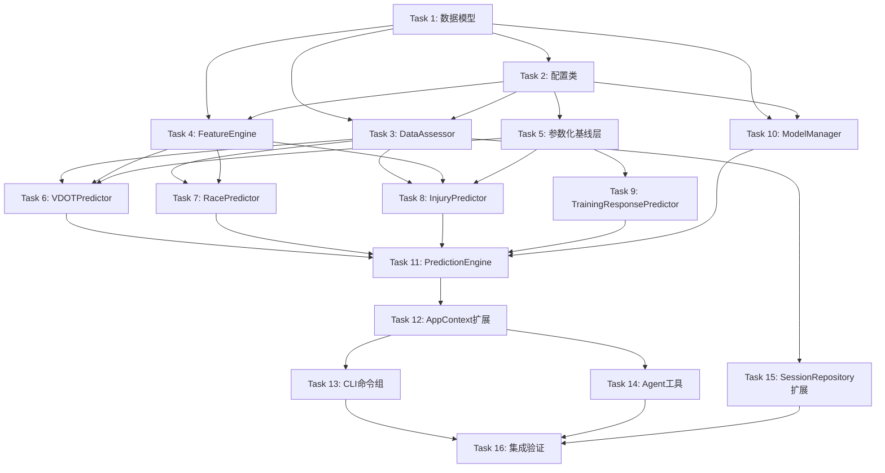

# v0.20.0 ML增强预测 实现计划

> **For agentic workers:** REQUIRED SUB-SKILL: Use superpowers:subagent-driven-development (recommended) or superpowers:executing-plans to implement this plan task-by-task. Steps use checkbox (`- [ ]`) syntax for tracking.

**Goal:** 为数据充足的跑者提供ML增强预测能力（VDOT趋势/比赛成绩/伤病风险），数据不足时自动降级为基础预测，绝不阻塞用户。

**Architecture:** 三层降级架构（ML增强 → 参数化基线 → 基础预测），PredictionEngine作为统一编排入口，FeatureEngine复用已有计算器，DataAssessor评估数据充足性，ModelManager管理模型生命周期。所有核心组件通过AppContext依赖注入。

**Tech Stack:** Python 3.11+ / scikit-learn ≥1.5.0 / scipy ≥1.10.0 / shap ≥0.48.0 / joblib ≥1.3.0 / Polars 0.20+ / Typer + Rich

**Spec Alignment:** 架构设计说明书 v7.1.0 §6 | 需求规格说明书 v8.1 §3.1 | 评审报告 v0.20.0 行动项 A1-A9

---

## 文件结构总览

| 操作 | 文件路径 | 职责 |
|------|----------|------|
| Create | `src/core/prediction/__init__.py` | 模块导出 |
| Create | `src/core/prediction/models.py` | 所有frozen dataclass数据模型 |
| Create | `src/core/prediction/config.py` | PredictionConfig配置类 |
| Create | `src/core/prediction/feature_engine.py` | 特征工程（时序/负荷/身体信号特征提取） |
| Create | `src/core/prediction/data_assessor.py` | 数据充足度评估 |
| Create | `src/core/prediction/baselines/__init__.py` | 基线模块导出 |
| Create | `src/core/prediction/baselines/banister_ir.py` | Banister IR参数化模型 |
| Create | `src/core/prediction/baselines/rule_based_injury.py` | 规则基线伤病模型 |
| Create | `src/core/prediction/baselines/logistic_injury.py` | 逻辑回归伤病模型 |
| Create | `src/core/prediction/vdot_predictor.py` | VDOT趋势预测引擎 |
| Create | `src/core/prediction/race_predictor.py` | 个人化比赛成绩预测 |
| Create | `src/core/prediction/injury_predictor.py` | ML伤病风险预测 |
| Create | `src/core/prediction/training_response_predictor.py` | 训练响应预测 |
| Create | `src/core/prediction/model_manager.py` | 模型生命周期管理 |
| Create | `src/core/prediction/prediction_engine.py` | 预测引擎（编排层，统一入口） |
| Create | `src/cli/commands/predict.py` | predict命令组 |
| Create | `src/cli/handlers/predict_handler.py` | 预测业务逻辑调用层 |
| Modify | `src/core/base/context.py` | 新增prediction_engine等延迟属性 |
| Modify | `src/cli/commands/__init__.py` | 新增predict_app导出 |
| Modify | `src/cli/app.py` | 注册predict命令组 |
| Modify | `src/agents/tools.py` | 新增7个Agent工具 |
| Create | `tests/unit/core/prediction/__init__.py` | 测试模块 |
| Create | `tests/unit/core/prediction/test_models.py` | 数据模型测试 |
| Create | `tests/unit/core/prediction/test_config.py` | 配置测试 |
| Create | `tests/unit/core/prediction/test_feature_engine.py` | 特征工程测试 |
| Create | `tests/unit/core/prediction/test_data_assessor.py` | 数据充足度测试 |
| Create | `tests/unit/core/prediction/test_banister_ir.py` | Banister IR测试 |
| Create | `tests/unit/core/prediction/test_rule_based_injury.py` | 规则基线测试 |
| Create | `tests/unit/core/prediction/test_logistic_injury.py` | 逻辑回归测试 |
| Create | `tests/unit/core/prediction/test_vdot_predictor.py` | VDOT预测器测试 |
| Create | `tests/unit/core/prediction/test_race_predictor.py` | 比赛预测器测试 |
| Create | `tests/unit/core/prediction/test_injury_predictor.py` | 伤病预测器测试 |
| Create | `tests/unit/core/prediction/test_training_response_predictor.py` | 训练响应测试 |
| Create | `tests/unit/core/prediction/test_model_manager.py` | 模型管理器测试 |
| Create | `tests/unit/core/prediction/test_prediction_engine.py` | 预测引擎测试 |

---

## Task 1: 数据模型定义

**Files:** `src/core/prediction/__init__.py`, `src/core/prediction/models.py`, `tests/unit/core/prediction/__init__.py`, `tests/unit/core/prediction/test_models.py`

**Spec Ref:** 架构设计说明书 §6.6 数据模型

- [ ] **Step 1: 创建测试目录和测试文件**

创建 `tests/unit/core/prediction/__init__.py`（空文件）。

编写 `tests/unit/core/prediction/test_models.py`，覆盖所有frozen dataclass的创建和to_dict方法：

- `VDOTFactor`: name/weight/direction/value + to_dict
- `MLPredictionInfo`: model_type/training_samples/feature_count/shap_available/quantile_models + to_dict
- `VDOTPrediction`: 全字段 + prediction_type三种值("ml_enhanced"/"parametric"/"basic") + model_info可选None + to_dict
- `PaceSplit`: segment/pace/pace_seconds + to_dict
- `PaceStrategy`: strategy_type/splits + to_dict
- `PersonalizationInfo`: runner_type/riegel_exponent/correction_factor/race_samples_count/pre_race_adjustment + to_dict
- `RacePredictionResult`: 全字段 + prediction_type("personalized"/"standard") + 可选字段 + to_dict
- `RiskTimePoint`: days_ahead/risk_probability/risk_level + to_dict
- `RiskFactor`: name/contribution/current_value/threshold_value/direction + to_dict
- `AcuteLoadRisk`: atl_ctl_ratio/weekly_load_change_pct/risk_contribution + to_dict
- `ChronicRisk`: tsb_consecutive_low_days/resting_hr_deviation_pct/risk_contribution + to_dict
- `BodySignalRisk`: fatigue_score/recovery_status/active_alerts/risk_contribution + to_dict
- `InjuryRiskPrediction`: 全字段 + prediction_type三种值 + 可选字段 + to_dict
- `PredictionRecord`: prediction_date/prediction_type/predicted_value/predicted_unit/actual_value可选/deviation_pct可选/prediction_method/model_version可选/confidence + to_dict（完整Schema对齐架构文档§6.5.6）
- `TrainingResponse`: 全字段 + prediction_type("parametric"/"basic") + to_dict
- `InjuryReportResult`: injury_id/injury_type/severity/date/label_type/created_at/success + to_dict
- `InjuryLabel`: injury_id/injury_type/severity/start_date/end_date可选/label_type/affected_sessions/notes + to_dict
- `SufficiencyDimension`: name/current_value/target_value/is_met/progress_pct + to_dict
- `DataSufficiencyReport`: prediction_type/is_sufficient/overall_progress_pct/dimensions/advice + to_dict
- `PredictionStatusReport`: vdot_status/race_status/injury_status/overall_ready_count/advice + to_dict
- `ModelMetadata`: model_type/version/trained_at/training_samples/feature_count/validation_error/model_algorithm/sklearn_version/quantile_models/ensemble_weights可选 + to_dict
- `ModelTrainingResult`: model_type/version/training_samples/validation_error/training_duration_seconds/success/message + to_dict
- `ModelManagementResult`: action/model_type/success/message/details + to_dict
- `ModelStatus`: model_type/version/trained_at/training_samples/validation_error/is_available + to_dict

**关键约束：**
- 所有dataclass必须使用 `frozen=True`
- `data_quality` 字段类型为 `DataQuality`（从 `src.core.body_signal.models` 导入，复用现有枚举保持一致性，值为 DataQuality.SUFFICIENT / DataQuality.INSUFFICIENT / DataQuality.EMPTY）
- `prediction_type` 字段类型为 `str`，取值严格为架构文档定义的三段式
- 所有dataclass必须实现 `to_dict()` 方法
- `InjuryRiskPrediction` 的 `top_risk_factors` 和 `recommendations` 使用 `field(default_factory=list)`
- `PredictionRecord` 需包含架构文档§6.5.6定义的完整字段：prediction_date/prediction_type/predicted_value/predicted_unit/actual_value/deviation_pct/prediction_method/model_version/confidence

- [ ] **Step 2: 运行测试确认失败**

```bash
uv run pytest tests/unit/core/prediction/test_models.py -v
```

Expected: FAIL with ModuleNotFoundError

- [ ] **Step 3: 创建模块目录和__init__.py**

创建 `src/core/prediction/__init__.py`：

```python
from src.core.prediction.prediction_engine import PredictionEngine

__all__ = ["PredictionEngine"]
```

- [ ] **Step 4: 实现数据模型**

创建 `src/core/prediction/models.py`，严格按照架构设计说明书§6.6的数据模型定义实现所有frozen dataclass。

**关键实现要点：**
- `VDOTPrediction.confidence_interval` 类型为 `tuple[float, float]`
- `InjuryRiskPrediction.risk_timeline` 类型为 `list[RiskTimePoint]`
- `InjuryRiskPrediction.acute_load_risk` / `chronic_risk` / `body_signal_risk` 为可选
- `RacePredictionResult.pace_strategy` / `personalization_info` 为可选
- `VDOTPrediction.model_info` 为可选
- `ModelMetadata.ensemble_weights` 为可选 `dict[str, float] | None`
- `ModelManagementResult.details` 使用 `field(default_factory=dict)`

- [ ] **Step 5: 运行测试确认通过**

```bash
uv run pytest tests/unit/core/prediction/test_models.py -v
```

Expected: PASS

- [ ] **Step 6: 提交**

```bash
git add src/core/prediction/__init__.py src/core/prediction/models.py tests/unit/core/prediction/__init__.py tests/unit/core/prediction/test_models.py
git commit -m "feat(prediction): add v0.20.0 data models"
```

---

## Task 2: PredictionConfig配置类

**Files:** `src/core/prediction/config.py`, `tests/unit/core/prediction/test_config.py`

**Spec Ref:** 架构设计说明书 §6.7 配置Schema定义

- [ ] **Step 1: 编写配置测试**

编写 `tests/unit/core/prediction/test_config.py`，覆盖：

- 默认值验证（所有21个配置项的默认值与架构文档一致）
- `__post_init__` 校验逻辑：
  - `gb_n_estimators < 10` → ValueError
  - `gb_learning_rate == 0.0` → ValueError
  - `gb_learning_rate > 1.0` → ValueError
  - `gb_max_depth < 1` → ValueError
  - `vdot_min_months < 6` → ValueError
  - `risk_warning_threshold == 0.0` → ValueError
  - `risk_warning_threshold > 1.0` → ValueError
- `to_dict()` 方法
- `from_dict()` 方法（部分字段覆盖，其余用默认值）
- `from_env()` 方法（使用monkeypatch设置环境变量 `NANOBOT_PREDICTION_*`）

- [ ] **Step 2: 运行测试确认失败**

```bash
uv run pytest tests/unit/core/prediction/test_config.py -v
```

- [ ] **Step 3: 实现PredictionConfig**

创建 `src/core/prediction/config.py`，严格按照架构设计说明书§6.7实现。

**关键实现要点：**
- 使用 `@dataclass(frozen=True)`（严格遵循架构文档§6.7定义，与现有AppConfig/LLMConfig/BodySignalConfig保持一致）
- 21个配置项及默认值与架构文档完全一致
- `__post_init__` 校验5个关键参数
- `to_dict()` 返回 `dict[str, Any]`
- `from_dict(cls, d)` 过滤无效key，仅接受 `__dataclass_fields__` 中的key
- `from_env(cls)` 读取 `NANOBOT_PREDICTION_` 前缀的环境变量
- `pre_race_fatigue_adjustment_range` 和 `pre_race_recovery_adjustment_range` 类型为 `tuple[float, float]`，`to_dict` 时转为list

- [ ] **Step 4: 运行测试确认通过**

```bash
uv run pytest tests/unit/core/prediction/test_config.py -v
```

- [ ] **Step 5: 提交**

```bash
git add src/core/prediction/config.py tests/unit/core/prediction/test_config.py
git commit -m "feat(prediction): add PredictionConfig with validation and env support"
```

---

## Task 3: DataAssessor数据充足度评估器

**Files:** `src/core/prediction/data_assessor.py`, `tests/unit/core/prediction/test_data_assessor.py`

**Spec Ref:** 架构设计说明书 §6.5.2 数据充足度评估器

**前置依赖:** Task 1 (models.py), Task 2 (config.py)

- [ ] **Step 1: 编写DataAssessor测试**

Mock `SessionRepository`，需新增以下方法（当前SessionRepository不存在这些方法，DataAssessor通过 `_safe_call` 防御性调用）：

- `get_total_session_count()` → int
- `get_data_span_months()` → float
- `get_race_session_count()` → int
- `get_hr_completeness()` → float

测试用例：

- VDOT充足（500条/20月）→ is_sufficient=True
- VDOT不足（100条/10月）→ is_sufficient=False
- VDOT参数化范围（300条/15月）→ is_sufficient=False, progress>50%
- Race充足（5次比赛）→ is_sufficient=True
- Race不足（1次比赛）→ is_sufficient=False
- Injury充足（400条/20月/心率0.9）→ is_sufficient=True
- Injury不足（50条/6月/心率0.3）→ is_sufficient=False
- `get_full_status()` 返回 PredictionStatusReport
- `get_accumulation_advice("vdot")` 返回建议列表
- 未知prediction_type → ValueError
- SessionRepository方法不存在/异常 → 返回默认值，不抛异常

- [ ] **Step 2: 运行测试确认失败**

```bash
uv run pytest tests/unit/core/prediction/test_data_assessor.py -v
```

- [ ] **Step 3: 实现DataAssessor**

创建 `src/core/prediction/data_assessor.py`。

**关键实现要点：**
- 构造函数接收 `session_repo: Any` 和 `config: PredictionConfig | None = None`
- `assess_sufficiency(prediction_type)` 分发到 `_assess_vdot()` / `_assess_race()` / `_assess_injury()`
- `_assess_vdot()`: 评估 time_span_months + total_records 两个维度
  - 充足标准：months >= vdot_min_months AND records >= vdot_min_records
  - 参数化范围：records >= vdot_parametric_min_records AND records < vdot_min_records
- `_assess_race()`: 评估 race_count 一个维度
  - 充足标准：race_count >= race_min_races
- `_assess_injury()`: 评估 time_span_months + total_records + hr_completeness 三个维度
  - 充足标准：months >= injury_min_months AND records >= injury_min_records AND hr >= injury_hr_completeness
- `_safe_call(method_name, default)`: 防御性调用，异常时返回默认值
- 建议文本参考架构文档§6.20的CLI输出示例

- [ ] **Step 4: 运行测试确认通过**

```bash
uv run pytest tests/unit/core/prediction/test_data_assessor.py -v
```

- [ ] **Step 5: 提交**

```bash
git add src/core/prediction/data_assessor.py tests/unit/core/prediction/test_data_assessor.py
git commit -m "feat(prediction): add DataAssessor for data sufficiency evaluation"
```

---

## Task 4: FeatureEngine特征工程

**Files:** `src/core/prediction/feature_engine.py`, `tests/unit/core/prediction/test_feature_engine.py`

**Spec Ref:** 架构设计说明书 §6.5.1 特征工程

**前置依赖:** Task 1 (models.py), Task 2 (config.py)

- [ ] **Step 1: 编写FeatureEngine测试**

Mock依赖：`SessionRepository`, `TrainingLoadAnalyzer`, `HRVAnalyzer`, `BodySignalEngine`, `VDOTCalculator`

测试用例：

- `extract_vdot_features(days=30)` 返回 FeatureMatrix，feature_names ≥ 12个
- `extract_injury_features(days=30)` 返回 FeatureMatrix，feature_names ≥ 8个
- `extract_race_features()` 返回 FeatureMatrix
- `get_feature_names("vdot")` 返回list，长度 ≥ 12
- `get_feature_names("injury")` 返回list，长度 ≥ 8
- `get_feature_names("race")` 返回list
- 依赖异常时（如TrainingLoadAnalyzer抛异常）→ 返回默认值0.0的FeatureMatrix
- `invalidate_cache()` 清空缓存
- 同日缓存命中（第二次调用返回缓存结果）

- [ ] **Step 2: 运行测试确认失败**

```bash
uv run pytest tests/unit/core/prediction/test_feature_engine.py -v
```

- [ ] **Step 3: 实现FeatureEngine**

创建 `src/core/prediction/feature_engine.py`。

**关键实现要点：**

FeatureMatrix dataclass（架构文档§6.5.1使用VDOTFeatureMatrix/RaceFeatureMatrix/InjuryFeatureMatrix三种类型，实现时统一为FeatureMatrix + feature_type字段区分）：
```python
@dataclass
class FeatureMatrix:
    features: np.ndarray
    feature_names: list[str]
    feature_type: str  # "vdot" / "race" / "injury"
    dates: list[str] = field(default_factory=list)
    data_quality: str = "sufficient"
```

VDOT特征（12个，对应架构文档§6.5.1表格）：
1. `weekly_volume_km` - 最近7天总跑量
2. `volume_change_rate` - 本周vs上周跑量变化率
3. `month_sin` - 月份周期编码sin
4. `month_cos` - 月份周期编码cos
5. `ctl_value` - 当前CTL
6. `tsb_value` - 当前TSB
7. `atl_ctl_ratio` - ATL/CTL比率
8. `load_ramp_rate` - 周负荷增长率
9. `high_intensity_pct` - 高强度训练占比
10. `avg_intensity_factor` - 平均强度因子
11. `fatigue_score` - 当前疲劳度（来自BodySignalEngine）
12. `resting_hr_deviation` - 静息心率偏差（来自HRVAnalyzer）

Injury特征（8个）：
1. `atl_ctl_ratio`
2. `weekly_load_change_pct`
3. `tsb_consecutive_low_days`
4. `tsb_trend_slope`
5. `resting_hr_deviation_pct`
6. `resting_hr_7d_trend`
7. `hrv_rmssd_trend`
8. `hrv_sdnn_deviation`

Race特征（5个）：
1. `current_vdot`
2. `riegel_exponent`
3. `correction_factor`
4. `pre_race_fatigue`
5. `pre_race_recovery`

**复用关系：** 消费 `TrainingLoadAnalyzer`、`HRVAnalyzer`、`BodySignalEngine`、`SessionRepository`、`VDOTCalculator` 的计算结果，不重复实现计算逻辑。每个特征提取使用 `_safe_float()` 防御性调用，异常时返回0.0。

**缓存机制：** 同日缓存，key格式 `{type}_features_{days}_{date}`，`invalidate_cache()` 清空。

- [ ] **Step 4: 运行测试确认通过**

```bash
uv run pytest tests/unit/core/prediction/test_feature_engine.py -v
```

- [ ] **Step 5: 提交**

```bash
git add src/core/prediction/feature_engine.py tests/unit/core/prediction/test_feature_engine.py
git commit -m "feat(prediction): add FeatureEngine with VDOT/race/injury feature extraction"
```

---

## Task 5: 参数化基线层（baselines/）

**Files:** `src/core/prediction/baselines/__init__.py`, `src/core/prediction/baselines/banister_ir.py`, `src/core/prediction/baselines/rule_based_injury.py`, `src/core/prediction/baselines/logistic_injury.py`, `tests/unit/core/prediction/test_banister_ir.py`, `tests/unit/core/prediction/test_rule_based_injury.py`, `tests/unit/core/prediction/test_logistic_injury.py`

**Spec Ref:** 架构设计说明书 §6.2 ADR-004/ADR-006, §6.5.3/§6.5.5

**前置依赖:** Task 2 (config.py)

- [ ] **Step 1: 编写baselines测试**

**BanisterIRModel 测试：**
- 默认参数验证（tau_fitness=42.0, tau_fatigue=10.0, k1=0.0038, k2=0.043）
- `predict()` 基本预测（返回float，>0）
- `predict(days_ahead=7)` 未来预测
- `fit()` + `predict()` 拟合后预测（使用合成数据200条）
- 拟合参数约束验证（在文献值±30%范围内）

**RuleBasedInjuryBaseline 测试：**
- 低风险场景（ACWR=1.1, 单调性=1.5, 连续高强度=1天, 静息心率偏差=3%）→ risk_level="low"
- 中风险场景（ACWR=1.4, 单调性=1.8, 连续高强度=3天, 静息心率偏差=8%）
- 高风险场景（ACWR=1.8, 单调性=2.5, 连续高强度=5天, 静息心率偏差=15%）→ risk_level="high"
- 边界值测试（ACWR=1.5 恰好触发高风险）

**LogisticInjuryModel 测试：**
- `predict_proba()` 未拟合时返回默认概率（0.0-1.0之间）
- `fit()` + `predict_proba()` 拟合后预测概率
- 使用合成数据150条（8维特征）

- [ ] **Step 2: 运行测试确认失败**

```bash
uv run pytest tests/unit/core/prediction/test_banister_ir.py tests/unit/core/prediction/test_rule_based_injury.py tests/unit/core/prediction/test_logistic_injury.py -v
```

- [ ] **Step 3: 创建baselines/__init__.py**

```python
from src.core.prediction.baselines.banister_ir import BanisterIRModel
from src.core.prediction.baselines.logistic_injury import LogisticInjuryModel
from src.core.prediction.baselines.rule_based_injury import RuleBasedInjuryBaseline

__all__ = ["BanisterIRModel", "LogisticInjuryModel", "RuleBasedInjuryBaseline"]
```

- [ ] **Step 4: 实现BanisterIRModel**

创建 `src/core/prediction/baselines/banister_ir.py`。

**关键实现要点：**

```python
@dataclass
class BanisterIRModel:
    tau_fitness: float = 42.0
    tau_fatigue: float = 10.0
    k1: float = 0.0038
    k2: float = 0.043
    _fitted: bool = field(default=False, init=False, repr=False)
```

- `predict(training_stress, base_vdot, days_ahead=0)` → float
  - 公式：VDOT(t) = VDOT_base + Σ[k1 * stress_i * exp(-(t-t_i)/tau_fitness)] - Σ[k2 * stress_i * exp(-(t-t_i)/tau_fatigue)]
  - 使用numpy向量化计算
- `fit(training_stress, vdot_values, config=None)` → None
  - 使用 `scipy.optimize.minimize` (L-BFGS-B)
  - 参数约束：k1∈[0.0027, 0.0049], k2∈[0.030, 0.056], tau_fitness∈[30, 55], tau_fatigue∈[7, 14]
  - 目标函数：MSE(predicted, actual)
  - 拟合成功后设置 `_fitted = True`

- [ ] **Step 5: 实现RuleBasedInjuryBaseline**

创建 `src/core/prediction/baselines/rule_based_injury.py`。

**关键实现要点：**
- `assess(acwr, training_monotony, consecutive_hard_days, resting_hr_deviation_pct)` → dict
  - 返回 `{"risk_score": float, "risk_level": str, "risk_factors": list[str]}`
  - 规则（对应架构文档§6.5.5 L1规则基线）：
    - ACWR > 1.5 → 高风险，贡献40分
    - 训练单调性 > 2.0 → 中风险，贡献25分
    - 连续高强度训练 > 3天 → 中风险，贡献20分
    - 静息心率偏差 > 10% → 中风险，贡献15分
  - risk_level: score<40→"low", 40≤score<60→"medium", score≥60→"high"

- [ ] **Step 6: 实现LogisticInjuryModel**

创建 `src/core/prediction/baselines/logistic_injury.py`。

**关键实现要点：**
- 构造函数接收 `config: PredictionConfig | None = None`
- 内部使用 `sklearn.linear_model.LogisticRegression(penalty='l2', C=0.1, class_weight='balanced', max_iter=1000)`
- 内部使用 `sklearn.calibration.CalibratedClassifierCV(method='isotonic', cv=3)`
- `fit(X, y)` → None：训练逻辑回归 + 校准
- `predict_proba(X)` → float：返回正类概率（0-1）
- 未拟合时返回默认概率0.1

- [ ] **Step 7: 运行测试确认通过**

```bash
uv run pytest tests/unit/core/prediction/test_banister_ir.py tests/unit/core/prediction/test_rule_based_injury.py tests/unit/core/prediction/test_logistic_injury.py -v
```

- [ ] **Step 8: 提交**

```bash
git add src/core/prediction/baselines/ tests/unit/core/prediction/test_banister_ir.py tests/unit/core/prediction/test_rule_based_injury.py tests/unit/core/prediction/test_logistic_injury.py
git commit -m "feat(prediction): add parametric baseline layer (BanisterIR, RuleBased, Logistic)"
```

---

## Task 6: VDOTPredictor VDOT趋势预测引擎

**Files:** `src/core/prediction/vdot_predictor.py`, `tests/unit/core/prediction/test_vdot_predictor.py`

**Spec Ref:** 架构设计说明书 §6.5.3 VDOT趋势预测引擎

**前置依赖:** Task 3 (DataAssessor), Task 4 (FeatureEngine), Task 5 (baselines)

- [ ] **Step 1: 编写VDOTPredictor测试**

Mock依赖：`FeatureEngine`, `DataAssessor`, `ModelManager`, `RacePredictionEngine`, `BanisterIRModel`

测试用例：

- ML增强预测（数据充足+模型存在）→ VDOTPrediction(prediction_type="ml_enhanced")
- ML增强预测（数据充足+模型不存在，自动训练）→ VDOTPrediction(prediction_type="ml_enhanced")
- 参数化基线预测（数据中等200-400条）→ VDOTPrediction(prediction_type="parametric")
- 基础预测降级（数据不足<200条）→ VDOTPrediction(prediction_type="basic")
- `train_model()` 返回 ModelTrainingResult
- `get_feature_importance()` 返回 list[VDOTFactor]
- 模型文件损坏时自动重训（ModelManager.load_model抛异常）
- SHAP超时时降级为sklearn内置特征重要性（shap_available=False）
- 特征提取部分失败时继续预测（data_quality="insufficient"）

- [ ] **Step 2: 运行测试确认失败**

```bash
uv run pytest tests/unit/core/prediction/test_vdot_predictor.py -v
```

- [ ] **Step 3: 实现VDOTPredictor**

创建 `src/core/prediction/vdot_predictor.py`。

**关键实现要点：**

构造函数：
```python
class VDOTPredictor:
    def __init__(
        self,
        feature_engine: Any,
        data_assessor: Any,
        model_manager: Any,
        race_engine: Any,
        banister_model: Any,
        config: PredictionConfig | None = None,
    ) -> None:
```

`predict(days)` 核心流程（对应架构文档§6.5.3流程图）：
1. `data_assessor.assess_sufficiency("vdot")`
2. 充足(400+)→提取特征→加载/训练ML模型→分位数回归预测(p10/p50/p90)→SHAP分析→返回ml_enhanced
3. 中等(200-400)→BanisterIRModel.predict()→返回parametric
4. 不足(<200)→race_engine.predict_vdot_at_race()→返回basic

ML模型选型：`GradientBoostingRegressor(loss='quantile', alpha=0.1/0.5/0.9, n_estimators=100, max_depth=5)`

SHAP分析：带超时降级（参考架构文档§6.19 SHAP降级策略）
- L1: 完整SHAP TreeExplainer
- L2: 采样SHAP (max_evals=100)
- L3: sklearn内置feature_importances_（超时/异常时降级）

`train_model()`: 训练3个分位数模型(p10/p50/p90) + SHAP分析 + 保存模型

`get_feature_importance()`: 返回list[VDOTFactor]，包含name/weight/direction/value

- [ ] **Step 4: 运行测试确认通过**

```bash
uv run pytest tests/unit/core/prediction/test_vdot_predictor.py -v
```

- [ ] **Step 5: 提交**

```bash
git add src/core/prediction/vdot_predictor.py tests/unit/core/prediction/test_vdot_predictor.py
git commit -m "feat(prediction): add VDOTPredictor with three-tier degradation"
```

---

## Task 7: RacePredictor 个人化比赛成绩预测

**Files:** `src/core/prediction/race_predictor.py`, `tests/unit/core/prediction/test_race_predictor.py`

**Spec Ref:** 架构设计说明书 §6.5.4 个人化比赛成绩预测

**前置依赖:** Task 3 (DataAssessor), Task 4 (FeatureEngine)

- [ ] **Step 1: 编写RacePredictor测试**

Mock依赖：`FeatureEngine`, `DataAssessor`, `ModelManager`, `RacePredictionEngine`, `BodySignalEngine`

测试用例：

- 个人化预测（比赛记录≥3次）→ RacePredictionResult(prediction_type="personalized")
- 标准预测降级（比赛记录<3次）→ RacePredictionResult(prediction_type="standard")
- `fit_riegel_curve()` 拟合个人化Riegel指数
- `learn_personalization()` 学习耐力型/速度型/均衡型标签
- 赛前身体状态修正（BodySignalEngine可用）→ 疲劳高下调/恢复GREEN上调
- 赛前身体状态不可用 → 跳过修正
- `record_prediction(record)` 记录预测结果
- 配速策略生成（全马→5km分段）

- [ ] **Step 2: 运行测试确认失败**

```bash
uv run pytest tests/unit/core/prediction/test_race_predictor.py -v
```

- [ ] **Step 3: 实现RacePredictor**

创建 `src/core/prediction/race_predictor.py`。

**关键实现要点：**

构造函数：
```python
class RacePredictor:
    def __init__(
        self,
        feature_engine: Any,
        data_assessor: Any,
        model_manager: Any,
        race_engine: Any,
        body_signal_engine: Any,
        config: PredictionConfig | None = None,
    ) -> None:
```

`predict(distance_km, race_date)` 核心流程（对应架构文档§6.5.4流程图）：
1. `data_assessor.assess_sufficiency("race")`
2. 比赛记录≥3次→fit_riegel_curve()→learn_personalization()→赛前状态修正→返回personalized
3. 比赛记录<3次→race_engine.predict()→返回standard

Riegel曲线拟合：`scipy.optimize.curve_fit`
- 标准公式：T2 = T1 × (D2/D1)^1.06
- 个人化拟合：T2 = T1 × (D2/D1)^α，α∈[0.95, 1.15]

个人修正系数学习：`sklearn.linear_model.Ridge`
- 输入：比赛距离、VDOT、训练周数、CTL
- 输出：个人修正系数 + 耐力型/速度型/均衡型标签

赛前状态修正：
- 疲劳度高 → 预测成绩下调2-5%（config.pre_race_fatigue_adjustment_range）
- 恢复状态GREEN → 预测成绩上调1-3%（config.pre_race_recovery_adjustment_range）

配速策略：根据runner_type生成
- endurance → negative_split
- speed → conservative
- balanced → even

- [ ] **Step 4: 运行测试确认通过**

```bash
uv run pytest tests/unit/core/prediction/test_race_predictor.py -v
```

- [ ] **Step 5: 提交**

```bash
git add src/core/prediction/race_predictor.py tests/unit/core/prediction/test_race_predictor.py
git commit -m "feat(prediction): add RacePredictor with personalization and Riegel curve"
```

---

## Task 8: InjuryPredictor ML伤病风险预测

**Files:** `src/core/prediction/injury_predictor.py`, `tests/unit/core/prediction/test_injury_predictor.py`

**Spec Ref:** 架构设计说明书 §6.5.5 ML伤病风险预测

**前置依赖:** Task 3 (DataAssessor), Task 4 (FeatureEngine), Task 5 (baselines)

- [ ] **Step 1: 编写InjuryPredictor测试**

Mock依赖：`FeatureEngine`, `DataAssessor`, `ModelManager`, `InjuryRiskAnalyzer`, `RuleBasedInjuryBaseline`, `LogisticInjuryModel`

测试用例：

- ML增强预测（数据充足300+条）→ InjuryRiskPrediction(prediction_type="ml_enhanced")
- 参数化基线预测（数据中等100-300条）→ InjuryRiskPrediction(prediction_type="parametric")
- 基础预测降级（数据不足<100条）→ InjuryRiskPrediction(prediction_type="basic")
- `train_model()` 返回 ModelTrainingResult
- `get_risk_timeline(days=21)` 返回 list[RiskTimePoint]（7/14/21天）
- `get_risk_factors()` 返回 list[RiskFactor]
- 集成预测：逻辑回归概率×0.4 + GBDT概率×0.6
- 风险预警阈值（probability>0.6）→ recommendations包含预警建议
- 伤病标签读写（injury_labels目录）

- [ ] **Step 2: 运行测试确认失败**

```bash
uv run pytest tests/unit/core/prediction/test_injury_predictor.py -v
```

- [ ] **Step 3: 实现InjuryPredictor**

创建 `src/core/prediction/injury_predictor.py`。

**关键实现要点：**

构造函数：
```python
class InjuryPredictor:
    def __init__(
        self,
        feature_engine: Any,
        data_assessor: Any,
        model_manager: Any,
        injury_analyzer: Any,
        rule_baseline: Any,
        logistic_model: Any,
        config: PredictionConfig | None = None,
    ) -> None:
```

`predict(days)` 核心流程（对应架构文档§6.5.5流程图）：
1. `data_assessor.assess_sufficiency("injury")`
2. 充足(300+)→提取特征→加载/训练GBDT→集成预测(LR×0.4+GBDT×0.6)→风险时间线→SHAP→返回ml_enhanced
3. 中等(100-300)→LogisticInjuryModel→返回parametric
4. 不足(<100)→RuleBasedInjuryBaseline→返回basic

ML模型选型（分层架构）：
- L1 规则基线：RuleBasedInjuryBaseline（无需训练数据）
- L2 逻辑回归：LogisticRegression(penalty='l2', C=0.1, class_weight='balanced') + CalibratedClassifierCV
- L3 GBDT增强：GradientBoostingClassifier(n_estimators=50, max_depth=3, learning_rate=0.05, min_samples_leaf=30)
- 集成策略：LR概率×0.4 + GBDT概率×0.6

风险时间线：基于当前特征 + 未来负荷假设，预测7/14/21天风险概率

伤病标签体系：
- confirmed: 用户通过report_injury工具报告
- suspected: 训练中断>7天 + 疲劳评分>70
- unconfirmed: 其他异常模式
- 存储位置：`~/.nanobot-runner/injury_labels/{label_type}/{injury_id}.json`

- [ ] **Step 4: 运行测试确认通过**

```bash
uv run pytest tests/unit/core/prediction/test_injury_predictor.py -v
```

- [ ] **Step 5: 提交**

```bash
git add src/core/prediction/injury_predictor.py tests/unit/core/prediction/test_injury_predictor.py
git commit -m "feat(prediction): add InjuryPredictor with layered ML architecture"
```

---

## Task 9: TrainingResponsePredictor 训练响应预测

**Files:** `src/core/prediction/training_response_predictor.py`, `tests/unit/core/prediction/test_training_response_predictor.py`

**Spec Ref:** 架构设计说明书 §6.5.7 预测引擎（predict_training_response方法）

**前置依赖:** Task 5 (BanisterIRModel)

- [ ] **Step 1: 编写TrainingResponsePredictor测试**

Mock依赖：`BanisterIRModel`

测试用例：

- 预测tempo跑45min高强度的响应 → TrainingResponse(prediction_type="parametric")
- 预测easy跑60min低强度的响应
- 预测interval跑30min极高强度的响应
- BanisterIRModel异常时降级为basic预测
- 各字段合理性验证（vdot_impact>0, fatigue_impact>0, recovery_hours>0）

- [ ] **Step 2: 运行测试确认失败**

```bash
uv run pytest tests/unit/core/prediction/test_training_response_predictor.py -v
```

- [ ] **Step 3: 实现TrainingResponsePredictor**

创建 `src/core/prediction/training_response_predictor.py`。

**关键实现要点：**

构造函数：
```python
class TrainingResponsePredictor:
    def __init__(
        self,
        banister_model: Any,
        config: PredictionConfig | None = None,
    ) -> None:
```

`predict(session_type, duration_min, intensity)` → TrainingResponse
- session_type: "easy"/"tempo"/"interval"/"long"/"recovery"
- duration_min: 训练时长（分钟）
- intensity: "low"/"medium"/"high"/"very_high"
- 使用BanisterIRModel计算fitness_delta和fatigue_delta
- 基于经验公式估算vdot_impact、fatigue_impact、recovery_hours、injury_risk_delta
- BanisterIRModel异常时降级为basic（使用简单线性估算）

- [ ] **Step 4: 运行测试确认通过**

```bash
uv run pytest tests/unit/core/prediction/test_training_response_predictor.py -v
```

- [ ] **Step 5: 提交**

```bash
git add src/core/prediction/training_response_predictor.py tests/unit/core/prediction/test_training_response_predictor.py
git commit -m "feat(prediction): add TrainingResponsePredictor"
```

---

## Task 10: ModelManager 模型生命周期管理

**Files:** `src/core/prediction/model_manager.py`, `tests/unit/core/prediction/test_model_manager.py`

**Spec Ref:** 架构设计说明书 §6.5.6 模型管理器

**前置依赖:** Task 1 (models.py), Task 2 (config.py)

- [ ] **Step 1: 编写ModelManager测试**

使用tmp_path作为模型存储目录。

测试用例：

- `get_model_status("vdot_predictor")` 模型不存在 → is_available=False
- `save_model()` + `load_model()` 往返测试
- `get_model_status()` 模型存在 → is_available=True
- `train_model("vdot_predictor")` 返回 ModelTrainingResult
- `rollback_model("vdot_predictor", "v1")` 回滚成功
- 模型文件损坏时（写入无效joblib）→ load_model抛异常
- sklearn版本不兼容时自动重训
- `check_auto_update()` 新数据不足50条时不触发
- predictions.parquet 读写测试
- 模型元数据JSON读写测试

- [ ] **Step 2: 运行测试确认失败**

```bash
uv run pytest tests/unit/core/prediction/test_model_manager.py -v
```

- [ ] **Step 3: 实现ModelManager**

创建 `src/core/prediction/model_manager.py`。

**关键实现要点：**

构造函数：
```python
class ModelManager:
    def __init__(
        self,
        models_dir: Path,
        config: PredictionConfig | None = None,
    ) -> None:
```

模型存储结构（对应架构文档§6.5.6）：
```
models_dir/
├── vdot_predictor/
│   ├── model_v1.joblib
│   ├── metadata_v1.json
│   └── feature_importance_v1.json
├── vdot_predictor_banister/
│   ├── params_v1.json
│   └── metadata_v1.json
├── race_predictor/
│   ├── model_v1.joblib
│   ├── metadata_v1.json
│   └── riegel_params_v1.json
├── injury_predictor/
│   ├── gbdt_model_v1.joblib
│   ├── lr_model_v1.joblib
│   ├── metadata_v1.json
│   └── risk_thresholds_v1.json
└── prediction_history/
    └── predictions.parquet
```

核心方法：
- `get_model_status(model_type)` → ModelStatus
- `load_model(model_type)` → Any（joblib加载 + sklearn版本校验）
- `save_model(model_type, model, metadata)` → None
- `train_model(model_type)` → ModelTrainingResult
- `rollback_model(model_type, version)` → bool
- `check_auto_update()` → None（检查增量学习触发条件）
- `record_prediction(record)` → None（写入predictions.parquet）

模型元数据格式：ModelMetadata（JSON存储）
- 记录sklearn版本，加载时校验兼容性
- 版本不兼容时自动重训

增量学习策略：新数据≥50条时自动触发（config.incremental_update_threshold）

- [ ] **Step 4: 运行测试确认通过**

```bash
uv run pytest tests/unit/core/prediction/test_model_manager.py -v
```

- [ ] **Step 5: 提交**

```bash
git add src/core/prediction/model_manager.py tests/unit/core/prediction/test_model_manager.py
git commit -m "feat(prediction): add ModelManager for model lifecycle management"
```

---

## Task 11: PredictionEngine 预测引擎（编排层）

**Files:** `src/core/prediction/prediction_engine.py`, `tests/unit/core/prediction/test_prediction_engine.py`

**Spec Ref:** 架构设计说明书 §6.5.7 预测引擎

**前置依赖:** Task 6-10 (所有Predictor和ModelManager)

- [ ] **Step 1: 编写PredictionEngine测试**

Mock所有Predictor和DataAssessor。

测试用例：

- `predict_vdot_trend(days=30)` 委托给VDOTPredictor
- `predict_race_result(distance_km=42.195, race_date="2026-12-01")` 委托给RacePredictor
- `predict_injury_risk(days=21)` 委托给InjuryPredictor
- `predict_training_response(session_type="tempo", duration_min=45, intensity="high")` 委托给TrainingResponsePredictor
- `report_injury(injury_type="overuse", severity="moderate", date="2026-05-01")` 返回InjuryReportResult
- `check_prediction_status()` 返回PredictionStatusReport
- `manage_model(action="train", model_type="vdot")` 委托给ModelManager
- 同日缓存机制（第二次调用返回缓存）
- `invalidate_cache()` 清空缓存
- 未知action → ValueError

- [ ] **Step 2: 运行测试确认失败**

```bash
uv run pytest tests/unit/core/prediction/test_prediction_engine.py -v
```

- [ ] **Step 3: 实现PredictionEngine**

创建 `src/core/prediction/prediction_engine.py`。

**关键实现要点：**

构造函数：
```python
class PredictionEngine:
    def __init__(
        self,
        vdot_predictor: Any,
        race_predictor: Any,
        injury_predictor: Any,
        training_response_predictor: Any,
        data_assessor: Any,
        model_manager: Any,
    ) -> None:
```

核心方法（对应架构文档§6.5.7接口表）：
- `predict_vdot_trend(days)` → VDOTPrediction
- `predict_race_result(distance_km, race_date)` → RacePredictionResult
- `predict_injury_risk(days)` → InjuryRiskPrediction
- `predict_training_response(session_type, duration_min, intensity)` → TrainingResponse
- `report_injury(injury_type, severity, date)` → InjuryReportResult
- `check_prediction_status()` → PredictionStatusReport
- `manage_model(action, model_type)` → ModelManagementResult

缓存机制（对应架构文档§6.15）：
```python
_cache_date: str | None = None
_cache: dict[str, Any] = {}

def _get_cache(self, key: str) -> Any | None:
    today = date.today().isoformat()
    if self._cache_date != today:
        self._cache.clear()
        self._cache_date = today
    return self._cache.get(key)

def _set_cache(self, key: str, value: Any) -> None:
    today = date.today().isoformat()
    if self._cache_date != today:
        self._cache.clear()
        self._cache_date = today
    self._cache[key] = value
```

`report_injury()` 实现：
- 生成injury_id（格式：`inj_{date}_{seq}`）
- 创建InjuryLabel（label_type="confirmed"）
- 保存到 `~/.nanobot-runner/injury_labels/confirmed/{injury_id}.json`
- 返回InjuryReportResult

`manage_model()` action映射：
- "train" → model_manager.train_model()
- "status" → model_manager.get_model_status()
- "rollback" → model_manager.rollback_model()

- [ ] **Step 4: 运行测试确认通过**

```bash
uv run pytest tests/unit/core/prediction/test_prediction_engine.py -v
```

- [ ] **Step 5: 提交**

```bash
git add src/core/prediction/prediction_engine.py tests/unit/core/prediction/test_prediction_engine.py
git commit -m "feat(prediction): add PredictionEngine as unified orchestration entry"
```

---

## Task 12: AppContext扩展

**Files:** 修改 `src/core/base/context.py`

**Spec Ref:** 架构设计说明书 §6.8 AppContext扩展

**前置依赖:** Task 11 (PredictionEngine)

- [ ] **Step 1: 在AppContext中新增延迟属性**

在 `src/core/base/context.py` 中新增以下属性（严格遵循现有延迟加载模式）：

1. `training_load_analyzer` 属性（v0.20.0暴露为AppContext属性）
2. `vdot_calculator` 属性（v0.20.0暴露为AppContext属性）
3. `race_prediction_engine` 属性（v0.20.0暴露为AppContext属性，注释说明"无状态工具类，无需依赖注入"）
4. `injury_risk_analyzer` 属性（v0.20.0暴露为AppContext属性）
5. `prediction_engine` 属性（v0.20.0新增，完整依赖注入链）

`prediction_engine` 属性的依赖注入链（严格对应架构文档§6.8）：
```python
@property
def prediction_engine(self) -> Any:
    from src.core.prediction.prediction_engine import PredictionEngine
    from src.core.prediction.data_assessor import DataAssessor
    from src.core.prediction.feature_engine import FeatureEngine
    from src.core.prediction.vdot_predictor import VDOTPredictor
    from src.core.prediction.race_predictor import RacePredictor
    from src.core.prediction.injury_predictor import InjuryPredictor
    from src.core.prediction.model_manager import ModelManager

    engine = self.get_extension("prediction_engine")
    if engine is None:
        from src.core.prediction.baselines.banister_ir import BanisterIRModel
        from src.core.prediction.baselines.rule_based_injury import RuleBasedInjuryBaseline
        from src.core.prediction.baselines.logistic_injury import LogisticInjuryModel
        from src.core.prediction.training_response_predictor import TrainingResponsePredictor

        feature_engine = FeatureEngine(
            session_repo=self.session_repo,
            training_load_analyzer=self.training_load_analyzer,
            hrv_analyzer=self.body_signal_engine.hrv_analyzer,
            body_signal_engine=self.body_signal_engine,
            vdot_calculator=self.vdot_calculator,
        )
        data_assessor = DataAssessor(session_repo=self.session_repo)
        model_manager = ModelManager(models_dir=Path(self.config.data_dir) / "models")
        banister_model = BanisterIRModel()
        rule_baseline = RuleBasedInjuryBaseline()
        logistic_model = LogisticInjuryModel()
        vdot_predictor = VDOTPredictor(
            feature_engine=feature_engine,
            data_assessor=data_assessor,
            model_manager=model_manager,
            race_engine=self.race_prediction_engine,
            banister_model=banister_model,
        )
        race_predictor = RacePredictor(
            feature_engine=feature_engine,
            data_assessor=data_assessor,
            model_manager=model_manager,
            race_engine=self.race_prediction_engine,
            body_signal_engine=self.body_signal_engine,
        )
        injury_predictor = InjuryPredictor(
            feature_engine=feature_engine,
            data_assessor=data_assessor,
            model_manager=model_manager,
            injury_analyzer=self.injury_risk_analyzer,
            rule_baseline=rule_baseline,
            logistic_model=logistic_model,
        )
        training_response_predictor = TrainingResponsePredictor(
            banister_model=banister_model,
        )
        engine = PredictionEngine(
            vdot_predictor=vdot_predictor,
            race_predictor=race_predictor,
            injury_predictor=injury_predictor,
            training_response_predictor=training_response_predictor,
            data_assessor=data_assessor,
            model_manager=model_manager,
        )
        self.set_extension("prediction_engine", engine)
    return engine
```

- [ ] **Step 2: 验证import无循环依赖**

```bash
uv run python -c "from src.core.base.context import AppContext; print('OK')"
```

- [ ] **Step 3: 提交**

```bash
git add src/core/base/context.py
git commit -m "feat(prediction): extend AppContext with prediction_engine and related properties"
```

---

## Task 13: CLI predict命令组

**Files:** `src/cli/commands/predict.py`, `src/cli/handlers/predict_handler.py`, 修改 `src/cli/commands/__init__.py`, 修改 `src/cli/app.py`

**Spec Ref:** 架构设计说明书 §6.9 CLI命令设计, §6.20 CLI Help文案

**前置依赖:** Task 12 (AppContext扩展)

- [ ] **Step 1: 创建predict_handler.py**

创建 `src/cli/handlers/predict_handler.py`，遵循现有handler模式（如status_handler.py）。

Handler函数：
- `handle_predict_status(context)` → 格式化输出PredictionStatusReport
- `handle_predict_vdot(context, days)` → 格式化输出VDOTPrediction
- `handle_predict_race(context, distance, date)` → 格式化输出RacePredictionResult
- `handle_predict_injury_risk(context, days)` → 格式化输出InjuryRiskPrediction
- `handle_predict_model_status(context, model_type)` → 格式化输出ModelStatus
- `handle_predict_model_train(context, model_type)` → 格式化输出ModelTrainingResult

输出格式参考架构文档§6.20的CLI输出示例：
- `predict vdot --days 30` 输出包含：🧠 ML增强预测/📊 参数化模型预测 标识、当前VDOT、预测VDOT、趋势斜率、置信区间、关键影响因素、模型信息
- `predict status` 输出包含：📊 预测能力解锁状态、各预测类型解锁状态、建议

- [ ] **Step 2: 创建predict.py命令组**

创建 `src/cli/commands/predict.py`，遵循现有命令模式（如status.py）。

```python
import typer

app = typer.Typer(
    name="predict",
    help="ML增强预测命令组（数据充足时自动启用ML模型）",
)
```

子命令：
- `predict status` — "检查数据充足度，查看ML预测解锁状态"
- `predict vdot --days 30` — "预测VDOT趋势（自动选择ML/基础模型）"
- `predict race --distance marathon --date 2026-12-01` — "预测比赛成绩（个人化模型，基于历史比赛数据）"
- `predict injury-risk --days 21` — "预测伤病风险（ML模型，3周前置预警）"
- `predict model status --type all` — "查看模型训练状态和评估指标"
- `predict model train --type vdot` — "手动触发模型训练"

distance参数映射：marathon→42.195, half→21.0975, 10k→10.0, 5k→5.0

- [ ] **Step 3: 注册predict命令组**

修改 `src/cli/commands/__init__.py`：
```python
from src.cli.commands.predict import app as predict_app
```

修改 `src/cli/app.py`：
```python
from src.cli.commands import predict_app
app.add_typer(predict_app, name="predict")
```

- [ ] **Step 4: 验证CLI命令注册**

```bash
uv run nanobotrun predict --help
uv run nanobotrun predict vdot --help
uv run nanobotrun predict status --help
```

- [ ] **Step 5: 提交**

```bash
git add src/cli/commands/predict.py src/cli/handlers/predict_handler.py src/cli/commands/__init__.py src/cli/app.py
git commit -m "feat(prediction): add predict CLI command group"
```

---

## Task 14: Agent工具扩展

**Files:** 修改 `src/agents/tools.py`

**Spec Ref:** 架构设计说明书 §6.10 Agent工具设计

**前置依赖:** Task 12 (AppContext扩展)

- [ ] **Step 1: 新增7个Agent工具**

在 `src/agents/tools.py` 中新增以下工具类（遵循现有BaseTool模式）：

1. **PredictVdotTrendTool** — VDOT趋势预测
   - name: "predict_vdot_trend"
   - parameters: `{"days": {"type": "integer", "description": "预测天数，默认30"}}`
   - execute: 调用 `context.prediction_engine.predict_vdot_trend(days)`

2. **PredictRaceResultTool** — 比赛成绩预测
   - name: "predict_race_result"
   - parameters: `{"distance": {"type": "string", "description": "比赛距离: marathon/half/10k/5k"}, "date": {"type": "string", "description": "比赛日期YYYY-MM-DD，可选"}}`
   - execute: 调用 `context.prediction_engine.predict_race_result(distance_km, race_date)`

3. **PredictInjuryRiskTool** — 伤病风险预测
   - name: "predict_injury_risk"
   - parameters: `{"days": {"type": "integer", "description": "预测天数，默认21"}}`
   - execute: 调用 `context.prediction_engine.predict_injury_risk(days)`

4. **CheckPredictionStatusTool** — 数据充足度评估
   - name: "check_prediction_status"
   - parameters: `{}`
   - execute: 调用 `context.prediction_engine.check_prediction_status()`

5. **ManagePredictionModelTool** — 模型管理
   - name: "manage_prediction_model"
   - parameters: `{"action": {"type": "string", "description": "操作: train/status/rollback"}, "model_type": {"type": "string", "description": "模型类型: vdot/race/injury"}}`
   - execute: 调用 `context.prediction_engine.manage_model(action, model_type)`

6. **ReportInjuryTool** — 伤病报告提交 ⭐v7.0新增
   - name: "report_injury"
   - parameters: `{"injury_type": {"type": "string", "description": "伤病类型: overuse/acute/illness"}, "severity": {"type": "string", "description": "严重程度: mild/moderate/severe"}, "date": {"type": "string", "description": "伤病日期YYYY-MM-DD"}}`
   - execute: 调用 `context.prediction_engine.report_injury(injury_type, severity, date)`

7. **PredictTrainingResponseTool** — 训练响应预测 ⭐v7.0新增
   - name: "predict_training_response"
   - parameters: `{"session_type": {"type": "string", "description": "训练类型: easy/tempo/interval/long/recovery"}, "duration_min": {"type": "integer", "description": "训练时长(分钟)"}, "intensity": {"type": "string", "description": "强度: low/medium/high/very_high"}}`
   - execute: 调用 `context.prediction_engine.predict_training_response(session_type, duration_min, intensity)`

- [ ] **Step 2: 注册工具到RunnerTools**

在 `RunnerTools` 类中注册新增的7个工具。

- [ ] **Step 3: 验证工具注册**

```bash
uv run python -c "from src.agents.tools import RunnerTools; rt = RunnerTools.__new__(RunnerTools); print([t.name for t in rt.get_tools() if 'predict' in t.name or 'injury' in t.name])"
```

- [ ] **Step 4: 提交**

```bash
git add src/agents/tools.py
git commit -m "feat(prediction): add 7 Agent tools for prediction functionality"
```

---

## Task 15: SessionRepository扩展方法

**Files:** 修改 `src/core/storage/session_repository.py`

**Spec Ref:** DataAssessor需要的数据查询接口

**前置依赖:** Task 3 (DataAssessor)

- [ ] **Step 1: 新增DataAssessor所需查询方法**

在 `SessionRepository` 中新增以下方法（遵循现有查询方法模式）：

1. `get_total_session_count()` → int
   - 返回所有session的总数量
   - 实现：`self._build_session_lazy().collect().height`

2. `get_data_span_months()` → float
   - 返回最早到最晚session的时间跨度（月）
   - 实现：计算 `(max_date - min_date).days / 30.44`

3. `get_race_session_count()` → int
   - 返回标记为比赛的session数量
   - 实现：筛选 `is_race == True` 的记录数（需确认Parquet中是否有此字段，若无则基于距离阈值判断：distance >= 10000 且无walk标记）

4. `get_hr_completeness()` → float
   - 返回有心率数据的session占比（0-1）
   - 实现：筛选 `avg_hr > 0` 的记录数 / 总记录数

- [ ] **Step 2: 验证方法可用**

```bash
uv run python -c "from src.core.storage.session_repository import SessionRepository; print('OK')"
```

- [ ] **Step 3: 提交**

```bash
git add src/core/storage/session_repository.py
git commit -m "feat(prediction): extend SessionRepository with prediction query methods"
```

---

## Task 16: 集成验证与代码质量

**前置依赖:** Task 1-15 全部完成

- [ ] **Step 1: 运行全量单元测试**

```bash
uv run pytest tests/unit/core/prediction/ -v
```

- [ ] **Step 2: 运行ruff格式化和检查**

```bash
uv run ruff format src/core/prediction/ src/cli/commands/predict.py src/cli/handlers/predict_handler.py
uv run ruff check src/core/prediction/ src/cli/commands/predict.py src/cli/handlers/predict_handler.py
```

- [ ] **Step 3: 运行mypy类型检查**

```bash
uv run mypy src/core/prediction/ --ignore-missing-imports
```

- [ ] **Step 4: 验证CLI端到端**

```bash
uv run nanobotrun predict --help
uv run nanobotrun predict status
uv run nanobotrun predict vdot --days 30
uv run nanobotrun predict race --distance marathon
uv run nanobotrun predict injury-risk --days 21
uv run nanobotrun predict model status
```

- [ ] **Step 5: 验证Agent工具端到端**

```bash
uv run python -c "
from src.core.base.context import AppContextFactory
ctx = AppContextFactory.create_context()
engine = ctx.prediction_engine
status = engine.check_prediction_status()
print(status.to_dict())
"
```

- [ ] **Step 6: 修复所有lint/type/测试问题**

- [ ] **Step 7: 最终提交**

```bash
git add -A
git commit -m "feat(prediction): v0.20.0 ML enhanced prediction module complete"
```

---

## 任务依赖关系



## 并行执行策略

| 批次 | 可并行任务 | 说明 |
|------|-----------|------|
| Batch 1 | Task 1 | 基础依赖，必须先完成 |
| Batch 2 | Task 2, Task 5 | 配置类和基线层互不依赖 |
| Batch 3 | Task 3, Task 4, Task 10 | DataAssessor/FeatureEngine/ModelManager互不依赖 |
| Batch 4 | Task 6, Task 7, Task 8, Task 9 | 四个Predictor互不依赖 |
| Batch 5 | Task 11 | PredictionEngine依赖所有Predictor |
| Batch 6 | Task 12 | AppContext扩展依赖PredictionEngine |
| Batch 7 | Task 13, Task 14, Task 15 | CLI/Agent/SessionRepository互不依赖 |
| Batch 8 | Task 16 | 集成验证依赖所有任务 |

## 评审报告行动项覆盖

| 行动项 | 对应Task | 说明 |
|--------|----------|------|
| A1: 补充CLI status命令组 | 不在本计划范围 | v0.19遗留，需单独处理 |
| A2: 补充body_signal Agent工具 | 不在本计划范围 | v0.19遗留，需单独处理 |
| A3: pyproject.toml添加依赖 | 已完成 | scikit-learn/scipy/shap/joblib已存在 |
| A4: numpy+sklearn兼容性验证 | Task 16 | 集成验证时确认 |
| A5: 修正模糊AC | 不在本计划范围 | 需求文档修订 |
| A6: v0.22 Go/No-Go决策标准 | 不在本计划范围 | 产品规划修订 |
| A7: Phase C基线测量 | 不在本计划范围 | v0.22后执行 |
| A8: 跨模块集成测试场景 | Task 16 | 集成验证覆盖 |
| A9: v0.19功能状态标注 | 不在本计划范围 | 文档修订 |

---

## 自检报告

**自检日期**: 2026-05-08
**自检范围**: 规格覆盖、占位符扫描、类型一致性

### 1. 占位符扫描 ✅

全文件扫描 `TODO|FIXME|TBD|待定|占位` 关键词：**0处**，无遗留占位符。

### 2. 规格覆盖 ✅

| 架构文档章节 | 计划覆盖 | 对应Task |
|-------------|---------|----------|
| §6.1 版本目标 | ✅ | Goal声明 |
| §6.2 ADR-004/005/006 | ✅ | Task 5 (BanisterIR), Task 8 (Injury分层) |
| §6.3 模块架构图 | ✅ | 依赖关系图 + 文件结构 |
| §6.4 代码库结构 | ✅ | 文件结构总览（完全匹配） |
| §6.5.1 FeatureEngine | ✅ | Task 4 |
| §6.5.2 DataAssessor | ✅ | Task 3 |
| §6.5.3 VDOTPredictor | ✅ | Task 6 |
| §6.5.4 RacePredictor | ✅ | Task 7 |
| §6.5.5 InjuryPredictor | ✅ | Task 8 |
| §6.5.6 ModelManager | ✅ | Task 10 |
| §6.5.7 PredictionEngine | ✅ | Task 11 |
| §6.6 数据模型(17个) | ✅ | Task 1 |
| §6.7 PredictionConfig | ✅ | Task 2 |
| §6.8 AppContext扩展 | ✅ | Task 12（代码与架构文档完全一致） |
| §6.9 CLI命令设计 | ✅ | Task 13 |
| §6.10 Agent工具(7个) | ✅ | Task 14 |
| §6.11 降级策略 | ✅ | Task 6/7/8（各Predictor内部实现） |
| §6.12 性能设计 | ✅ | Task 16（集成验证） |
| §6.13 安全设计 | ✅ | Task 10（ModelManager路径校验） |
| §6.14 风险与缓解 | ✅ | 各Task的异常处理 |
| §6.15 缓存机制 | ✅ | Task 4/11（FeatureEngine + PredictionEngine） |
| §6.16 冷启动策略 | ✅ | Task 6/7/8（首次自动训练） |
| §6.17 模型评估指标 | ✅ | Task 10（ModelTrainingResult） |
| §6.18 测试策略 | ✅ | 各Task测试 + Task 16 |
| §6.19 SHAP降级策略 | ✅ | Task 6（三级降级） |
| §6.20 CLI Help文案 | ✅ | Task 13 |

### 3. 类型一致性 ✅（已修正）

| 问题 | 原计划 | 修正后 | 依据 |
|------|--------|--------|------|
| `data_quality` 字段类型 | `str` | `DataQuality`（从body_signal.models导入） | 架构文档§6.6使用DataQuality枚举 |
| `PredictionConfig` frozen | `@dataclass`（非frozen） | `@dataclass(frozen=True)` | 架构文档§6.7明确frozen=True |
| `PredictionRecord` 字段 | 5个字段 | 9个字段（+predicted_unit/prediction_method/model_version/confidence） | 架构文档§6.5.6完整Schema |
| `FeatureMatrix` 类型 | 无feature_type | 增加`feature_type: str` | 架构文档§6.5.1区分VDOT/Race/Injury |

### 4. 遗留风险

| 风险 | 等级 | 说明 |
|------|------|------|
| DataQuality枚举不一致 | 🟡 低 | 架构文档定义StrEnum，现有代码使用Enum；计划使用现有代码的Enum，后续统一 |
| Race特征未在架构文档显式列出 | 🟡 低 | 5个race特征由RacePredictor设计推导，合理但需开发时确认 |
| ModelTrainingResult等3个模型未在架构文档§6.6显式定义 | 🟡 低 | 架构文档接口表引用但未定义dataclass，计划补充定义 |
