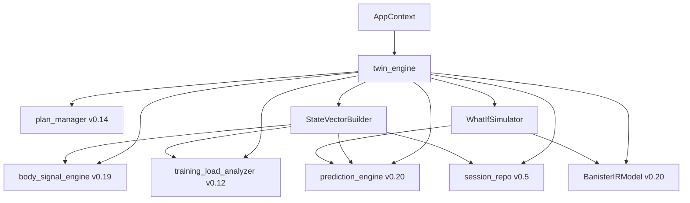
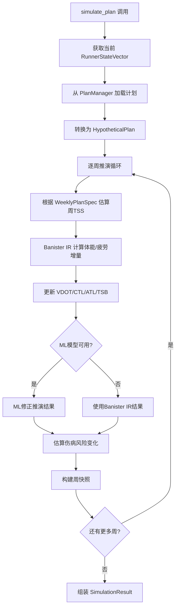

# v0.21 数字孪生引擎设计规格

> **版本**: v1.1
> **日期**: 2026-05-11
> **状态**: 修订中（基于用户澄清决策调整）
> **基线**: v0.20.1
> **对齐文档**:
> - [产品规划方案 v9.1](../product/产品规划方案.md)
> - [架构设计说明书 v7.0.0](../architecture/架构设计说明书.md)
> - [需求规格说明书 v8.0](../requirements/REQ_需求规格说明书.md)

---

## 1. 概述

### 1.1 版本定位

**版本主题**: 数字孪生引擎 —— 构建可推演的跑者生理模型
**核心目标**: 实现 What-If 推演能力，让用户"在训练前看到训练后的自己"
**目标用户**: 有明确训练目标的高级用户（计划参加比赛的跑者）

### 1.2 需求澄清决策

| # | 问题 | 决策 |
|---|------|------|
| 1 | RunnerStateVector维度 | 产品规划5维度（体能/负荷/身体信号/风险/训练模式） |
| 2 | What-If范围 | 精简：`simulate_plan()` + `compare_plans()`，`find_optimal_plan()` 延后 |
| 3 | 时间粒度 | 周粒度 |
| 4 | 推演模型 | ML优先+Banister降级 |
| 5 | 计划输入 | **仅系统计划（plan_id引用）**，手动构建延后评估 |
| 6 | 交互界面 | CLI和Agent完全对等 |
| 7 | 数据门槛 | 状态向量无门槛+推演分层降级 |
| 8 | 成功标准 | 量化指标（VDOT误差<8%，对比一致率>70%，响应<10秒） |
| 9 | 状态向量缓存 | **计算后缓存，TTL=24h**，存储到 `~/.nanobot-runner/twin/state_vector.json` |

### 1.3 架构方案

**选定方案**: 方案A — 薄编排层

`DigitalTwinEngine` 作为薄编排层，聚合现有模块输出，不引入新的状态转移引擎。What-If 推演通过组合调用 `PredictionEngine` + `TrainingResponsePredictor` + `BanisterIRModel` 实现。

**选择理由**:
1. YAGNI原则：v0.21 是数字孪生首个版本，核心价值是"让用户看到推演结果"
2. 风险最小：完全复用 v0.20 已验证模块，不引入新状态转移模型
3. 为迭代留空间：薄编排层接口可无缝过渡到方案B/C

---

## 2. 模块架构

### 2.1 目录结构

```
src/core/twin/
├── __init__.py                 # 模块导出
├── models.py                   # 数据模型定义
├── twin_engine.py              # DigitalTwinEngine 编排层
├── state_vector_builder.py     # RunnerStateVector 构建器
└── whatif_simulator.py         # What-If 推演器
```

### 2.2 模块职责

| 文件 | 职责 | 依赖 |
|------|------|------|
| `models.py` | 所有数据模型定义，不可变数据类 | `src.core.body_signal.models` |
| `twin_engine.py` | 薄编排层，调用子组件组装结果 | `StateVectorBuilder`, `WhatIfSimulator`, `PlanManager` |
| `state_vector_builder.py` | 聚合多模块数据构建5维度状态向量 | `PredictionEngine`, `BodySignalEngine`, `TrainingLoadAnalyzer`, `SessionRepository` |
| `whatif_simulator.py` | 逐周推演逻辑，ML/Banister/基础三层降级 | `BanisterIRModel`, `PredictionEngine` |

### 2.3 依赖关系



---

## 3. 数据模型

### 3.1 RunnerStateVector（5维度状态向量）

```python
@dataclass(frozen=True)
class FitnessDimension:
    """体能维度"""
    vdot: float
    vdot_trend: float
    vo2max_estimate: float | None

@dataclass(frozen=True)
class LoadDimension:
    """负荷维度"""
    ctl: float
    atl: float
    tsb: float
    acwr: float

@dataclass(frozen=True)
class BodySignalDimension:
    """身体信号维度"""
    fatigue_score: float
    recovery_status: str
    resting_hr: float | None
    hrv_rmssd: float | None

@dataclass(frozen=True)
class RiskDimension:
    """风险维度"""
    injury_risk_7d: float
    injury_risk_28d: float
    overtraining_risk: str

@dataclass(frozen=True)
class TrainingPatternDimension:
    """训练模式维度"""
    weekly_volume_km: float
    intensity_distribution: dict[str, float]
    long_run_frequency: float

@dataclass(frozen=True)
class RunnerStateVector:
    """跑者状态向量 - 5维度综合状态"""
    fitness: FitnessDimension
    load: LoadDimension
    body_signal: BodySignalDimension
    risk: RiskDimension
    training_pattern: TrainingPatternDimension
    snapshot_date: str
    data_quality: DataQuality

    def to_dict(self) -> dict[str, Any]: ...
```

### 3.2 HypotheticalPlan（假设计划）

```python
@dataclass(frozen=True)
class WeeklyPlanSpec:
    """周训练规格"""
    weekly_volume_km: float
    easy_ratio: float
    tempo_ratio: float
    interval_ratio: float
    long_run_km: float
    intensity_multiplier: float = 1.0

    def to_dict(self) -> dict[str, Any]: ...

@dataclass(frozen=True)
class HypotheticalPlan:
    """假设计划 - 轻量级训练方案描述（v0.21仅支持系统计划引用）"""
    name: str
    weeks: list[WeeklyPlanSpec]
    source: str = "plan_id"  # v0.21仅支持 plan_id 引用系统计划
    plan_id: str

    def to_dict(self) -> dict[str, Any]: ...
```

### 3.3 SimulationResult（推演结果）

```python
@dataclass(frozen=True)
class SimulationWeekSnapshot:
    """推演周快照"""
    week_number: int
    state: RunnerStateVector
    weekly_plan: WeeklyPlanSpec
    confidence: float

    def to_dict(self) -> dict[str, Any]: ...

@dataclass(frozen=True)
class SimulationResult:
    """推演结果"""
    plan_name: str
    initial_state: RunnerStateVector
    final_state: RunnerStateVector
    snapshots: list[SimulationWeekSnapshot]
    total_weeks: int
    prediction_type: str
    vdot_delta: float
    peak_injury_risk: float
    avg_tsb: float

    def to_dict(self) -> dict[str, Any]: ...
```

### 3.4 PlanComparison（计划对比）

```python
@dataclass(frozen=True)
class PlanComparisonMetrics:
    """单个计划的对比指标"""
    plan_name: str
    vdot_delta: float
    peak_injury_risk: float
    avg_tsb: float
    min_recovery_status: str
    recommendation_score: float

    def to_dict(self) -> dict[str, Any]: ...

@dataclass(frozen=True)
class PlanComparison:
    """计划对比结果"""
    plans: list[PlanComparisonMetrics]
    best_plan: str
    comparison_dimensions: list[str]
    recommendation: str

    def to_dict(self) -> dict[str, Any]: ...
```

---

## 4. 核心接口

### 4.1 DigitalTwinEngine

```python
class DigitalTwinEngine:
    """数字孪生引擎 - 薄编排层"""

    def __init__(
        self,
        prediction_engine: PredictionEngine,
        body_signal_engine: BodySignalEngine,
        training_load_analyzer: TrainingLoadAnalyzer,
        session_repo: SessionRepository,
        plan_manager: PlanManager | None = None,
        banister_model: BanisterIRModel | None = None,
    ) -> None: ...

    def get_runner_state(self, use_cache: bool = True) -> RunnerStateVector:
        """获取当前跑者状态向量

        聚合5个维度的数据，数据缺失维度用默认值/零值填充，
        data_quality 标注为 INSUFFICIENT。

        计算结果缓存到 ~/.nanobot-runner/twin/state_vector.json，
        TTL=24h，use_cache=False 时强制刷新。
        """

    def simulate_plan(
        self,
        plan_id: str,
        weeks: int | None = None,
    ) -> SimulationResult:
        """模拟训练计划效果

        从 PlanManager 加载系统计划，逐周推演，ML/Banister/基础三层降级。
        """

    def compare_plans(
        self,
        plan_ids: list[str],
    ) -> PlanComparison:
        """对比多个训练计划

        对每个 plan_id 调用 simulate_plan()，综合评分推荐最优计划。
        """
```

### 4.2 StateVectorBuilder

```python
class StateVectorBuilder:
    """跑者状态向量构建器"""

    def __init__(
        self,
        prediction_engine: PredictionEngine,
        body_signal_engine: BodySignalEngine,
        training_load_analyzer: TrainingLoadAnalyzer,
        session_repo: SessionRepository,
    ) -> None: ...

    def build(self) -> RunnerStateVector: ...
    def build_fitness(self) -> FitnessDimension: ...
    def build_load(self) -> LoadDimension: ...
    def build_body_signal(self) -> BodySignalDimension: ...
    def build_risk(self) -> RiskDimension: ...
    def build_training_pattern(self) -> TrainingPatternDimension: ...
```

### 4.3 WhatIfSimulator

```python
class WhatIfSimulator:
    """What-If 推演器"""

    def __init__(
        self,
        banister_model: BanisterIRModel,
        prediction_engine: PredictionEngine | None = None,
    ) -> None: ...

    def simulate_week(
        self,
        current_state: RunnerStateVector,
        week_plan: WeeklyPlanSpec,
    ) -> RunnerStateVector:
        """推演一周后的状态"""

    def simulate(
        self,
        initial_state: RunnerStateVector,
        plan: HypotheticalPlan,
    ) -> list[SimulationWeekSnapshot]:
        """逐周推演完整计划"""
```

---

## 5. 推演流程与降级策略

### 5.1 推演核心流程



### 5.2 三层降级策略

| 层级 | 条件 | 推演模型 | prediction_type | 置信度衰减 |
|------|------|----------|-----------------|-----------|
| L1 ML增强 | ML模型已训练且可用 | Banister IR + ML修正 | `ml_enhanced` | 每周衰减5% |
| L2 参数化 | ML不可用，Banister IR已拟合 | Banister IR（拟合参数） | `parametric` | 每周衰减8% |
| L3 基础 | Banister IR未拟合 | Banister IR（默认参数）+ 线性外推 | `basic` | 每周衰减12% |

### 5.3 置信度衰减机制

- 初始置信度 = 预测模型的置信度（来自 v0.20 PredictionEngine）
- 每周衰减：`confidence *= (1 - decay_rate)`
- 推演4周后：L1 约 0.81，L2 约 0.72，L3 约 0.60
- 置信度 < 0.5 时输出标注"推演结果仅供参考"

### 5.4 周TSS估算

复用 `TrainingResponsePredictor` 的 `SESSION_TYPE_TSS_PER_MIN` 常量：

```python
AVG_PACE_MIN_PER_KM = 6.0

def estimate_weekly_tss(week_plan: WeeklyPlanSpec) -> float:
    total_minutes = week_plan.weekly_volume_km / AVG_PACE_MIN_PER_KM * week_plan.intensity_multiplier
    easy_tss = total_minutes * week_plan.easy_ratio * 0.5
    tempo_tss = total_minutes * week_plan.tempo_ratio * 0.8
    interval_tss = total_minutes * week_plan.interval_ratio * 1.1
    long_tss = week_plan.long_run_km / AVG_PACE_MIN_PER_KM * 0.65
    return easy_tss + tempo_tss + interval_tss + long_tss
```

### 5.5 计划对比评分算法

```python
def calculate_recommendation_score(metrics: PlanComparisonMetrics) -> float:
    vdot_score = min(100, max(0, metrics.vdot_delta * 20))
    risk_score = max(0, 100 - metrics.peak_injury_risk)
    tsb_score = min(100, max(0, (metrics.avg_tsb + 30) * 2))
    recovery_score = {"green": 100, "yellow": 50, "red": 0}.get(metrics.min_recovery_status, 50)
    return vdot_score * 0.4 + risk_score * 0.3 + tsb_score * 0.2 + recovery_score * 0.1
```

---

## 6. 集成与依赖注入

### 6.1 AppContext 扩展

在 `src/core/base/context.py` 新增 `twin_engine` 属性：

```python
@property
def twin_engine(self) -> Any:
    """获取数字孪生引擎（v0.21.0新增）"""
    from src.core.twin.twin_engine import DigitalTwinEngine

    engine = self.get_extension("twin_engine")
    if engine is None:
        engine = DigitalTwinEngine(
            prediction_engine=self.prediction_engine,
            body_signal_engine=self.body_signal_engine,
            training_load_analyzer=self.training_load_analyzer,
            session_repo=self.session_repo,
            plan_manager=self.plan_manager,
        )
        self.set_extension("twin_engine", engine)
    return engine
```

### 6.2 PlanManager 集成（v0.21仅支持系统计划）

```python
def _load_plan(self, plan_id: str) -> HypotheticalPlan:
    """从 PlanManager 加载系统计划并转换为 HypotheticalPlan"""
    if not self._plan_manager:
        raise TwinEngineError("PlanManager 未初始化，无法加载计划")
    training_plan = self._plan_manager.get_plan(plan_id)
    return self._convert_training_plan(training_plan)

def _convert_training_plan(self, tp: TrainingPlan) -> HypotheticalPlan:
    weeks = []
    for week in tp.weeks:
        weeks.append(WeeklyPlanSpec(
            weekly_volume_km=week.weekly_volume_km,
            easy_ratio=week.easy_ratio,
            tempo_ratio=week.tempo_ratio,
            interval_ratio=week.interval_ratio,
            long_run_km=week.long_run_km,
            intensity_multiplier=week.intensity_multiplier,
        ))
    return HypotheticalPlan(
        name=tp.plan_name,
        weeks=weeks,
        source="plan_id",
        plan_id=tp.plan_id,
    )
```

---

## 7. CLI 与 Agent 接口

### 7.1 CLI 命令

```bash
# 查看当前跑者状态向量
nanobotrun twin status [--json]

# 模拟训练计划效果（v0.21仅支持系统计划）
nanobotrun twin simulate
    --plan-id <plan_id>
    --weeks <N>
    [--json]

# 对比多个训练计划（v0.21仅支持系统计划）
nanobotrun twin compare
    --plan-ids <id1,id2,id3>
    [--json]
```

### 7.2 Agent 工具

| 工具名 | 功能 | 输入 | 输出 |
|--------|------|------|------|
| `get_runner_state` | 获取当前跑者状态向量 | use_cache: bool | RunnerStateVector |
| `simulate_plan` | 模拟训练计划效果 | plan_id: str, weeks: int | SimulationResult |
| `compare_plans` | 对比多个训练计划 | plan_ids: list[str] | PlanComparison |

---

## 8. 测试策略

### 8.1 单元测试

| 测试文件 | 覆盖模块 | 关键测试场景 |
|----------|----------|-------------|
| `test_models.py` | 数据模型 | 序列化/反序列化、默认值、边界值 |
| `test_state_vector_builder.py` | StateVectorBuilder | 5维度构建、数据缺失降级、缓存一致性 |
| `test_whatif_simulator.py` | WhatIfSimulator | 逐周推演、置信度衰减、TSS估算、ML/Banister降级 |
| `test_twin_engine.py` | DigitalTwinEngine | 编排逻辑、计划加载、compare_plans评分、缓存一致性 |

### 8.2 关键测试场景

**场景1: StateVectorBuilder 数据缺失降级**
- 输入: 用户只有2周数据，无HRV数据
- 预期: fitness用基础线性外推，body_signal的hrv_rmssd=None，risk用规则基线，整体data_quality=INSUFFICIENT

**场景2: WhatIfSimulator 逐周推演**
- 输入: 模拟4周计划，初始VDOT=42.0
- 预期: 每周VDOT递增，置信度逐周衰减（L1: 0.95→0.81），第4周快照包含完整状态向量

**场景3: 推演降级策略**
- 场景A: ML模型可用 → prediction_type="ml_enhanced"
- 场景B: ML不可用，Banister已拟合 → prediction_type="parametric"
- 场景C: 均不可用 → prediction_type="basic"

**场景4: compare_plans 评分**
- 输入: 3个计划（A: VDOT+1.0/风险12%, B: VDOT+0.5/风险5%, C: VDOT+1.5/风险25%）
- 预期: 计划B综合评分最高（低风险+高恢复）

### 8.3 集成测试

| 场景 | 覆盖链路 |
|------|----------|
| twin status 全链路 | AppContext → TwinEngine → StateVectorBuilder → PredictionEngine/BodySignalEngine |
| twin simulate 全链路 | AppContext → TwinEngine → WhatIfSimulator → BanisterIRModel/PredictionEngine |
| twin compare 全链路 | AppContext → TwinEngine → 多次simulate → 评分对比 |

### 8.4 Mock 策略

- **必须 Mock**: PredictionEngine（ML推理耗时）、BodySignalEngine（数据查询）、SessionRepository（数据库）
- **禁止 Mock**: BanisterIRModel（纯计算）、数据模型（纯数据结构）、WhatIfSimulator（核心逻辑）

---

## 9. 版本成功标准

### 9.1 量化验收标准

| 维度 | 标准 | 测量方式 |
|------|------|----------|
| 功能完成 | P0功能100%实现 | 功能清单核对 |
| 推演准确度 | 推演VDOT误差<8%（4周推演） | 回测历史数据 |
| 计划对比 | 对比结果与人工判断一致率>70% | 专家评审 |
| 性能 | 推演响应<10秒（4周计划） | 性能测试 |
| 降级可用 | 数据不足时降级路径全部可用 | 边界测试 |
| 测试覆盖 | 核心模块单元测试覆盖率≥80% | pytest-cov |

### 9.2 P0 功能范围

| 功能 | 说明 |
|------|------|
| RunnerStateVector | 5维度状态向量，数据缺失降级 |
| get_runner_state | CLI + Agent 工具 |
| simulate_plan | 逐周推演，ML/Banister/基础三层降级 |
| compare_plans | 多计划对比，综合评分推荐 |
| HypotheticalPlan 系统计划引用 | 仅 plan_id 引用系统计划 |

### 9.3 P1 功能范围

| 功能 | 说明 |
|------|------|
| 推演结果可视化 | CLI 表格输出 |
| 推演历史记录 | 保存推演结果到本地 |

### 9.4 明确排除的范围

| 功能 | 原因 | 建议版本 |
|------|------|----------|
| `find_optimal_plan()` | 约束优化复杂度高 | v0.22+ |
| 技术/心理维度 | 缺乏数据源 | v0.22+ |
| 推演结果与实际对比校准 | 需要v0.23决策追踪 | v0.23 |
| 多Agent并行推演 | nanobot框架限制 | 待评估 |

---

## 10. 状态向量缓存策略

### 10.1 缓存设计

```python
@dataclass(frozen=True)
class StateVectorCache:
    """状态向量缓存"""
    state: RunnerStateVector
    created_at: datetime
    ttl_hours: int = 24

    def is_expired(self) -> bool:
        return datetime.now() - self.created_at > timedelta(hours=self.ttl_hours)
```

### 10.2 缓存位置

```
~/.nanobot-runner/
├── twin/
│   └── state_vector.json   # 缓存文件（RunnerStateCache序列化）
```

### 10.3 缓存逻辑

```python
def get_runner_state(self, use_cache: bool = True) -> RunnerStateVector:
    cache_path = self._get_cache_path()
    
    if use_cache and cache_path.exists():
        cache = self._load_cache(cache_path)
        if not cache.is_expired():
            return cache.state
    
    # 缓存不存在或已过期，重新构建
    state = self._state_vector_builder.build()
    self._save_cache(cache_path, StateVectorCache(state=state, created_at=datetime.now()))
    return state
```

### 10.4 缓存刷新触发条件

| 触发条件 | 行为 |
|---------|------|
| TTL过期（24h） | 下次调用时自动重建 |
| `use_cache=False` | 强制重建并更新缓存 |
| 新数据导入 | 建议调用方传入 `use_cache=False` |

---

## 11. 与架构文档对齐说明

| 架构文档定义 | 本设计调整 | 原因 |
|-------------|-----------|------|
| 4维度（体能/疲劳/技术/心理） | 5维度（体能/负荷/身体信号/风险/训练模式） | 产品规划决策 |
| `find_optimal_plan()` | 延后到 v0.22+ | YAGNI原则 |
| 无 `StateVectorBuilder` | 新增独立构建器 | 单一职责，便于测试 |
| 计划输入双模式 | 仅系统计划引用 | 用户澄清决策，避免过度设计 |
