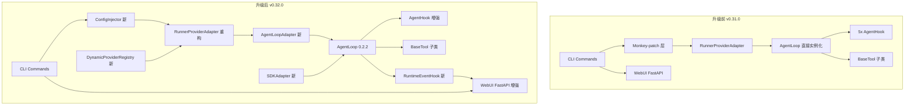
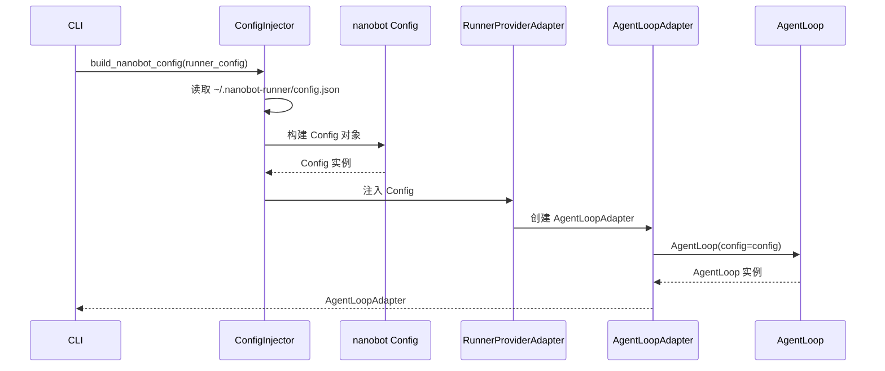
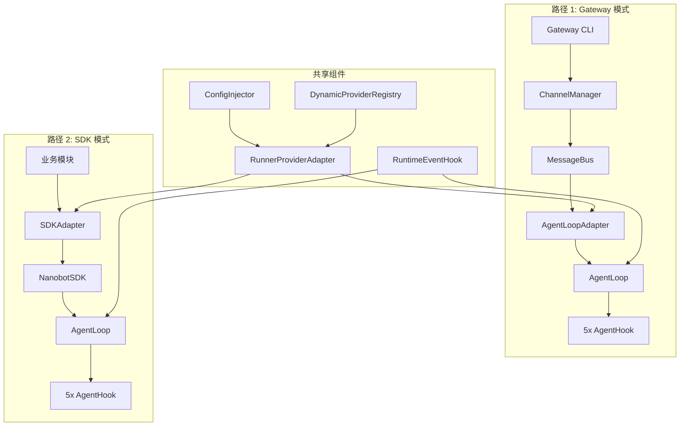
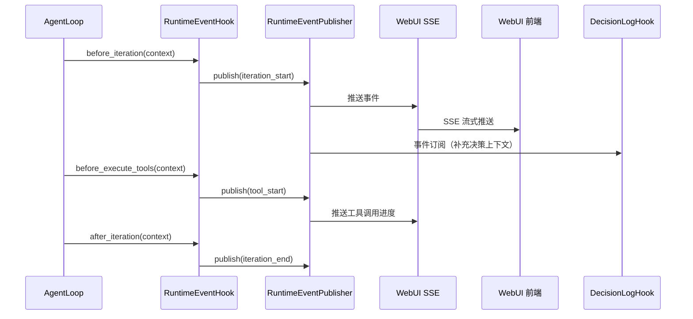
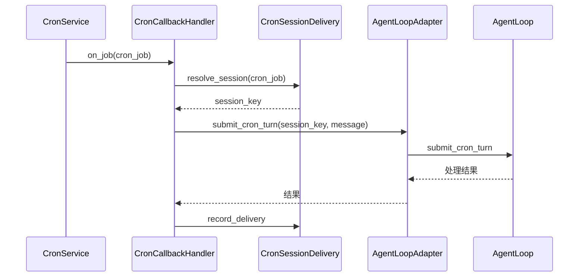
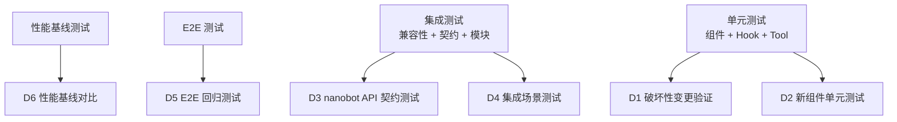
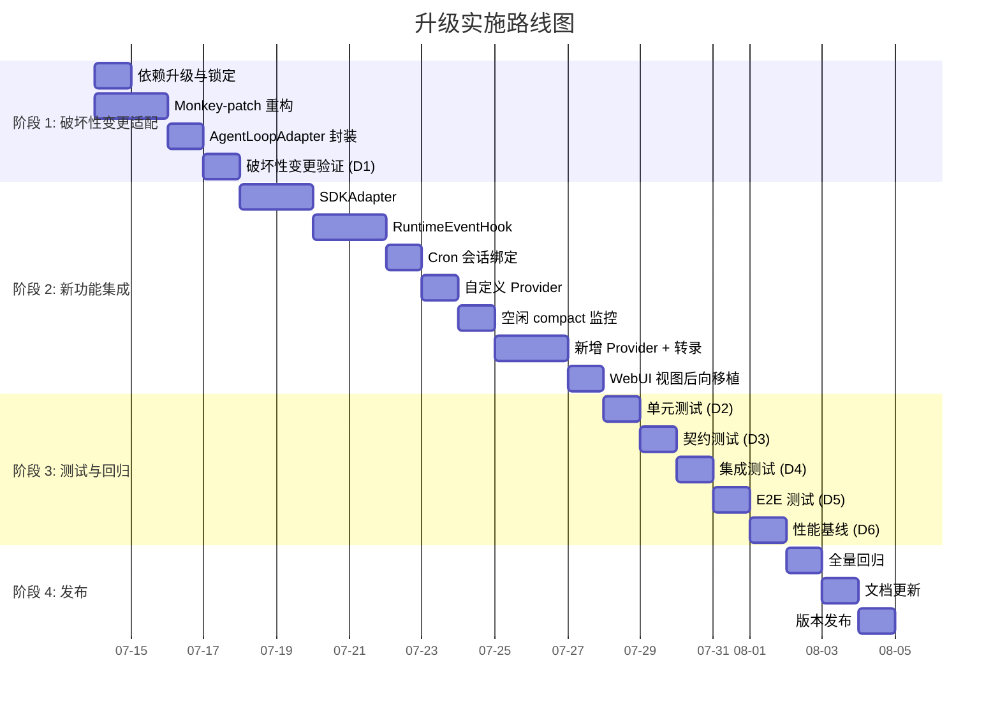

# nanobot-ai 0.2.1 → 0.2.2 升级设计规格

> **版本**: v1.0
> **日期**: 2026-07-13
> **项目**: RunFlowAgent (v0.31.0 → v0.32.0)
> **目标**: 升级底座 nanobot-ai 0.2.1 → 0.2.2
> **依据**: [nanobot-ai 0.2.2 升级投入产出比分析](../../architecture/review/nanobot-ai_0.2.2_升级投入产出比分析.md)
> **状态**: 已确认，待生成实施计划

---

## 一、设计决策汇总

本设计基于 6 轮澄清问答，形成以下决策：

| 决策点 | 选择 | 理由 |
|--------|------|------|
| 升级范围 | 方案 A：完整升级 + 核心新功能 | 战略价值最高，技术债一次清偿 |
| Monkey-patch 策略 | 完全重构（SDK 替代） | 彻底偿还技术债，避免未来被动升级 |
| 私有 API 处理 | AgentLoopAdapter 封装 | 隔离私有 API 调用，优先用公开 API 替代 |
| 新功能交付 | 全部三个梯队，9 项功能 | 一次发布完整交付，避免多版本维护 |
| 测试策略 | 增量 + 契约 + 性能基线 | 全面覆盖 + 未来升级防护 |
| 版本约束 | `nanobot-ai>=0.2.2,<0.3.0` + 快速回滚 | 锁定主版本，简单直接的回滚 |
| 实施路径 | 路径 A：单版本全量交付 | 与用户决策一致，避免 Feature Flag 复杂度 |

**总工时估算**：15.5-18.5 人日（大型升级项目）

---

## 二、整体架构变更

### 2.1 架构对比



### 2.2 核心架构变更清单

| 变更类型 | 变更内容 | 位置 |
|---------|---------|------|
| 移除 | `_patch_websocket_settings_api()` monkey-patch 机制 | `src/core/provider_adapter.py` |
| 移除 | `nanobot_loader.load_config/save_config` patch | `src/core/provider_adapter.py` |
| 移除 | `nanobot.webui.{settings_api,mcp_presets_api,cli_apps_api}` patch | `src/core/provider_adapter.py` |
| 移除 | `manager_module._default_webui_dist` patch | `src/cli/commands/gateway.py` |
| 新增 | `ConfigInjector` — 通过 SDK 配置注入替代 monkey-patch | `src/core/config_injector.py` |
| 新增 | `SDKAdapter` — 编程式 Agent 调用入口 | `src/core/sdk_adapter.py` |
| 新增 | `AgentLoopAdapter` — 封装私有 API 调用 | `src/core/agent_loop_adapter.py` |
| 新增 | `RuntimeEventHook` — 订阅运行时事件总线 | `src/core/transparency/runtime_event_hook.py` |
| 新增 | `DynamicProviderRegistry` — 动态 Provider 注册 | `src/core/provider_adapter.py`（扩展） |
| 重构 | `RunnerProviderAdapter` — 用 SDK 配置注入替代 patch | `src/core/provider_adapter.py` |
| 重构 | `DreamIntegration` — 适配 cron + process_direct 模式 | `src/core/memory/dream_integration.py` |
| 增强 | 5 个 AgentHook — 接入 run-level hook 生命周期 | `src/core/transparency/*.py`、`src/core/evolution/decision_log_hook.py` |
| 增强 | `CronCallbackHandler` — 接入 CronSessionDelivery | `src/core/plan/cron_callback.py` |
| 增强 | WebUI 后端 — 新增运行时事件 SSE 端点 | `src/core/webui/routes/` |

### 2.3 架构原则

1. **单一职责**：每个新组件只负责一个明确职责
2. **接口隔离**：私有 API 调用全部集中在 `AgentLoopAdapter`
3. **配置注入优于 Monkey-patch**：用 SDK 配置注入能力替代运行时 patch
4. **渐进式增强**：现有功能保持兼容，新功能通过新组件提供

---

## 三、组件设计

### 3.1 ConfigInjector — 配置注入器

**职责**：通过 nanobot 0.2.2 SDK 配置注入能力，替代现有 monkey-patch，将 RunFlowAgent 自有配置（`~/.nanobot-runner/config.json`）注入 nanobot 运行时。

**位置**：`src/core/config_injector.py`

**接口**：
```python
class ConfigInjector:
    def __init__(self, config_path: Path): ...

    def build_nanobot_config(self, runner_config: dict[str, Any]) -> Config:
        """构建 nanobot Config 对象（替代 load_config patch）"""

    def save_runner_config(self, config: dict[str, Any]) -> None:
        """保存 RunFlowAgent 配置（替代 save_config patch）"""

    def resolve_webui_dist(self) -> Path | None:
        """解析 WebUI dist 目录（替代 _default_webui_dist patch）"""
```

**依赖**：`nanobot.config.schema.Config`、`nanobot.config.loader.set_config_path`

**替换关系**：
- 替代 `_patch_websocket_settings_api()` 全部逻辑
- 替代 `nanobot_loader.load_config/save_config` patch
- 替代 `manager_module._default_webui_dist` patch

**配置字段映射**：

| RunFlowAgent 字段 | nanobot Config 字段 | 映射方式 |
|-----------------|-------------------|---------|
| `agents.defaults.model` | `agents.defaults.model` | 直接映射 |
| `agents.defaults.provider` | `agents.defaults.provider` | 直接映射 |
| `agents.defaults.timezone` | `agents.defaults.timezone` | 直接映射（覆盖 UTC） |
| `agents.defaults.workspace` | `agents.defaults.workspace` | 强制 `~/.nanobot-runner/` |
| `providers.{name}.api_key` | `providers.{name}.api_key` | 直接映射 |
| `providers.{name}.api_base` | `providers.{name}.api_base` | 直接映射 |
| `tools.mcp_servers` | `tools.mcp_servers` | 转换为 `MCPServerConfig` 列表 |
| `websocket.*` | `websocket.*` | 直接映射 |
| `webui.*` | `webui.*` | 直接映射 |

### 3.2 AgentLoopAdapter — AgentLoop 适配器

**职责**：封装 `AgentLoop` 的私有/半公开 API 调用，为业务模块提供稳定接口。

**位置**：`src/core/agent_loop_adapter.py`

**接口**：
```python
class AgentLoopAdapter:
    def __init__(self, agent_loop: AgentLoop): ...

    async def connect_mcp(self) -> None:
        """连接 MCP 服务器（封装 _connect_mcp）"""

    @property
    def mcp_stacks(self) -> list[Any]:
        """MCP 栈（封装 _mcp_stacks）"""

    @property
    def background_tasks(self) -> set[Any]:
        """后台任务集合（封装 _background_tasks）"""

    def add_hook(self, hook: AgentHook) -> None:
        """添加 Hook（封装 _extra_hooks 追加）"""

    async def close_mcp(self) -> None:
        """关闭 MCP 连接"""

    async def process_direct(self, message: str, **kwargs) -> str:
        """直接处理消息"""

    async def submit_cron_turn(self, session_key: str, message: str) -> None:
        """提交 Cron turn（0.2.2 新增公开 API）"""

    async def stop(self) -> None:
        """停止 Agent Loop"""
```

**封装原则**：
- 所有 `_` 前缀私有 API 调用必须通过 Adapter
- 优先使用 0.2.2 新增公开 API（如 `submit_cron_turn`）
- Adapter 接口保持稳定，nanobot 版本变更时只修改 Adapter 内部实现

### 3.3 SDKAdapter — SDK 编程式入口

**职责**：封装 nanobot 0.2.2 Python SDK，为业务模块提供编程式 Agent 调用能力。

**位置**：`src/core/sdk_adapter.py`

**接口**：
```python
class SDKAdapter:
    def __init__(self, config: Config, config_injector: ConfigInjector): ...

    async def create_session(self, session_key: str) -> NanobotSDK:
        """创建 SDK 会话（支持 async with）"""

    async def stream_query(
        self, message: str, session_key: str | None = None
    ) -> AsyncIterator[str]:
        """流式查询 Agent"""

    async def query(self, message: str, session_key: str | None = None) -> str:
        """同步查询 Agent（非流式）"""
```

**依赖**：`nanobot.nanobot.Nanobot`（0.2.2 新增）、`nanobot.sdk.*`

**使用场景**：
- 进化引擎触发 Agent 决策（无需 Gateway）
- 数字孪生 What-If 推演（编程式调用）
- 训练计划自动生成（嵌入业务流程）

### 3.4 RuntimeEventHook — 运行时事件订阅

**职责**：订阅 nanobot 0.2.2 的 `RuntimeEventPublisher`，将运行时事件转发到 WebUI 和业务模块。

**位置**：`src/core/transparency/runtime_event_hook.py`

**接口**：
```python
class RuntimeEventHook(AgentHook):
    def __init__(self, event_publisher: RuntimeEventPublisher): ...

    def subscribe(self, callback: Callable[[RuntimeEvent], None]) -> None:
        """订阅运行时事件"""

    async def before_iteration(self, context: AgentHookContext) -> None: ...
    async def before_execute_tools(self, context: AgentHookContext) -> None: ...
    async def after_iteration(self, context: AgentHookContext) -> None: ...
```

**集成点**：
- WebUI 后端新增 SSE 端点 `/api/runtime-events`
- DecisionLogHook 可订阅事件，补充决策上下文

### 3.5 DynamicProviderRegistry — 动态 Provider 注册

**职责**：利用 0.2.2 的 `create_dynamic_spec()` 和 `ProvidersConfig.extra="allow"` 能力，支持运行时注册自定义 OpenAI 兼容 Provider。

**位置**：`src/core/provider_adapter.py`（扩展）

**接口**：
```python
class DynamicProviderRegistry:
    @staticmethod
    def register_custom_provider(
        name: str, api_base: str, api_key: str, default_model: str
    ) -> None:
        """注册自定义 OpenAI 兼容 Provider"""

    @staticmethod
    def list_custom_providers() -> list[str]:
        """列出已注册的自定义 Provider"""
```

**依赖**：`nanobot.providers.registry.create_dynamic_spec`（0.2.2 新增）

### 3.6 现有组件修改清单

| 组件 | 文件 | 修改内容 |
|------|------|---------|
| `RunnerProviderAdapter` | `src/core/provider_adapter.py` | 移除 monkey-patch，改用 `ConfigInjector` |
| `DreamIntegration` | `src/core/memory/dream_integration.py` | 适配 cron + process_direct，移除废弃字段 |
| `DecisionLogHook` | `src/core/evolution/decision_log_hook.py` | 接入 run-level hook |
| `StreamingHook` | `src/core/transparency/streaming_hook.py` | 验证 `on_stream_end` 的 `resuming` 参数 |
| `CronCallbackHandler` | `src/core/plan/cron_callback.py` | 接入 `CronSessionDelivery` |
| `gateway.py` | `src/cli/commands/gateway.py` | 用 `AgentLoopAdapter` 替代私有 API 调用 |
| `agent.py` | `src/cli/commands/agent.py` | 同上 |
| WebUI 后端 | `src/core/webui/routes/` | 新增 `/api/runtime-events` SSE 端点 |
| `config.example.json` | 根目录 | 补充自定义 Provider、语音转录配置示例 |

---

## 四、数据流与接口

### 4.1 配置注入数据流



**关键变更**：
- 升级前：`_patch_websocket_settings_api()` 在运行时替换 nanobot 的 `load_config`/`save_config`
- 升级后：`ConfigInjector` 在启动时显式构建 `Config` 对象并注入

### 4.2 Agent 调用双路径



- **Gateway 模式**：保留现有 CLI → ChannelManager → MessageBus → AgentLoopAdapter → AgentLoop 路径
- **SDK 模式**：新增业务模块 → SDKAdapter → NanobotSDK → AgentLoop 路径
- **共享组件**：ConfigInjector、RunnerProviderAdapter、DynamicProviderRegistry、RuntimeEventHook

### 4.3 运行时事件数据流



### 4.4 Cron 会话绑定数据流



---

## 五、新功能特性清单

### 5.1 第一梯队（核心价值）

| 功能 | 描述 | 技术路径 |
|------|------|---------|
| **Python SDK 适配器** | 编程式 Agent 调用底座 | `src/core/sdk_adapter.py` 封装 `nanobot.nanobot.Nanobot` |
| **运行时事件总线** | WebUI 实时性基础 | `RuntimeEventHook` 订阅 `RuntimeEventPublisher` + SSE 端点 |
| **Token 级历史截断** | 上下文利用率 +15-25% | 0.2.2 自动生效，验证 + 调参 |

### 5.2 第二梯队（增强价值）

| 功能 | 描述 | 技术路径 |
|------|------|---------|
| **Cron 会话绑定** | 定时任务有状态化 | `CronCallbackHandler` 接入 `CronSessionDelivery` |
| **空闲自动 compact** | Memory 峰值 -30% | 0.2.2 自动生效，`MemoryManager` 新增监控 |
| **自定义 Provider** | 运行时注册 OpenAI 兼容 Provider | `DynamicProviderRegistry` + WebUI 配置入口 |

### 5.3 第三梯队（可选）

| 功能 | 描述 | 技术路径 |
|------|------|---------|
| **新增 LLM Provider** | Mistral/AssemblyAI/XiaomiMiMo/StepFun | 按需启用，通过自定义 Provider 机制 |
| **语音转录能力** | 4 个转录 Provider + TranscriptionConfig | 基础集成（配置层 + TranscriptionConfig），默认禁用，用户按需启用 |
| **WebUI 视图后向移植** | Token 热图、版本检查、会话分叉 | 选择性后向移植 |

### 5.4 现有功能增强

| 现有功能 | 增强建议 | 技术路径 |
|---------|---------|---------|
| DecisionLogHook | 接入 run-level hook | 扩展 `decision_log_hook.py` |
| StreamingHook | 事件源切换到 RuntimeEventPublisher | 渐进式迁移 |
| CronCallbackHandler | 接入 CronSessionDelivery | 扩展 `cron_callback.py` |
| RunnerProviderAdapter | 接入 create_dynamic_spec | 扩展 `provider_adapter.py` |
| MemoryManager | 接入空闲自动 compact 监控 | 扩展 `memory_manager.py` |
| MCP Connector | 受益于 SSRF 防护 | 升级自动生效 |
| WebUI 设置中心 | 新增自定义 Provider 配置入口 | 扩展 `routes/settings.py` |

---

## 六、错误处理与回滚

### 6.1 错误分类与处理策略

| 错误类别 | 示例 | 处理策略 | 严重等级 |
|---------|------|---------|---------|
| **E1: 配置注入失败** | ConfigInjector 无法构建 Config | 回退默认配置 + 日志告警 + 阻断启动 | 🔴 高 |
| **E2: 私有 API 变更** | `_extra_hooks`/`_connect_mcp` 被移除 | AgentLoopAdapter 抛 `AdapterError` + 阻断启动 | 🔴 高 |
| **E3: Hook 签名不兼容** | `before_iteration` 签名变更 | 测试阶段捕获 + 按历史模式适配 | 🟠 中 |
| **E4: SDK 调用失败** | `NanobotSDK` 创建/调用失败 | 回退 Gateway 模式 + 降级告警 | 🟡 低 |
| **E5: 运行时事件订阅异常** | RuntimeEventPublisher 不可用 | 静默降级 + 日志记录 | 🟢 低 |
| **E6: Cron 会话绑定失败** | `submit_cron_turn` 失败 | 回退无状态 Cron 模式 + 日志告警 | 🟡 低 |
| **E7: 自定义 Provider 注册失败** | `create_dynamic_spec` 失败 | 跳过该 Provider + 日志告警 | 🟡 低 |
| **E8: Dream 行为变化** | cron + process_direct 不兼容 | 禁用 Dream + 日志告警 + 用户提示 | 🟡 低 |

### 6.2 错误处理原则

1. **快速失败**：E1/E2 类错误阻断启动
2. **优雅降级**：E4/E5/E6/E7 类错误降级处理，不影响核心功能
3. **可观测性**：所有错误记录日志，关键错误触发告警
4. **用户友好**：错误信息包含可操作建议

### 6.3 回滚决策矩阵

| 触发条件 | 回滚范围 | 回滚方式 | 预计耗时 |
|---------|---------|---------|---------|
| 阶段 1 失败（破坏性变更适配） | 全部回滚 | `git revert` + `pyproject.toml` 回退到 `>=0.2.1` | 0.5 人日 |
| 阶段 2 失败（新功能集成） | 回滚新功能，保留阶段 1 | `git revert` 新功能提交 | 0.3 人日 |
| 阶段 3 失败（测试回归） | 定位失败项，修复或回滚 | 针对性 `git revert` | 0.5 人日 |
| 发布后严重问题 | 回退到 v0.31.0 | 版本回退 + 重新发布 | 1.0 人日 |

### 6.4 回滚检查清单

- [ ] `pyproject.toml` 中 `nanobot-ai` 版本约束已回退
- [ ] `uv sync` 成功重装依赖
- [ ] 全量单元测试通过
- [ ] 集成测试通过（含 `test_nanobot_compatibility.py`）
- [ ] E2E 测试通过（WebUI + Gateway）
- [ ] 配置文件 `~/.nanobot-runner/config.json` 兼容性验证
- [ ] 日志中无残留错误

---

## 七、测试策略

### 7.1 测试架构



### 7.2 测试覆盖维度

#### D1: 破坏性变更验证测试
- 位置：`tests/integration/test_nanobot_compatibility.py`（扩展）
- 覆盖：7 项破坏性变更的实际影响验证

#### D2: 新组件单元测试
- 位置：`tests/unit/core/`
- 覆盖：ConfigInjector、AgentLoopAdapter、SDKAdapter、RuntimeEventHook、DynamicProviderRegistry
- 覆盖率目标：≥ 85%

#### D3: nanobot API 契约测试
- 位置：`tests/integration/test_nanobot_api_contract.py`（新文件）
- 覆盖：AgentLoop/AgentHook/Tool/Provider/Config/MessageBus/CronService/SDK/RuntimeEventPublisher 公开 API
- 原则：只锁定公开 API，测试存在性和签名，不测试行为

#### D4: 集成场景测试
- 位置：`tests/integration/`
- 覆盖：配置注入全流程、SDK 编程式调用、运行时事件订阅、Cron 会话绑定、自定义 Provider、Dream 适配、Hook 生命周期、双路径共存

#### D5: E2E 回归测试
- 位置：`tests/e2e/`
- 覆盖：WebUI + Gateway 全链路、运行时事件 SSE、配置管理、自定义 Provider UI

#### D6: 性能基线对比测试
- 位置：`tests/performance/test_upgrade_baseline.py`（新文件）
- 指标与阈值：

| 指标 | 目标 | 阈值 |
|------|------|------|
| Agent Loop P50 延迟 | ≤ 基线 ×1.10 | 退化 >10% 阻断 |
| Agent Loop P99 延迟 | ≤ 基线 ×1.15 | 退化 >15% 阻断 |
| Memory 峰值占用 | ≤ 基线 ×0.90 | 退化 >10% 阻断 |
| WebUI 会话列表加载 | ≤ 基线 ×0.70 | 退化 >30% 阻断 |
| Token 级截断利用率 | ≥ 基线 ×1.15 | 无退化阈值 |
| 空闲 compact 后占用 | ≤ 基线 ×0.70 | 无退化阈值 |

### 7.3 测试准入准出

**准入标准**：
- [ ] 所有新组件代码已提交
- [ ] 代码静态检查通过（ruff/mypy）
- [ ] 单元测试代码已编写

**准出标准**：
- [ ] D1 破坏性变更验证全部通过
- [ ] D2 新组件单元测试覆盖率 ≥ 85%
- [ ] D3 契约测试全部通过
- [ ] D4 集成场景测试全部通过
- [ ] D5 E2E 回归测试全部通过
- [ ] D6 性能基线对比无退化（或退化在阈值内）
- [ ] 全量回归测试通过

---

## 八、实施阶段划分

### 8.1 阶段总览



### 8.2 阶段检查点

| 检查点 | 时机 | 检查内容 | 通过标准 |
|--------|------|---------|---------|
| CP1 | 阶段 1 完成 | 破坏性变更适配 + 重构 | D1 测试通过 + 现有功能无回归 |
| CP2 | 阶段 2 完成 | 9 项新功能集成 | D2 单测覆盖率 ≥ 85% |
| CP3 | 阶段 3 完成 | 全量测试 | D3-D6 全部通过 |
| CP4 | 阶段 4 完成 | 发布前 | 全量回归 + 性能基线 + 架构评审 |

---

## 九、风险管控

### 9.1 关键风险监控点

| 监控点 | 监控方式 | 告警阈值 | 告警方式 |
|--------|---------|---------|---------|
| 配置注入成功率 | 启动日志 | 失败即告警 | 日志 ERROR + 阻断启动 |
| AgentLoopAdapter 调用成功率 | 运行时日志 | 失败率 >1% | 日志 WARNING |
| SDK 调用成功率 | 运行时日志 | 失败率 >5% | 日志 WARNING + 降级 |
| 运行时事件订阅健康 | 心跳检查 | 连续 3 次失败 | 日志 WARNING |
| Cron 会话绑定成功率 | 运行时日志 | 失败率 >10% | 日志 WARNING + 降级 |
| Hook 执行延迟 | 性能监控 | P99 >100ms | 日志 WARNING |

### 9.2 告警分级

| 等级 | 触发条件 | 响应方式 |
|------|---------|---------|
| P0 | 配置注入失败 / AgentLoopAdapter 完全不可用 | 阻断启动，立即修复 |
| P1 | SDK 持续不可用 / Hook 签名不兼容 | 降级运行，规划修复 |
| P2 | 运行时事件订阅异常 / Cron 绑定偶发失败 | 静默降级，记录日志 |
| P3 | 性能轻微退化 / 非核心功能异常 | 观察监控，下个版本修复 |

---

## 十、版本约束与依赖

### 10.1 版本约束

```toml
# pyproject.toml
dependencies = [
    "nanobot-ai>=0.2.2,<0.3.0",
    ...
]
```

- 下限：`>=0.2.2`（锁定目标版本）
- 上限：`<0.3.0`（锁定主版本，防止被动升级）

### 10.2 新增依赖

0.2.2 新增的核心依赖（自动随 nanobot-ai 安装）：
- `lxml-html-clean>=0.4.0,<1.0.0` — HTML 清洗
- `azure-identity>=1.19.0,<2.0.0`（可选，azure 组）— Azure AAD 认证

---

## 附录 A：决策追溯

| 决策 | 选择 | 澄清轮次 | 理由 |
|------|------|---------|------|
| 升级范围 | 方案 A 完整升级 | Q1 | 战略价值最高，技术债一次清偿 |
| Monkey-patch | 完全重构 | Q2 | 彻底偿还技术债 |
| 私有 API | Adapter 封装 | Q3 | 隔离私有 API，优先公开 API |
| 新功能 | 全部三个梯队 | Q4 | 一次发布完整交付 |
| 测试 | 增量+契约+性能 | Q5 | 全面覆盖 + 未来防护 |
| 版本约束 | 严格+快速回滚 | Q6 | 简单直接，避免 Feature Flag |
| 实施路径 | 路径 A 单版本 | 方案选择 | 与用户决策一致 |

## 附录 B：参考文档

- [nanobot-ai 0.2.2 升级投入产出比分析](../../architecture/review/nanobot-ai_0.2.2_升级投入产出比分析.md)
- [架构设计说明书](../../architecture/架构设计说明书.md)
- [兼容性测试基线](../../../tests/integration/test_nanobot_compatibility.py)
- [nanobot 项目 0.2.2 源码](d:/yecll/Documents/GitHub/nanobot)

---

**文档结束**
