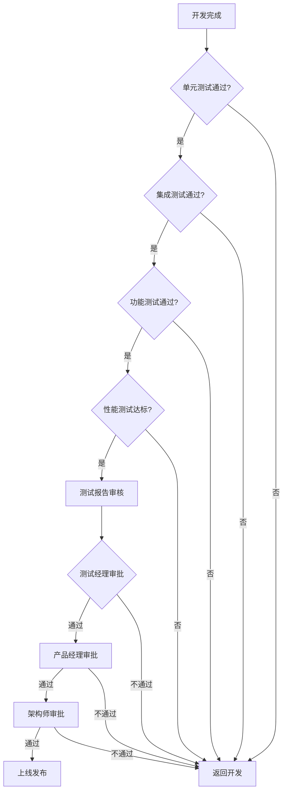
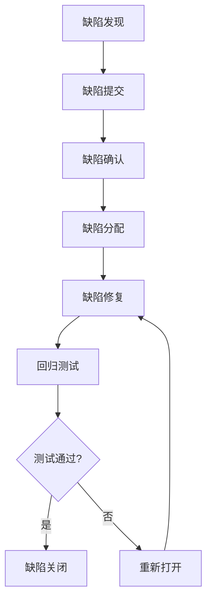

# 项目测试策略与规范

**文档版本**: v1.0  
**生效日期**: 2026-03-02  
**适用项目**: Nanobot Runner  
**文档负责人**: 测试工程师

---

## 一、测试策略概述

### 1.1 测试目标

基于 Nanobot Runner 项目特性，制定以下测试目标：

- **数据隐私保障**: 确保本地化存储，零外联数据泄露风险
- **高性能计算**: 验证 Polars 引擎在百万级数据下的性能表现
- **功能完整性**: 覆盖 FIT 文件解析、数据导入、分析计算等核心功能
- **用户体验**: 保证 CLI 交互的响应速度和稳定性

### 1.2 测试原则

- **隐私优先**: 所有测试数据均为模拟数据，禁止使用真实用户数据
- **性能导向**: 重点关注大数据量下的处理性能
- **自动化优先**: 核心功能测试实现自动化
- **分层测试**: 单元测试→集成测试→系统测试的完整测试体系

---

## 二、测试范围与类型

### 2.1 测试范围矩阵

| 测试类型 | 覆盖模块 | 测试重点 | 优先级 |
|---------|---------|---------|--------|
| **单元测试** | 所有核心模块 | 函数逻辑、边界条件、异常处理 | P0 |
| **集成测试** | 模块间交互 | 数据流、接口兼容性、错误传递 | P0 |
| **功能测试** | 业务功能 | FIT解析、数据导入、分析计算 | P0 |
| **性能测试** | 数据处理模块 | 大数据量处理性能、内存占用 | P1 |
| **安全测试** | 数据存储模块 | 数据加密、权限控制、隐私保护 | P1 |
| **兼容性测试** | 系统适配 | Windows/macOS/Linux 三端兼容 | P1 |
| **可靠性测试** | 核心服务 | 长时间运行稳定性、错误恢复 | P2 |

### 2.2 核心模块测试重点

#### 2.2.1 数据导入与管理模块
- FIT 文件格式解析正确性
- 指纹去重算法的准确性
- Parquet 存储的完整性和一致性
- 断点续传功能的可靠性

#### 2.2.2 CLI 交互模块
- 命令响应时间 < 1s
- 自然语言查询的准确性
- 错误提示的友好性
- 帮助文档的完整性

#### 2.2.3 数据分析引擎
- VDOT、TSS、ATL、CTL 计算准确性
- 心率漂移识别算法的有效性
- 大数据量下的查询性能
- 内存使用效率

---

## 三、测试准入标准

### 3.1 文档完整性要求

| 文档类型 | 完成度要求 | 审核人 |
|---------|-----------|--------|
| 需求规格说明书 | 100% | 产品经理 |
| 架构设计文档 | 100% | 架构师 |
| 接口设计文档 | 100% | 开发工程师 |
| 数据库设计文档 | 100% | DBA |

### 3.2 代码质量要求

| 指标 | 标准值 | 检查工具 |
|------|--------|----------|
| 单元测试覆盖率 | ≥80% | pytest-cov |
| 代码规范符合度 | ≥95% | ruff/flake8 |
| 静态代码分析 | 0严重问题 | pylint |
| 编译/构建成功率 | 100% | uv/pip |

### 3.3 开发完成度要求

- [ ] 所有 P0 功能开发完成
- [ ] 核心业务流程可正常执行
- [ ] 基础错误处理机制已实现
- [ ] 单元测试全部通过

---

## 四、测试准出标准

### 4.1 测试执行标准

| 测试类型 | 通过率要求 | 缺陷密度 | 备注 |
|---------|-----------|----------|------|
| 单元测试 | 100% | ≤0.1缺陷/千行 | 核心模块必须100% |
| 集成测试 | ≥95% | ≤0.05缺陷/千行 | 关键路径必须100% |
| 功能测试 | ≥90% | ≤0.02缺陷/千行 | P0功能必须100% |
| 性能测试 | 达标 | 无性能回归 | 响应时间达标 |

### 4.2 缺陷修复标准

| 缺陷等级 | 修复率要求 | 遗留限制 | 备注 |
|---------|-----------|----------|------|
| 致命缺陷 | 100% | 0个 | 不允许遗留 |
| 严重缺陷 | 100% | ≤2个 | 需有规避方案 |
| 一般缺陷 | ≥90% | ≤5个 | 不影响核心功能 |
| 轻微缺陷 | ≥80% | ≤10个 | 可后续版本修复 |

### 4.3 质量评估标准

- **优秀**: 所有测试通过率≥95%，无严重以上缺陷遗留
- **良好**: 核心功能通过率100%，一般缺陷修复率≥90%
- **合格**: P0功能通过率100%，致命/严重缺陷已修复
- **不合格**: 存在未修复的致命/严重缺陷

---

## 五、上线门禁规则

### 5.1 门禁检查清单

#### 5.1.1 代码质量门禁
- [ ] 单元测试覆盖率 ≥80%
- [ ] 代码规范检查通过
- [ ] 静态代码分析无严重问题
- [ ] 构建成功率 100%

#### 5.1.2 功能完整性门禁
- [ ] 所有 P0 功能测试通过
- [ ] 核心业务流程验证通过
- [ ] 关键性能指标达标
- [ ] 安全扫描无高危漏洞

#### 5.1.3 文档完整性门禁
- [ ] 测试报告完整
- [ ] 用户手册更新
- [ ] 部署文档就绪
- [ ] 回滚方案准备

### 5.2 审批流程



### 5.3 风险评估机制

| 风险等级 | 影响范围 | 处理措施 | 审批要求 |
|---------|---------|---------|----------|
| 高风险 | 核心功能异常 | 暂停上线，紧急修复 | 技术总监审批 |
| 中风险 | 次要功能异常 | 制定规避方案 | 产品经理+测试经理审批 |
| 低风险 | 体验问题 | 后续版本修复 | 测试经理审批 |

---

## 六、测试环境配置

### 6.1 环境分类

| 环境类型 | 用途 | 配置要求 | 数据要求 |
|---------|------|---------|----------|
| 开发环境 | 功能开发 | 最低配置 | 模拟小数据 |
| 测试环境 | 功能测试 | 标准配置 | 模拟标准数据 |
| 性能环境 | 性能测试 | 生产级配置 | 模拟大数据 |
| 预生产环境 | 集成测试 | 生产级配置 | 脱敏生产数据 |

### 6.2 硬件配置要求

| 组件 | 开发环境 | 测试环境 | 性能环境 |
|------|---------|---------|----------|
| CPU | 4核 | 8核 | 16核 |
| 内存 | 8GB | 16GB | 32GB |
| 存储 | 100GB SSD | 500GB SSD | 1TB SSD |
| 网络 | 100Mbps | 1Gbps | 1Gbps |

### 6.3 软件配置要求

| 软件组件 | 版本要求 | 配置参数 |
|---------|---------|----------|
| Python | 3.10+ | 虚拟环境隔离 |
| Polars | 0.20+ | 多线程配置 |
| Parquet | via pyarrow | 压缩配置 |
| 操作系统 | Win/macOS/Linux | 系统权限配置 |

---

## 七、测试数据管理

### 7.1 数据分类

| 数据类型 | 来源 | 用途 | 隐私要求 |
|---------|------|------|----------|
| 模拟数据 | 程序生成 | 单元测试 | 无限制 |
| 脱敏数据 | 生产数据脱敏 | 集成测试 | 高度脱敏 |
| 性能数据 | 大数据生成工具 | 性能测试 | 模拟数据 |
| 边界数据 | 手工构造 | 边界测试 | 无限制 |

### 7.2 数据生命周期管理


### 7.3 数据安全规范

- **禁止使用真实用户数据**进行测试
- 所有测试数据必须经过脱敏处理
- 测试数据存储需要加密保护
- 测试完成后及时清理测试数据

---

## 八、缺陷管理流程

### 8.1 缺陷等级定义

| 等级 | 定义 | 示例 | 处理时限 |
|------|------|------|----------|
| 致命 | 系统崩溃、数据丢失 | 程序崩溃、数据损坏 | 4小时 |
| 严重 | 核心功能不可用 | FIT解析失败、数据导入异常 | 8小时 |
| 一般 | 功能异常但不影响核心 | 计算结果显示错误 | 24小时 |
| 轻微 | 界面问题、体验问题 | 提示信息不准确 | 48小时 |

### 8.2 缺陷生命周期



### 8.3 缺陷跟踪指标

| 指标 | 计算公式 | 目标值 |
|------|---------|--------|
| 缺陷密度 | 缺陷数/千行代码 | ≤0.1 |
| 缺陷修复率 | 已修复缺陷/总缺陷 | ≥90% |
| 平均修复时间 | 总修复时间/缺陷数 | ≤8小时 |
| 重开率 | 重开缺陷数/总缺陷数 | ≤5% |

---

## 九、测试工具选型

### 9.1 自动化测试工具

| 测试类型 | 工具名称 | 版本 | 配置说明 |
|---------|---------|------|----------|
| 单元测试 | pytest | 最新 | 配合 pytest-cov 使用 |
| 集成测试 | pytest | 最新 | 使用 fixture 管理依赖 |
| 性能测试 | pytest-benchmark | 最新 | 基准测试和性能对比 |
| 代码覆盖 | pytest-cov | 最新 | 生成 HTML 报告 |

### 9.2 代码质量工具

| 工具类型 | 工具名称 | 配置文件 | 检查规则 |
|---------|---------|---------|----------|
| 代码规范 | ruff | pyproject.toml | PEP8 标准 |
| 类型检查 | mypy | mypy.ini | 静态类型检查 |
| 安全扫描 | bandit | bandit.yml | 安全漏洞检测 |
| 依赖检查 | safety | requirements.txt | 依赖漏洞检查 |

### 9.3 性能监控工具

| 监控维度 | 工具/方法 | 监控指标 | 告警阈值 |
|---------|---------|---------|----------|
| 内存使用 | memory_profiler | 内存峰值 | 80% 系统内存 |
| CPU 使用 | psutil | CPU 使用率 | 90% |
| 响应时间 | timeit | 接口响应时间 | 3秒 |
| 磁盘 I/O | iostat | 读写速度 | 根据硬件配置 |

---

## 十、测试文档模板

### 10.1 测试计划模板

```markdown
# 测试计划 - [版本号]

## 1. 测试范围
- 新增功能: [功能列表]
- 修改功能: [功能列表]
- 回归测试: [模块列表]

## 2. 测试策略
- 测试类型: [单元/集成/系统]
- 测试方法: [手工/自动化]
- 测试重点: [核心功能点]

## 3. 资源安排
- 测试人员: [人员名单]
- 测试环境: [环境配置]
- 时间安排: [测试周期]

## 4. 风险评估
- 技术风险: [风险描述]
- 进度风险: [风险描述]
- 应对措施: [应对方案]
```

### 10.2 测试用例模板

```markdown
## [模块名称] - 测试用例

### 用例ID: [TC-001]
- **用例名称**: [功能点测试]
- **优先级**: P0/P1/P2
- **前置条件**: [执行前提]
- **测试步骤**:
  1. [步骤1]
  2. [步骤2]
  3. [步骤3]
- **预期结果**: [期望输出]
- **实际结果**: [实际输出]
- **测试结果**: ✅通过 / ❌失败
- **备注**: [特殊情况说明]
```

### 10.3 测试报告模板

```markdown
# 测试报告 - [版本号]

## 1. 测试概况
- 测试周期: [开始日期] - [结束日期]
- 测试轮次: [第N轮]
- 测试环境: [环境描述]

## 2. 测试统计
| 测试类型 | 用例数 | 通过数 | 失败数 | 通过率 |
|---------|-------|-------|-------|--------|
| 单元测试 | [数字] | [数字] | [数字] | [百分比] |
| 集成测试 | [数字] | [数字] | [数字] | [百分比] |
| 功能测试 | [数字] | [数字] | [数字] | [百分比] |

## 3. 缺陷统计
| 缺陷等级 | 新增 | 修复 | 遗留 | 修复率 |
|---------|-----|-----|-----|--------|
| 致命 | [数字] | [数字] | [数字] | [百分比] |
| 严重 | [数字] | [数字] | [数字] | [百分比] |
| 一般 | [数字] | [数字] | [数字] | [百分比] |
| 轻微 | [数字] | [数字] | [数字] | [百分比] |

## 4. 测试结论
- 质量评估: [优秀/良好/合格/不合格]
- 上线建议: [建议上线/有条件上线/不建议上线]
- 风险评估: [风险等级及说明]
```

---

## 十一、交付物清单

### 11.1 测试过程文档

| 文档名称 | 交付时间 | 负责人 | 审核人 |
|---------|---------|--------|--------|
| 测试计划 | 开发完成前 | 测试工程师 | 测试经理 |
| 测试用例 | 测试开始前 | 测试工程师 | 测试经理 |
| 测试数据 | 测试开始前 | 测试工程师 | 开发工程师 |
| 测试脚本 | 测试执行前 | 测试工程师 | 开发工程师 |

### 11.2 测试结果文档

| 文档名称 | 交付时间 | 用途 | 受众 |
|---------|---------|------|------|
| 测试报告 | 每轮测试结束后 | 质量评估 | 项目组 |
| 缺陷报告 | 实时更新 | 问题跟踪 | 开发团队 |
| 性能报告 | 性能测试后 | 性能评估 | 架构师 |
| 覆盖率报告 | 单元测试后 | 代码质量 | 开发工程师 |

### 11.3 验收文档

| 文档名称 | 交付时间 | 签署人 | 存档位置 |
|---------|---------|--------|----------|
| 测试验收报告 | 上线前 | 测试经理、产品经理 | 项目文档库 |
| 上线确认书 | 上线前 | 技术总监、产品总监 | 项目文档库 |
| 运维交接文档 | 上线后 | 测试、开发、运维 | 运维知识库 |

---

## 十二、附录

### 12.1 术语定义

- **P0**: 最高优先级，核心功能，必须实现
- **P1**: 高优先级，重要功能，建议实现
- **P2**: 普通优先级，增强功能，可选实现
- **VDOT**: 跑力值，衡量跑步能力的指标
- **TSS**: 训练压力分数，量化训练负荷
- **ATL/CTL**: 急性/慢性训练负荷

### 12.2 参考标准

- IEEE 829 软件测试文档标准
- ISO/IEC 25010 软件产品质量标准
- 项目内部编码规范
- 行业最佳实践

### 12.3 修订历史

| 版本 | 修订日期 | 修订内容 | 修订人 |
|------|---------|---------|--------|
| v1.0 | 2026-03-02 | 初始版本 | 测试工程师 |

---

**文档审批**:  
测试经理: ___________ 日期: _________  
技术总监: ___________ 日期: _________  
产品经理: ___________ 日期: _________