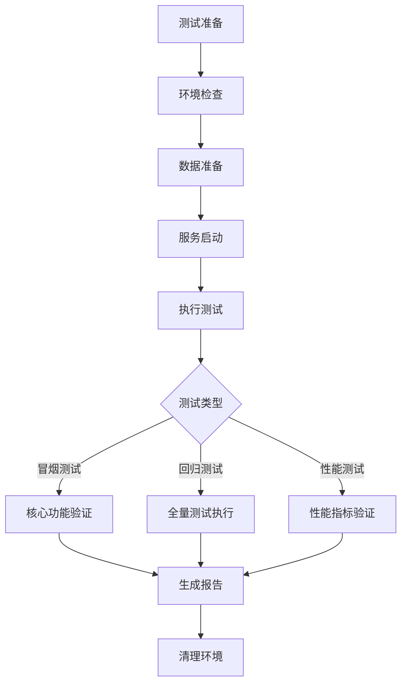
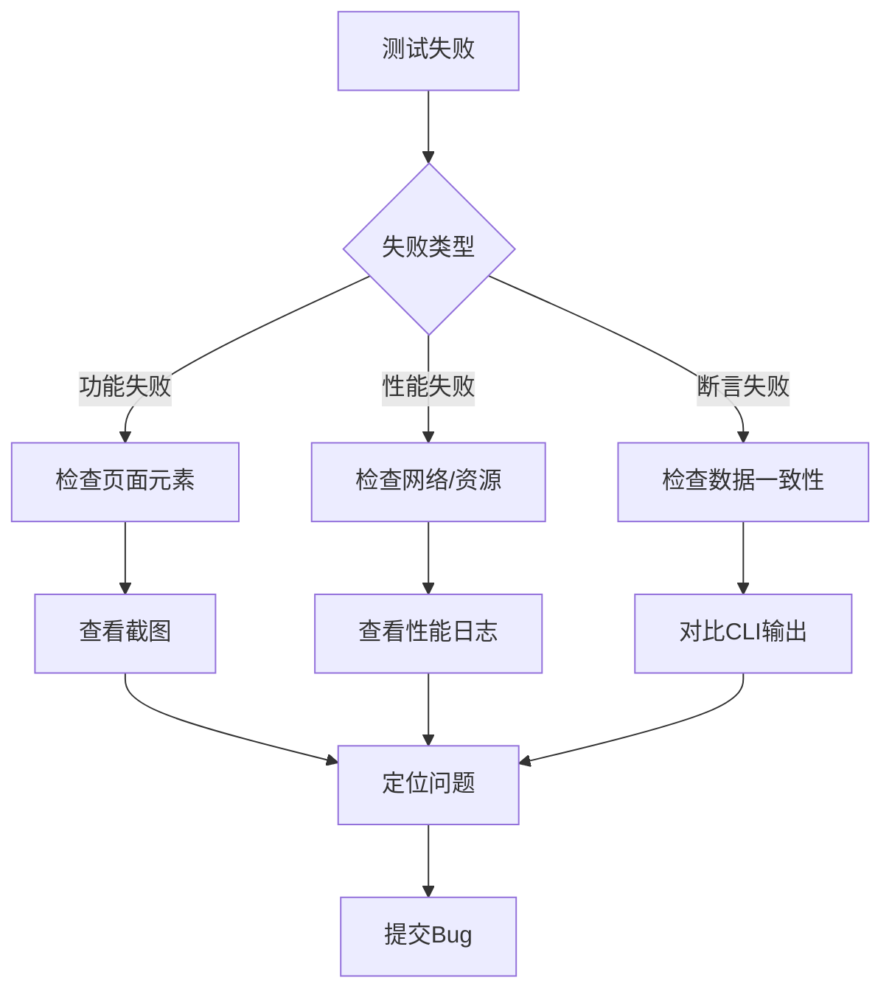

# WebUI E2E测试方案 v0.29.0

**文档版本**: v1.0.0  
**创建日期**: 2026-06-15  
**适用版本**: v0.27.0 - v0.29.0  
**测试范围**: WebUI基础功能 + 数据可视化 + 管理控制台

---

## 1. 测试方案概述

### 1.1 测试目标

1. **功能验证**：验证WebUI所有功能需求（REQ-D-11至REQ-D-46）的正确性
2. **用户体验**：验证核心业务流程的端到端可用性
3. **性能达标**：验证非功能需求（NFR-D-11至NFR-D-30）的性能指标
4. **数据一致性**：验证WebUI数据与CLI输出的数值一致性（误差<0.1%）
5. **向后兼容**：验证WebUI启用不影响CLI/飞书功能

### 1.2 测试范围

#### 1.2.1 功能测试范围

| 模块 | 需求编号 | 功能点 | 优先级 | 测试用例数 |
|------|---------|--------|--------|-----------|
| WebUI基础 | REQ-D-11~20 | AI对话、流式输出、多会话、基础设置、品牌自定义、WebSocket配置、安全认证、Gateway增强、统一会话 | P0 | 15 |
| 数据可视化 | REQ-D-21~36 | 仪表盘、VDOT趋势、训练负荷、活动列表、活动详情、身体信号、10个API端点 | P0 | 25 |
| 训练计划管理 | REQ-D-37~41 | 日历视图、列表视图、执行进度、AI调整模式、手工调整模式 | P0 | 20 |
| 进化引擎控制台 | REQ-D-42~44 | 状态面板、提示参数调优、月度进化报告 | P1 | 15 |
| 设置中心 | REQ-D-45~46 | 个人资料、偏好设置、连接状态、系统配置、快捷操作栏 | P2 | 10 |
| **总计** | - | - | - | **85** |

#### 1.2.2 非功能测试范围

| NFR编号 | 需求 | 测试方法 | 验收标准 |
|---------|------|---------|---------|
| NFR-D-11 | WebUI首屏加载<3s | Playwright性能监控 | 首屏加载时间<3000ms |
| NFR-D-12 | WebSocket连接<100ms | Playwright WebSocket监控 | 握手到连接建立<100ms |
| NFR-D-13 | 流式输出延迟<200ms | Playwright流式监控 | Agent delta到展示<200ms |
| NFR-D-17 | 仪表盘首屏<2s | Playwright性能监控 | 仪表盘加载<2000ms |
| NFR-D-18 | 图表渲染<1s | Playwright图表监控 | 图表渲染<1000ms |
| NFR-D-21 | 数据一致性<0.1% | API响应与CLI输出对比 | 数值误差<0.1% |
| NFR-D-24 | 计划页面首屏<2s | Playwright性能监控 | 计划页面加载<2000ms |
| NFR-D-26 | 参数滑块延迟<200ms | Playwright交互监控 | 滑块拖动到值更新<200ms |
| NFR-D-30 | 日历渲染<500ms | Playwright渲染监控 | 100个训练日渲染<500ms |

### 1.3 测试不包含范围

1. **nanobot-ai WebUI前端修改**：不测试nanobot-ai原生WebUI组件
2. **飞书通道功能**：飞书通道测试在独立测试套件中
3. **CLI命令功能**：CLI命令测试在`tests/e2e/test_gateway_e2e.py`中
4. **后端单元测试**：后端API单元测试在`tests/unit/`中

---

## 2. 测试框架与工具选型

### 2.1 测试框架选型

| 工具 | 版本 | 用途 | 选型理由 |
|------|------|------|---------|
| **Playwright** | 1.40+ | 浏览器自动化E2E测试 | 支持多浏览器、自动等待、网络拦截、性能监控 |
| **pytest-playwright** | 0.4+ | Playwright pytest集成 | 与现有pytest测试套件无缝集成 |
| **pytest-asyncio** | 0.21+ | 异步测试支持 | 支持WebSocket和异步API测试 |
| **pytest-timeout** | 2.1+ | 测试超时控制 | 防止测试挂起 |
| **pytest-html** | 4.1+ | HTML测试报告 | 可视化测试结果 |

### 2.2 辅助工具

| 工具 | 用途 |
|------|------|
| **httpx** | API接口测试（独立于浏览器） |
| **Pillow** | 截图对比（视觉回归测试） |
| **psutil** | 资源消耗监控 |
| **allure-pytest** | Allure测试报告（可选） |

### 2.3 测试目录结构

```
tests/
├── e2e/
│   ├── webui/
│   │   ├── conftest.py                    # WebUI测试配置
│   │   ├── test_webui_auth.py             # 认证测试
│   │   ├── test_webui_dashboard.py        # 仪表盘测试
│   │   ├── test_webui_vdot.py             # VDOT趋势测试
│   │   ├── test_webui_training_load.py    # 训练负荷测试
│   │   ├── test_webui_activities.py       # 活动列表/详情测试
│   │   ├── test_webui_body_signals.py     # 身体信号测试
│   │   ├── test_webui_plan.py             # 训练计划管理测试
│   │   ├── test_webui_evolution.py        # 进化引擎控制台测试
│   │   ├── test_webui_settings.py         # 设置中心测试
│   │   ├── test_webui_ai_chat.py          # AI对话测试
│   │   ├── test_webui_performance.py      # 性能测试
│   │   ├── test_webui_data_consistency.py # 数据一致性测试
│   │   └── pages/                         # Page Object Models
│   │       ├── base_page.py
│   │       ├── dashboard_page.py
│   │       ├── vdot_page.py
│   │       ├── training_load_page.py
│   │       ├── activities_page.py
│   │       ├── activity_detail_page.py
│   │       ├── body_signals_page.py
│   │       ├── plan_page.py
│   │       ├── evolution_page.py
│   │       ├── settings_page.py
│   │       └── ai_chat_page.py
│   └── test_gateway_e2e.py                # 现有Gateway测试
```

---

## 3. 测试环境配置

### 3.1 测试环境要求

#### 3.1.1 硬件要求

| 资源 | 最低要求 | 推荐配置 |
|------|---------|---------|
| CPU | 4核 | 8核 |
| 内存 | 8GB | 16GB |
| 磁盘 | 10GB可用空间 | 20GB可用空间 |

#### 3.1.2 软件要求

| 软件 | 版本 | 用途 |
|------|------|------|
| Python | 3.11+ | 测试运行环境 |
| Node.js | 18+ | WebUI前端构建 |
| Chrome/Edge | 最新版 | 浏览器测试 |
| Firefox | 最新版 | 跨浏览器测试（可选） |

#### 3.1.3 依赖安装

```bash
# 安装测试依赖
uv add --dev pytest-playwright playwright pytest-asyncio pytest-timeout pytest-html httpx

# 安装Playwright浏览器
playwright install chromium
playwright install firefox  # 可选
```

### 3.2 测试环境配置

#### 3.2.1 测试数据准备

**测试数据集**：
- 使用`tests/data/fixtures/`下的样本FIT文件
- 准备包含以下数据的测试数据库：
  - 100+活动记录（覆盖不同训练类型）
  - 30+天VDOT趋势数据
  - 90+天训练负荷数据
  - 7+天身体信号数据
  - 2+个训练计划（1个活跃，1个已完成）
  - 30+条决策日志
  - 10+条进化动作记录

**数据准备脚本**：`tests/e2e/webui/fixtures/prepare_test_data.py`

#### 3.2.2 服务启动配置

**测试前准备**：
```bash
# 1. 初始化测试数据目录
uv run nanobotrun system init --data-dir ./test_data

# 2. 导入测试数据
uv run nanobotrun data import tests/data/fixtures/ --data-dir ./test_data

# 3. 启动Gateway（含WebUI）
uv run nanobotrun gateway start --webui --port 8765 --data-dir ./test_data
```

**环境变量**：
```bash
# 测试环境配置
export NANOBOT_DATA_DIR=./test_data
export NANOBOT_WEBUI_ENABLED=true
export NANOBOT_WS_HOST=127.0.0.1
export NANOBOT_WS_PORT=8765
export NANOBOT_WS_TOKEN=test_token_12345
```

#### 3.2.3 测试配置（conftest.py）

```python
# tests/e2e/webui/conftest.py
import pytest
import subprocess
import time
import httpx
from pathlib import Path

@pytest.fixture(scope="session")
def webui_server():
    """启动WebUI测试服务器"""
    # 启动Gateway服务
    process = subprocess.Popen([
        "uv", "run", "nanobotrun", "gateway", "start",
        "--webui", "--port", "8765",
        "--data-dir", "./test_data"
    ])
    
    # 等待服务启动
    time.sleep(3)
    
    # 验证服务可用
    for _ in range(10):
        try:
            response = httpx.get("http://127.0.0.1:8765/health")
            if response.status_code == 200:
                break
        except:
            time.sleep(1)
    
    yield "http://127.0.0.1:8765"
    
    # 清理
    process.terminate()
    process.wait()

@pytest.fixture(scope="session")
def webui_token():
    """获取WebUI访问Token"""
    # 从token_issue_path读取或生成
    token_path = Path("./test_data/.webui_token")
    if token_path.exists():
        return token_path.read_text().strip()
    return "test_token_12345"

@pytest.fixture
def browser_context(browser, webui_token):
    """创建带认证的浏览器上下文"""
    context = browser.new_context()
    # 注入Token到localStorage
    context.add_init_script(f"""
        localStorage.setItem('auth_token', '{webui_token}');
    """)
    yield context
    context.close()

@pytest.fixture
def page(browser_context):
    """创建测试页面"""
    page = browser_context.new_page()
    yield page
    page.close()
```

---

## 4. 测试用例设计规范

### 4.1 测试用例命名规范

```python
# 格式：test_{功能模块}_{场景}_{预期结果}
def test_dashboard_page_loads_within_2_seconds():
def test_vdot_trend_chart_renders_with_data():
def test_plan_calendar_view_displays_daily_workouts():
def test_evolution_status_panel_shows_trigger_conditions():
def test_settings_profile_update_succeeds():
```

### 4.2 测试用例结构

```python
class TestDashboardPage:
    """仪表盘页面测试"""
    
    def test_dashboard_page_loads(self, page: Page):
        """测试仪表盘页面加载"""
        # Arrange
        page.goto("http://127.0.0.1:8765/")
        
        # Act
        page.wait_for_load_state("networkidle")
        
        # Assert
        assert page.title() == "Nanobot Runner"
        assert page.locator("h1").text_content() == "仪表盘"
        
    def test_dashboard_shows_training_load(self, page: Page):
        """测试仪表盘显示训练负荷"""
        # Arrange
        page.goto("http://127.0.0.1:8765/")
        page.wait_for_load_state("networkidle")
        
        # Act
        training_load_card = page.locator("[data-testid='training-load-card']")
        
        # Assert
        assert training_load_card.is_visible()
        assert "ATL" in training_load_card.text_content()
        assert "CTL" in training_load_card.text_content()
```

### 4.3 Page Object Model（POM）设计

```python
# tests/e2e/webui/pages/dashboard_page.py
from playwright.sync_api import Page

class DashboardPage:
    """仪表盘页面对象"""
    
    URL = "http://127.0.0.1:8765/"
    
    def __init__(self, page: Page):
        self.page = page
        self.training_load_card = page.locator("[data-testid='training-load-card']")
        self.body_signal_card = page.locator("[data-testid='body-signal-card']")
        self.recent_activities = page.locator("[data-testid='recent-activities']")
    
    def navigate(self):
        """导航到仪表盘"""
        self.page.goto(self.URL)
        self.page.wait_for_load_state("networkidle")
    
    def get_training_load(self) -> dict:
        """获取训练负荷数据"""
        atl = self.training_load_card.locator("[data-testid='atl-value']").text_content()
        ctl = self.training_load_card.locator("[data-testid='ctl-value']").text_content()
        return {"atl": float(atl), "ctl": float(ctl)}
    
    def is_loaded(self) -> bool:
        """检查页面是否加载完成"""
        return self.training_load_card.is_visible()
```

### 4.4 测试数据管理策略

#### 4.4.1 测试数据分层

| 层级 | 数据类型 | 管理方式 | 更新频率 |
|------|---------|---------|---------|
| **固定数据** | 样本FIT文件 | Git版本控制 | 永不更新 |
| **基础数据** | 活动记录、VDOT趋势 | 测试前导入 | 每次测试重置 |
| **动态数据** | 训练计划、决策日志 | 测试用例创建 | 测试后清理 |

#### 4.4.2 测试数据隔离

```python
@pytest.fixture
def isolated_test_data(tmp_path):
    """创建隔离的测试数据目录"""
    # 复制基础数据到临时目录
    shutil.copytree("tests/data/fixtures", tmp_path / "fixtures")
    
    # 初始化测试数据库
    subprocess.run([
        "uv", "run", "nanobotrun", "system", "init",
        "--data-dir", str(tmp_path)
    ])
    
    # 导入测试数据
    subprocess.run([
        "uv", "run", "nanobotrun", "data", "import",
        str(tmp_path / "fixtures"),
        "--data-dir", str(tmp_path)
    ])
    
    yield tmp_path
    
    # 清理（自动删除临时目录）
```

#### 4.4.3 测试数据清理

```python
@pytest.fixture(autouse=True)
def cleanup_test_data(webui_server):
    """测试后清理动态数据"""
    yield
    
    # 清理训练计划
    subprocess.run([
        "uv", "run", "nanobotrun", "plan", "delete",
        "--plan-id", "test_plan_*",
        "--data-dir", "./test_data"
    ])
    
    # 清理决策日志
    subprocess.run([
        "uv", "run", "nanobotrun", "evolution", "clear",
        "--data-dir", "./test_data"
    ])
```

---

## 5. 测试用例清单

### 5.1 WebUI认证测试（test_webui_auth.py）

| 编号 | 测试用例 | 优先级 | 验收标准 |
|------|---------|--------|---------|
| AUTH-001 | Token认证启用时访问WebUI需要Token | P0 | 无Token返回401 |
| AUTH-002 | Token认证禁用时可匿名访问 | P1 | 无Token可访问 |
| AUTH-003 | Token过期后自动刷新 | P0 | Token自动续期 |
| AUTH-004 | 无效Token返回401 | P0 | 返回401错误 |
| AUTH-005 | WebSocket连接需要Token | P0 | 无Token握手失败 |

### 5.2 仪表盘测试（test_webui_dashboard.py）

| 编号 | 测试用例 | 优先级 | 验收标准 |
|------|---------|--------|---------|
| DASH-001 | 仪表盘页面加载<2s | P0 | 加载时间<2000ms |
| DASH-002 | 仪表盘显示训练负荷卡片 | P0 | ATL/CTL/TSB数值正确 |
| DASH-003 | 仪表盘显示身体信号摘要 | P0 | HRV/疲劳度/恢复度正确 |
| DASH-004 | 仪表盘显示最近活动列表 | P0 | 显示最近7天活动 |
| DASH-005 | 仪表盘数据与CLI一致 | P0 | 误差<0.1% |
| DASH-006 | 仪表盘空数据状态显示 | P1 | 显示"暂无数据"提示 |

### 5.3 VDOT趋势测试（test_webui_vdot.py）

| 编号 | 测试用例 | 优先级 | 验收标准 |
|------|---------|--------|---------|
| VDOT-001 | VDOT趋势页面加载 | P0 | 页面正常渲染 |
| VDOT-002 | VDOT趋势图表渲染<1s | P0 | 图表渲染时间<1000ms |
| VDOT-003 | VDOT趋势支持7/30/90/365天切换 | P0 | 切换后图表更新 |
| VDOT-004 | VDOT趋势显示最高/最低/平均值 | P0 | 数值正确 |
| VDOT-005 | VDOT趋势数据与CLI一致 | P0 | 误差<0.1% |
| VDOT-006 | VDOT趋势无数据时显示空状态 | P1 | 显示"暂无VDOT数据" |

### 5.4 训练负荷测试（test_webui_training_load.py）

| 编号 | 测试用例 | 优先级 | 验收标准 |
|------|---------|--------|---------|
| LOAD-001 | 训练负荷页面加载 | P0 | 页面正常渲染 |
| LOAD-002 | 训练负荷图表渲染<1s | P0 | 图表渲染时间<1000ms |
| LOAD-003 | 训练负荷支持30/90/180天切换 | P0 | 切换后图表更新 |
| LOAD-004 | 训练负荷显示ATL/CTL/TSB | P0 | 数值正确 |
| LOAD-005 | 训练负荷趋势图显示 | P0 | 图表正确渲染 |
| LOAD-006 | 训练负荷数据与CLI一致 | P0 | 误差<0.1% |

### 5.5 活动列表测试（test_webui_activities.py）

| 编号 | 测试用例 | 优先级 | 验收标准 |
|------|---------|--------|---------|
| ACT-001 | 活动列表页面加载 | P0 | 页面正常渲染 |
| ACT-002 | 活动列表分页显示 | P0 | 每页20条，支持翻页 |
| ACT-003 | 活动列表按日期倒序排列 | P0 | 最新活动在前 |
| ACT-004 | 活动列表显示类型/距离/配速/心率 | P0 | 信息完整 |
| ACT-005 | 活动列表响应时间<500ms | P0 | API响应<500ms |
| ACT-006 | 点击活动跳转详情页 | P0 | 正确跳转到/activity/{id} |
| ACT-007 | 活动列表支持筛选 | P1 | 按类型/日期筛选 |

### 5.6 活动详情测试（test_webui_activity_detail.py）

| 编号 | 测试用例 | 优先级 | 验收标准 |
|------|---------|--------|---------|
| DETAIL-001 | 活动详情页加载 | P0 | 页面正常渲染 |
| DETAIL-002 | 活动详情显示完整信息 | P0 | 距离/时长/配速/心率/VDOT |
| DETAIL-003 | 活动详情显示心率曲线 | P0 | 图表正确渲染 |
| DETAIL-004 | 活动详情显示配速曲线 | P0 | 图表正确渲染 |
| DETAIL-005 | 活动详情数据与CLI一致 | P0 | 误差<0.1% |
| DETAIL-006 | 活动不存在时显示404 | P1 | 显示"活动不存在" |

### 5.7 身体信号测试（test_webui_body_signals.py）

| 编号 | 测试用例 | 优先级 | 验收标准 |
|------|---------|--------|---------|
| BODY-001 | 身体信号页面加载 | P0 | 页面正常渲染 |
| BODY-002 | 身体信号显示HRV趋势 | P0 | HRV图表正确 |
| BODY-003 | 身体信号显示疲劳度趋势 | P0 | 疲劳度图表正确 |
| BODY-004 | 身体信号显示恢复度趋势 | P0 | 恢复度图表正确 |
| BODY-005 | 身体信号支持7/30/90天切换 | P0 | 切换后图表更新 |
| BODY-006 | 身体信号数据与CLI一致 | P0 | 误差<0.1% |

### 5.8 训练计划管理测试（test_webui_plan.py）

| 编号 | 测试用例 | 优先级 | 验收标准 |
|------|---------|--------|---------|
| PLAN-001 | 训练计划日历视图渲染 | P0 | 日历正确显示训练日 |
| PLAN-002 | 日历视图显示训练类型/距离/配速 | P0 | 卡片信息完整 |
| PLAN-003 | 日历视图支持周/月切换 | P0 | 切换后视图更新 |
| PLAN-004 | 训练计划列表视图渲染 | P0 | 列表显示所有计划 |
| PLAN-005 | 列表视图显示计划状态 | P0 | 状态标签正确 |
| PLAN-006 | 计划执行进度环形图显示 | P0 | 完成率正确 |
| PLAN-007 | 计划忠实度指标显示 | P0 | 忠实度数值正确 |
| PLAN-008 | 按周汇总完成情况显示 | P1 | 周汇总数据正确 |
| PLAN-009 | AI调整模式跳转对话界面 | P1 | 跳转到AI对话页面 |
| PLAN-010 | 手工调整模式编辑训练详情 | P1 | 编辑后保存成功 |
| PLAN-011 | 计划页面首屏加载<2s | P0 | 加载时间<2000ms |
| PLAN-012 | 日历渲染100个训练日<500ms | P0 | 渲染时间<500ms |
| PLAN-013 | 计划数据与CLI一致 | P0 | 误差<0.1% |
| PLAN-014 | 无计划时显示空状态 | P1 | 显示"暂无训练计划" |
| PLAN-015 | 计划调整后自动刷新 | P1 | 页面自动更新 |

### 5.9 进化引擎控制台测试（test_webui_evolution.py）

| 编号 | 测试用例 | 优先级 | 验收标准 |
|------|---------|--------|---------|
| EVO-001 | 进化状态面板渲染 | P0 | 状态卡片正确显示 |
| EVO-002 | 4条触发条件状态显示 | P0 | 当前值vs阈值正确 |
| EVO-003 | 最近5条进化动作记录显示 | P0 | 按时间倒序排列 |
| EVO-004 | 提示参数调优滑块渲染 | P1 | 4个滑块正确显示 |
| EVO-005 | 滑块值与当前参数同步 | P1 | 滑块初始值正确 |
| EVO-006 | 滑块调整后保存成功 | P1 | 参数持久化成功 |
| EVO-007 | 恢复默认按钮重置参数 | P1 | 参数重置为0.5 |
| EVO-008 | 月度进化报告列表渲染 | P1 | 报告列表正确显示 |
| EVO-009 | 报告详情页渲染 | P1 | 详情页数据正确 |
| EVO-010 | 进化面板响应时间<1s | P0 | 响应时间<1000ms |
| EVO-011 | 参数滑块交互延迟<200ms | P0 | 延迟<200ms |
| EVO-012 | 进化数据与CLI一致 | P0 | 误差<0.1% |

### 5.10 设置中心测试（test_webui_settings.py）

| 编号 | 测试用例 | 优先级 | 验收标准 |
|------|---------|--------|---------|
| SET-001 | 设置中心页面加载 | P2 | 页面正常渲染 |
| SET-002 | 个人资料显示VDOT/训练水平 | P2 | 信息正确显示 |
| SET-003 | 偏好设置时区切换 | P2 | 时区切换成功 |
| SET-004 | 偏好设置Model Preset切换 | P2 | 预设切换成功 |
| SET-005 | 连接状态显示 | P2 | WebSocket状态正确 |
| SET-006 | 系统配置显示 | P2 | 版本/数据目录正确 |
| SET-007 | 快捷操作栏跳转 | P2 | 跳转目标正确 |

### 5.11 AI对话测试（test_webui_ai_chat.py）

| 编号 | 测试用例 | 优先级 | 验收标准 |
|------|---------|--------|---------|
| CHAT-001 | AI对话页面加载 | P0 | 页面正常渲染 |
| CHAT-002 | 发送消息后流式输出 | P0 | 逐字显示回复 |
| CHAT-003 | 流式延迟<200ms | P0 | 延迟<200ms |
| CHAT-004 | 工具调用成功率≥99% | P0 | 工具调用正常 |
| CHAT-005 | 多会话管理（创建/切换/删除） | P0 | 会话管理正常 |
| CHAT-006 | WebSocket握手<100ms | P0 | 握手时间<100ms |
| CHAT-007 | 推理过程可见 | P1 | 推理过程展示 |
| CHAT-008 | 对话标题自动生成 | P1 | 标题正确生成 |

### 5.12 性能测试（test_webui_performance.py）

| 编号 | 测试用例 | 优先级 | 验收标准 |
|------|---------|--------|---------|
| PERF-001 | WebUI首屏加载<3s | P0 | 加载时间<3000ms |
| PERF-002 | 仪表盘首屏<2s | P0 | 加载时间<2000ms |
| PERF-003 | 图表渲染<1s | P0 | 渲染时间<1000ms |
| PERF-004 | API响应时间<500ms | P0 | 响应时间<500ms |
| PERF-005 | WebSocket连接<100ms | P0 | 握手时间<100ms |
| PERF-006 | 流式输出延迟<200ms | P0 | 延迟<200ms |
| PERF-007 | 参数滑块延迟<200ms | P0 | 延迟<200ms |
| PERF-008 | 日历渲染<500ms | P0 | 渲染时间<500ms |
| PERF-009 | 内存使用<500MB | P1 | 内存占用<500MB |
| PERF-010 | 并发10用户无崩溃 | P2 | 服务稳定 |

### 5.13 数据一致性测试（test_webui_data_consistency.py）

| 编号 | 测试用例 | 优先级 | 验收标准 |
|------|---------|--------|---------|
| CONS-001 | 仪表盘数据与CLI一致 | P0 | 误差<0.1% |
| CONS-002 | VDOT趋势与CLI一致 | P0 | 误差<0.1% |
| CONS-003 | 训练负荷与CLI一致 | P0 | 误差<0.1% |
| CONS-004 | 活动列表与CLI一致 | P0 | 误差<0.1% |
| CONS-005 | 身体信号与CLI一致 | P0 | 误差<0.1% |
| CONS-006 | 训练计划与CLI一致 | P0 | 误差<0.1% |
| CONS-007 | 进化状态与CLI一致 | P0 | 误差<0.1% |

---

## 6. 测试执行流程

### 6.1 测试执行阶段



### 6.2 测试执行命令

```bash
# 1. 冒烟测试（核心功能验证）
uv run pytest tests/e2e/webui/ -m smoke -v --html=reports/webui_smoke.html

# 2. 全量回归测试
uv run pytest tests/e2e/webui/ -v --html=reports/webui_full.html

# 3. 性能测试
uv run pytest tests/e2e/webui/test_webui_performance.py -v --html=reports/webui_perf.html

# 4. 数据一致性测试
uv run pytest tests/e2e/webui/test_webui_data_consistency.py -v

# 5. 特定模块测试
uv run pytest tests/e2e/webui/test_webui_plan.py -v

# 6. 并行执行（加速）
uv run pytest tests/e2e/webui/ -n 4 -v
```

### 6.3 测试标记（Markers）

```python
# pytest.ini 或 pyproject.toml
[tool.pytest.ini_options]
markers = [
    "smoke: 冒烟测试（核心功能）",
    "regression: 回归测试（全量）",
    "performance: 性能测试",
    "p0: P0优先级",
    "p1: P1优先级",
    "p2: P2优先级",
]
```

### 6.4 测试执行频率

| 测试类型 | 执行频率 | 触发条件 |
|---------|---------|---------|
| 冒烟测试 | 每次提交 | CI/CD自动触发 |
| 全量回归 | 每日构建 | 定时任务触发 |
| 性能测试 | 每周一次 | 定时任务触发 |
| 数据一致性 | 每次发布 | 发布前验证 |

---

## 7. 测试结果分析与报告

### 7.1 测试报告格式

**HTML报告**（pytest-html）：
```bash
uv run pytest tests/e2e/webui/ --html=reports/webui_test_report.html --self-contained-html
```

**报告内容**：
- 测试执行时间
- 通过/失败/跳过用例数
- 失败用例详情（错误信息、截图、日志）
- 性能指标（加载时间、响应时间）
- 数据一致性结果

### 7.2 失败用例分析流程



### 7.3 测试覆盖率统计

```bash
# 前端覆盖率（Vitest）
cd webui && npm run test:coverage

# 后端API覆盖率（pytest-cov）
uv run pytest tests/unit/webui/ --cov=src/core/webui --cov-report=html
```

### 7.4 测试通过标准

| 测试类型 | 通过标准 |
|---------|---------|
| 冒烟测试 | 100%通过 |
| 回归测试 | P0用例100%通过，P1用例≥95%通过 |
| 性能测试 | 所有性能指标达标 |
| 数据一致性 | 所有数据误差<0.1% |

---

## 8. 测试维护与更新计划

### 8.1 测试维护策略

#### 8.1.1 测试代码审查

- **审查频率**：每次PR合并前
- **审查要点**：
  - 测试用例是否符合命名规范
  - Page Object Model是否正确封装
  - 测试数据是否正确隔离
  - 断言是否充分

#### 8.1.2 测试用例更新

| 触发条件 | 更新内容 | 负责人 |
|---------|---------|--------|
| 新增功能 | 新增对应测试用例 | 开发工程师 |
| 功能变更 | 更新受影响用例 | 测试工程师 |
| Bug修复 | 新增回归测试用例 | 开发工程师 |
| 性能优化 | 更新性能基线 | 测试工程师 |

#### 8.1.3 测试数据更新

- **固定数据**：每季度审查一次，确保数据有效性
- **基础数据**：每月更新一次，覆盖最新数据结构
- **动态数据**：测试用例自动创建和清理

### 8.2 测试用例废弃标准

**废弃条件**：
1. 功能已下线或重构
2. 测试用例重复覆盖相同场景
3. 测试用例执行时间>5分钟且无优化空间
4. 测试用例稳定性<90%（频繁失败）

**废弃流程**：
1. 标记测试用例为`@pytest.mark.skip(reason="废弃原因")`
2. 提交PR说明废弃原因
3. 团队评审通过
4. 删除测试用例代码

### 8.3 测试文档更新

| 文档 | 更新频率 | 更新内容 |
|------|---------|---------|
| 测试方案 | 每季度 | 测试范围、工具选型、执行流程 |
| 测试用例清单 | 每次迭代 | 新增/更新/废弃用例 |
| 测试报告模板 | 每年 | 报告格式、指标定义 |
| 测试环境指南 | 环境变更时 | 环境配置、依赖安装 |

### 8.4 测试技能提升

**培训计划**：
- Playwright高级用法（每月一次分享）
- 性能测试最佳实践（每季度一次培训）
- 测试用例设计方法（每年一次外部培训）

**知识沉淀**：
- 测试最佳实践文档
- 常见问题FAQ
- 测试用例模板库

---

## 9. 风险与应对

### 9.1 技术风险

| 风险 | 影响 | 概率 | 应对措施 |
|------|------|------|---------|
| WebUI服务启动失败 | 测试无法执行 | 中 | 增加服务健康检查，失败时自动重启 |
| 浏览器版本不兼容 | 测试失败 | 低 | 锁定浏览器版本，定期更新 |
| 测试数据污染 | 测试结果不准确 | 中 | 严格数据隔离，测试后清理 |
| 网络延迟影响性能测试 | 性能指标不准确 | 高 | 本地执行性能测试，避免网络干扰 |

### 9.2 资源风险

| 风险 | 影响 | 概率 | 应对措施 |
|------|------|------|---------|
| 测试执行时间过长 | CI/CD效率低 | 中 | 并行执行测试，优化测试用例 |
| 测试环境资源不足 | 测试失败 | 低 | 增加测试服务器资源 |
| 测试维护成本高 | 测试覆盖率下降 | 中 | 自动化测试生成，复用测试模板 |

### 9.3 质量风险

| 风险 | 影响 | 概率 | 应对措施 |
|------|------|------|---------|
| 测试覆盖率不足 | 遗漏Bug | 中 | 定期审查覆盖率，补充测试用例 |
| 测试用例不稳定 | 误报/漏报 | 高 | 增加重试机制，优化测试用例 |
| 测试数据不真实 | 测试结果不可靠 | 中 | 使用真实数据脱敏，增加数据多样性 |

---

## 10. 附录

### 10.1 术语表

| 术语 | 定义 |
|------|------|
| **POM** | Page Object Model，页面对象模型 |
| **E2E** | End-to-End，端到端测试 |
| **NFR** | Non-Functional Requirement，非功能需求 |
| **SPA** | Single Page Application，单页应用 |
| **WebSocket** | 全双工通信协议 |

### 10.2 参考文档

- [Playwright官方文档](https://playwright.dev/)
- [pytest-playwright插件](https://github.com/playwright-community/pytest-playwright)
- [WebUI设计文档](../architecture/架构设计说明书.md) §10-11
- [需求规格说明书](../requirements/REQ_需求规格说明书.md) §5
- [测试指南](../guides/testing_guide.md)

### 10.3 测试用例优先级定义

| 优先级 | 定义 | 执行频率 | 通过标准 |
|--------|------|---------|---------|
| **P0** | 核心功能，阻塞发布 | 每次提交 | 100%通过 |
| **P1** | 重要功能，影响体验 | 每日构建 | ≥95%通过 |
| **P2** | 辅助功能，可选交付 | 每周构建 | ≥90%通过 |

### 10.4 测试环境检查清单

- [ ] Python 3.11+ 已安装
- [ ] Node.js 18+ 已安装
- [ ] Playwright浏览器已安装
- [ ] 测试依赖已安装（pytest-playwright等）
- [ ] 测试数据已准备
- [ ] WebUI服务可正常启动
- [ ] 网络连接正常（本地127.0.0.1）
- [ ] 磁盘空间充足（>10GB）
- [ ] 内存充足（>8GB）

---

**文档编制**: AI测试工程师  
**审核状态**: 待审核  
**下次更新**: v1.0.0版本发布后
