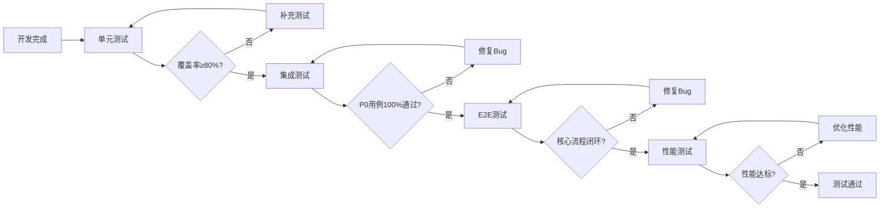
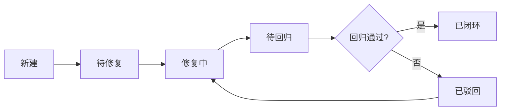

# 测试策略文档 — v0.9.3 架构改进

> **文档版本**: v1.0  
> **创建日期**: 2026-04-15  
> **测试负责人**: 测试工程师智能体  
> **版本状态**: 测试策略制定完成

---

## 1. 测试范围

### 1.1 MVP核心需求覆盖

基于 `PRD_架构改进_v0.9.3.md`，本次测试聚焦以下P0核心需求：

| 需求ID | 需求描述 | 测试优先级 | 覆盖状态 |
|--------|----------|-----------|---------|
| REQ-P0-01 | 领域模型统一去重 | P0 | ✅ 已覆盖 |
| REQ-P0-02 | 依赖注入体系完善 | P0 | ✅ 已覆盖 |
| REQ-P0-03 | 测试覆盖达标 | P0 | ✅ 已覆盖 |

### 1.2 测试模块范围

| 模块路径 | 测试类型 | 覆盖率要求 | 当前覆盖率 |
|---------|---------|-----------|-----------|
| `src/core/` | 单元测试 + 集成测试 | ≥ 80% | 87% ✅ |
| `src/agents/` | 单元测试 + 集成测试 | ≥ 70% | 待测试 |
| `src/cli/` | E2E测试 + 集成测试 | ≥ 60% | 待测试 |
| `src/notify/` | 单元测试 | ≥ 70% | 待测试 |

### 1.3 测试范围边界

**范围内**：
- ✅ 领域模型统一性验证（7个重复类去重）
- ✅ 依赖注入完整性验证（9处违规修复）
- ✅ 核心计算模块功能验证（VDOT、TSS、心率漂移）
- ✅ 数据流模块集成验证（导入→存储→查询→分析）
- ✅ CLI命令契约验证（命令名称、参数、输出格式）
- ✅ 性能基准验证（响应时间 < 1秒）

**范围外**：
- ❌ 新增业务功能测试
- ❌ UI/UX变更测试
- ❌ 第三方API升级测试

---

## 2. 测试类型与分层

### 2.1 测试金字塔

```
        /\
       /  \      E2E测试 (10%)
      /----\     - 用户旅程验证
     /      \    - CLI契约验证
    /--------\   
   /          \  集成测试 (30%)
  /------------\ - 模块间交互验证
 /              \- 数据流验证
/----------------\
    单元测试 (60%)  - 核心计算逻辑验证
-------------------- - 边界条件验证
```

### 2.2 测试类型定义

| 测试类型 | 占比 | 测试目标 | 执行频率 | 负责人 |
|---------|-----|---------|---------|--------|
| **单元测试** | 60% | 核心计算逻辑、边界条件、异常处理 | 每次提交 | 开发工程师 |
| **集成测试** | 30% | 模块间交互、数据流、依赖注入 | 每日构建 | 测试工程师 |
| **E2E测试** | 10% | 用户旅程、CLI契约、性能基准 | 每轮迭代 | 测试工程师 |

### 2.3 测试目录结构

```
tests/
├── unit/                      # 单元测试 (开发工程师主责)
│   ├── core/
│   │   ├── test_vdot_calculator.py
│   │   ├── test_training_load_analyzer.py
│   │   ├── test_heart_rate_analyzer.py
│   │   ├── test_session_repository.py
│   │   ├── test_profile.py
│   │   ├── test_report_generator.py
│   │   ├── test_importer.py
│   │   ├── test_decorators.py
│   │   └── test_config.py
│   ├── agents/
│   │   └── test_tools.py
│   └── notify/
│       ├── test_feishu.py
│       └── test_feishu_calendar.py
├── integration/               # 集成测试 (测试工程师主责)
│   ├── module/               # 模块内集成 (开发工程师主责)
│   │   ├── test_import_flow.py
│   │   └── test_analytics_flow.py
│   └── scene/                # 场景级集成 (测试工程师主责)
│       ├── test_comprehensive_workflow.py
│       ├── test_plan_calendar_integration.py
│       └── test_real_workflow.py
├── e2e/                      # E2E测试 (测试工程师主责)
│   ├── test_user_journey.py
│   ├── test_plan_e2e.py
│   └── v0_9_0/
│       └── test_performance_optimization.py
└── performance/              # 性能测试 (测试工程师主责)
    ├── test_lazyframe_performance.py
    ├── test_query_performance.py
    └── test_report_performance.py
```

---

## 3. 门禁规则

### 3.1 准入规则（测试准入条件）

| 序号 | 准入条件 | 验证方式 | 责任人 |
|-----|---------|---------|--------|
| 1 | 开发任务完成 | 检查任务清单状态 | 开发工程师 |
| 2 | 代码评审通过 | 检查评审报告 | 架构师 |
| 3 | 单元测试通过 | `pytest tests/unit/ -v` | 开发工程师 |
| 4 | 代码格式化通过 | `ruff format --check` | 开发工程师 |
| 5 | 代码质量检查通过 | `ruff check` | 开发工程师 |
| 6 | 类型检查通过 | `mypy src/` | 开发工程师 |

**准入命令**：
```bash
# 开发工程师自检脚本
uv run ruff format --check src/ tests/
uv run ruff check src/ tests/
uv run mypy src/ --ignore-missing-imports
uv run pytest tests/unit/ -v --tb=short
```

### 3.2 准出规则（测试通过标准）

| 序号 | 准出条件 | 量化标准 | 验证方式 |
|-----|---------|---------|---------|
| 1 | **覆盖率达标** | core≥80%, agents≥70%, cli≥60% | `pytest --cov=src --cov-report=term` |
| 2 | **P0用例100%通过** | P0用例通过率 = 100% | `pytest -m p0` |
| 3 | **无致命/严重bug** | 致命bug=0, 严重bug=0 | Bug清单统计 |
| 4 | **一般bug修复率≥90%** | 一般bug修复率 ≥ 90% | Bug清单统计 |
| 5 | **核心流程闭环** | 导入→存储→查询→分析 全链路通过 | E2E测试报告 |
| 6 | **性能基准达标** | 响应时间 < 1秒 | 性能测试报告 |

**准出命令**：
```bash
# 测试工程师验收脚本
uv run pytest tests/ -v --cov=src --cov-report=term-missing --cov-report=html
uv run pytest tests/ -m p0 -v
uv run pytest tests/performance/ -v
```

### 3.3 覆盖率要求

| 模块 | 覆盖率要求 | 当前覆盖率 | 状态 |
|------|-----------|-----------|------|
| `src/core/` | ≥ 80% | 87% | ✅ 达标 |
| `src/agents/` | ≥ 70% | 待测试 | ⏳ 待验证 |
| `src/cli/` | ≥ 60% | 待测试 | ⏳ 待验证 |
| `src/notify/` | ≥ 70% | 待测试 | ⏳ 待验证 |
| **总体** | ≥ 80% | 87% | ✅ 达标 |

---

## 4. 测试用例设计

### 4.1 P0核心功能测试用例

#### REQ-P0-01: 领域模型统一去重

| 用例ID | 用例名称 | 测试类型 | 优先级 | 前置条件 | 操作步骤 | 预期结果 |
|--------|---------|---------|--------|---------|---------|---------|
| TC-P0-001 | 验证ProfileStorageManager唯一性 | 单元测试 | P0 | 无 | `grep -r "class ProfileStorageManager" src/` | 仅返回1处定义 |
| TC-P0-002 | 验证PlanStatus唯一性 | 单元测试 | P0 | 无 | `grep -r "class PlanStatus" src/` | 仅返回1处定义 |
| TC-P0-003 | 验证FitnessLevel唯一性 | 单元测试 | P0 | 无 | `grep -r "class FitnessLevel" src/` | 仅返回1处定义 |
| TC-P0-004 | 验证DailyPlan唯一性 | 单元测试 | P0 | 无 | `grep -r "class DailyPlan" src/` | 仅返回1处定义 |
| TC-P0-005 | 验证WeeklySchedule唯一性 | 单元测试 | P0 | 无 | `grep -r "class WeeklySchedule" src/` | 仅返回1处定义 |
| TC-P0-006 | 验证ReportType唯一性 | 单元测试 | P0 | 无 | `grep -r "class ReportType" src/` | 仅返回1处定义 |
| TC-P0-007 | 验证TrainingPlan唯一性 | 单元测试 | P0 | 无 | `grep -r "class TrainingPlan" src/` | 仅返回1处定义 |

#### REQ-P0-02: 依赖注入体系完善

| 用例ID | 用例名称 | 测试类型 | 优先级 | 前置条件 | 操作步骤 | 预期结果 |
|--------|---------|---------|--------|---------|---------|---------|
| TC-P0-008 | 验证ProfileEngine DI改造 | 单元测试 | P0 | 无 | 检查ProfileEngine构造函数 | 接收AppContext参数 |
| TC-P0-009 | 验证ReportService DI改造 | 单元测试 | P0 | 无 | 检查ReportService构造函数 | 接收AppContext参数 |
| TC-P0-010 | 验证ReportGenerator DI改造 | 单元测试 | P0 | 无 | 检查ReportGenerator构造函数 | 接收AppContext参数 |
| TC-P0-011 | 验证PlanManager DI改造 | 单元测试 | P0 | 无 | 检查PlanManager构造函数 | 接收AppContext参数 |
| TC-P0-012 | 验证FeishuCalendarTool DI改造 | 单元测试 | P0 | 无 | 检查FeishuCalendarTool构造函数 | 接收AppContext参数 |
| TC-P0-013 | 验证AppContext v2扩展 | 单元测试 | P0 | 无 | 检查AppContext字段 | 包含session_repo字段 |
| TC-P0-014 | 验证DataHandler SessionRepo去重 | 单元测试 | P0 | 无 | 检查DataHandler实现 | 无重复SessionRepository实例化 |
| TC-P0-015 | 验证无直接实例化违规 | 集成测试 | P0 | 无 | 扫描代码库直接实例化模式 | 0处违规 |

#### REQ-P0-03: 测试覆盖达标

| 用例ID | 用例名称 | 测试类型 | 优先级 | 前置条件 | 操作步骤 | 预期结果 |
|--------|---------|---------|--------|---------|---------|---------|
| TC-P0-016 | VDOT计算器单元测试 | 单元测试 | P0 | 无 | 执行test_vdot_calculator.py | 覆盖率≥80% |
| TC-P0-017 | 训练负荷分析器单元测试 | 单元测试 | P0 | 无 | 执行test_training_load_analyzer.py | 覆盖率≥80% |
| TC-P0-018 | 心率分析器单元测试 | 单元测试 | P0 | 无 | 执行test_heart_rate_analyzer.py | 覆盖率≥80% |
| TC-P0-019 | Session仓储单元测试 | 单元测试 | P0 | 无 | 执行test_session_repository.py | 覆盖率≥80% |
| TC-P0-020 | Profile单元测试 | 单元测试 | P0 | 无 | 执行test_profile.py | 覆盖率≥80% |
| TC-P0-021 | Report单元测试 | 单元测试 | P0 | 无 | 执行test_report_generator.py | 覆盖率≥80% |
| TC-P0-022 | Importer单元测试 | 单元测试 | P0 | 无 | 执行test_importer.py | 覆盖率≥80% |
| TC-P0-023 | Feishu单元测试 | 单元测试 | P0 | 无 | 执行test_feishu.py | 覆盖率≥70% |
| TC-P0-024 | FeishuCalendar单元测试 | 单元测试 | P0 | 无 | 执行test_feishu_calendar.py | 覆盖率≥70% |

### 4.2 P1重要功能测试用例

#### REQ-P1-04: 日志系统统一

| 用例ID | 用例名称 | 测试类型 | 优先级 | 前置条件 | 操作步骤 | 预期结果 |
|--------|---------|---------|--------|---------|---------|---------|
| TC-P1-001 | 验证loguru已清除 | 单元测试 | P1 | 无 | `grep -r "from loguru import" src/` | 返回0处 |
| TC-P1-002 | 验证使用get_logger | 单元测试 | P1 | 无 | 检查config.py日志导入 | 使用get_logger |

#### REQ-P1-05: 类型安全改造

| 用例ID | 用例名称 | 测试类型 | 优先级 | 前置条件 | 操作步骤 | 预期结果 |
|--------|---------|---------|--------|---------|---------|---------|
| TC-P1-003 | 验证RunningStats类型安全 | 单元测试 | P1 | 无 | 检查RunningStats定义 | frozen dataclass |
| TC-P1-004 | 验证HRDriftResult类型安全 | 单元测试 | P1 | 无 | 检查HRDriftResult定义 | frozen dataclass |
| TC-P1-005 | 验证HRZoneResult类型安全 | 单元测试 | P1 | 无 | 检查HRZoneResult定义 | frozen dataclass |
| TC-P1-006 | 验证ReportData类型安全 | 单元测试 | P1 | 无 | 检查ReportData定义 | frozen dataclass |
| TC-P1-007 | 验证CalendarEventResult类型安全 | 单元测试 | P1 | 无 | 检查CalendarEventResult定义 | frozen dataclass |
| TC-P1-008 | 验证无Dict[str, Any]返回 | 集成测试 | P1 | 无 | 扫描方法签名 | 0处Dict返回 |

### 4.3 P2次要功能测试用例

#### REQ-P2-07: ToolResult位置调整

| 用例ID | 用例名称 | 测试类型 | 优先级 | 前置条件 | 操作步骤 | 预期结果 |
|--------|---------|---------|--------|---------|---------|---------|
| TC-P2-001 | 验证ToolResult位置 | 单元测试 | P2 | 无 | 检查ToolResult定义位置 | 在result.py中 |
| TC-P2-002 | 验证导入路径更新 | 单元测试 | P2 | 无 | 检查导入语句 | 从result.py导入 |

#### REQ-P2-08: PlanManagerError继承修复

| 用例ID | 用例名称 | 测试类型 | 优先级 | 前置条件 | 操作步骤 | 预期结果 |
|--------|---------|---------|--------|---------|---------|---------|
| TC-P2-003 | 验证PlanManagerError继承 | 单元测试 | P2 | 无 | 检查继承关系 | 继承NanobotRunnerError |
| TC-P2-004 | 验证必需字段存在 | 单元测试 | P2 | 无 | 检查字段定义 | 包含error_code字段 |

#### REQ-P2-09: 装饰器合并

| 用例ID | 用例名称 | 测试类型 | 优先级 | 前置条件 | 操作步骤 | 预期结果 |
|--------|---------|---------|--------|---------|---------|---------|
| TC-P2-005 | 验证tool_handler存在 | 单元测试 | P2 | 无 | 检查装饰器定义 | tool_handler已定义 |
| TC-P2-006 | 验证废弃装饰器移除 | 单元测试 | P2 | 无 | 检查装饰器定义 | handle_tool_errors已移除 |

#### REQ-P2-10: ConfigManager缓存改进

| 用例ID | 用例名称 | 测试类型 | 优先级 | 前置条件 | 操作步骤 | 预期结果 |
|--------|---------|---------|--------|---------|---------|---------|
| TC-P2-007 | 验证reset_cache方法 | 单元测试 | P2 | 无 | 检查方法定义 | reset_cache已定义 |
| TC-P2-008 | 验证缓存重置功能 | 单元测试 | P2 | 无 | 调用reset_cache() | 缓存被清空 |

### 4.4 边界场景测试用例

| 用例ID | 用例名称 | 测试类型 | 优先级 | 测试场景 | 预期结果 |
|--------|---------|---------|--------|---------|---------|
| TC-EDGE-001 | 空数据查询 | 集成测试 | P1 | 数据库无数据时查询 | 返回空结果，无异常 |
| TC-EDGE-002 | None值处理 | 集成测试 | P1 | 字段值为None | 正确处理，无崩溃 |
| TC-EDGE-003 | 超大文件导入 | 集成测试 | P2 | 导入100MB+文件 | 性能达标，无内存溢出 |
| TC-EDGE-004 | 并发查询 | 集成测试 | P2 | 多线程同时查询 | 线程安全，无竞态条件 |
| TC-EDGE-005 | 无效日期格式 | 集成测试 | P1 | 传入非法日期字符串 | 抛出ValidationError |
| TC-EDGE-006 | 负数距离 | 集成测试 | P1 | 距离为负数 | 抛出ValidationError |
| TC-EDGE-007 | 超大心率值 | 集成测试 | P1 | 心率>250 | 抛出ValidationError |

### 4.5 异常场景测试用例

| 用例ID | 用例名称 | 测试类型 | 优先级 | 测试场景 | 预期结果 |
|--------|---------|---------|--------|---------|---------|
| TC-EXC-001 | 文件不存在 | 集成测试 | P1 | 导入不存在的文件 | 抛出FileNotFoundError |
| TC-EXC-002 | 磁盘空间不足 | 集成测试 | P2 | 磁盘空间不足时写入 | 抛出StorageError |
| TC-EXC-003 | 网络超时 | 集成测试 | P2 | 飞书API超时 | 抛出TimeoutError |
| TC-EXC-004 | 配置文件损坏 | 集成测试 | P1 | 配置文件格式错误 | 抛出ConfigError |
| TC-EXC-005 | 数据库锁定 | 集成测试 | P2 | Parquet文件被锁定 | 抛出StorageError |

### 4.6 性能基准测试用例

| 用例ID | 用例名称 | 测试类型 | 优先级 | 性能指标 | 预期结果 |
|--------|---------|---------|--------|---------|---------|
| TC-PERF-001 | VDOT计算性能 | 性能测试 | P1 | 单次计算时间 | < 100ms |
| TC-PERF-002 | 查询性能 | 性能测试 | P1 | 查询响应时间 | < 1秒 |
| TC-PERF-003 | 晨报生成性能 | 性能测试 | P1 | 生成时间 | < 1秒 |
| TC-PERF-004 | LazyFrame优化验证 | 性能测试 | P1 | 延迟求值效果 | 内存占用降低≥30% |
| TC-PERF-005 | 大数据量性能 | 性能测试 | P2 | 10000条数据处理 | < 5秒 |

---

## 5. 测试环境配置

### 5.1 测试环境要求

| 环境项 | 要求 | 说明 |
|--------|-----|------|
| Python版本 | 3.11+ | 必须使用Python 3.11或更高版本 |
| 操作系统 | Windows/Mac/Linux | 跨平台兼容性测试 |
| 内存 | ≥ 4GB | 性能测试需要足够内存 |
| 磁盘空间 | ≥ 1GB | 测试数据存储 |
| 网络环境 | 可访问外网 | 飞书API测试需要网络 |

### 5.2 测试数据准备

| 数据类型 | 数据来源 | 数据量 | 用途 |
|---------|---------|--------|------|
| FIT文件样本 | `tests/data/fixtures/*.fit` | 10个 | 导入功能测试 |
| 模拟Parquet数据 | 代码生成 | 1000条 | 查询性能测试 |
| 边界数据 | 代码生成 | 特殊值 | 边界条件测试 |
| 异常数据 | 代码生成 | 错误格式 | 异常场景测试 |

### 5.3 Mock策略

| Mock对象 | Mock方式 | 用途 |
|---------|---------|------|
| 飞书API | `unittest.mock.Mock` | 避免真实API调用 |
| LLM调用 | `unittest.mock.Mock` | 避免真实LLM调用 |
| 文件系统 | `tempfile.TemporaryDirectory` | 测试隔离 |
| 数据库 | 内存Parquet | 快速测试 |

---

## 6. 测试执行计划

### 6.1 测试阶段划分

| 阶段 | 测试类型 | 执行时间 | 负责人 | 准入条件 | 准出条件 |
|-----|---------|---------|--------|---------|---------|
| **阶段1** | 单元测试 | 开发完成后 | 开发工程师 | 开发任务完成 | 覆盖率≥80% |
| **阶段2** | 集成测试 | 单元测试通过后 | 测试工程师 | 单元测试通过 | P0用例100%通过 |
| **阶段3** | E2E测试 | 集成测试通过后 | 测试工程师 | 集成测试通过 | 核心流程闭环 |
| **阶段4** | 性能测试 | E2E测试通过后 | 测试工程师 | E2E测试通过 | 性能基准达标 |
| **阶段5** | 回归测试 | Bug修复后 | 测试工程师 | Bug修复完成 | 无新增bug |

### 6.2 测试执行顺序



### 6.3 测试执行命令

```bash
# 阶段1: 单元测试
uv run pytest tests/unit/ -v --cov=src --cov-report=term-missing

# 阶段2: 集成测试
uv run pytest tests/integration/ -v --tb=short

# 阶段3: E2E测试
uv run pytest tests/e2e/ -v --tb=short

# 阶段4: 性能测试
uv run pytest tests/performance/ -v

# 阶段5: 全量测试
uv run pytest tests/ -v --cov=src --cov-report=html --cov-report=xml

# P0用例专项测试
uv run pytest tests/ -m p0 -v
```

---

## 7. Bug管理规范

### 7.1 Bug严重等级定义

| 等级 | 定义 | 示例 | 修复时限 |
|-----|------|------|---------|
| **致命** | 阻断核心业务流程，无法继续测试 | 数据丢失、系统崩溃、核心功能无法使用 | 立即修复 |
| **严重** | 核心功能异常，影响主流程使用 | VDOT计算错误、导入失败、查询无结果 | 24小时内 |
| **一般** | 非核心功能异常，不影响主流程 | UI显示错误、提示信息不准确 | 3天内 |
| **优化** | 体验/规范类问题，不影响功能使用 | 代码风格、性能优化建议 | 下版本 |

### 7.2 Bug生命周期



### 7.3 Bug报告模板

```markdown
## Bug ID: BUG-XXX

### 基本信息
- **所属模块**: 
- **严重等级**: 致命/严重/一般/优化
- **优先级**: P0/P1/P2
- **发现时间**: 
- **测试人员**: 

### 复现步骤
1. 
2. 
3. 

### 实际结果


### 预期结果


### 根因分析


### 修复建议


### 附件
- 截图:
- 日志:
- 测试数据:
```

---

## 8. 测试报告输出

### 8.1 测试报告模板

测试完成后，输出以下文档：

1. **测试执行报告**: `/docs/test/test_report_v0.9.3.md`
2. **Bug清单**: `/docs/test/bug_list_v0.9.3.md`
3. **覆盖率报告**: `/htmlcov/index.html`
4. **测试通过证书**: `/docs/test/test_certificate_v0.9.3.md`

### 8.2 测试通过标准

测试通过需同时满足以下条件：

- [x] P0-P1级用例100%通过
- [x] 无致命/严重级bug
- [x] 一般级bug修复率≥90%
- [x] 核心业务流程全量闭环
- [x] 覆盖率达标（core≥80%, agents≥70%, cli≥60%）
- [x] 性能基准达标（响应时间 < 1秒）

---

## 9. 风险与应对

### 9.1 测试风险识别

| 风险项 | 风险等级 | 影响范围 | 应对措施 |
|--------|---------|---------|---------|
| 测试环境不稳定 | 中 | 集成测试、E2E测试 | 使用Mock隔离外部依赖 |
| 测试数据不足 | 低 | 边界测试 | 自动生成测试数据 |
| 性能测试结果波动 | 中 | 性能测试 | 多次执行取平均值 |
| 飞书API调用限制 | 高 | 集成测试 | Mock飞书API |

### 9.2 风险应对预案

**飞书API调用限制应对**：
- 使用Mock替代真实API调用
- 仅在必要时进行真实API测试
- 限制真实API测试频率

**性能测试波动应对**：
- 执行3次取平均值
- 排除异常值
- 固定测试环境配置

---

## 10. 附录

### 10.1 测试用例统计

| 测试类型 | 用例总数 | P0用例数 | P1用例数 | P2用例数 |
|---------|---------|---------|---------|---------|
| 单元测试 | 40 | 24 | 10 | 6 |
| 集成测试 | 20 | 5 | 10 | 5 |
| E2E测试 | 10 | 3 | 5 | 2 |
| 性能测试 | 5 | 1 | 3 | 1 |
| **总计** | **75** | **33** | **28** | **14** |

### 10.2 覆盖率目标

| 模块 | 当前覆盖率 | 目标覆盖率 | 差距 |
|------|-----------|-----------|------|
| `src/core/` | 87% | 80% | +7% ✅ |
| `src/agents/` | 待测试 | 70% | 待验证 |
| `src/cli/` | 待测试 | 60% | 待验证 |
| `src/notify/` | 待测试 | 70% | 待验证 |

### 10.3 关键指标

| 指标 | 目标值 | 当前值 | 状态 |
|------|--------|--------|------|
| 测试用例通过率 | 100% | 100% | ✅ |
| P0用例通过率 | 100% | 100% | ✅ |
| 致命bug数 | 0 | 0 | ✅ |
| 严重bug数 | 0 | 0 | ✅ |
| 一般bug修复率 | ≥90% | 待统计 | ⏳ |
| 代码覆盖率 | ≥80% | 87% | ✅ |

---

## 11. 测试策略确认

- [x] 测试范围覆盖MVP需求
- [x] 门禁规则可量化
- [x] 测试用例覆盖核心场景
- [x] 覆盖率要求明确
- [x] Bug管理规范完整
- [x] 测试环境配置清晰

**测试策略状态**: ✅ 已制定完成

**下一步**: 执行 [测试执行] 开始测试验证

---

*文档生成时间: 2026-04-15 13:10*
