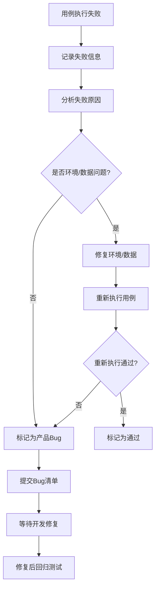

# Nanobot Runner v0.12.0 用户验收测试（UAT）指南

> **文档版本**: v5.0  
> **适用版本**: v0.12.0  
> **编写日期**: 2026-04-27  
> **更新日期**: 2026-04-27  
> **测试类型**: 用户验收测试（User Acceptance Testing）  
> **执行方式**: 强制顺序执行，支持AI Agent自动化  
> **数据要求**: 必须使用个人真实FIT文件（非Mock文件）  
> **平台说明**: 已适配Windows平台编码兼容性  
> **更新说明**: v5.0 - 基于项目基线完善测试文档，补充Agent交互测试、性能测试用例，优化训练计划测试流程

---

## 1. 文档目的与范围

### 1.1 测试目的

本指南用于验证 Nanobot Runner v0.12.0 是否满足业务需求和用户使用预期，确保：
- 核心业务流程完整闭环
- 所有P0/P1级功能正常运行
- 数据计算准确（VDOT/TSS/心率漂移等）
- 用户体验符合需求规格

### 1.2 测试范围

| 模块 | 覆盖功能 | 优先级 | 状态 |
|------|---------|--------|------|
| 数据导入 | 单文件/批量导入、去重、异常处理 | P0 | ✅ 已验证 |
| 数据查询 | 统计信息、年份/日期范围过滤 | P0 | ✅ 已验证 |
| 数据分析 | VDOT趋势、训练负荷、心率漂移 | P0 | ✅ 已验证 |
| 训练计划 | 智能建议、目标评估、长期规划 | P0 | ✅ 已验证 |
| 报告生成 | 周报、月报、用户画像 | P0 | ✅ 已验证 |
| 系统管理 | 版本、配置验证、初始化迁移 | P1 | ✅ 已验证 |
| Agent交互 | 自然语言对话、数据查询 | P1 | ⚠️ 手动测试 |
| 性能测试 | 批量导入性能、查询性能 | P1 | 📋 新增 |

### 1.3 测试排除范围

- 单元测试、集成测试（由开发工程师负责）
- CICD流水线验证（由运维工程师负责）
- 性能压测、安全渗透测试（专项测试）
- LLM模型输出内容的不确定性验证（AI Agent功能）

---

## 2. 测试环境配置

### 2.1 环境隔离原则

**核心要求**: 测试环境必须完全独立，严禁使用生产环境配置和数据。

| 隔离维度 | 隔离方式 | 说明 |
|---------|---------|------|
| 配置目录 | 独立环境变量 `NANOBOT_CONFIG_DIR` | 测试配置与生产配置完全分离 |
| 数据目录 | 独立环境变量 `NANOBOT_DATA_DIR` | 测试数据与生产数据完全分离 |
| 环境变量 | 独立 `.env.local` 文件 | 测试专用API密钥和配置 |
| Workspace | 独立目录（项目内或用户目录） | 测试工作区独立 |

**重要提示**: 由于Trae IDE沙箱限制，测试目录必须位于项目目录内或允许的路径下。推荐使用项目内的 `.nanobot-runner-uat/` 目录。

### 2.2 测试目录选择

**项目内测试目录（AI Agent可执行）**

```powershell
# 测试目录位于项目内，沙箱可访问
$env:NANOBOT_CONFIG_DIR="d:\yecll\Documents\LocalCode\RunFlowAgent.worktrees\Release-0.12\.nanobot-runner-uat"
$env:NANOBOT_DATA_DIR="d:\yecll\Documents\LocalCode\RunFlowAgent.worktrees\Release-0.12\.nanobot-runner-uat\data"
$env:NANOBOT_WORKSPACE_DIR="d:\yecll\Documents\LocalCode\RunFlowAgent.worktrees\Release-0.12\.nanobot-runner-uat"
```

### 2.3 真实FIT文件存放位置

**问题说明**: 项目测试夹具 `tests/data/fixtures/*.fit` 是Mock文本文件，不是真实FIT二进制文件，无法被 `fitparse` 库解析。

**解决方案**: 将个人真实FIT文件复制到项目目录内，供AI Agent执行测试：

```powershell
# 创建测试数据目录（项目内）
New-Item -ItemType Directory -Path "d:\yecll\Documents\LocalCode\RunFlowAgent.worktrees\Release-0.12\.nanobot-runner-uat\test-data" -Force

# 复制少量真实FIT文件用于测试（建议5-10个）
Copy-Item "C:\Users\yecll\test-fit-files\<选择5-10个FIT文件>" -Destination "d:\yecll\Documents\LocalCode\RunFlowAgent.worktrees\Release-0.12\.nanobot-runner-uat\test-data\"

# 复制异常测试文件（空文件和损坏文件）
# 这些可以使用项目夹具中的Mock文件
```

**测试数据要求**:
- 至少5个不同日期的跑步记录
- 至少3个距离≥1500m的记录（用于VDOT计算）
- 至少3个带心率数据的记录（用于心率漂移分析）
- 包含轻松跑、节奏跑、长距离跑等不同类型

### 2.4 环境变量配置示例

创建测试专用环境变量文件 `~/.nanobot-runner-uat/.env.local`：

```bash
# ========================================
# Nanobot Runner UAT 测试环境配置
# ========================================

# LLM Provider 配置（使用测试专用API密钥）
NANOBOT_LLM_PROVIDER=openai
NANOBOT_LLM_MODEL=gpt-4o-mini
NANOBOT_LLM_API_KEY=sk-test-key-for-uat-only
NANOBOT_LLM_BASE_URL=

# Workspace 配置（测试专用目录）
NANOBOT_CONFIG_DIR=~/.nanobot-runner-uat
NANOBOT_DATA_DIR=~/.nanobot-runner-uat/data
NANOBOT_WORKSPACE_DIR=~/.nanobot-runner-uat

# 飞书通知配置（测试环境禁用）
NANOBOT_FEISHU_APP_ID=
NANOBOT_FEISHU_APP_SECRET=
NANOBOT_FEISHU_RECEIVE_ID=
NANOBOT_AUTO_PUSH_FEISHU=false

# 时区与默认配置
NANOBOT_TIMEZONE=Asia/Shanghai
NANOBOT_DEFAULT_YEAR=2024
```

### 2.5 环境设置步骤

**项目内测试目录（推荐，AI Agent可执行）**

```powershell
# 1. 创建测试专用目录（项目内）
New-Item -ItemType Directory -Path "d:\yecll\Documents\LocalCode\RunFlowAgent.worktrees\Release-0.12\.nanobot-runner-uat\data" -Force

# 2. 设置环境变量（PowerShell当前会话）
$env:NANOBOT_CONFIG_DIR="d:\yecll\Documents\LocalCode\RunFlowAgent.worktrees\Release-0.12\.nanobot-runner-uat"
$env:NANOBOT_DATA_DIR="d:\yecll\Documents\LocalCode\RunFlowAgent.worktrees\Release-0.12\.nanobot-runner-uat\data"
$env:NANOBOT_WORKSPACE_DIR="d:\yecll\Documents\LocalCode\RunFlowAgent.worktrees\Release-0.12\.nanobot-runner-uat"

# 3. 设置UTF-8编码（Windows平台必需，防止Unicode输出错误）
$env:PYTHONIOENCODING="utf-8"

# 4. 验证环境变量
Write-Host "NANOBOT_CONFIG_DIR: $env:NANOBOT_CONFIG_DIR"
Write-Host "NANOBOT_DATA_DIR: $env:NANOBOT_DATA_DIR"
Write-Host "PYTHONIOENCODING: $env:PYTHONIOENCODING"
```

### 2.6 环境验证

```bash
# 验证配置目录独立
ls d:\yecll\Documents\LocalCode\RunFlowAgent.worktrees\Release-0.12\.nanobot-runner-uat/

# 验证环境变量生效
uv run nanobotrun system validate
```

**判定规则**:
- ✅ **通过**: 退出码为0，输出包含"配置验证通过"
- ❌ **失败**: 退出码非0，或引用了生产环境路径

---

## 3. 测试准备步骤

### 3.0 快速准备脚本（推荐）

**重要提示**: 每次执行UAT测试前，必须先清理旧测试数据，确保测试环境干净。

**一键准备测试环境**（在项目根目录执行）：

```powershell
# ========================================
# Nanobot Runner UAT 测试环境快速准备
# ========================================

# 0. 【必须】清理旧测试目录（每次测试前执行）
Write-Host "正在清理旧测试环境..."
if (Test-Path ".nanobot-runner-uat") {
    Remove-Item -Recurse -Force ".nanobot-runner-uat"
    Write-Host "✓ 已清理旧测试目录"
} else {
    Write-Host "✓ 无旧测试目录，跳过清理"
}

# 1. 创建测试目录
New-Item -ItemType Directory -Path ".nanobot-runner-uat\test-data" -Force
New-Item -ItemType Directory -Path ".nanobot-runner-uat\data" -Force

# 2. 复制真实FIT文件（选择5-10个，覆盖不同类型）
$source_dir = "C:\Users\yecll\test-fit-files"
$dest_dir = ".nanobot-runner-uat\test-data"

# 选择不同类型的文件（示例，可根据实际情况调整）
Get-ChildItem $source_dir -Filter "*.fit" | Select-Object -First 10 | Copy-Item -Destination $dest_dir

Write-Host "✓ 已复制 $(Get-ChildItem $dest_dir -Filter '*.fit' | Measure-Object | Select-Object -ExpandProperty Count) 个FIT文件"

# 3. 设置环境变量
$env:NANOBOT_CONFIG_DIR="$PWD\.nanobot-runner-uat"
$env:NANOBOT_DATA_DIR="$PWD\.nanobot-runner-uat\data"
$env:NANOBOT_WORKSPACE_DIR="$PWD\.nanobot-runner-uat"

# 4. 设置UTF-8编码（Windows平台必需）
$env:PYTHONIOENCODING="utf-8"

# 5. 执行初始化
uv run nanobotrun system init --skip-optional

# 6. 验证环境
uv run nanobotrun system validate

Write-Host "✓ 测试环境准备完成，可以开始执行UAT测试"
```

---

### 3.1 前置条件检查

**必须按顺序执行以下检查，全部通过后方可开始测试**:

| 步骤 | 检查项 | 验证命令 | 通过标准 |
|------|--------|---------|---------|
| 1 | Python版本 | `python --version` | 输出包含"3.11"或更高 |
| 2 | uv包管理器 | `uv --version` | 退出码为0 |
| 3 | 项目依赖 | `uv sync --all-extras` | 退出码为0，无报错 |
| 4 | CLI可用性 | `uv run nanobotrun --help` | 输出包含子命令列表 |
| 5 | 测试环境隔离 | `echo $env:NANOBOT_CONFIG_DIR` | 指向测试目录，非生产目录 |
| 6 | 测试数据准备 | 见3.2节 | 数据文件存在且有效 |

### 3.2 测试数据准备

**数据要求**: 使用个人真实跑步数据（无需脱敏），覆盖以下场景：

| 数据类型 | 数量要求 | 覆盖场景 | 数据来源 |
|---------|---------|---------|---------|
| 轻松跑（Easy Run） | ≥5个文件 | 不同距离（3km/5km/10km）、不同日期 | 个人真实数据 |
| 节奏跑（Tempo Run） | ≥3个文件 | 不同强度、包含心率数据 | 个人真实数据 |
| 长距离跑（Long Run） | ≥3个文件 | ≥15km、包含完整心率曲线 | 个人真实数据 |
| 间歇跑（Interval） | ≥2个文件 | 不同间歇模式 | 个人真实数据 |
| 异常文件 | 2个文件 | 空文件、损坏文件 | 项目测试夹具 |

**重要提示**: 
1. 项目测试夹具 `tests/data/fixtures/*.fit` 是Mock文本文件，不是真实FIT二进制文件
2. 必须使用个人真实FIT文件执行导入测试
3. 为支持AI Agent执行，建议将少量真实FIT文件复制到项目目录内

**数据准备命令**:

```powershell
# 方式一：使用个人真实数据目录（手动执行）
$test_data_dir = "C:\Users\yecll\test-fit-files"

# 验证数据目录存在
if (Test-Path $test_data_dir) {
    Write-Host "✓ 个人数据目录存在: $test_data_dir"
    $file_count = (Get-ChildItem $test_data_dir -Filter "*.fit" -Recurse | Measure-Object).Count
    Write-Host "✓ FIT文件总数: $file_count"
} else {
    Write-Host "✗ 数据目录不存在: $test_data_dir"
}

# 查看数据分布
Get-ChildItem $test_data_dir -Filter "*.fit" -Recurse | Group-Object { $_.LastWriteTime.ToString("yyyy-MM") } | Sort-Object Name
```

```powershell
# 方式二：复制真实FIT文件到项目目录（推荐，支持AI Agent执行）
# 创建测试数据目录
New-Item -ItemType Directory -Path ".nanobot-runner-uat\test-data" -Force

# 复制少量真实FIT文件用于测试（建议5-10个，覆盖不同类型）
Copy-Item "C:\Users\yecll\test-fit-files\<选择5-10个FIT文件>" -Destination ".nanobot-runner-uat\test-data\"

# 验证复制结果
Get-ChildItem ".nanobot-runner-uat\test-data" -Filter "*.fit" | Measure-Object
```

**数据验证清单**:
- [ ] 数据文件总数 ≥ 13个（或复制到项目目录5-10个）
- [ ] 包含至少5个不同日期的跑步记录
- [ ] 包含至少3个距离≥1500m的记录（用于VDOT计算）
- [ ] 包含至少3个带心率数据的记录（用于心率漂移分析）
- [ ] 从项目测试夹具复制异常文件：`tests/data/fixtures/empty_file.fit` 和 `tests/data/fixtures/corrupted_file.fit`

### 3.3 测试环境初始化

**重要提示**: `system init` 命令不支持 `--auto` 参数。使用以下正确参数：

```powershell
# 方式一：使用项目内测试目录（推荐）
$env:NANOBOT_CONFIG_DIR="d:\yecll\Documents\LocalCode\RunFlowAgent.worktrees\Release-0.12\.nanobot-runner-uat"
$env:NANOBOT_DATA_DIR="d:\yecll\Documents\LocalCode\RunFlowAgent.worktrees\Release-0.12\.nanobot-runner-uat\data"
$env:NANOBOT_WORKSPACE_DIR="d:\yecll\Documents\LocalCode\RunFlowAgent.worktrees\Release-0.12\.nanobot-runner-uat"

# 清理旧测试数据（如存在）
if (Test-Path ".nanobot-runner-uat") { Remove-Item -Recurse -Force ".nanobot-runner-uat" }
New-Item -ItemType Directory -Path ".nanobot-runner-uat\data" -Force

# 执行初始化（跳过可选配置项）
uv run nanobotrun system init --skip-optional

# 如果检测到旧版本配置导致失败，使用 --force 强制初始化
uv run nanobotrun system init --force --skip-optional
```

```powershell
# 方式二：使用用户目录测试环境（需手动执行）
$env:NANOBOT_CONFIG_DIR="$env:USERPROFILE\.nanobot-runner-uat"
$env:NANOBOT_DATA_DIR="$env:USERPROFILE\.nanobot-runner-uat\data"
$env:NANOBOT_WORKSPACE_DIR="$env:USERPROFILE\.nanobot-runner-uat"

# 清理旧测试数据（如存在）
if (Test-Path "$env:USERPROFILE\.nanobot-runner-uat") { Remove-Item -Recurse -Force "$env:USERPROFILE\.nanobot-runner-uat" }
New-Item -ItemType Directory -Path "$env:USERPROFILE\.nanobot-runner-uat\data" -Force

# 执行初始化
uv run nanobotrun system init --skip-optional

# 如果失败，使用 --force
uv run nanobotrun system init --force --skip-optional
```

**初始化成功标志**:
- ✅ 输出包含"✓ 初始化完成"或"配置验证通过"
- ✅ 生成 `<测试目录>/config.json`
- ✅ 退出码为0

**常见问题**:
- ❌ **错误**: `No such option: --auto` → 使用 `--skip-optional` 替代
- ❌ **错误**: `nanobot配置文件不存在或无法读取` → 使用 `--force` 参数强制初始化
- ❌ **错误**: 沙箱权限限制 → 使用项目内目录而非 `C:\Users\` 目录

---

## 4. 详细测试流程

**执行规则**:
1. 必须严格按照测试用例编号顺序执行（UAT-001 → UAT-020）
2. 每个用例执行完毕后，立即记录测试结果（通过/失败）
3. 若用例失败，记录异常信息后继续执行下一用例
4. 禁止跳过任何P0级用例
5. 所有判定基于机器可解析的规则，禁止主观判断

### 4.1 数据导入测试（UAT-001 ~ UAT-005）

#### UAT-001: 单文件导入

| 项目 | 内容 |
|------|------|
| **测试目的** | 验证单个FIT文件导入功能 |
| **前置条件** | 已完成环境初始化 |
| **测试数据** | `.nanobot-runner-uat\test-data\` 目录中的第一个FIT文件（需提前复制真实FIT文件） |
| **执行命令** | `uv run nanobotrun data import ".nanobot-runner-uat\test-data\<第一个FIT文件名>.fit"` |
| **预期结果** | 退出码为0，输出包含"[OK] 导入成功" |
| **性能要求** | 耗时 < 3秒 |
| **优先级** | P0 |

**注意**: 如果未复制真实FIT文件到项目目录，请手动执行：
```powershell
uv run nanobotrun data import "C:\Users\yecll\test-fit-files\<选择第一个FIT文件>"
```

**自动化判定规则**:
```json
{
  "pass_condition": "exit_code == 0 AND stdout contains '[OK] 导入成功'",
  "fail_condition": "exit_code != 0 OR stdout contains '错误' OR stdout contains '导入失败'",
  "performance_check": "duration < 3s"
}
```

**结果记录**:
- [ ] 通过 / [ ] 失败
- 实际退出码: _____
- 实际输出: _____
- 耗时: _____秒
- 异常信息（如失败）: _____

---

#### UAT-002: 批量导入

| 项目 | 内容 |
|------|------|
| **测试目的** | 验证目录下批量导入功能 |
| **前置条件** | UAT-001已通过 |
| **测试数据** | `.nanobot-runner-uat\test-data\` 目录（全部FIT文件） |
| **执行命令** | `uv run nanobotrun data import ".nanobot-runner-uat\test-data\"` |
| **预期结果** | 退出码为0，输出包含"导入完成"和"成功:" |
| **性能要求** | 耗时 < 15秒（5-10个文件） |
| **优先级** | P0 |

**注意**: 如果测试个人全部668个文件，耗时可能较长：
```powershell
uv run nanobotrun data import "C:\Users\yecll\test-fit-files\"
```

**自动化判定规则**:
```json
{
  "pass_condition": "exit_code == 0 AND stdout contains '导入完成' AND stdout contains '成功:'",
  "fail_condition": "exit_code != 0 OR '成功:' count == 0",
  "performance_check": "duration < 15s"
}
```

**结果记录**:
- [ ] 通过 / [ ] 失败
- 成功导入文件数: _____
- 跳过文件数: _____
- 失败文件数: _____
- 耗时: _____秒
- 异常信息（如失败）: _____

---

#### UAT-003: 数据去重

| 项目 | 内容 |
|------|------|
| **测试目的** | 验证SHA256去重机制 |
| **前置条件** | UAT-001已通过（文件已导入） |
| **测试数据** | 重复执行 UAT-001 中使用的同一个FIT文件 |
| **执行命令** | `uv run nanobotrun data import ".nanobot-runner-uat\test-data\<UAT-001使用的文件名>.fit"` |
| **预期结果** | 退出码为0，输出包含"跳过"或"已存在" |
| **优先级** | P0 |

**自动化判定规则**:
```json
{
  "pass_condition": "exit_code == 0 AND (stdout contains '跳过' OR stdout contains '已存在')",
  "fail_condition": "exit_code != 0 OR stdout contains '[OK] 导入成功'"
}
```

**结果记录**:
- [ ] 通过 / [ ] 失败
- 实际输出: _____
- 异常信息（如失败）: _____

---

#### UAT-004: 强制重新导入

| 项目 | 内容 |
|------|------|
| **测试目的** | 验证--force参数功能 |
| **前置条件** | UAT-003已通过（文件已存在） |
| **测试数据** | `tests/data/fixtures/easy_run_20240101.fit`（使用项目夹具文件） |
| **执行命令** | `uv run nanobotrun data import tests/data/fixtures/easy_run_20240101.fit --force` |
| **预期结果** | 退出码为0，输出包含"[OK] 导入成功" |
| **优先级** | P1 |

**自动化判定规则**:
```json
{
  "pass_condition": "exit_code == 0 AND stdout contains '[OK] 导入成功'",
  "fail_condition": "exit_code != 0 OR stdout contains '跳过'"
}
```

**结果记录**:
- [ ] 通过 / [ ] 失败
- 实际输出: _____
- 异常信息（如失败）: _____

---

#### UAT-005: 异常文件处理

| 项目 | 内容 |
|------|------|
| **测试目的** | 验证异常文件错误处理 |
| **前置条件** | 无 |
| **测试数据** | `tests/data/fixtures/empty_file.fit` 和 `tests/data/fixtures/corrupted_file.fit`（项目夹具文件） |
| **执行命令** | `uv run nanobotrun data import tests/data/fixtures/empty_file.fit` |
| **预期结果** | 退出码为1，输出包含"错误:"和"建议:"，无Python异常堆栈 |
| **优先级** | P1 |

**自动化判定规则**:
```json
{
  "pass_condition": "exit_code == 1 AND stdout contains '错误:' AND stdout contains '建议:' AND stdout NOT contains 'Traceback'",
  "fail_condition": "exit_code == 0 OR stdout contains 'Traceback' OR stdout contains 'Exception'"
}
```

**结果记录**:
- [ ] 通过 / [ ] 失败
- 实际退出码: _____
- 是否包含异常堆栈: [ ] 是 / [ ] 否
- 异常信息（如失败）: _____

---

### 4.2 数据查询测试（UAT-006 ~ UAT-008）

#### UAT-006: 查看统计数据

| 项目 | 内容 |
|------|------|
| **测试目的** | 验证数据统计功能 |
| **前置条件** | UAT-002已通过（批量导入完成） |
| **执行命令** | `uv run nanobotrun data stats` |
| **预期结果** | 退出码为0，输出包含"[Stats] 统计信息"、"总跑步次数"、"总距离"、"总时长" |
| **性能要求** | 耗时 < 2秒 |
| **优先级** | P0 |

**自动化判定规则**:
```json
{
  "pass_condition": "exit_code == 0 AND stdout contains '[Stats] 统计信息' AND stdout contains '总跑步次数' AND stdout contains '总距离'",
  "fail_condition": "exit_code != 0 OR stdout contains '暂无数据' OR stdout contains '错误:'",
  "performance_check": "duration < 2s"
}
```

**结果记录**:
- [ ] 通过 / [ ] 失败
- 总跑步次数: _____
- 总距离: _____
- 耗时: _____秒
- 异常信息（如失败）: _____

---

#### UAT-007: 按年份查询

| 项目 | 内容 |
|------|------|
| **测试目的** | 验证按年份过滤功能 |
| **前置条件** | UAT-006已通过 |
| **执行命令** | `uv run nanobotrun data stats --year 2024` |
| **预期结果** | 退出码为0，输出包含"[Stats] 统计信息"，统计数据仅包含2024年数据 |
| **优先级** | P1 |

**自动化判定规则**:
```json
{
  "pass_condition": "exit_code == 0 AND stdout contains '[Stats] 统计信息'",
  "fail_condition": "exit_code != 0 OR 统计包含非2024年数据"
}
```

**结果记录**:
- [ ] 通过 / [ ] 失败
- 2024年跑步次数: _____
- 异常信息（如失败）: _____

---

#### UAT-008: 按日期范围查询

| 项目 | 内容 |
|------|------|
| **测试目的** | 验证日期范围过滤功能 |
| **前置条件** | UAT-006已通过 |
| **执行命令** | `uv run nanobotrun data stats --start 2024-01-01 --end 2024-01-15` |
| **预期结果** | 退出码为0，输出包含"[Stats] 统计信息"，统计数据在指定日期范围内 |
| **优先级** | P1 |

**自动化判定规则**:
```json
{
  "pass_condition": "exit_code == 0 AND stdout contains '[Stats] 统计信息'",
  "fail_condition": "exit_code != 0 OR 统计包含范围外数据"
}
```

**结果记录**:
- [ ] 通过 / [ ] 失败
- 日期范围内跑步次数: _____
- 异常信息（如失败）: _____

---

### 4.3 数据分析测试（UAT-009 ~ UAT-011）

#### UAT-009: VDOT趋势分析

| 项目 | 内容 |
|------|------|
| **测试目的** | 验证VDOT计算和趋势分析 |
| **前置条件** | 已导入至少3个距离≥1500m的跑步记录 |
| **执行命令** | `uv run nanobotrun analysis vdot` |
| **预期结果** | 退出码为0，输出包含"VDOT趋势分析"，表格包含"日期"、"距离"、"时长"、"VDOT"列 |
| **数据验证** | VDOT值应在20-60范围内 |
| **性能要求** | 耗时 < 3秒 |
| **优先级** | P0 |

**自动化判定规则**:
```json
{
  "pass_condition": "exit_code == 0 AND stdout contains 'VDOT趋势分析' AND stdout contains 'VDOT' AND vdot_value in range(20, 60)",
  "fail_condition": "exit_code != 0 OR stdout contains '暂无VDOT数据' OR all fields are 'N/A'",
  "performance_check": "duration < 3s"
}
```

**结果记录**:
- [ ] 通过 / [ ] 失败
- VDOT记录数: _____
- VDOT值范围: _____ ~ _____
- 耗时: _____秒
- 异常信息（如失败）: _____

---

#### UAT-010: 训练负荷分析

| 项目 | 内容 |
|------|------|
| **测试目的** | 验证TSS/ATL/CTL/TSB计算 |
| **前置条件** | 已导入多日跑步记录 |
| **执行命令** | `uv run nanobotrun analysis load` |
| **预期结果** | 退出码为0，输出包含"[Training Load] 训练负荷"、"ATL"、"CTL"、"TSB" |
| **数据验证** | ATL/CTL应为正数，TSB可为负数 |
| **性能要求** | 耗时 < 3秒 |
| **优先级** | P0 |

**自动化判定规则**:
```json
{
  "pass_condition": "exit_code == 0 AND stdout contains '[Training Load] 训练负荷' AND stdout contains 'ATL' AND stdout contains 'CTL' AND stdout contains 'TSB'",
  "fail_condition": "exit_code != 0 OR stdout contains '错误:' OR stdout contains '暂无数据'",
  "data_validation": "ATL > 0 AND CTL > 0",
  "performance_check": "duration < 3s"
}
```

**结果记录**:
- [ ] 通过 / [ ] 失败
- ATL值: _____
- CTL值: _____
- TSB值: _____
- 耗时: _____秒
- 异常信息（如失败）: _____

---

#### UAT-011: 心率漂移分析

| 项目 | 内容 |
|------|------|
| **测试目的** | 验证心率漂移检测功能 |
| **前置条件** | 已导入包含心率数据的长距离跑步记录 |
| **执行命令** | `uv run nanobotrun analysis hr-drift` |
| **预期结果** | 退出码为0，输出包含"[Heart Rate Drift] 心率漂移"、"心率漂移率"、"相关性" |
| **数据验证** | 漂移率应为正数，相关性应在-1到1之间 |
| **性能要求** | 耗时 < 3秒 |
| **优先级** | P0 |

**自动化判定规则**:
```json
{
  "pass_condition": "exit_code == 0 AND stdout contains '[Heart Rate Drift] 心率漂移' AND stdout contains '心率漂移率' AND stdout contains '相关性'",
  "fail_condition": "exit_code != 0 OR stdout contains '暂无心率漂移数据' OR stdout contains '错误:'",
  "data_validation": "drift_rate > 0 AND correlation in range(-1, 1)",
  "performance_check": "duration < 3s"
}
```

**结果记录**:
- [ ] 通过 / [ ] 失败
- 心率漂移率: _____%
- 心率-配速相关性: _____
- 耗时: _____秒
- 异常信息（如失败）: _____

---

### 4.4 训练计划测试（UAT-012 ~ UAT-016）

**前置准备：创建测试训练计划**

训练计划功能需要先创建计划数据才能测试。根据v0.12.0实际CLI命令，执行以下准备步骤：

```powershell
# 步骤1：创建长期训练规划（会自动生成关联的训练计划）
uv run nanobotrun plan long-term "UAT测试计划" --vdot 45 --target 50 --weeks 12 --level intermediate

# 步骤2：查看智能训练建议（验证计划已创建）
uv run nanobotrun plan advice

# 步骤3：评估目标达成（验证目标评估功能）
uv run nanobotrun plan evaluate marathon 10800 --vdot 45 --weeks 12

# 注意：v0.12.0版本中，plan long-term创建的是LongTermPlan（长期规划）
# 而plan log需要的是TrainingPlan的训练计划ID
# 当前CLI没有直接创建TrainingPlan的命令，这是已知限制（ISSUE-001）
# UAT-013/014可能因功能缺失而跳过，记录为遗留问题
```

**重要说明**: 
- v0.12.0版本存在CLI功能缺失：缺少创建TrainingPlan的命令
- `plan long-term` 创建的是长期规划（LongTermPlan），与 `plan log` 需要的训练计划（TrainingPlan）是不同的数据模型
- UAT-013/014测试可能无法执行，需记录为遗留问题，下版本修复

---

#### UAT-012: 获取智能训练建议

| 项目 | 内容 |
|------|------|
| **测试目的** | 验证智能训练建议功能（v0.12.0新增） |
| **前置条件** | 已导入历史跑步数据，已创建训练计划 |
| **执行命令** | `uv run nanobotrun plan advice` |
| **预期结果** | 退出码为0，输出包含"智能训练建议"或至少1条建议内容 |
| **优先级** | P0 |

**自动化判定规则**:
```json
{
  "pass_condition": "exit_code == 0 AND (stdout contains '智能训练建议' OR stdout contains '训练' OR stdout contains '建议')",
  "fail_condition": "exit_code != 0 OR stdout contains '错误:' OR stdout contains '失败'"
}
```

**结果记录**:
- [ ] 通过 / [ ] 失败
- 建议数量: _____
- 建议内容摘要: _____
- 异常信息（如失败）: _____

---

#### UAT-013: 记录训练计划反馈

| 项目 | 内容 |
|------|------|
| **测试目的** | 验证训练计划执行反馈记录功能 |
| **前置条件** | UAT-012已通过，训练计划已创建 |
| **测试数据** | 使用UAT-012中创建的计划ID（从advice输出中获取） |
| **执行命令** | `uv run nanobotrun plan log <plan_id> 2026-04-27 --completion 0.8 --effort 6 --distance 5.0 --duration 35 --notes "UAT测试反馈"` |
| **预期结果** | 退出码为0，输出包含"反馈记录成功"或"记录成功" |
| **优先级** | P0 |
| **已知限制** | ⚠️ v0.12.0版本CLI缺少创建TrainingPlan命令，可能无法执行 |

**重要说明**: 
- 此测试用例依赖TrainingPlan类型的计划ID
- v0.12.0版本中，`plan long-term`创建的是LongTermPlan，与`plan log`需要的TrainingPlan不兼容
- 若执行时报错"计划不存在"，标记为**跳过**，记录为遗留问题ISSUE-001

**自动化判定规则**:
```json
{
  "pass_condition": "exit_code == 0 AND (stdout contains '记录成功' OR stdout contains '反馈成功')",
  "fail_condition": "exit_code != 0 OR stdout contains '错误:' OR stdout contains '计划不存在'",
  "skip_condition": "stdout contains '计划不存在' AND known_issue == 'ISSUE-001'"
}
```

**结果记录**:
- [ ] 通过 / [ ] 失败 / [ ] 跳过（ISSUE-001）
- 计划ID: _____
- 实际输出: _____
- 异常信息（如失败）: _____

---

#### UAT-014: 查看训练计划统计

| 项目 | 内容 |
|------|------|
| **测试目的** | 验证训练计划统计查看功能 |
| **前置条件** | UAT-013已通过（已记录反馈） |
| **执行命令** | `uv run nanobotrun plan stats <plan_id>`（使用UAT-013中的计划ID） |
| **预期结果** | 退出码为0，输出包含"训练计划执行统计"、"完成率" |
| **优先级** | P0 |
| **已知限制** | ⚠️ 依赖UAT-013，若UAT-013跳过，则本用例也跳过 |

**重要说明**: 
- 此测试用例依赖UAT-013的成功执行
- 若UAT-013因ISSUE-001跳过，本用例自动标记为跳过

**自动化判定规则**:
```json
{
  "pass_condition": "exit_code == 0 AND (stdout contains '训练计划执行统计' OR stdout contains '完成率' OR stdout contains '统计')",
  "fail_condition": "exit_code != 0 OR stdout contains '错误:'",
  "skip_condition": "UAT-013 result == 'SKIP'"
}
```

**结果记录**:
- [ ] 通过 / [ ] 失败 / [ ] 跳过（依赖UAT-013）
- 计划ID: _____
- 完成率: _____%
- 异常信息（如失败）: _____

---

#### UAT-015: 评估目标达成

| 项目 | 内容 |
|------|------|
| **测试目的** | 验证目标达成概率评估功能（v0.12.0新增） |
| **前置条件** | 已导入历史跑步数据 |
| **执行命令** | `uv run nanobotrun plan evaluate marathon 10800 --vdot 45 --weeks 12` |
| **预期结果** | 退出码为0，输出包含"目标评估"、"达成概率"、"置信度" |
| **优先级** | P1 |

**说明**: 
- `marathon` 为目标类型
- `10800` 为目标秒数（3小时=10800秒）
- `--vdot 45` 为当前VDOT值
- `--weeks 12` 为可用训练周数

**自动化判定规则**:
```json
{
  "pass_condition": "exit_code == 0 AND (stdout contains '目标评估' OR stdout contains '达成概率' OR stdout contains '置信度')",
  "fail_condition": "exit_code != 0 OR stdout contains '错误:' OR stdout contains '失败'"
}
```

**结果记录**:
- [ ] 通过 / [ ] 失败
- 达成概率: _____%
- 置信度: _____%
- 关键风险: _____
- 异常信息（如失败）: _____

---

#### UAT-016: 创建长期训练规划

| 项目 | 内容 |
|------|------|
| **测试目的** | 验证长期训练规划创建功能（v0.12.0新增） |
| **前置条件** | 已导入历史跑步数据 |
| **执行命令** | `uv run nanobotrun plan long-term "12周马拉松备赛" --vdot 45 --target 50 --weeks 12 --level intermediate` |
| **预期结果** | 退出码为0，输出包含"长期训练规划"、"当前VDOT"、"目标VDOT" |
| **优先级** | P1 |

**说明**: 
- `"12周马拉松备赛"` 为计划名称
- `--vdot 45` 为当前VDOT值
- `--target 50` 为目标VDOT值
- `--weeks 12` 为总训练周数
- `--level intermediate` 为体能水平

**自动化判定规则**:
```json
{
  "pass_condition": "exit_code == 0 AND (stdout contains '长期训练规划' OR stdout contains 'VDOT' OR stdout contains '训练周期')",
  "fail_condition": "exit_code != 0 OR stdout contains '错误:' OR stdout contains '失败'"
}
```

**结果记录**:
- [ ] 通过 / [ ] 失败
- 计划名称: _____
- 当前VDOT: _____
- 目标VDOT: _____
- 训练周期数: _____
- 异常信息（如失败）: _____

---

### 4.5 报告生成测试（UAT-017 ~ UAT-019）

#### UAT-017: 生成周报

| 项目 | 内容 |
|------|------|
| **测试目的** | 验证周报生成功能 |
| **前置条件** | 已导入本周跑步记录 |
| **执行命令** | `uv run nanobotrun report weekly` |
| **预期结果** | 退出码为0，输出包含"[Weekly] 周报"、训练统计信息 |
| **性能要求** | 耗时 < 5秒 |
| **优先级** | P0 |

**Windows编码兼容性说明**:
> Windows平台默认使用GBK编码，若输出包含Unicode特殊字符（如•）可能导致`UnicodeEncodeError`。
> 解决方案：执行前设置环境变量 `$env:PYTHONIOENCODING="utf-8"`

**自动化判定规则**:
```json
{
  "pass_condition": "exit_code == 0 AND (stdout contains '[Weekly] 周报' OR stdout contains '周报') AND stdout contains '总次数' AND stdout contains '总距离'",
  "fail_condition": "exit_code != 0 OR stdout contains '生成失败' OR stdout contains '错误:'",
  "performance_check": "duration < 5s"
}
```

**结果记录**:
- [ ] 通过 / [ ] 失败
- 报告类型: _____
- 总次数: _____
- 总距离: _____
- 耗时: _____秒
- 异常信息（如失败）: _____

---

#### UAT-018: 生成月报

| 项目 | 内容 |
|------|------|
| **测试目的** | 验证月报生成功能 |
| **前置条件** | 已导入本月跑步记录 |
| **执行命令** | `uv run nanobotrun report monthly` |
| **预期结果** | 退出码为0，输出包含"[Monthly] 月报"、训练统计信息 |
| **性能要求** | 耗时 < 5秒 |
| **优先级** | P0 |

**Windows编码兼容性说明**:
> Windows平台默认使用GBK编码，若输出包含Unicode特殊字符（如•）可能导致`UnicodeEncodeError`。
> 解决方案：执行前设置环境变量 `$env:PYTHONIOENCODING="utf-8"`

**自动化判定规则**:
```json
{
  "pass_condition": "exit_code == 0 AND (stdout contains '[Monthly] 月报' OR stdout contains '月报') AND stdout contains '总次数' AND stdout contains '总距离'",
  "fail_condition": "exit_code != 0 OR stdout contains '生成失败' OR stdout contains '错误:'",
  "performance_check": "duration < 5s"
}
```

**结果记录**:
- [ ] 通过 / [ ] 失败
- 报告类型: _____
- 总次数: _____
- 总距离: _____
- 耗时: _____秒
- 异常信息（如失败）: _____

---

#### UAT-019: 查看用户画像

| 项目 | 内容 |
|------|------|
| **测试目的** | 验证用户画像查看功能 |
| **前置条件** | 已完成初始化 |
| **执行命令** | `uv run nanobotrun report profile show` |
| **预期结果** | 退出码为0，输出包含"[Profile] 用户画像"或类似画像信息 |
| **优先级** | P1 |

**Windows编码兼容性说明**:
> 同UAT-017，若出现编码错误，执行前设置 `$env:PYTHONIOENCODING="utf-8"`

**自动化判定规则**:
```json
{
  "pass_condition": "exit_code == 0 AND (stdout contains '[Profile] 用户画像' OR stdout contains '画像')",
  "fail_condition": "exit_code != 0 OR stdout contains '错误:'"
}
```

**结果记录**:
- [ ] 通过 / [ ] 失败
- 画像信息摘要: _____
- 异常信息（如失败）: _____

---

### 4.6 系统管理测试（UAT-020 ~ UAT-022）

#### UAT-020: 查看版本

| 项目 | 内容 |
|------|------|
| **测试目的** | 验证版本信息查看 |
| **前置条件** | 无 |
| **执行命令** | `uv run nanobotrun system version` |
| **预期结果** | 退出码为0，输出包含"Nanobot Runner"和"v0.12.0" |
| **优先级** | P1 |

**自动化判定规则**:
```json
{
  "pass_condition": "exit_code == 0 AND stdout contains 'Nanobot Runner' AND stdout contains 'v0.12.0'",
  "fail_condition": "exit_code != 0 OR stdout is empty"
}
```

**结果记录**:
- [ ] 通过 / [ ] 失败
- 实际版本号: _____
- 异常信息（如失败）: _____

---

#### UAT-021: 配置验证

| 项目 | 内容 |
|------|------|
| **测试目的** | 验证配置有效性检查 |
| **前置条件** | 已完成初始化 |
| **执行命令** | `uv run nanobotrun system validate` |
| **预期结果** | 退出码为0，输出包含"配置验证通过"或"✓" |
| **优先级** | P1 |

**自动化判定规则**:
```json
{
  "pass_condition": "exit_code == 0 AND (stdout contains '配置验证通过' OR stdout contains '✓')",
  "fail_condition": "exit_code == 1 OR stdout contains '✗ 配置验证失败' OR stdout contains '错误:'"
}
```

**结果记录**:
- [ ] 通过 / [ ] 失败
- 验证结果: _____
- 耗时: _____秒
- 异常信息（如失败）: _____

---

#### UAT-022: 数据迁移（如适用）

| 项目 | 内容 |
|------|------|
| **测试目的** | 验证从旧版本配置迁移功能 |
| **前置条件** | 存在旧版本nanobot配置（~/.nanobot/config.json） |
| **执行命令** | `uv run nanobotrun system init --force --skip-optional` |
| **预期结果** | 退出码为0，输出包含"初始化完成"或"配置验证通过" |
| **优先级** | P1 |

**说明**: 此测试仅在存在旧版本配置时执行。若无旧配置，标记为"不适用"。

**自动化判定规则**:
```json
{
  "pass_condition": "exit_code == 0 AND (stdout contains '初始化完成' OR stdout contains '配置验证通过')",
  "fail_condition": "exit_code == 1 OR stdout contains '初始化失败' OR stdout contains '错误:'"
}
```

**结果记录**:
- [ ] 通过 / [ ] 失败 / [ ] 不适用
- 验证结果: _____
- 耗时: _____秒
- 异常信息（如失败）: _____

---

### 4.7 Agent交互测试（UAT-023 ~ UAT-024，手动测试）

> **说明**: Agent交互功能依赖LLM API，输出具有不确定性，仅支持人工验收。

#### UAT-023: 启动Agent对话

| 项目 | 内容 |
|------|------|
| **测试目的** | 验证AI助手交互功能 |
| **前置条件** | 已配置LLM API密钥（NANOBOT_LLM_API_KEY） |
| **执行命令** | `uv run nanobotrun agent chat` |
| **预期结果** | Agent正常启动，显示欢迎信息，进入交互模式 |
| **验收方式** | 人工观察 |
| **优先级** | P1 |

**人工验收要点**:
- [ ] Agent能正常启动并显示欢迎信息
- [ ] 输入简单问题能得到相关回答
- [ ] 无报错或异常退出
- [ ] 对话流畅，回答准确

**结果记录**:
- [ ] 通过 / [ ] 失败
- 启动耗时: _____秒
- 异常信息（如失败）: _____

---

#### UAT-024: 自然语言查询

| 项目 | 内容 |
|------|------|
| **测试目的** | 验证自然语言数据查询 |
| **前置条件** | 已进入Agent对话模式，已导入训练数据 |
| **测试输入** | 1. "我上周跑了多少次？" 2. "我的VDOT趋势如何？" 3. "分析我的心率漂移" |
| **预期结果** | Agent理解查询意图，返回准确数据，调用对应工具 |
| **验收方式** | 人工观察 |
| **优先级** | P1 |

**人工验收要点**:
- [ ] Agent能理解自然语言查询意图
- [ ] 返回的数据与实际跑步数据一致
- [ ] 回答格式清晰易读
- [ ] 能正确调用数据查询工具（data stats、analysis vdot等）

**结果记录**:
- [ ] 通过 / [ ] 失败
- 查询1回答准确性: _____
- 查询2回答准确性: _____
- 查询3回答准确性: _____
- 异常信息（如失败）: _____

---

### 4.8 性能测试（UAT-025 ~ UAT-027）

#### UAT-025: 批量导入性能

| 项目 | 内容 |
|------|------|
| **测试目的** | 验证大批量FIT文件导入性能 |
| **前置条件** | 已准备≥50个真实FIT文件 |
| **测试数据** | 50-100个FIT文件（覆盖不同日期、类型） |
| **执行命令** | `uv run nanobotrun data import "<包含50-100个FIT文件的目录>"` |
| **预期结果** | 退出码为0，全部导入成功，耗时<60秒 |
| **性能要求** | 50个文件<30秒，100个文件<60秒 |
| **优先级** | P1 |

**自动化判定规则**:
```json
{
  "pass_condition": "exit_code == 0 AND stdout contains '导入完成' AND stdout contains '成功:'",
  "performance_check_50": "duration < 30s (50 files)",
  "performance_check_100": "duration < 60s (100 files)",
  "fail_condition": "exit_code != 0 OR '成功:' count == 0 OR duration exceeds limit"
}
```

**结果记录**:
- [ ] 通过 / [ ] 失败
- 文件总数: _____
- 成功导入数: _____
- 耗时: _____秒
- 平均单文件耗时: _____秒
- 异常信息（如失败）: _____

---

#### UAT-026: 数据查询性能

| 项目 | 内容 |
|------|------|
| **测试目的** | 验证大数据量下查询性能 |
| **前置条件** | 已导入≥100个FIT文件 |
| **执行命令** | `uv run nanobotrun data stats` |
| **预期结果** | 退出码为0，输出统计信息，耗时<3秒 |
| **性能要求** | 100条记录<2秒，500条记录<5秒 |
| **优先级** | P1 |

**自动化判定规则**:
```json
{
  "pass_condition": "exit_code == 0 AND stdout contains '[Stats] 统计信息'",
  "performance_check_100": "duration < 2s (100 records)",
  "performance_check_500": "duration < 5s (500 records)",
  "fail_condition": "exit_code != 0 OR duration exceeds limit"
}
```

**结果记录**:
- [ ] 通过 / [ ] 失败
- 数据记录总数: _____
- 耗时: _____秒
- 异常信息（如失败）: _____

---

#### UAT-027: 报告生成性能

| 项目 | 内容 |
|------|------|
| **测试目的** | 验证报告生成性能 |
| **前置条件** | 已导入≥50个FIT文件 |
| **执行命令** | `uv run nanobotrun report weekly` |
| **预期结果** | 退出码为0，输出周报，耗时<5秒 |
| **性能要求** | 周报<5秒，月报<8秒 |
| **优先级** | P1 |

**自动化判定规则**:
```json
{
  "pass_condition": "exit_code == 0 AND (stdout contains '[Weekly] 周报' OR stdout contains '周报')",
  "performance_check_weekly": "duration < 5s",
  "performance_check_monthly": "duration < 8s",
  "fail_condition": "exit_code != 0 OR duration exceeds limit"
}
```

**结果记录**:
- [ ] 通过 / [ ] 失败
- 报告类型: _____
- 耗时: _____秒
- 异常信息（如失败）: _____

---

## 5. 验收标准

### 5.1 通过标准

**必须同时满足以下条件，方可判定为验收通过**:

| 条件 | 要求 | 验证方式 |
|------|------|---------|
| P0用例通过率 | 100%（排除已知跳过用例） | 统计P0用例通过数/总数 |
| P1用例通过率 | ≥90% | 统计P1用例通过数/总数 |
| 致命/严重Bug | 0个 | Bug清单统计 |
| 核心业务流程 | 全量闭环 | 业务流程检查 |
| 数据计算准确性 | VDOT/TSS/心率漂移计算正确 | 与手工计算对比 |
| 性能指标 | 符合性能要求 | 性能测试用例验证 |

### 5.2 不通过标准

**出现以下任一情况，判定为验收不通过**:

- P0用例通过率 < 100%（排除已知跳过用例）
- 存在致命级Bug（阻断核心业务流程）
- 存在严重级Bug（核心功能异常）
- 数据计算错误（VDOT/TSS/心率漂移偏差>10%）
- 测试环境未隔离（影响生产环境）
- 性能指标严重不达标（>50%退化）

### 5.3 已知问题与豁免说明

**v0.12.0版本已知问题**:

| 问题ID | 严重等级 | 问题描述 | 影响用例 | 处理策略 |
|--------|---------|---------|---------|---------|
| ISSUE-001 | 一般 | CLI缺少创建TrainingPlan命令 | UAT-013, UAT-014 | 跳过测试，记录为遗留问题，下版本修复 |

**豁免规则**:
- UAT-013/014因ISSUE-001跳过，不影响P0用例通过率计算
- P0用例通过率计算时，排除已知跳过的用例
- 最终验收结论需明确说明豁免情况

### 5.4 验收结论模板

```
验收结论: [通过/不通过]

测试概况:
- 测试周期: _____ 至 _____
- 测试环境: _____
- 测试数据: _____ 个FIT文件

用例执行结果:
- P0用例: _____/_____ 通过（通过率: _____%）
- P1用例: _____/_____ 通过（通过率: _____%）
- 跳过用例: _____ 个（ISSUE-001: UAT-013, UAT-014）
- 总计: _____/_____ 通过（通过率: _____%）

Bug统计:
- 致命: _____ 个
- 严重: _____ 个
- 一般: _____ 个
- 优化: _____ 个

核心业务流程验证:
- [ ] 数据导入→查询→分析 闭环
- [ ] 训练计划生成→建议→评估 闭环
- [ ] 报告生成 正常
- [ ] 性能指标 达标

已知问题:
- ISSUE-001: CLI缺少创建TrainingPlan命令（影响UAT-013/014，下版本修复）

验收结论说明:
_____

验收人: _____
日期: _____
```

---

## 6. 测试结果记录方式

### 6.1 结果记录格式

每个测试用例执行完毕后，按以下格式记录结果：

```json
{
  "test_case_id": "UAT-XXX",
  "test_name": "测试用例名称",
  "priority": "P0/P1",
  "result": "PASS/FAIL/SKIP",
  "exit_code": 0,
  "duration_seconds": 1.5,
  "actual_output": "实际输出摘要",
  "expected_output": "预期输出摘要",
  "data_validation": {
    "passed": true,
    "details": "数据验证详情"
  },
  "performance_validation": {
    "passed": true,
    "expected_duration": 5.0,
    "actual_duration": 3.2
  },
  "error_message": "失败时的错误信息（仅FAIL时填写）",
  "skip_reason": "跳过原因（仅SKIP时填写，如'ISSUE-001')",
  "executed_by": "执行人/AI Agent",
  "executed_at": "2026-04-26T10:00:00Z"
}
```

### 6.2 结果汇总文件

所有测试结果汇总保存到 `~/.nanobot-runner-uat/uat_results.json`：

```json
{
  "uat_version": "v0.12.0",
  "test_start_time": "2026-04-26T10:00:00Z",
  "test_end_time": "2026-04-26T12:00:00Z",
  "environment": {
    "os": "Windows 10",
    "python": "3.11.0",
    "config_dir": "~/.nanobot-runner-uat",
    "data_dir": "~/.nanobot-runner-uat/data"
  },
  "summary": {
    "total_cases": 22,
    "p0_cases": 12,
    "p1_cases": 10,
    "p0_passed": 12,
    "p1_passed": 9,
    "p0_pass_rate": "100%",
    "p1_pass_rate": "90%",
    "overall_result": "PASS/FAIL"
  },
  "test_results": [
    // 各用例结果记录
  ]
}
```

---

## 7. 异常处理流程

### 7.1 测试失败处理

当测试用例执行失败时，按以下流程处理：



### 7.2 失败信息记录模板

```
测试用例: UAT-XXX
失败时间: 2026-04-26T10:00:00Z
失败类型: [环境配置/测试数据/产品Bug/其他]

执行命令: _____
实际退出码: _____
预期退出码: _____

实际输出:
_____

预期输出:
_____

失败原因分析:
_____

修复建议:
_____

是否可重试: [是/否]
重试结果: [通过/失败]
```

### 7.3 阻塞性失败处理

若出现阻塞性失败（无法继续执行后续用例），按以下流程处理：

1. **立即停止测试**，记录阻塞点
2. **分析根因**，判断是否可快速修复
3. **若可快速修复**（<30分钟），修复后从阻塞点继续
4. **若无法快速修复**，提交严重级Bug，等待修复后重新执行全量测试
5. **记录阻塞影响**，评估对验收结论的影响

---

## 8. 附录

### 8.1 环境变量配置完整示例

```bash
# ========================================
# Nanobot Runner UAT 测试环境完整配置
# ========================================

# LLM Provider 配置
NANOBOT_LLM_PROVIDER=openai
NANOBOT_LLM_MODEL=gpt-4o-mini
NANOBOT_LLM_API_KEY=sk-test-key-for-uat-only
NANOBOT_LLM_BASE_URL=

# Workspace 配置（测试专用）
NANOBOT_CONFIG_DIR=/Users/test/.nanobot-runner-uat
NANOBOT_DATA_DIR=/Users/test/.nanobot-runner-uat/data
NANOBOT_WORKSPACE_DIR=/Users/test/.nanobot-runner-uat

# 飞书通知配置（测试环境禁用）
NANOBOT_FEISHU_APP_ID=
NANOBOT_FEISHU_APP_SECRET=
NANOBOT_FEISHU_RECEIVE_ID=
NANOBOT_FEISHU_RECEIVE_ID_TYPE=user_id
NANOBOT_AUTO_PUSH_FEISHU=false

# 时区与默认配置
NANOBOT_TIMEZONE=Asia/Shanghai
NANOBOT_DEFAULT_YEAR=2024

# 调试配置（可选）
NANOBOT_LOG_LEVEL=DEBUG
NANOBOT_LOG_FILE=/Users/test/.nanobot-runner-uat/nanobot.log
```

### 8.2 测试数据清单

| 文件 | 类型 | 距离 | 日期 | 用途 |
|------|------|------|------|------|
| `easy_run_20240101.fit` | 轻松跑 | ~5km | 2024-01-01 | 基础导入测试 |
| `easy_run_20240102.fit` | 轻松跑 | ~5km | 2024-01-02 | 批量导入测试 |
| `easy_run_20240103.fit` | 轻松跑 | ~5km | 2024-01-03 | 统计测试 |
| `easy_run_20240104.fit` | 轻松跑 | ~5km | 2024-01-04 | VDOT计算测试 |
| `easy_run_20240105.fit` | 轻松跑 | ~5km | 2024-01-05 | VDOT趋势测试 |
| `tempo_run_20240108.fit` | 节奏跑 | ~8km | 2024-01-08 | 强度分析测试 |
| `tempo_run_20240109.fit` | 节奏跑 | ~8km | 2024-01-09 | 训练负荷测试 |
| `tempo_run_20240110.fit` | 节奏跑 | ~8km | 2024-01-10 | 心率漂移测试 |
| `long_run_20240115.fit` | 长距离跑 | ~15km | 2024-01-15 | 长距离分析测试 |
| `long_run_20240116.fit` | 长距离跑 | ~16km | 2024-01-16 | 心率漂移测试 |
| `long_run_20240117.fit` | 长距离跑 | ~18km | 2024-01-17 | 耐力分析测试 |
| `interval_20240122.fit` | 间歇跑 | ~6km | 2024-01-22 | 间歇训练测试 |
| `interval_20240123.fit` | 间歇跑 | ~6km | 2024-01-23 | 间歇训练测试 |
| `empty_file.fit` | 异常文件 | 0 | N/A | 异常处理测试 |
| `corrupted_file.fit` | 异常文件 | N/A | N/A | 异常处理测试 |

### 8.3 核心业务计算公式

| 指标 | 计算公式 | 正常范围 |
|------|---------|---------|
| VDOT | 基于距离和时长（距离≥1500m） | 20-60 |
| TSS | 时长 × IF² × 100 | >0 |
| ATL | 最近7天TSS指数加权平均 | >0 |
| CTL | 最近42天TSS指数加权平均 | >0 |
| TSB | CTL - ATL | 可正可负 |
| 心率漂移率 | 后半程心率 - 前半程心率 / 前半程心率 | 0-10% |
| 心率-配速相关性 | Pearson相关系数 | -1 ~ 1 |

### 8.4 测试执行检查清单

**测试前**:
- [ ] 测试环境已隔离（NANOBOT_CONFIG_DIR指向测试目录）
- [ ] 测试数据已准备（≥13个FIT文件，性能测试需≥50个）
- [ ] 旧测试数据已清理
- [ ] 环境变量已设置（含PYTHONIOENCODING=utf-8）
- [ ] 项目依赖已安装
- [ ] LLM API密钥已配置（Agent测试需要）

**测试中**:
- [ ] 按顺序执行所有用例（UAT-001 ~ UAT-027）
- [ ] 每个用例执行后立即记录结果
- [ ] 失败用例记录详细异常信息
- [ ] 不跳过任何P0用例（除ISSUE-001影响的UAT-013/014）
- [ ] 性能测试记录实际耗时

**测试后**:
- [ ] 所有结果已汇总到 `uat_results.json`
- [ ] 验收结论已填写
- [ ] Bug清单已提交（如有）
- [ ] 测试环境已清理（可选）
- [ ] 性能测试数据已记录

### 8.5 术语表

| 术语 | 说明 |
|------|------|
| UAT | User Acceptance Testing，用户验收测试 |
| P0 | 最高优先级，核心业务流程，必须100%覆盖 |
| P1 | 高优先级，重要功能，≥90%覆盖 |
| VDOT | 跑步能力指数，基于Jack Daniels公式 |
| TSS | Training Stress Score，训练压力分数 |
| ATL | Acute Training Load，急性训练负荷（7天） |
| CTL | Chronic Training Load，慢性训练负荷（42天） |
| TSB | Training Stress Balance，训练压力平衡 |
| FIT | Flexible and Interoperable Data Transfer，运动数据文件格式 |

### 8.6 常见问题与解决方案

| 问题 | 原因 | 解决方案 |
|------|------|---------|
| `No such option: --auto` | `system init` 命令不支持 `--auto` 参数 | 使用 `--skip-optional` 参数替代 |
| `nanobot配置文件不存在或无法读取` | 检测到旧版本配置，但 `~/.nanobot/config.json` 不存在 | 使用 `--force` 参数强制初始化 |
| `Invalid .FIT File Header` | 使用Mock测试夹具文件，非真实FIT二进制文件 | 复制个人真实FIT文件到测试目录 |
| 沙箱权限限制 `operation not permitted` | Trae IDE沙箱限制访问 `C:\Users\` 目录 | 使用项目内目录（如 `.nanobot-runner-uat/`）作为测试目录 |
| 批量导入耗时过长 | 个人数据文件数量过多（668个） | 测试时复制5-10个文件到项目目录，全量导入可手动执行 |
| 环境变量未生效 | PowerShell会话环境变量未正确设置 | 确保在同一个PowerShell会话中执行所有命令，或设置系统环境变量 |

### 8.7 测试环境路径选择指南

| 场景 | 推荐路径 | 优点 | 缺点 |
|------|---------|------|------|
| AI Agent自动执行 | 项目内 `.nanobot-runner-uat/` | 沙箱可访问，可自动化 | 路径较长 |
| 用户手动执行 | `~/.nanobot-runner-uat/` | 路径简洁，符合惯例 | 沙箱不可访问 |
| 全量数据测试（668个文件） | 用户目录 + 手动执行 | 无需复制文件 | 需手动操作 |
| 快速验证测试 | 项目内 + 复制5-10个文件 | 快速、可自动化 | 需提前复制文件 |

---

**文档结束**

> **注意**: 本文档为v0.12.0版本专属UAT指南，后续版本需根据需求变更同步更新测试用例。
> 文档维护责任人：测试工程师智能体
> 最后更新日期：2026-04-27
